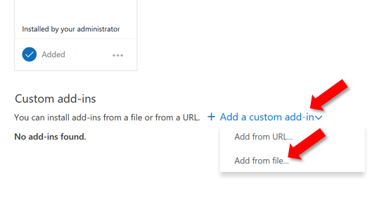
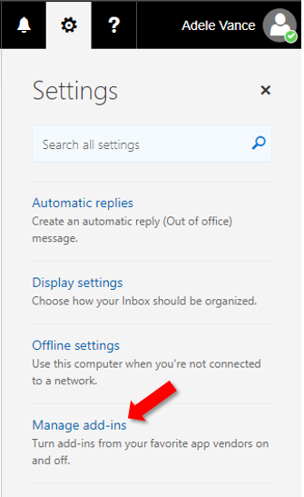

# Загрузка неопубликованных надстроек Outlook для тестирования

Вы можете использовать загрузку неопубликованных надстроек, чтобы установить надстройку Outlook для тестирования, не размещая ее в каталоге надстроек.

## Побная нагрузка автоматически

Если вы Outlook надстройку с помощью [генератора Yeoman](https://github.com/OfficeDev/generator-office)для Office надстройки, то надстройка лучше всего сделать через командную строку. Это позволит использовать наши инструменты и побочные нагрузки на все поддерживаемые устройства в одной команде.

1. Используя командную строку, перейдите в корневой каталог проекта надстройки Yeoman. Выполните команду `npm start`.

1. Надстройка Outlook автоматически будет Outlook на настольном компьютере. Вы увидите, как появится диалоговое окно, указав, что существует попытка побокзагрузить надстройку, указав имя и расположение файла манифеста. Выберите **ОК,** который зарегистрирует манифест.

    > [!IMPORTANT]
    > Если манифест содержит ошибку или путь к манифесту недействителен, вы получите сообщение об ошибке.

1. Если манифест не содержит ошибок и путь действителен, надстройка теперь будет загружена и доступна как на рабочем столе, так и в Outlook в Интернете. Он также будет установлен на всех поддерживаемых устройствах.

## Боковая нагрузка вручную

Хотя мы настоятельно рекомендуем автоматически перегружать по командной строке, как покрылось в предыдущем разделе, вы также можете вручную Outlook надстройку на основе Outlook клиента.

### Outlook в Интернете

Процесс загрузки надстройки в Outlook в Интернете зависит от того, используете ли вы новую или классическую версию.

- Если ваша панель инструментов почтового ящика выглядит так, как показано на изображении ниже, см. статью [Загрузка неопубликованных надстроек в новой веб-версии Outlook](#new-outlook-on-the-web).

    

- Если ваша панель инструментов почтового ящика выглядит так, как показано на изображении ниже, см. статью [Загрузка неопубликованных надстроек в классической веб-версии Outlook](#classic-outlook-on-the-web).

    

> [!NOTE]
> Если ваша организация добавили свой логотип на панель инструментов почтового ящика, вы можете увидеть изображение, которое будет немного отличаться от показанных ранее изображений.

### Новые Outlook в Интернете

1. Откройте [Outlook в Интернете](https://outlook.office.com).

1. Создание нового сообщения.

1. Выберите **...** в нижней части нового сообщения, а затем выберите **Получить надстройки** в появившемся меню.

    

1. В диалоговом окне **Надстройки для Outlook** выберите **Мои надстройки**.

    

1. Найдите раздел **Пользовательские надстройки** в нижней части диалогового окна. Выберите **Добавить пользовательскую надстройку** > **Добавить из файла**.

    

1. Найдите файл манифеста для своей надстройки и установите его, подтверждая все запросы.

### Классический Outlook в Интернете

1. Откройте [Outlook в Интернете](https://outlook.office.com).

1. Нажмите значок шестеренки в верхнем правом углу панели инструментов и выберите пункт **Управление надстройками**.

    

1. На странице **Управление надстройками** выберите **Надстройки** > **Мои надстройки**.

    

1. Найдите раздел **Пользовательские надстройки** в нижней части диалогового окна. Выберите **Добавить пользовательскую надстройку** > **Добавить из файла**.

    

1. Найдите файл манифеста для своей надстройки и установите его, подтверждая все запросы.

### Outlook на рабочем столе

#### Outlook 2016 или более поздней

1. Откройте Outlook 2016 или более поздней Windows mac.

1. Нажмите кнопку **Получить надстройки** на ленте.

    

    > [!IMPORTANT]
    > Если вы не видите кнопку **Get Add-ins** в версии Outlook, выберите:
    >
    > - **Сохранить** кнопку на ленте, если это доступно.
    >
    >   ИЛИ
    >
    > - **Меню** файла, а затем выберите кнопку **Управление** надстройками на вкладке **Info,** чтобы открыть диалоговое окно надстройки в Outlook в Интернете.  Дополнительные статьи о веб-опыте см. в предыдущем разделе [Sideload](#outlook-on-the-web)надстройки в Outlook в Интернете .

1. Если в верхней части диалогов есть вкладки, убедитесь, что вкладка **Надстройки** выбрана. Выберите **Мои надстройки**.

    

1. Найдите раздел **Пользовательские надстройки** в нижней части диалогового окна. Выберите **Добавить пользовательскую надстройку** > **Добавить из файла**.

    

1. Найдите файл манифеста для своей надстройки и установите его, подтверждая все запросы.

#### Outlook 2013

1. Откройте Outlook 2013 на Windows.

1. Выберите меню **File,** а затем выберите кнопку Управление надстройками на вкладке **Info.** Outlook откроет **веб-версию** в браузере.

1. Выполните действия в [разделе Sideload](#outlook-on-the-web) надстройки в Outlook в Интернете в соответствии с вашей версией Outlook в Интернете.

## Удаление боковой надстройки

Во всех версиях Outlook ключом к удаляемой боковой надстройке является диалоговое окно **My Add-ins,** в котором перечислены установленные надстройки. Выберите ellipsis `...` () для надстройки, а затем выберите **Удалить**.

Чтобы перейти  к диалоговому окну Мои надстройки для Outlook  клиента, используйте последние шаги, перечисленные для ручной загрузки в предыдущих разделах этой статьи.

Чтобы удалить из Outlook надстройку, используйте шаги, описанные в этой статье, чтобы  найти надстройку в разделе Настраиваемые надстройки диалоговое окно, в которое перечислены установленные надстройки. Выберите ellipsis () для надстройки, а затем выберите `...` **Удалить,** чтобы удалить эту конкретную надстройка. Закройте диалоговое окно.
