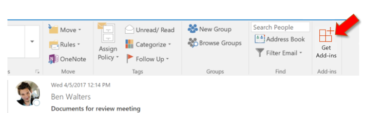

# Загрузка неопубликованных надстроек Outlook для тестирования

Вы можете использовать загрузку неопубликованных надстроек, чтобы установить надстройку Outlook для тестирования, не размещая ее в каталоге надстроек.

## Боковая нагрузка автоматически

Если вы создали Outlook надстройку с [помощью генератора Yeoman для Office дополнительных надстройок,](https://github.com/OfficeDev/generator-office)то загрузку лучше всего делать через командную строку. Это позволит воспользоваться нашими инструментами и боковой загрузкой на всех поддерживаемых устройствах в одной команде.

1. Используя командную строку, перейдите к корневому каталогу проекта надстройки, генерируемого Yeoman. Выполните команду `npm start`.

1. Ваше Outlook надстройка автоматически будет перегружена для Outlook на вашем настольном компьютере. Вы увидите, что появляется диалог, заявляя, что есть попытка перезагрузить надстройку, перечислив имя и местоположение файла манифеста. Выберите **OK**, который будет регистрировать манифест.

    > [!IMPORTANT]
    > Если манифест содержит ошибку или путь к манифесту недействителен, вы получите сообщение об ошибке.

1. Если ваш манифест не содержит ошибок и путь действителен, ваше дополнение теперь будет загружено и доступно как на рабочем столе, так и Outlook в Интернете. Он также будет установлен на всех поддерживаемых устройствах.

## Боковая нагрузка вручную

Хотя мы настоятельно рекомендуем автоматически перегрузить по командной строке, как это было в предыдущем разделе, вы также можете вручную перезагрузить Outlook надстройку на основе Outlook клиента.

### Outlook в Интернете

Процесс боковой загрузки надстройки в интернете Outlook зависит от того, используете ли вы новую или классическую версию.

- Если ваша панель инструментов почтового ящика выглядит так, как показано на изображении ниже, см. статью [Загрузка неопубликованных надстроек в новой веб-версии Outlook](#new-outlook-on-the-web).

    

- Если ваша панель инструментов почтового ящика выглядит так, как показано на изображении ниже, см. статью [Загрузка неопубликованных надстроек в классической веб-версии Outlook](#classic-outlook-on-the-web).

    

> [!NOTE]
> Если ваша организация добавили свой логотип на панель инструментов почтового ящика, вы можете увидеть изображение, которое будет немного отличаться от показанных ранее изображений.

### Новые Outlook в Интернете

1. Откройте [Outlook в Интернете](https://outlook.office.com).

1. Создайте новое сообщение.

1. Выберите **...** в нижней части нового сообщения, а затем выберите **Получить надстройки** в появившемся меню.

    

1. В диалоговом окне **Надстройки для Outlook** выберите **Мои надстройки**.

    

1. Найдите раздел **Пользовательские надстройки** в нижней части диалогового окна. Выберите **Добавить пользовательскую надстройку** > **Добавить из файла**.

    

1. Найдите файл манифеста для своей надстройки и установите его, подтверждая все запросы.

### Классический Outlook в Интернете

1. Откройте [Outlook в Интернете](https://outlook.office.com).

1. Нажмите значок шестеренки в верхнем правом углу панели инструментов и выберите пункт **Управление надстройками**.

    

1. На странице **Управление надстройками** выберите **Надстройки** > **Мои надстройки**.

    

1. Найдите раздел **Пользовательские надстройки** в нижней части диалогового окна. Выберите **Добавить пользовательскую надстройку** > **Добавить из файла**.

    

1. Найдите файл манифеста для своей надстройки и установите его, подтверждая все запросы.

### Outlook на рабочем столе

#### Outlook 2016 или позже

1. Откройте Outlook 2016 или позже на Windows или Mac.

1. Нажмите кнопку **Получить надстройки** на ленте.

    

    > [!IMPORTANT]
    > Если вы не видите **кнопку Get Add-ins** в версии Outlook, выберите:
    >
    > - **Храните** кнопку на ленте, если она доступна.
    >
    >   OR
    >
    > - **Меню** файлов, а затем **выберите кнопку «Управлять надстройки»** **на вкладке Info,** чтобы открыть **диалог add-ins** Outlook в Интернете. Вы можете увидеть больше о веб-опыт в предыдущем разделе [Sideload надстройки в Outlook в Интернете](#outlook-on-the-web).

1. Если в верхней части диалога есть вкладки, убедитесь, **что вкладка «Дополнительные встрой»** выбрана. Выберите **Мои надстройки**.

    

1. Найдите раздел **Пользовательские надстройки** в нижней части диалогового окна. Выберите **Добавить пользовательскую надстройку** > **Добавить из файла**.

    

1. Найдите файл манифеста для своей надстройки и установите его, подтверждая все запросы.

#### Outlook 2013

1. Открыт Outlook 2013 года в Windows.

1. Выберите **меню** файла, а затем выберите кнопку «Управлять надстройки» на вкладке **Info.** Outlook она откроет **веб-версию** в браузере.

1. Следуйте шагам в [Sideload надстройки в разделе Outlook в соответствии](#outlook-on-the-web) с вашей версией Outlook в Интернете.

## Удалите боковое надстройку

На всех версиях Outlook, ключом к удалению боковой загрузки надстройки **является диалог My Add-ins,** в котором перечислены установленные надстройки. Выберите эллипсис `...` () для дополнения, а затем выберите **Удалить**.

Чтобы перейти к **диалоговому ящику My Add-ins** для вашего клиента Outlook, используйте последние шаги, перечисленные [для ручной боковой загрузки](#sideload-manually) в предыдущих разделах этой статьи.

Чтобы удалить боковое дополнение с Outlook, используйте шаги, описанные ранее в этой статье, чтобы найти надстройку **в разделе пользовательских надстройок диалогового** окна, в которую перечислены установленные надстройки. Выберите эллипсис `...` () для дополнения, а затем выберите **Удалить,** чтобы удалить это конкретное дополнение. Закройте диалоговое окно.
