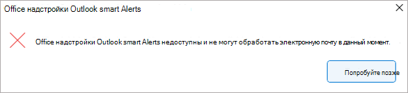
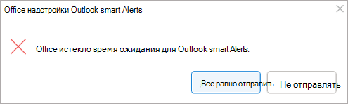

# <a name="use-smart-alerts-and-the-onmessagesend-and-onappointmentsend-events-in-your-outlook-add-in-preview"></a>Использование интеллектуальных оповещений и событий OnMessageSend и OnAppointmentSend в надстройке Outlook (предварительная версия)

События `OnMessageSend` и `OnAppointmentSend` события используют преимущества интеллектуальных оповещений, что позволяет выполнять логику после того,  как пользователь нажмет кнопку "Отправить Outlook сообщение или встречу. Обработчик событий позволяет предоставить пользователям возможность улучшить свои сообщения электронной почты и приглашения на собрания перед отправкой.

В следующем пошаговом руководстве используется `OnMessageSend` событие. К концу этого пошагового руководства у вас будет надстройка, которая запускается каждый раз, когда отправляется сообщение, и проверяет, не забыл ли пользователь добавить документ или рисунок, упомянутые в сообщении электронной почты.

> [!IMPORTANT]
> События `OnMessageSend` и события `OnAppointmentSend` доступны только в предварительной версии с подпиской Microsoft 365 в Outlook на Windows. Дополнительные сведения см. в разделе ["Предварительный просмотр"](autolaunch.md#how-to-preview). События предварительной версии не должны использоваться в рабочих надстройки.

## <a name="prerequisites"></a>Предварительные требования

Это `OnMessageSend` событие доступно с помощью функции активации на основе событий. Чтобы понять, как настроить надстройку для использования этой функции, использовать другие доступные события, настроить предварительную версию для этого события, отладить надстройку и т. д., см. статью "[Настройка](autolaunch.md) надстройки Outlook для активации на основе событий".

## <a name="set-up-your-environment"></a>Настройка среды

Выполните [Outlook](../quickstarts/outlook-quickstart.md?tabs=yeomangenerator) краткое руководство по созданию проекта надстройки с помощью генератора Yeoman для Office надстроек.

## <a name="configure-the-manifest"></a>Настройка манифеста

1. В редакторе кода откройте проект быстрого запуска.

1. Откройте файл **manifest.xml** , расположенный в корневом каталоге проекта.

1. Выберите весь узел **VersionOverrides** (включая открытые и закрывающее теги) и замените его следующим XML-кодом, а затем сохраните изменения.

```XML
<VersionOverrides xmlns="http://schemas.microsoft.com/office/mailappversionoverrides" xsi:type="VersionOverridesV1_0">
  <VersionOverrides xmlns="http://schemas.microsoft.com/office/mailappversionoverrides/1.1" xsi:type="VersionOverridesV1_1">
    <Requirements>
      <bt:Sets DefaultMinVersion="1.3">
        <bt:Set Name="Mailbox" />
      </bt:Sets>
    </Requirements>
    <Hosts>
      <Host xsi:type="MailHost">
        <!-- Event-based activation happens in a lightweight runtime.-->
        <Runtimes>
          <!-- HTML file including reference to or inline JavaScript event handlers.
               This is used by Outlook on the web and on the new Mac UI. -->
          <Runtime resid="WebViewRuntime.Url">
            <!-- JavaScript file containing event handlers. This is used by Outlook Desktop. -->
            <Override type="javascript" resid="JSRuntime.Url"/>
          </Runtime>
        </Runtimes>
        <DesktopFormFactor>
          <FunctionFile resid="Commands.Url" />
          <ExtensionPoint xsi:type="MessageReadCommandSurface">
            <OfficeTab id="TabDefault">
              <Group id="msgReadGroup">
                <Label resid="GroupLabel" />
                <Control xsi:type="Button" id="msgReadOpenPaneButton">
                  <Label resid="TaskpaneButton.Label" />
                  <Supertip>
                    <Title resid="TaskpaneButton.Label" />
                    <Description resid="TaskpaneButton.Tooltip" />
                  </Supertip>
                  <Icon>
                    <bt:Image size="16" resid="Icon.16x16" />
                    <bt:Image size="32" resid="Icon.32x32" />
                    <bt:Image size="80" resid="Icon.80x80" />
                  </Icon>
                  <Action xsi:type="ShowTaskpane">
                    <SourceLocation resid="Taskpane.Url" />
                  </Action>
                </Control>
                <Control xsi:type="Button" id="ActionButton">
                  <Label resid="ActionButton.Label"/>
                  <Supertip>
                    <Title resid="ActionButton.Label"/>
                    <Description resid="ActionButton.Tooltip"/>
                  </Supertip>
                  <Icon>
                    <bt:Image size="16" resid="Icon.16x16"/>
                    <bt:Image size="32" resid="Icon.32x32"/>
                    <bt:Image size="80" resid="Icon.80x80"/>
                  </Icon>
                  <Action xsi:type="ExecuteFunction">
                    <FunctionName>action</FunctionName>
                  </Action>
                </Control>
              </Group>
            </OfficeTab>
          </ExtensionPoint>

          <!-- Can configure other command surface extension points for add-in command support. -->

          <!-- Enable launching the add-in on the included event. -->
          <ExtensionPoint xsi:type="LaunchEvent">
            <LaunchEvents>
              <LaunchEvent Type="OnMessageSend" FunctionName="onMessageSendHandler" SendMode="PromptUser" />
            </LaunchEvents>
            <!-- Identifies the runtime to be used (also referenced by the Runtime element). -->
            <SourceLocation resid="WebViewRuntime.Url"/>
          </ExtensionPoint>
        </DesktopFormFactor>
      </Host>
    </Hosts>
    <Resources>
      <bt:Images>
        <bt:Image id="Icon.16x16" DefaultValue="https://localhost:3000/assets/icon-16.png"/>
        <bt:Image id="Icon.32x32" DefaultValue="https://localhost:3000/assets/icon-32.png"/>
        <bt:Image id="Icon.80x80" DefaultValue="https://localhost:3000/assets/icon-80.png"/>
      </bt:Images>
      <bt:Urls>
        <bt:Url id="Commands.Url" DefaultValue="https://localhost:3000/commands.html" />
        <bt:Url id="Taskpane.Url" DefaultValue="https://localhost:3000/taskpane.html" />
        <bt:Url id="WebViewRuntime.Url" DefaultValue="https://localhost:3000/commands.html" />
        <!-- Entry needed for Outlook Desktop. -->
        <bt:Url id="JSRuntime.Url" DefaultValue="https://localhost:3000/launchevent.js" />
      </bt:Urls>
      <bt:ShortStrings>
        <bt:String id="GroupLabel" DefaultValue="Contoso Add-in"/>
        <bt:String id="TaskpaneButton.Label" DefaultValue="Show Taskpane"/>
        <bt:String id="ActionButton.Label" DefaultValue="Perform an action"/>
      </bt:ShortStrings>
      <bt:LongStrings>
        <bt:String id="TaskpaneButton.Tooltip" DefaultValue="Opens a pane displaying all available properties."/>
        <bt:String id="ActionButton.Tooltip" DefaultValue="Perform an action when clicked."/>
      </bt:LongStrings>
    </Resources>
  </VersionOverrides>
</VersionOverrides>
```

> [!TIP]
>
> - **Параметры SendMode**, доступные вместе с событиями `OnMessageSend` `OnAppointmentSend`, см. в разделе "[Доступные параметры SendMode"](/javascript/api/manifest/launchevent#available-sendmode-options-preview).
> - Дополнительные сведения о манифестах Outlook надстроек см. в Outlook [манифестах надстроек](manifests.md).

## <a name="implement-event-handling"></a>Реализация обработки событий

Необходимо реализовать обработку выбранного события.

В этом сценарии вы добавите обработку для отправки сообщения. Ваша надстройка проверит наличие определенных ключевых слов в сообщении. Если какие-либо из этих ключевых слов найдены, будет проверяться наличие вложений. Если вложений нет, надстройка рекомендует пользователю добавить возможное отсутствующее вложение.

1. В том же проекте быстрого запуска создайте папку с именем **launchevent** в **каталоге ./src** .

1. В **папке ./src/launchevent** создайте файл с именем **launchevent.js**.

1. Откройте файл **./src/launchevent/launchevent.js** редакторе кода и добавьте следующий код JavaScript.

    ```js
    /*
    * Copyright (c) Microsoft Corporation. All rights reserved. Licensed under the MIT license.
    * See LICENSE in the project root for license information.
    */

    function onMessageSendHandler(event) {
      Office.context.mailbox.item.body.getAsync(
        "text",
        { asyncContext: event },
        getBodyCallback
      );
    }

    function getBodyCallback(asyncResult){
      let event = asyncResult.asyncContext;
      let body = "";
      if (asyncResult.status !== Office.AsyncResultStatus.Failed && asyncResult.value !== undefined) {
        body = asyncResult.value;
      } else {
        let message = "Failed to get body text";
        console.error(message);
        event.completed({ allowEvent: false, errorMessage: message });
        return;
      }

      let matches = hasMatches(body);
      if (matches) {
        Office.context.mailbox.item.getAttachmentsAsync(
          { asyncContext: event },
          getAttachmentsCallback);
      } else {
        event.completed({ allowEvent: true });
      }
    }

    function hasMatches(body) {
      if (body == null || body == "") {
        return false;
      }

      const arrayOfTerms = ["send", "picture", "document", "attachment"];
      for (let index = 0; index < arrayOfTerms.length; index++) {
        const term = arrayOfTerms[index].trim();
        const regex = RegExp(term, 'i');
        if (regex.test(body)) {
          return true;
        }
      }

      return false;
    }

    function getAttachmentsCallback(asyncResult) {
      let event = asyncResult.asyncContext;
      if (asyncResult.value.length > 0) {
        for (let i = 0; i < asyncResult.value.length; i++) {
          if (asyncResult.value[i].isInline == false) {
            event.completed({ allowEvent: true });
            return;
          }
        }

        event.completed({ allowEvent: false, errorMessage: "Looks like you forgot to include an attachment?" });
      } else {
        event.completed({ allowEvent: false, errorMessage: "Looks like you're forgetting to include an attachment?" });
      }
    }

    // 1st parameter: FunctionName of LaunchEvent in the manifest; 2nd parameter: Its implementation in this .js file.
    Office.actions.associate("onMessageSendHandler", onMessageSendHandler);
    ```

1. Сохраните изменения.

## <a name="update-webpack-config-settings"></a>Обновление настроек конфигурации webpack

1. Откройте **webpack.config.jsфайл** , найденный в корневом каталоге проекта, и выполните следующие действия.

1. Найдите `plugins` массив в объекте `config` и добавьте этот новый объект в начало массива.

    ```js
    new CopyWebpackPlugin({
      patterns: [
        {
          from: "./src/launchevent/launchevent.js",
          to: "launchevent.js",
        },
      ],
    }),
    ```

1. Сохраните изменения.

## <a name="try-it-out"></a>Проверка

1. Выполните следующие команды в корневом каталоге проекта. При запуске `npm start`запустится локальный веб-сервер (если он еще не запущен), а надстройка будет загружена неопубликованным приложением.

    ```command&nbsp;line
    npm run build
    ```

    ```command&nbsp;line
    npm start
    ```

    > [!NOTE]
    > Если ваша надстройка не была загружена автоматически неопубликованным приложением, следуйте инструкциям в разделе "Загрузка неопубликованных Outlook надстроек для тестирования, чтобы вручную загрузить неопубликованную надстройку в Outlook.[](../outlook/sideload-outlook-add-ins-for-testing.md#sideload-manually)

1. В Outlook на Windows создайте новое сообщение и задайте тему. В текст добавьте текст, например "Привет, посмотрите этот рисунок моей собаки!".
1. Отправьте сообщение. Должно появиться диалоговое окно с рекомендацией добавить вложение.

    

1. Добавьте вложение и отправьте сообщение еще раз. На этот раз оповещений не должно быть.

## <a name="smart-alerts-feature-behavior-and-scenarios"></a>Поведение и сценарии функции смарт-оповещений

Описания параметров **SendMode** и рекомендации по их использованию подробно описаны в параметрах [Available SendMode](/javascript/api/manifest/launchevent). Ниже описано поведение функции для определенных сценариев.

### <a name="add-in-is-unavailable"></a>Надстройка недоступна

Если надстройка недоступна при отправке сообщения или встречи (например, возникает ошибка, препятствующая загрузке надстройки), пользователь получает оповещение. Параметры, доступные пользователю, зависят от параметра **SendMode** , примененного к надстройке.

Если используется параметр или параметр, пользователь может выбрать команду "Отправить в любом случае", чтобы отправить элемент без проверки надстройки, или попробовать позже, чтобы надстройка проверила элемент, когда он снова станет доступен. `PromptUser` `SoftBlock`


Если этот `Block` параметр используется, пользователь не сможет отправить элемент, пока надстройка не станет доступной.



### <a name="long-running-add-in-operations"></a>Длительные операции надстроек

Если надстройка работает более пяти секунд, но менее пяти минут, пользователь получает предупреждение о том, что надстройка обрабатывает сообщение или встречу дольше, чем ожидалось.

Если этот `PromptUser` параметр используется, пользователь может выбрать команду **"** Отправить в любом случае", чтобы отправить элемент, не завершая проверку надстройки. Кроме того, пользователь может выбрать **"Не** отправлять", чтобы остановить обработку надстройки.


Однако если используется параметр `SoftBlock` `Block` или параметр, пользователь не сможет отправить элемент, пока надстройка не завершит его обработку.


`OnMessageSend` и `OnAppointmentSend` надстройки должны быть короткими и упрощенными. Чтобы избежать длительной операции, используйте другие события для обработки условных проверок перед `OnMessageSend` активацией `OnAppointmentSend` события. Например, если пользователю требуется шифровать вложения для каждого сообщения или встречи, `OnMessageAttachmentsChanged` `OnAppointmentAttachmentsChanged` рассмотрите возможность использования события или события для выполнения проверки.

### <a name="add-in-timed-out"></a>Истекло время ожидания надстройки

Если надстройка работает в течение пяти минут или более, время ожидания истекло. Если этот `PromptUser` параметр используется, пользователь может выбрать команду **"** Отправить в любом случае", чтобы отправить элемент, не завершая проверку надстройки. Кроме того, пользователь может выбрать " **Не отправлять"**.



Если используется `SoftBlock` параметр `Block` или параметр, пользователь не может отправить элемент, пока надстройка не завершит проверку. Пользователь должен попытаться отправить элемент еще раз, чтобы повторно активировать надстройку.


## <a name="limitations"></a>Ограничения

Так как события `OnMessageSend` и события `OnAppointmentSend` поддерживаются с помощью функции активации на основе событий, те же ограничения функций применяются к надстройки, которые активируются в результате этих событий. Описание этих ограничений см. в описании поведения и ограничений активации на [основе событий](autolaunch.md#event-based-activation-behavior-and-limitations).

Помимо этих ограничений, в `OnMessageSend` `OnAppointmentSend` манифесте можно объявить только один экземпляр и событие. Если требуется несколько событий `OnMessageSend` `OnAppointmentSend` или событий, необходимо объявить каждое из них в отдельном манифесте или надстройке.

Хотя диалоговое окно "Интеллектуальные оповещения" можно изменить в соответствии со сценарием надстройки с помощью свойства [errorMessage](/javascript/api/office/office.addincommands.eventcompletedoptions) метода event.completed, следующее невозможно настроить.

- Строка заголовка диалогового окна. Здесь всегда отображается имя вашей надстройки.
- Формат сообщения. Например, нельзя изменить размер и цвет шрифта текста или вставить маркированный список.
- Параметры диалогового окна. Например, параметры **"Отправить в любом случае** " и **"** Не отправлять" являются фиксированными и зависят от выбранного параметра [SendMode](/javascript/api/manifest/launchevent) .
- Диалоговые окна обработки активации на основе событий и сведений о ходе выполнения. Например, текст и параметры, отображаемые в диалоговых окнах времени ожидания и длительных операций, изменить нельзя.

## <a name="see-also"></a>См. также

- [Манифесты надстроек Outlook](manifests.md)
- [Настройка надстройки Outlook для активации на основе событий](autolaunch.md)
- [Отладка надстроек на основе событий](debug-autolaunch.md)
- [Варианты описания AppSource для надстройки на основе Outlook событий](autolaunch-store-options.md)
- [Office кода надстроек. Использование интеллектуальных оповещений Outlook](https://github.com/OfficeDev/Office-Add-in-samples/tree/main/Samples/outlook-check-item-categories)
