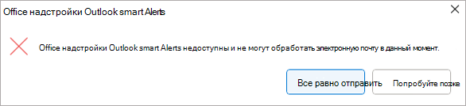

# <a name="use-smart-alerts-and-the-onmessagesend-and-onappointmentsend-events-in-your-outlook-add-in"></a>Использование смарт-оповещений и событий OnMessageSend и OnAppointmentSend в надстройке Outlook

События `OnMessageSend` и `OnAppointmentSend` пользуются преимуществами смарт-оповещений, которые позволяют выполнять логику после того, как пользователь выберет **Отправить** в своем сообщении Outlook или встрече. Обработчик событий позволяет пользователям улучшить свои сообщения электронной почты и приглашения на собрания, прежде чем они будут отправлены.

В следующем пошаговом руководстве используется `OnMessageSend` событие . К концу этого пошагового руководства у вас будет надстройка, которая запускается при отправке сообщения и проверяет, забыл ли пользователь добавить документ или рисунок, упомянутый в сообщении электронной почты.

> [!NOTE]
> События `OnMessageSend` и `OnAppointmentSend` были введены в [наборе требований 1.12](/javascript/api/requirement-sets/outlook/requirement-set-1.12/outlook-requirement-set-1.12). См [клиенты и платформы](/javascript/api/requirement-sets/outlook/outlook-api-requirement-sets), поддерживающие этот набор обязательных требований.

## <a name="prerequisites"></a>Предварительные требования

Событие `OnMessageSend` доступно через функцию активации на основе событий. Сведения о настройке надстройки для использования этой функции, использовании других доступных событий, отладке надстройки и т. д. см. [в статье Настройка надстройки Outlook для активации на основе событий](autolaunch.md).

### <a name="supported-clients-and-platforms"></a>Поддерживаемые клиенты и платформы

В следующей таблице перечислены поддерживаемые сочетания клиента и сервера для функции смарт-оповещений, включая минимально необходимые Exchange Server накопительного обновления, если применимо. Исключенные сочетания не поддерживаются.

|Client|Exchange Online|Локальная версия Exchange 2019 (накопительное обновление 12 или более поздняя версия)|Локальная среда Exchange 2016 (накопительное обновление 22 или более поздняя версия) |
|-----|-----|-----|-----|
|**Windows**<br>Версия 2206 (сборка 15330.20196) или более поздняя|Да|Да|Да|
|**Mac**<br>Версия 16.65.827.0 или более поздняя|Да|Неприменимо|Неприменимо|
|**Веб-браузер (современный пользовательский интерфейс)**|Да|Неприменимо|Неприменимо|
|**iOS**|Неприменимо|Неприменимо|Неприменимо|
|**Android**|Неприменимо|Неприменимо|Неприменимо|

## <a name="set-up-your-environment"></a>Настройка среды

Выполните [краткое руководство по Outlook](../quickstarts/outlook-quickstart.md?tabs=yeomangenerator), в котором создается проект надстройки с [генератором Yeoman для надстроек Office](../develop/yeoman-generator-overview.md).

## <a name="configure-the-manifest"></a>Настройка манифеста

Чтобы настроить манифест, выберите вкладку для используемого типа манифеста.

# <a name="xml-manifest"></a>[XML-манифест](#tab/xmlmanifest)

1. В редакторе кода откройте проект быстрого запуска.

1. Откройте **файлmanifest.xml** , расположенный в корне проекта.

1. Выберите весь **\<VersionOverrides\>** узел (включая открытые и закрытые теги) и замените его следующим XML-кодом, а затем сохраните изменения.

```XML
<VersionOverrides xmlns="http://schemas.microsoft.com/office/mailappversionoverrides" xsi:type="VersionOverridesV1_0">
  <VersionOverrides xmlns="http://schemas.microsoft.com/office/mailappversionoverrides/1.1" xsi:type="VersionOverridesV1_1">
    <Requirements>
      <bt:Sets DefaultMinVersion="1.12">
        <bt:Set Name="Mailbox" />
      </bt:Sets>
    </Requirements>
    <Hosts>
      <Host xsi:type="MailHost">
        <!-- Event-based activation happens in a lightweight runtime.-->
        <Runtimes>
          <!-- HTML file including reference to or inline JavaScript event handlers.
               This is used by Outlook on the web and on the new Mac UI. -->
          <Runtime resid="WebViewRuntime.Url">
            <!-- JavaScript file containing event handlers. This is used by Outlook on Windows. -->
            <Override type="javascript" resid="JSRuntime.Url"/>
          </Runtime>
        </Runtimes>
        <DesktopFormFactor>
          <FunctionFile resid="Commands.Url" />
          <ExtensionPoint xsi:type="MessageReadCommandSurface">
            <OfficeTab id="TabDefault">
              <Group id="msgReadGroup">
                <Label resid="GroupLabel" />
                <Control xsi:type="Button" id="msgReadOpenPaneButton">
                  <Label resid="TaskpaneButton.Label" />
                  <Supertip>
                    <Title resid="TaskpaneButton.Label" />
                    <Description resid="TaskpaneButton.Tooltip" />
                  </Supertip>
                  <Icon>
                    <bt:Image size="16" resid="Icon.16x16" />
                    <bt:Image size="32" resid="Icon.32x32" />
                    <bt:Image size="80" resid="Icon.80x80" />
                  </Icon>
                  <Action xsi:type="ShowTaskpane">
                    <SourceLocation resid="Taskpane.Url" />
                  </Action>
                </Control>
                <Control xsi:type="Button" id="ActionButton">
                  <Label resid="ActionButton.Label"/>
                  <Supertip>
                    <Title resid="ActionButton.Label"/>
                    <Description resid="ActionButton.Tooltip"/>
                  </Supertip>
                  <Icon>
                    <bt:Image size="16" resid="Icon.16x16"/>
                    <bt:Image size="32" resid="Icon.32x32"/>
                    <bt:Image size="80" resid="Icon.80x80"/>
                  </Icon>
                  <Action xsi:type="ExecuteFunction">
                    <FunctionName>action</FunctionName>
                  </Action>
                </Control>
              </Group>
            </OfficeTab>
          </ExtensionPoint>

          <!-- Can configure other command surface extension points for add-in command support. -->

          <!-- Enable launching the add-in on the included event. -->
          <ExtensionPoint xsi:type="LaunchEvent">
            <LaunchEvents>
              <LaunchEvent Type="OnMessageSend" FunctionName="onMessageSendHandler" SendMode="PromptUser" />
            </LaunchEvents>
            <!-- Identifies the runtime to be used (also referenced by the Runtime element). -->
            <SourceLocation resid="WebViewRuntime.Url"/>
          </ExtensionPoint>
        </DesktopFormFactor>
      </Host>
    </Hosts>
    <Resources>
      <bt:Images>
        <bt:Image id="Icon.16x16" DefaultValue="https://localhost:3000/assets/icon-16.png"/>
        <bt:Image id="Icon.32x32" DefaultValue="https://localhost:3000/assets/icon-32.png"/>
        <bt:Image id="Icon.80x80" DefaultValue="https://localhost:3000/assets/icon-80.png"/>
      </bt:Images>
      <bt:Urls>
        <bt:Url id="Commands.Url" DefaultValue="https://localhost:3000/commands.html" />
        <bt:Url id="Taskpane.Url" DefaultValue="https://localhost:3000/taskpane.html" />
        <bt:Url id="WebViewRuntime.Url" DefaultValue="https://localhost:3000/commands.html" />
        <!-- Entry needed for Outlook on Windows. -->
        <bt:Url id="JSRuntime.Url" DefaultValue="https://localhost:3000/launchevent.js" />
      </bt:Urls>
      <bt:ShortStrings>
        <bt:String id="GroupLabel" DefaultValue="Contoso Add-in"/>
        <bt:String id="TaskpaneButton.Label" DefaultValue="Show Taskpane"/>
        <bt:String id="ActionButton.Label" DefaultValue="Perform an action"/>
      </bt:ShortStrings>
      <bt:LongStrings>
        <bt:String id="TaskpaneButton.Tooltip" DefaultValue="Opens a pane displaying all available properties."/>
        <bt:String id="ActionButton.Tooltip" DefaultValue="Perform an action when clicked."/>
      </bt:LongStrings>
    </Resources>
  </VersionOverrides>
</VersionOverrides>
```

> [!TIP]
>
> - Параметры **SendMode, доступные** с событиями и`OnAppointmentSend`, см. в `OnMessageSend` разделе [Доступные параметры SendMode](/javascript/api/manifest/launchevent#available-sendmode-options).
> - Дополнительные сведения о манифестах надстроек Outlook см. [в статье Манифесты надстроек Outlook](manifests.md).

# <a name="teams-manifest-developer-preview"></a>[Манифест Teams (предварительная версия для разработчиков)](#tab/jsonmanifest)

> [!IMPORTANT]
> Интеллектуальные оповещения пока не поддерживаются для [манифеста Teams для надстроек Office (предварительная версия).](../develop/json-manifest-overview.md) Эта вкладка предназначена для использования в будущем.

1. Откройте файл **manifest.json** .

1. Добавьте следующий объект в массив extensions.runtimes. Обратите внимание на указанные ниже особенности этой разметки.

   - Параметр minVersion набора обязательных элементов почтового ящика имеет значение "1.12", так как [в таблице поддерживаемых событий](autolaunch.md#supported-events) указано, что это самая низкая версия набора требований, поддерживающая `OnMessageSend` событие.
   - Для идентификатора среды выполнения задается описательное имя "autorun_runtime".
   - Свойство "code" имеет дочернее свойство page, для которого задано значение HTML-файла, и дочернее свойство script, для которого задается файл JavaScript. Вы создадите или измените эти файлы на последующих шагах. Office использует одно из этих значений или другое в зависимости от платформы.
       - Office в Windows выполняет обработчик событий в среде выполнения, доступной только для JavaScript, которая загружает файл JavaScript напрямую.
       - Office на Mac и в Интернете выполняют обработчик в среде выполнения браузера, которая загружает HTML-файл. Этот файл, в свою очередь, содержит `<script>` тег, который загружает файл JavaScript.
     Дополнительные сведения см. [в разделе Среды выполнения в надстройках Office](../testing/runtimes.md).
   - Свойство "время существования" имеет значение "short", что означает, что среда выполнения запускается при активации события и завершает работу по завершении обработчика. (В некоторых редких случаях среда выполнения завершает работу до завершения обработчика. См [. раздел Среды выполнения в надстройках Office](../testing/runtimes.md).)
   - Существует действие для запуска обработчика `OnMessageSend` для события. Вы создадите функцию обработчика на следующем шаге.

    ```json
     {
        "requirements": {
            "capabilities": [
                {
                    "name": "Mailbox",
                    "minVersion": "1.12"
                }
            ]
        },
        "id": "autorun_runtime",
        "type": "general",
        "code": {
            "page": "https://localhost:3000/commands.html",
            "script": "https://localhost:3000/launchevent.js"
        },
        "lifetime": "short",
        "actions": [
            {
                "id": "onMessageSendHandler",
                "type": "executeFunction",
                "displayName": "onMessageSendHandler"
            }
        ]
    }
    ```

1. Добавьте следующий массив autoRunEvents в качестве свойства объекта в массиве extensions.

    ```json
    "autoRunEvents": [
    
    ]
    ```

1. Добавьте следующий объект в массив autoRunEvents. Обратите внимание на следующие особенности этого кода:

   - Объект события назначает событию `OnMessageSend` функцию обработчика (используя имя манифеста Teams события messageSending, как описано в [таблице поддерживаемых событий](autolaunch.md#supported-events)). Имя функции, указанное в actionId, должно соответствовать имени, используемому в свойстве id объекта в массиве actions на предыдущем шаге.
   - Параметр sendMode имеет значение "promptUser". Это означает, что если сообщение не соответствует условиям, заданным надстройкой для отправки, пользователю будет предложено отменить отправку или отправить в любом случае.

    ```json
      {
          "requirements": {
              "capabilities": [
                  {
                      "name": "Mailbox",
                      "minVersion": "1.12"
                  }
              ],
              "scopes": [
                  "mail"
              ]
          },
          "events": [
            {
                "type": "messageSending",
                "actionId": "onMessageSendHandler",
                "options": {
                    "sendMode": "promptUser"
                }
            }
          ]
      }
    ```

---

## <a name="implement-event-handling"></a>Реализация обработки событий

Необходимо реализовать обработку выбранного события.

В этом сценарии вы добавите обработку отправки сообщения. Ваша надстройка проверит определенные ключевые слова в сообщении. Если какое-либо из этих ключевых слов найдено, оно проверит наличие вложений. Если вложения отсутствуют, надстройка порекомендует пользователю добавить возможно отсутствующие вложения.

1. В том же проекте быстрого запуска создайте папку **launchevent** в каталоге **./src** .

1. В папке **./src/launchevent** создайте файл **с именемlaunchevent.js**.

1. Откройте файл **./src/launchevent/launchevent.js** в редакторе кода и добавьте следующий код JavaScript.

    ```js
    /*
    * Copyright (c) Microsoft Corporation. All rights reserved. Licensed under the MIT license.
    * See LICENSE in the project root for license information.
    */

    function onMessageSendHandler(event) {
      Office.context.mailbox.item.body.getAsync(
        "text",
        { asyncContext: event },
        getBodyCallback
      );
    }

    function getBodyCallback(asyncResult){
      let event = asyncResult.asyncContext;
      let body = "";
      if (asyncResult.status !== Office.AsyncResultStatus.Failed && asyncResult.value !== undefined) {
        body = asyncResult.value;
      } else {
        let message = "Failed to get body text";
        console.error(message);
        event.completed({ allowEvent: false, errorMessage: message });
        return;
      }

      let matches = hasMatches(body);
      if (matches) {
        Office.context.mailbox.item.getAttachmentsAsync(
          { asyncContext: event },
          getAttachmentsCallback);
      } else {
        event.completed({ allowEvent: true });
      }
    }

    function hasMatches(body) {
      if (body == null || body == "") {
        return false;
      }

      const arrayOfTerms = ["send", "picture", "document", "attachment"];
      for (let index = 0; index < arrayOfTerms.length; index++) {
        const term = arrayOfTerms[index].trim();
        const regex = RegExp(term, 'i');
        if (regex.test(body)) {
          return true;
        }
      }

      return false;
    }

    function getAttachmentsCallback(asyncResult) {
      let event = asyncResult.asyncContext;
      if (asyncResult.value.length > 0) {
        for (let i = 0; i < asyncResult.value.length; i++) {
          if (asyncResult.value[i].isInline == false) {
            event.completed({ allowEvent: true });
            return;
          }
        }

        event.completed({ allowEvent: false, errorMessage: "Looks like you forgot to include an attachment?" });
      } else {
        event.completed({ allowEvent: false, errorMessage: "Looks like you're forgetting to include an attachment?" });
      }
    }

    // 1st parameter: FunctionName of LaunchEvent in the manifest; 2nd parameter: Its implementation in this .js file.
    Office.actions.associate("onMessageSendHandler", onMessageSendHandler);
    ```

## <a name="update-the-commands-html-file"></a>Обновление HTML-файла команд

1. В папке **./src/commands** откройте **commands.html**.

1. Непосредственно перед закрывающим **тегом головки** (`</head>`) добавьте запись скрипта для кода JavaScript для обработки событий.

   ```js
   <script type="text/javascript" src="../launchevent/launchevent.js"></script> 
   ```

1. Сохраните изменения.

## <a name="update-webpack-config-settings"></a>Обновление настроек конфигурации webpack

1. Откройте **файлwebpack.config.js** , который находится в корневом каталоге проекта, и выполните следующие действия.

1. `plugins` Найдите массив в объекте `config` и добавьте этот новый объект в начало массива.

    ```js
    new CopyWebpackPlugin({
      patterns: [
        {
          from: "./src/launchevent/launchevent.js",
          to: "launchevent.js",
        },
      ],
    }),
    ```

1. Сохраните изменения.

## <a name="try-it-out"></a>Проверка

1. Выполните следующие команды в корневом каталоге проекта. При запуске `npm start`запустится локальный веб-сервер (если он еще не запущен), и надстройка будет загружена неопубликованно.

    ```command&nbsp;line
    npm run build
    ```

    ```command&nbsp;line
    npm start
    ```

    > [!NOTE]
    > Если надстройка не была автоматически загружена неопубликованным приложением, следуйте инструкциям в разделе [Загрузка неопубликованных надстроек Outlook для тестирования,](../outlook/sideload-outlook-add-ins-for-testing.md#sideload-manually) чтобы вручную загрузить надстройку неопубликованного приложения в Outlook.

1. В Outlook в Windows создайте новое сообщение и задайте тему. В теле добавьте текст типа "Привет, проверьте эту фотографию моей собаки!".
1. Отправьте сообщение. Должно появиться диалоговое окно с рекомендацией по добавлению вложения.

    

1. Добавьте вложение, а затем отправьте сообщение еще раз. На этот раз оповещение не должно быть.

## <a name="deploy-to-users"></a>Развертывание для пользователей

Как и другие надстройки на основе событий, надстройки, использующие функцию смарт-оповещений, должны развертываться администратором организации. Инструкции по развертыванию надстройки с помощью Центр администрирования Microsoft 365 см. в разделе **Развертывание для пользователей** [статьи Настройка надстройки Outlook для активации на основе событий](autolaunch.md#deploy-to-users).

> [!IMPORTANT]
> Надстройки, использующие функцию смарт-оповещений, могут публиковаться в AppSource только в том случае, если [для свойства SendMode](/javascript/api/manifest/launchevent#available-sendmode-options) манифеста задан `SoftBlock` параметр или `PromptUser` . Если свойство **SendMode** надстройки имеет значение `Block`, оно может быть развернуто только администратором организации, так как оно не пройдет проверку AppSource. Дополнительные сведения о публикации надстройки на основе событий в AppSource см. в статье [Параметры описания AppSource для надстройки Outlook на основе событий](autolaunch-store-options.md).

## <a name="smart-alerts-feature-behavior-and-scenarios"></a>Поведение и сценарии функций интеллектуальных оповещений

Описание параметров **SendMode** и рекомендации по их использованию подробно описаны в разделе [Доступные параметры SendMode](/javascript/api/manifest/launchevent#available-sendmode-options). Ниже описывается поведение функции для определенных сценариев.

### <a name="add-in-is-unavailable"></a>Надстройка недоступна

Если надстройка недоступна при отправке сообщения или встречи (например, возникает ошибка, препятствующая загрузке надстройки), пользователь получает оповещение. Параметры, доступные пользователю, различаются в зависимости от параметра **SendMode** , примененного к надстройке.

`PromptUser` Если используется параметр или`SoftBlock`, пользователь может выбрать Отправить в **любом случае**, чтобы отправить элемент без проверки надстройки, или **попробовать позже**, чтобы разрешить проверку элемента надстройкой, когда он снова станет доступен.



`Block` Если параметр используется, пользователь не сможет отправить элемент, пока надстройка не станет доступной. (Параметр `Block` не поддерживается, если надстройка использует манифест Teams (предварительная версия).)


### <a name="long-running-add-in-operations"></a>Длительные операции надстроек

Если надстройка выполняется более пяти секунд, но менее пяти минут, пользователь получает предупреждение о том, что надстройка обрабатывает сообщение или встречу дольше, чем ожидалось.

`PromptUser` Если параметр используется, пользователь может выбрать **Отправить в любом случае**, чтобы отправить элемент без завершения проверки надстройкой. Кроме того, пользователь может выбрать **Не отправлять** , чтобы остановить обработку надстройки.


Однако если `SoftBlock` используется параметр или `Block` , пользователь не сможет отправить элемент, пока надстройка не завершит его обработку.


`OnMessageSend` и `OnAppointmentSend` надстройки должны быть короткими и упрощенными. Чтобы избежать длительных операций, используйте другие события для обработки условных проверок перед активацией `OnMessageSend` события или `OnAppointmentSend` . Например, если пользователю требуется шифровать вложения для каждого сообщения или встречи, рассмотрите `OnMessageAttachmentsChanged` возможность использования события или `OnAppointmentAttachmentsChanged` для выполнения проверки.

### <a name="add-in-timed-out"></a>Истекло время ожидания надстройки

Если надстройка работает в течение пяти минут или более, время ожидания истекает. `PromptUser` Если параметр используется, пользователь может выбрать **Отправить в любом случае** , чтобы отправить элемент без завершения проверки надстройкой. Кроме того, пользователь может выбрать **Не отправлять**.


`SoftBlock` Если используется параметр или`Block`, пользователь не сможет отправить элемент, пока надстройка не завершит проверку. Пользователь должен попытаться отправить элемент еще раз, чтобы повторно активировать надстройку.


## <a name="limitations"></a>Ограничения

`OnMessageSend` Так как события и `OnAppointmentSend` поддерживаются с помощью функции активации на основе событий, те же ограничения функций применяются к надстройкам, которые активируются в результате этих событий. Описание этих ограничений см. в разделе [Поведение активации на основе событий и ограничения](autolaunch.md#event-based-activation-behavior-and-limitations).

В дополнение к этим ограничениям в манифесте может быть объявлен только один экземпляр каждого события `OnMessageSend` и `OnAppointmentSend` . Если требуется несколько `OnMessageSend` событий или `OnAppointmentSend` , необходимо объявить каждое из них в отдельной надстройке.

Хотя диалоговое сообщение смарт-оповещений можно изменить в соответствии со сценарием надстройки с помощью [свойства errorMessage](/javascript/api/office/office.addincommands.eventcompletedoptions) метода event.completed, следующее нельзя настроить.

- Строка заголовка диалогового окна. Имя вашей надстройки всегда отображается там.
- Формат сообщения. Например, нельзя изменить размер шрифта и цвет текста или вставить маркированный список.
- Параметры диалогового окна. Например, параметры **Отправить в любом случае** и **Не отправлять** являются фиксированными и зависят от выбранного [параметра SendMode](/javascript/api/manifest/launchevent#available-sendmode-options) .
- Диалоговые окна обработки активации на основе событий и сведений о ходе выполнения. Например, текст и параметры, отображаемые в диалоговых окнах времени ожидания и длительных операций, нельзя изменить.

## <a name="differences-between-smart-alerts-and-the-on-send-feature"></a>Различия между интеллектуальными оповещениями и функцией отправки

Хотя интеллектуальные оповещения и [функция при отправке](outlook-on-send-addins.md) предоставляют пользователям возможность улучшить свои сообщения и приглашения на собрания до их отправки, смарт-оповещения — это более новая функция, которая обеспечивает большую гибкость с тем, как вы предлагаете пользователям дальнейшие действия. Основные различия между этими двумя функциями описаны в следующей таблице.

> [!IMPORTANT]
> Интеллектуальные оповещения пока не поддерживаются для манифеста Teams (предварительная версия). Мы работаем над предоставлением этой поддержки в ближайшее время.

|Атрибут|Интеллектуальные оповещения|При отправке|
|-----|-----|-----|
|**Минимальный поддерживаемый набор требований**|[Почтовый ящик 1.12](/javascript/api/requirement-sets/outlook/requirement-set-1.12/outlook-requirement-set-1.12)|[Mailbox 1.8](/javascript/api/requirement-sets/outlook/requirement-set-1.8/outlook-requirement-set-1.8)|
|**Поддерживаемые клиенты Outlook**|-Windows<br>— Веб-браузер (современный пользовательский интерфейс)<br>— Mac (новый пользовательский интерфейс)|-Windows<br>— веб-браузер (классический и современный пользовательский интерфейс)<br>— Mac (классический и новый пользовательский интерфейс) |
|**Поддерживаемые события**|**XML-манифест**<br>- `OnMessageSend`<br>- `OnAppointmentSend`<br><br>**Манифест Teams (предварительная версия)**<br>— messageSending<br>- "appointmentSending"|**XML-манифест**<br>- `ItemSend`<br><br>**Манифест Teams (предварительная версия)**<br>— не поддерживается|
|**Свойство расширения манифеста**|**XML-манифест**<br>- `LaunchEvent`<br><br>**Манифест Teams (предварительная версия)**<br>— "autoRunEvents"|**XML-манифест**<br>- `Events`<br><br>**Манифест Teams (предварительная версия)**<br>— не поддерживается|
|**Поддерживаемые параметры режима отправки**|— запрос пользователя<br>— Мягкий блок<br>— Блокировать (не поддерживается, если надстройка использует манифест Teams (предварительная версия))|Блокировка|
|**Максимальное количество поддерживаемых событий в надстройке**|Одно `OnMessageSend` и одно `OnAppointmentSend` событие.|Одно `ItemSend` событие.|
|**Развертывание надстройки**|Надстройка может быть опубликована в AppSource, если для ее `SendMode` свойства задан `SoftBlock` параметр или `PromptUser` . В противном случае надстройка должна быть развернута администратором организации.|Надстройка не может быть опубликована в AppSource. Он должен быть развернут администратором организации.|
|**Дополнительная конфигурация для установки надстройки**|После отправки манифеста в Центр администрирования Microsoft 365 дополнительная настройка не требуется.|В зависимости от стандартов соответствия требованиям организации и используемого клиента Outlook для установки надстройки необходимо настроить определенные политики почтовых ящиков.|

## <a name="see-also"></a>См. также

- [Манифесты надстроек Outlook](manifests.md)
- [Настройка надстройки Outlook для активации на основе событий](autolaunch.md)
- [Отладка надстроек на основе событий](debug-autolaunch.md)
- [Параметры описания AppSource для надстройки Outlook на основе событий](autolaunch-store-options.md)
- [Пример кода надстроек Office: использование смарт-оповещений Outlook](https://github.com/OfficeDev/Office-Add-in-samples/tree/main/Samples/outlook-check-item-categories)
