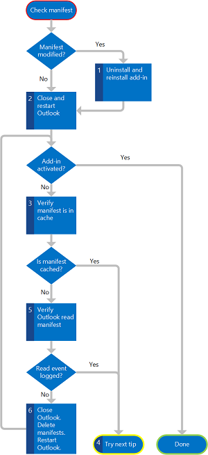

# <a name="troubleshoot-outlook-add-in-activation"></a>Устранение неполадок при активации надстроек Outlook

Надстройка Outlook с контекстной активацией основана на правилах активации в манифесте надстройки. Когда условия для выбранного элемента удовлетворяют правилам активации для надстройки, приложение активирует и отображает кнопку надстройки в пользовательском интерфейсе Outlook (область выбора надстроек для создания надстроек, панель надстройки для надстроек для чтения). Тем не менее, если ваша надстройка не активируется должным образом, следует ознакомиться со следующими разделами по возможным причинам.

## <a name="is-user-mailbox-on-a-version-of-exchange-server-that-is-at-least-exchange-2013"></a>Размещен ли почтовый ящик пользователя в Exchange Server версии не ниже Exchange 2013?

В первую очередь убедитесь, что тестируемая учетная запись пользователя находится в Exchange Server версии не ниже Exchange 2013. Если вы используете какие-либо функции, выпущенные после Exchange 2013, убедитесь, что учетная запись пользователя размещена в соответствующей версии Exchange.

Версию Exchange 2013 можно проверить одним из указанных ниже способов.

- Уточнить у администратора Exchange Server.

- Если вы тестируете надстройку в Outlook в Интернете или на мобильных устройствах, в отладчике сценариев (например, в отладчике JScript Debugger, который поставляется с Internet Explorer) найдите атрибут **src** тега **script**, указывающий расположение, из которого выполняется загрузка сценариев. Этот путь должен содержать подстроку **owa/15.0.516.x/owa2/...**, где **15.0.516.x** — это версия Exchange Server, например **15.0.516.2**.

- Кроме того, вы можете проверить версию с помощью свойства [Office.context.mailbox.diagnostics.hostVersion](/javascript/api/outlook/office.diagnostics#hostversion). В Outlook в Интернете и на мобильных устройствах это свойство возвращает сведения о версии Exchange Server.

- Если у вас есть возможность тестировать надстройку в Outlook, то вы можете применить указанный ниже простой способ отладки, в котором используются объектная модель Outlook и редактор Visual Basic.

    1. Во-первых, убедитесь, что включены макросы для Outlook. Выберите элементы **Файл** > **Параметры** > **Центр управления безопасностью** > **Параметры центра управления безопасностью** > **Параметры макросов**. Убедитесь, что в центре управления безопасностью выбрано значение **Уведомления для всех макросов**. Кроме того, при запуске Outlook необходимо выбрать элемент **Включить макросы**.

    1. На вкладке **Разработчик** ленты выберите **Visual Basic**.

       > [!NOTE]
       > Не отображается вкладка **Разработчик**? Сведения о том, как ее включить, см. в статье[ Отображение вкладки "Разработчик" на ленте](/visualstudio/vsto/how-to-show-the-developer-tab-on-the-ribbon).

    1. В редакторе Visual Basic выберите **Вид** > **Окно интерпретации**.

    1. Для отображения версии Exchange Server ввести в окне интерпретации следующее (основной номер версии в возвращаемом значении должен быть не ниже 15).

       - Если в профиле пользователя только одна учетная запись Exchange:

       ```vb
        ?Session.ExchangeMailboxServerVersion
       ```

       - Если в профиле пользователя несколько учетных записей Exchange (`emailAddress` представляет строку, содержащую основной SMTP-адрес пользователя):

       ```vb
        ?Session.Accounts.Item(emailAddress).ExchangeMailboxServerVersion
       ```

## <a name="is-the-add-in-disabled"></a>Не отключена ли надстройка?

Любой из полнофункциональных клиентов Outlook может отключать надстройку в целях повышения производительности, учитывая превышение порога использования ядра ЦП или памяти, устойчивость при сбоях и продолжительность обработки всех регулярных выражений для надстройки. Когда это происходит, полнофункциональный клиент Outlook выводит уведомление, что надстройка отключается.

> [!NOTE]
> Только полнофункциональные клиенты Outlook отслеживают использование ресурсов. При отключении надстройки в полнофункциональном клиенте Outlook она также отключается в Outlook в Интернете и на мобильных устройствах.

Чтобы проверить, не отключена ли надстройка, используйте один из следующих способов:

- В Outlook в Интернете войдите непосредственно в учетную запись почты, щелкните значок "Параметры" и выберите элемент **Управление надстройками**, чтобы перейти в Центр администрирования Exchange и проверить, включена ли эта надстройка.

- В Outlook для Windows перейдите в представление Backstage и выберите **Управление надстройками**. Войдите в Центр администрирования Exchange и проверьте, включена ли надстройка.

- В Outlook для Mac выберите пункт **Управление надстройками** на панели надстройки. Войдите в Центр администрирования Exchange и проверьте, включена ли надстройка.

## <a name="does-the-tested-item-support-outlook-add-ins-is-the-selected-item-delivered-by-a-version-of-exchange-server-that-is-at-least-exchange-2013"></a>Поддерживает ли тестируемый элемент надстройки Outlook? Предоставлен ли выбранный элемент Exchange Server версии не ниже Exchange 2013?

Если ваша надстройка Outlook является надстройкой чтения, которая должна активироваться, когда пользователь просматривает сообщение (включая письма, приглашения на собрания, а также ответы и отмены) или встречу, хотя в целом эти элементы поддерживают надстройки, существуют исключения. Проверьте, относится ли выбранный элемент к одному из [списка элементов, для которых надстройки Outlook не активируются](outlook-add-ins-overview.md#mailbox-items-available-to-add-ins).

Кроме того, поскольку встречи всегда сохраняются в формате RTF, правило [ItemHasRegularExpressionMatch](../reference/manifest/rule.md#itemhasregularexpressionmatch-rule), которое задает значение **PropertyName** для **BodyAsHTML**, не будет активировать надстройку для встреч или сообщений, сохраненных в виде обычного текста или в формате RTF.

Даже если почтовый элемент не относится к одному из указанных выше типов, при недоставке этого элемента Exchange Server не ниже версии Exchange 2013 известные сущности и свойства, например SMTP-адрес отправителя, не будут идентифицированы в этом элементе. Все правила активации, которые зависят от этих сущностей или свойств, не будут удовлетворены, и надстройка не будет активирована.

Если ваша надстройка является надстройкой создания, которая должна активироваться, когда пользователь создает сообщение или приглашение на собрание, убедитесь, что элемент не защищен с помощью IRM. Однако существует несколько исключений.

1. Надстройки активируют сообщения с цифровой подписью в Outlook, связанном с подпиской на Microsoft 365. В Windows эта поддержка представлена в сборке 8711.1000.
1. Начиная с Outlook Build 13229,10000 в Windows, надстройки теперь могут активировать элементы, защищенные IRM.  Дополнительные сведения об этой поддержке в предварительной версии можно найти в статье [Активация надстроек в элементах, защищенных службой управления правами на доступ к данным (IRM)](../reference/objectmodel/preview-requirement-set/outlook-requirement-set-preview.md#add-in-activation-on-items-protected-by-information-rights-management-irm).

## <a name="is-the-add-in-manifest-installed-properly-and-does-outlook-have-a-cached-copy"></a>Установлен ли манифест надстройки должным образом, и есть ли Outlook кэшированная копия?

Этот сценарий применим только к Outlook для Windows. Обычно при установке надстройки Outlook для почтового ящика Exchange Server копирует манифест надстройки из указанного вами расположения в почтовый ящик в Exchange Server. При каждом запуске Outlook считывает все манифесты, установленные для этого почтового ящика, во временный кэш в следующей папке:

```text
%LocalAppData%\Microsoft\Office\16.0\WEF
```

Например, для пользователя John кэш может находиться на сайте C:\Users\john\AppData\Local\Microsoft\Office\16.0\WEF.

> [!IMPORTANT]
> Для Outlook 2013 в Windows используйте 15,0 вместо 16,0, чтобы это расположение было бы следующим:
>
> ```text
> %LocalAppData%\Microsoft\Office\15.0\WEF
> ```

Если надстройка не активируется для каких-либо элементов, возможно, манифест неправильно установлен в Exchange Server или Outlook не прочитал этот манифест должным образом при запуске. С помощью Центра администрирования Exchange убедитесь, что надстройка установлена и включена для этого почтового ящика, и при необходимости перезагрузите Exchange Server.

На рисунке 1 показана сводка действий, которые необходимо выполнить, чтобы проверить правильность версии манифеста в Outlook.

**Рис. 1. Блок-схема действий по проверке правильности кэширования манифеста в Outlook**



В следующей процедуре подробно описываются эти действия.

1. Если вы изменили манифест, не закрывая Outlook, и для разработки надстройки не используете Visual Studio 2012 или более поздней версии, то следует удалить надстройку и установить ее еще раз с помощью Центра администрирования Exchange.

1. Перезапустите Outlook и проверьте, активирует ли Outlook надстройку теперь.

1. Если Outlook не активирует надстройку, проверьте, есть ли у Outlook кэшированная копия манифеста надстройки. Поищите ее по следующему пути:

    ```text
    %LocalAppData%\Microsoft\Office\16.0\WEF
    ```

    Манифест можно найти в следующей вложенной папке:

    ```text
    \<insert your guid>\<insert base 64 hash>\Manifests\<ManifestID>_<ManifestVersion>
    ```

    > [!NOTE]
    > Пример пути к манифесту, установленному для почтового ящика пользователя John:
    >
    > ```text
    > C:\Users\john\appdata\Local\Microsoft\Office\16.0\WEF\{8D8445A4-80E4-4D6B-B7AC-D4E6AF594E73}\GoRshCWa7vW8+jhKmyiDhA==\Manifests\b3d7d9d5-6f57-437d-9830-94e2aaccef16_1.2
    > ```

    Проверьте, есть ли манифест тестируемой надстройки в кэше.

1. Если манифест есть в кэше, пропустите остальную часть этого раздела и рассмотрите другие возможные причины ниже.

1. Если манифест в кэше отсутствует, проверьте, действительно ли Outlook успешно считал этот манифест в Exchange Server. Для этого воспользуйтесь средством просмотра событий Windows.

    1. В разделе **Журналы Windows** выберите **Приложение**.

    1. Найдите достаточно недавнее событие, идентификатор которого равен 63, что представляет загрузку Outlook манифеста из Exchange Server.

    1. Если Outlook успешно считал манифест, то событие в журнале должно иметь следующее описание:

        ```text
        The Exchange web service request GetAppManifests succeeded.
        ```

        В этом случае пропустите остальную часть этого раздела и рассмотрите другие возможные причины ниже.

1. Если манифест не был прочитан, закройте Outlook и удалите все манифесты в следующей папке:

    ```text
    %LocalAppData%\Microsoft\Office\16.0\WEF\<insert your guid>\<insert base 64 hash>\Manifests\
    ```

    Запустите Outlook и проверьте, активирует ли Outlook надстройку.

1. Если Outlook по-прежнему не активирует надстройку, вернитесь к шагу 3 и еще раз проверьте, прочитал ли Outlook манифест.

## <a name="is-the-add-in-manifest-valid"></a>Действителен ли манифест надстройки?

Сведения об устранении проблем, связанных с манифестом надстройки, см. в статье [Проверка манифеста и устранение связанных с ним неполадок](../testing/troubleshoot-manifest.md).

## <a name="are-you-using-the-appropriate-activation-rules"></a>Используются ли необходимые правила активации?

Начиная со схемы манифеста для надстроек Office версии 1.1, вы можете создавать надстройки, которые активируются, когда пользователь работает в форме создания (надстройке создания) или форме чтения (надстройке чтения). Обязательно укажите необходимые правила активации для каждого типа формы, в котором должна активироваться надстройка. Например, надстройки создания можно активировать только с помощью правил [ItemIs](../reference/manifest/rule.md#itemis-rule), в которых атрибут **FormType** которых имеет значение **Edit** или **ReadOrEdit**. При этом вам не удастся использовать другие типы правил, например [ItemHasKnownEntity](../reference/manifest/rule.md#itemhasknownentity-rule) и [ItemHasRegularExpressionMatch](../reference/manifest/rule.md#itemhasregularexpressionmatch-rule) для надстроек создания. Дополнительные сведения см. в статье [Правила активации для надстроек Outlook](activation-rules.md).

## <a name="if-you-use-a-regular-expression-is-it-properly-specified"></a>Если используется регулярное выражение, указано ли оно должным образом?

Поскольку регулярные выражения в правилах активации являются частью XML-файла манифеста надстройки чтения, при использовании в регулярных выражениях определенных символов убедитесь, что используется соответствующая escape-последовательность, которую поддерживают XML-процессоры. В таблице 1 приведены эти особые символы.

**Таблица 1. Escape-последовательности для регулярных выражений**

|**Символ**|**Описание**|**Используемая escape-последовательность**|
|:-----|:-----|:-----|
|`"`|Двойная кавычка|&amp;quot;|
|`&`|Амперсанд|&amp;amp;|
|`'`|Апостроф|&amp;apos;|
|`<`|Знак "меньше"|&amp;lt;|
|`>`|Знак "больше"|&amp;gt;|

## <a name="if-you-use-a-regular-expression-is-the-read-add-in-activating-in-outlook-on-the-web-or-mobile-devices-but-not-in-any-of-the-outlook-rich-clients"></a>Если вы используете регулярное выражение, надстройка чтения активируется в Outlook в Интернете или на мобильных устройствах, но не активируется ни в одном из полнофункциональных клиентов Outlook?

В полнофункциональных клиентах Outlook используется не такой обработчик регулярных выражений, как в Outlook в Интернете и на мобильных устройствах. В полнофункциональных клиентах Outlook используется обработчик регулярных выражений C++, который предоставляется в составе библиотеки стандартных шаблонов Visual Studio. Этот обработчик выполняет компиляцию в соответствии со стандартами ECMAScript 5. Outlook в Интернете и на мобильных устройствах использует компонент оценки регулярных выражений, который входит в состав JavaScript, предоставляется браузером и поддерживает расширенный набор стандартов ECMAScript 5.

В большинстве случаев эти клиенты Outlook находят совпадения для одного и того же регулярного выражения в правиле активации, но существуют исключения. Например, если регулярное выражение содержит настраиваемый класс символов на основе предопределенных классов символов, то расширенный клиент Outlook может возвращать результаты, отличные от Outlook в Интернете и на мобильных устройствах. Например, классы символов, содержащие классы стенографических символов `[\d\w]`, будут возвращать разные результаты. В этом случае, чтобы избежать разных результатов для разных приложений, используйте `(\d|\w)` вместо этого.

Тщательно протестируйте регулярное выражение. Если оно возвращает разные результаты, перепишите выражение для совместимости с обоими обработчиками. Чтобы проверить результаты оценки в полнофункциональном клиенте Outlook, напишите небольшую программу на C++, применяющую регулярное выражение к образцу сопоставляемого текста. Эта тестовая программа на C++ работает в Visual Studio и использует стандартную библиотеку шаблонов, имитируя поведение полнофункционального клиента Outlook при выполнении такого же регулярного выражения. Чтобы проверить результаты проверки в Outlook в Интернете или на мобильных устройствах, используйте любое средство проверки регулярных выражений JavaScript.

## <a name="if-you-use-an-itemis-itemhasattachment-or-itemhasregularexpressionmatch-rule-have-you-verified-the-related-item-property"></a>Если используется правило ItemIs, ItemHasAttachment или ItemHasRegularExpressionMatch, проверено ли соответствующее свойство элемента?

Если вы используете правило активации **ItemHasRegularExpressionMatch**, проверьте, соответствует ли значение атрибута **PropertyName** предполагаемому значению для выбранного элемента. Ниже приведены несколько советов по отладке соответствующих свойств.

- Если выбранный элемент представляет собой сообщение, и в атрибуте **PropertyName** вы указываете значение **BodyAsHTML**, откройте это сообщение и выберите **Просмотреть код**, чтобы проверить текст сообщения в HTML-представлении этого элемента.

- Если выбранный элемент представляет собой встречу или если правило активации задает **BodyAsPlaintext** в атрибуте **PropertyName**, вы можете использовать объектную модель Outlook и редактор Visual Basic в Outlook для Windows.

    1. Убедитесь, что макросы включены и на ленте Outlook отображается вкладка **Разработчик**.

    1. В редакторе Visual Basic выберите **Вид** > **Окно интерпретации**.

    1. Для отображения разных свойств в зависимости от сценария введите следующее.

        - Для HTML-текста элемента сообщения или встречи, выбранного в обозревателе Outlook:

        ```vb
        ?ActiveExplorer.Selection.Item(1).HTMLBody
        ```
        - Для простого текста элемента сообщения или встречи, выбранного в обозревателе Outlook:

        ```vb
        ?ActiveExplorer.Selection.Item(1).Body
        ```
        - Для HTML-текста элемента сообщения или встречи, выбранного в инспекторе Outlook:

        ```vb
        ?ActiveInspector.CurrentItem.HTMLBody
        ```
        - Для простого текста элемента сообщения или встречи, выбранного в инспекторе Outlook:

        ```vb
        ?ActiveInspector.CurrentItem.Body
        ```

Если правило активации **ItemHasRegularExpressionMatch** указывает **Subject** либо **SenderSMTPAddress** или если вы используете правило **ItemIs** либо **ItemHasAttachment**, и вы умеете работать с MAPI или хотите его использовать, то для проверки значения в таблице 2, от которого зависит ваше правило, можно воспользоваться [MFCMAPI](https://github.com/stephenegriffin/mfcmapi).

**Таблица 2. Правила активации и соответствующие свойства MAPI**

|Тип правила|Свойство MAPI для проверки|
|:-----|:-----|
|Правило **ItemHasRegularExpressionMatch** с **Subject**|[PidTagSubject](/office/client-developer/outlook/mapi/pidtagsubject-canonical-property)|
|Правило **ItemHasRegularExpressionMatch** с **SenderSMTPAddress**|[PidTagSenderSmtpAddress](/office/client-developer/outlook/mapi/pidtagsendersmtpaddress-canonical-property) и [PidTagSentRepresentingSmtpAddress](/office/client-developer/outlook/mapi/pidtagsentrepresentingsmtpaddress-canonical-property)|
|**ItemIs**|[PidTagMessageClass](/office/client-developer/outlook/mapi/pidtagmessageclass-canonical-property)|
|**ItemHasAttachment**|[PidTagHasAttachments](/office/client-developer/outlook/mapi/pidtaghasattachments-canonical-property)|

После проверки значения свойства можно с помощью средства оценки регулярных выражений проверить, находит ли регулярное выражение соответствие в этом значении.

## <a name="does-outlook-apply-all-the-regular-expressions-to-the-portion-of-the-item-body-as-you-expect"></a>Применяются ли в Outlook все регулярные выражения к части основного текста элемента, как ожидалось?

Этот раздел относится ко всем правилам активации, в которых используются регулярные выражения, в частности, к тем правилам, которые применяются к основному тексту элемента, который может иметь большой размер и для которого может потребоваться больше времени на оценку соответствий. Обратите внимание, что даже если свойство элемента, от которого зависит правило активации, имеет ожидаемое значение, Outlook не сможет оценивать все регулярные выражения по всему значению свойства Item. Чтобы обеспечить приемлемую производительность и контролировать чрезмерное использование ресурсов с помощью надстройки чтения, Outlook следит за следующими пределами обработки регулярных выражений в правилах активации во время выполнения:

- Вычисление размера текста элемента зависит от части основного текста элемента, в котором Outlook оценивает регулярное выражение. Эти пределы зависят от клиента, форм и формата текста элемента Outlook. В таблице 2 приведены сведения об [ограничении активации и API JavaScript для надстроек Outlook](limits-for-activation-and-javascript-api-for-outlook-add-ins.md).

- Количество соответствий регулярному выражению: полнофункциональные клиенты Outlook, Outlook в Интернете и на мобильных устройствах возвращают до 50 соответствий регулярным выражениям. Эти соответствия уникальны, и ограничение не распространяется на повторения. Не рассчитывайте, что соответствия будут возвращаться в определенном порядке и что порядок результатов в полнофункциональном клиенте Outlook будет таким же, как в Outlook в Интернете и на мобильных устройствах. Если ожидается, что найдется много соответствий регулярным выражениям из правил активации, и какого-то соответствия не хватает, это может быть связано с данным ограничением.

- Длина согласования регулярного выражения — существуют ограниченные значения длины регулярного выражения, возвращаемого приложением Outlook. Outlook не включает какие – либо ограничения, превышающие ограничения, и не отображает соответствующее сообщение. Вы можете проверить ваше регулярное выражение с помощью других средств оценки регулярных выражений или автономной тестовой программы на C++, чтобы проверить, имеются ли соответствия, превышающие ограничения. В таблице 3 приведены эти ограничения. Дополнительные сведения приведены в таблице 3 в разделе [Limits for Activation и API JavaScript для надстроек Outlook](limits-for-activation-and-javascript-api-for-outlook-add-ins.md).

    **Таблица 3. Ограничения длины для результатов, соответствующих регулярным выражениям**

    |Ограничение длины для результата, соответствующего регулярному выражению|Полнофункциональные клиенты Outlook|Outlook в Интернете или на мобильных устройствах|
    |:-----|:-----|:-----|
    |Основной текст элемента в виде простого текста|1,5 КБ|3 КБ|
    |Основной текст элемента в виде HTML-кода|3 КБ|3 КБ|

- Время, затрачиваемое на оценку всех регулярных выражений в надстройке чтения — для расширенного клиента Outlook. По умолчанию для каждой почтовой надстройки для Outlook должен завершить оценку всех регулярных выражений в правилах активации за 1 секунду. В противном случае Outlook повторяет попытку до трех раз и отключает приложение, если не может завершить оценку. Outlook отображает в панели уведомлений сообщение, что надстройка отключается. Количество времени на оценку регулярных выражений можно изменить в групповой политике или в разделе реестра. 

   > [!NOTE]
   > Если полнофункциональный клиент Outlook отключит надстройку для чтения, она станет недоступна для использования с данным почтовым ящиком в полнофункциональном клиенте Outlook, Outlook в Интернете и на мобильных устройствах.

## <a name="see-also"></a>См. также

- [Развертывание и установка надстроек Outlook для тестирования](testing-and-tips.md)
- [Правила активации для надстроек Outlook](activation-rules.md)
- [Использование правил активации на основе регулярных выражений для отображения надстройки Outlook](use-regular-expressions-to-show-an-outlook-add-in.md)
- [Ограничения для активации и API JavaScript для надстроек Outlook](limits-for-activation-and-javascript-api-for-outlook-add-ins.md)
- [Проверка манифеста и устранение связанных с ним неполадок](../testing/troubleshoot-manifest.md)
