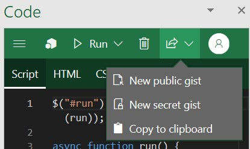
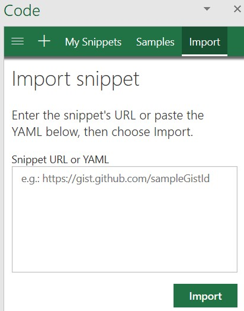

# Изучение API JavaScript для Office с помощью Script Lab

[Надстройка Script Lab](https://appsource.microsoft.com/product/office/WA104380862), бесплатно доступная в AppSource, дает возможность изучать API JavaScript для Office при работе в приложениях Office, таких как Excel или Word. Script Lab — удобный инструмент, который целесообразно добавить в набор средств разработки при работе с прототипами и при проверке нужной функциональности надстроек.

## Что такое Script Lab?

Script Lab — это инструмент для всех, кто хочет научиться разрабатывать надстройки Office с помощью API JavaScript для Office в Excel, Word и  PowerPoint. Благодаря поддержке IntelliSense можно видеть доступные возможности. Этот инструмент построен на платформе Monaco, которая используется решением Visual Studio Code. С помощью Script Lab можно получить доступ к библиотеке примеров, чтобы быстро опробовать доступные функции. Также можно использовать пример в качестве отправной точки для разработки собственного кода. Можно даже использовать Script Lab для предварительного ознакомления с API.

Звучит неплохо? Посмотрите этот минутный видеоролик, чтобы увидеть Script Lab в действии.

## Основные возможности

В Script Lab доступен ряд функций, которые помогут изучить API JavaScript для Office и функциональность прототипов надстроек.

### Изучите примеры

Встроенные примеры фрагментов кода, демонстрирующие выполнение задач с помощью API, помогут быстро начать работу. Можно запускать примеры, чтобы сразу видеть результат в области задач или документе, изучать примеры, чтобы понять принципы действия API, и даже использовать примеры для создания прототипов собственных надстроек.

### Код и стиль

В дополнение к коду JavaScript или TypeScript, который вызывает API JS для Office, каждый фрагмент также содержит разметку HTML, определяющую содержимое области задач, и таблицы стилей CSS, определяющие внешний вид области задач. Можно настроить разметку HTML и  CSS, чтобы поэкспериментировать с размещением и стилем элементов при создании прототипа дизайна панели задач для вашей собственной надстройки.

> [!TIP]
> Чтобы вызвать API предварительной версии во фрагменте кода, потребуется обновить библиотеки фрагмента кода для использования сети доставки содержимого бета-версии (`https://appsforoffice.microsoft.com/lib/beta/hosted/office.js`) и определения типов предварительной версии `@types/office-js-preview`. Кроме того, некоторые API предварительной версии доступны только при наличии регистрации в [программе предварительной оценки Office](https://insider.office.com) и используете сборку Office, предназначенную для участников этой программы.

### Сохранение фрагментов кода и общий доступ к ним

Фрагменты кода, которые вы открываете в Script Lab, по умолчанию сохраняются в кэше браузера. Чтобы навсегда сохранить фрагмент кода, можно экспортировать его в [gist GitHub](https://gist.github.com). Можно создать секретный gist, чтобы сохранить фрагмент кода только для собственного использования, или создать общедоступный gist, если вы планируете поделиться этим фрагментом кода с другими пользователями.

### Импорт фрагментов кода

Можно импортировать фрагмент кода в Script Lab, указав URL-адрес общедоступного [gist GitHub](https://gist.github.com), в котором хранится YAML этого фрагмента кода, или вставить полный код YAML этого фрагмента кода. Эта функция может оказаться полезной в случае, если кто-то другой поделился с вами своим фрагментом кода, опубликовав его в gist GitHub или предоставив YAML этого фрагмента кода.

## Поддерживаемые клиенты

Script Lab поддерживается для Excel, Word и  PowerPoint в следующих клиентах.

- Office 2013 или более поздней версии для Windows
- Office 2016 или более поздней версии для Mac
- Office в Интернете

## Дальнейшие действия

Чтобы использовать Script Lab в Excel, Word или  PowerPoint, установите [надстройку Script Lab](https://appsource.microsoft.com/product/office/WA104380862) из AppSource. 

Вы можете пополнить библиотеку примеров в Script Lab, добавив новые фрагменты кода в репозиторий GitHub [office-js-snippets](https://github.com/OfficeDev/office-js-snippets#office-js-snippets).

Когда вы будете готовы приступить к созданию своей первой надстройки Office, ознакомьтесь с кратким руководством для [Excel](../quickstarts/excel-quickstart-jquery.md), [Outlook](../quickstarts/outlook-quickstart.md), [Word](../quickstarts/word-quickstart.md), [OneNote](../quickstarts/onenote-quickstart.md), [PowerPoint](../quickstarts/powerpoint-quickstart.md) или [Project](../quickstarts/project-quickstart.md).

## См. также

- [Получить Script Lab](https://appsource.microsoft.com/product/office/WA104380862)
- [Подробнее о Script Lab](https://github.com/OfficeDev/script-lab#script-lab-a-microsoft-garage-project)
- [Присоединяйтесь к программе для разработчиков Office 365](https://developer.microsoft.com/office/dev-program)
- [Создание надстроек Office](../overview/office-add-ins-fundamentals.md)
