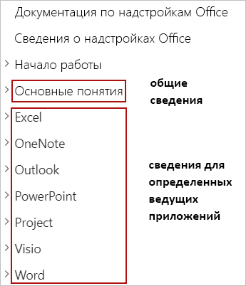

# Создание надстроек OfficeBuilding Office Add-ins

> [!TIP]
> Перед прочтением этой статьи ознакомьтесь с [обзором платформы надстроек Office](office-add-ins.md).Please review [Office Add-ins platform overview](office-add-ins.md) before reading this article.

Надстройки Office расширяют пользовательский интерфейс и функции приложений Office и взаимодействуют с содержимым документов Office.Office Add-ins extend the UI and functionality of Office applications and interact with content in Office documents. Вы сможете использовать привычные веб-технологии для создания надстроек Office для взаимодействия с Word, Excel, PowerPoint, OneNote, Project и Outlook, а также для расширения возможностей этих приложений.You'll use familiar web technologies to create Office Add-ins that extend and interact with Word, Excel, PowerPoint, OneNote, Project, or Outlook. Создаваемые надстройки можно запускать в Office на разных платформах, включая Windows, Mac, iPad, и в браузере.The add-ins you build can run in Office across multiple platforms, including Windows, Mac, iPad, and in a browser. В этой статье представлены общие сведения о разработке надстроек Office.This article provides an introduction to developing Office Add-ins.

## Создание надстройки OfficeCreating an Office Add-in 

Надстройку Office можно создать с помощью генератора Yeoman для надстроек Office или Visual Studio.You can create an Office Add-in by using the Yeoman generator for Office Add-ins or Visual Studio.

### Генератор Yeoman для надстроек OfficeYeoman generator for Office Add-ins

[Генератор Yeoman для надстроек Office](https://github.com/officedev/generator-office) можно использовать для создания проекта надстройки Office Node.js, которым можно управлять с помощью Visual Studio Code или любого другого редактора.The [Yeoman generator for Office Add-ins](https://github.com/officedev/generator-office) can be used to create a Node.js Office Add-in project that can be managed with Visual Studio Code or any other editor. В генераторе можно создавать надстройки Office для любой из следующих целей.The generator can create Office Add-ins for any of the following:

- ExcelExcel
- OneNoteOneNote
- OutlookOutlook
- PowerPointPowerPoint
- ProjectProject
- WordWord
- Пользовательские функции ExcelExcel custom functions

Проект можно создать с помощью HTML, CSS и JavaScript или с помощью Angular или React.You can choose to create the project using HTML, CSS and JavaScript, or using Angular or React. Для любой платформы можно также выбирать между JavaScript и Typescript.For whichever framework you choose, you can choose between JavaScript and Typescript as well. Дополнительные сведения о создании надстроек с помощью генератора Yeoman см. в статье [Разработка надстроек Office с помощью Visual Studio Code](../develop/develop-add-ins-vscode.md).For more information about creating add-ins with the Yeoman generator, see [Develop Office Add-ins with Visual Studio Code](../develop/develop-add-ins-vscode.md).

### Visual StudioVisual Studio

С помощью Visual Studio можно создавать надстройки Office для Excel, Outlook, Word и PowerPoint.Visual Studio can be used to create Office Add-ins for Excel, Outlook, Word, and PowerPoint. Проект надстройки Office создается в рамках решения Visual Studio и использует HTML, CSS и JavaScript.An Office Add-in project gets created as part of a Visual Studio solution and uses HTML, CSS, and JavaScript. Дополнительные сведения о создании надстроек с помощью Visual Studio см. в статье [Разработка надстроек Office с помощью Visual Studio](../develop/develop-add-ins-visual-studio.md).For more information about creating add-ins with Visual Studio, see [Develop Office Add-ins with Visual Studio](../develop/develop-add-ins-visual-studio.md).

[!include[Yeoman vs Visual Studio comparision](../includes/yeoman-generator-recommendation.md)]

## Изучение API с помощью Script LabExploring APIs with Script Lab

Script Lab — это надстройка, позволяющая изучать API JavaScript для Office и выполнять фрагменты кода при работе в программах Office, таких как Excel или Word.Script Lab is an add-in that enables you to explore the Office JavaScript API and run code snippets while you're working in an Office program such as Excel or Word. Она доступна бесплатно в [AppSource](https://appsource.microsoft.com/product/office/WA104380862) и является полезным инструментом для добавления в набор средств разработки при создании прототипов и проверке нужных функций в надстройке.It's available for free via [AppSource](https://appsource.microsoft.com/product/office/WA104380862) and is a useful tool to include in your development toolkit as you prototype and verify the functionality you want in your add-in. В Script Lab можно получить доступ к библиотеке встроенных примеров, чтобы быстро испытать API или использовать пример в качестве отправной точки для собственного кода.In Script Lab, you can access a library of built-in samples to quickly try out APIs or even use a sample as the starting point for your own code. 

В следующем 1-минутном видео показана надстройка Script Lab в действии.The following one-minute video shows Script Lab in action.

Дополнительные сведения о Script Lab см. в статье [Изучение API JavaScript для Office с помощью Script Lab](../overview/explore-with-script-lab.md).For more information about Script Lab, see [Explore Office JavaScript APIs using Script Lab](../overview/explore-with-script-lab.md).

## Расширение пользовательского интерфейса OfficeExtending the Office UI

Надстройка Office может расширить пользовательский интерфейс Office с помощью команд надстройки и контейнеров HTML, таких как области задач, контентные надстройки и диалоговые окна.An Office Add-in can extend the Office UI by using add-in commands and HTML containers such as task panes, content add-ins, or dialog boxes.

- [Команды надстроек](../design/add-in-commands.md) можно использовать для добавления настраиваемых вкладок, кнопок и меню на стандартную ленту в Office или для расширения стандартного контекстного меню, отображающегося при щелчке правой кнопкой мыши по тексту в документе Office или объекту в Excel.[Add-in commands](../design/add-in-commands.md) can be used to add custom tabs, buttons, and menus to the default ribbon in Office, or to extend the default context menu that appears when users right-click text in an Office document or an object in Excel. Когда пользователи выбирают команду надстройки, они запускают задачу, определяемую этой командой надстройки, например выполнение кода JavaScript, открытие области задач или запуск диалогового окна.When users select an add-in command, they initiate the task that the add-in command specifies, such as running JavaScript code, opening a task pane, or launching a dialog box.

- Контейнеры HTML, такие как [области задач](../design/task-pane-add-ins.md), [контентные надстройки](../design/content-add-ins.md) и [диалоговые окна](../design/dialog-boxes.md) можно использовать для отображения настраиваемого пользовательского интерфейса и предоставления дополнительных функций в приложении Office.HTML containers like [task panes](../design/task-pane-add-ins.md), [content add-ins](../design/content-add-ins.md), and [dialog boxes](../design/dialog-boxes.md) can be used to display custom UI and expose additional functionality within an Office application. Содержимое и функции каждой области задач, контентной надстройки или диалогового окна зависят от указанной вами веб-страницы.The content and functionality of each task pane, content add-in, or dialog box derives from a web page that you specify. Эти веб-страницы могут использовать API JavaScript для Office с целью взаимодействия с содержимым в документе Office, в котором запущена надстройка, а также могут выполнять другие типовые действия веб-страниц, например вызовы внешних веб-служб, упрощение проверки подлинности пользователей и т. д.Those web pages can use the Office JavaScript API to interact with content in the Office document where the add-in is running, and can also do other things that web pages typically do, like call external web services, facilitate user authentication, and more.

На следующем изображении показана команда надстройки на ленте, область задач справа от документа, диалоговое окно или контентная надстройка поверх документа.The following image shows an add-in command in the ribbon, a task pane to the right of the document, and a dialog box or content add-in over the document.

Дополнительные сведения о расширении пользовательского интерфейса Office см. в статье [Элементы пользовательского интерфейса Office для надстроек Office](../design/interface-elements.md).For more information about extending the Office UI, see [Office UI elements for Office Add-ins](../design/interface-elements.md).

## Основные понятия разработкиCore development concepts 

Надстройка Office состоит из двух частей:An Office Add-in consists of two parts:

- Манифест надстройки (XML-файл), определяющий параметры и возможности надстройки.The add-in manifest (an XML file) that defines the settings and capabilities of the add-in.

- Веб-приложение, определяющее пользовательский интерфейс и функции компонентов надстройки, таких как области задач, контентные надстройки и диалоговые окна.The web application that defines the UI and functionality of add-in components such as task panes, content add-ins, and dialog boxes.

Веб-приложение использует API JavaScript для Office, чтобы взаимодействовать с содержимым документа Office, в котором запущена надстройка.The web application uses the Office JavaScript API to interact with content in the Office document where the add-in is running. Надстройка также может выполнять другие типовые действия веб-приложений, например вызовы внешних веб-служб, упрощение проверки подлинности пользователей и т. д.Your add-in can also do other things that web applications typically do, like call external web services, facilitate user authentication, and more.

### Определение параметров и возможностей надстройкиDefining an add-in's settings and capabilities

Манифест надстройки Office (XML-файл), определяющий параметры и возможности надстройки.An Office Add-in's manifest (an XML file) defines the settings and capabilities of the add-in. Вы можете настроить манифест, чтобы указать следующие элементы:You'll configure the manifest to specify things such as:

- метаданные, описывающие надстройку (например, ИД, версия, описание, отображаемое имя, региональные параметры по умолчанию);Metadata that describes the add-in (for example, ID, version, description, display name, default locale).
- приложения Office, в которых будет запускаться надстройка;Office applications where the add-in will run.
- разрешения, требующиеся для надстройки;Permissions that the add-in requires.
- способ интеграции надстройки с Office, включая создаваемые ею элементы пользовательского интерфейса (например, настраиваемые вкладки и кнопки на ленте);How the add-in integrates with Office, including any custom UI that the add-in creates (for example, custom tabs, ribbon buttons).
- расположение изображений, используемых надстройкой для фирменной символики и значков команд;Location of images that the add-in uses for branding and command iconography.
- размеры надстройки (например, размеры для контентных надстроек, запрошенная высота для надстроек Outlook);Dimensions of the add-in (for example, dimensions for content add-ins, requested height for Outlook add-ins).
- правила, определяющие, когда надстройка активируется в контексте сообщения или встречи (только для надстроек Outlook).Rules that specify when the add-in activates in the context of a message or appointment (for Outlook add-ins only).

Дополнительные сведения о манифесте см. в статье [XML-манифест надстроек Office](add-in-manifests.md).For detailed information about the manifest, see [Office Add-ins XML manifest](add-in-manifests.md).

### Взаимодействие с содержимым в документе OfficeInteracting with content in an Office document

Надстройка Office может использовать API JavaScript для Office, чтобы взаимодействовать с содержимым документа Office, в котором запущена надстройка.An Office Add-in can use the Office JavaScript APIs to interact with content in the Office document where the add-in is running. 

#### Доступ к библиотеке API JavaScript для OfficeAccessing the Office JavaScript API library

[!include[information about accessing the Office JS API library](../includes/office-js-access-library.md)]

#### Модели APIAPI models

[!include[information about the Office JS API models](../includes/office-js-api-models.md)]

#### Наборы обязательных элементов APIAPI requirement sets

[!include[information about the Office JS API requirement sets](../includes/office-js-requirement-sets.md)]

## Тестирование и отладка надстройки OfficeTesting and debugging an Office Add-in

При разработке надстройки ее можно протестировать локально, используя метод, называемый _загрузка неопубликованной надстройки_.As you develop your add-in, you can test it locally by using a technique known as _sideloading_. Процедура отличается для разных платформ, а в некоторых случаях и для разных продуктов.The procedure for sideloading an add-in varies by platform, and in some cases, by product as well. Процедура отладки надстроек также может отличаться в зависимости от платформы и продукта.Likewise, the procedure for debugging an add-in can also vary by platform and product. Дополнительные сведения о тестировании и отладке см. в статье [Тестирование и отладка надстроек Office](../testing/test-debug-office-add-ins.md).For more information about testing and debugging, see [Test and debug Office Add-ins](../testing/test-debug-office-add-ins.md).

## Публикация надстройки OfficePublishing an Office Add-in

Когда вы будете готовы поделиться своей надстройкой с другими пользователями, это можно будет сделать с помощью метода развертывания, наиболее подходящего для ваших целей.When you're ready to share your add-in with others, you'll do so by using the deployment method that best meets your objectives. Например, чтобы развернуть надстройку для пользователей в организации, можно воспользоваться централизованным развертыванием или опубликовать надстройку в каталоге приложений SharePoint.For example, to deploy an add-in to users within your organization, you might use centralized deployment or publish the add-in to a SharePoint app catalog. Если вы хотите предоставить общий доступ к надстройке любому пользователю, можно опубликовать надстройку в AppSource.If you want to share your add-in publicly for anyone to obtain, you can publish the add-in to AppSource. Дополнительные сведения о публикации см. в статье [Развертывание и публикация надстроек Office](../publish/publish.md).For more information about publishing, see [Deploy and publish Office Add-ins](../publish/publish.md).

## Дальнейшие действияNext steps

В этой статье рассмотрены различные способы создания надстроек Office, представлен инструмент Script Lab, полезный при изучении API JavaScript для Office и создании прототипов функций надстроек, а также описаны важные понятия разработки, тестирования и публикации надстроек Office.This article has outlined the different ways to create Office Add-ins, introduced Script Lab as a valuable tool for exploring Office JavaScript APIs and prototyping add-in functionality, and described important Office Add-ins development, testing, and publishing concepts. После изучения этих ознакомительных сведений рекомендуется продолжить исследование надстроек Office по следующим путям.Now that you've explored this introductory information, consider continuing your Office Add-ins journey along the following paths.

### Создание надстройки OfficeCreate an Office add-in

Вы можете быстро создать простую надстройку для Excel, OneNote, Outlook, PowerPoint, Project или Word с помощью [5-минутного краткого руководства по началу работы](../index.md).You can quickly create a basic add-in for Excel, OneNote, Outlook, PowerPoint, Project, or Word by completing a [5-minute quick start](../index.md). Если вы уже ознакомились с кратким руководством и хотите создать более сложную надстройку, воспользуйтесь [учебником](../index.md).If you've previously completed a quick start and want to create a slightly more complex add-in, you should try the [tutorial](../index.md).

### Изучение API с помощью Script LabExplore the APIs with Script Lab

Изучите библиотеку встроенных примеров в [Script Lab](explore-with-script-lab.md), чтобы ознакомиться с возможностями API JavaScript для Office.Explore the library of built-in samples in [Script Lab](explore-with-script-lab.md) to get a sense for the capabilities of the Office JavaScript APIs.

### Дополнительные сведенияLearn more

Ознакомьтесь с этой документацией, чтобы узнать больше о разработке, тестировании и публикации надстроек Office.Learn more about developing, testing, and publishing Office Add-ins by exploring this documentation.

> [!TIP]
> При создании любой надстройки вы можете использовать информацию из раздела [Основные принципы](core-concepts-office-add-ins.md) этой документации, а также сведения из разделов для определенных ведущих приложений, соответствующих типу создаваемой надстройки (например, [Excel](../excel/index.md)).For any add-in that you build, you'll use information in the [Core concepts](core-concepts-office-add-ins.md) section of this documentation, along with information in the host-specific section that corresponds to the type of add-in you're building (for example, [Excel](../excel/index.md)).
>
> 

## См. такжеSee also 

- [Обзор платформы надстроек OfficeOffice Add-ins platform overview](office-add-ins.md)
- [Основные принципы надстроек OfficeCore concepts for Office Add-ins](../overview/core-concepts-office-add-ins.md)
- [Разработка надстроек OfficeDevelop Office Add-ins](../develop/develop-overview.md)
- [Разработка надстроек Office с помощью Visual Studio CodeDevelop Office Add-ins with Visual Studio Code](../develop/develop-add-ins-vscode.md)
- [Разработка надстроек Office с помощью Visual StudioDevelop Office Add-ins with Visual Studio](../develop/develop-add-ins-visual-studio.md)
- [Проектирование надстроек OfficeDesign Office Add-ins](../design/add-in-design.md)
- [Тестирование и отладка надстроек OfficeTest and debug Office Add-ins](../testing/test-debug-office-add-ins.md)
- [Публикация надстроек OfficePublish Office Add-ins](../publish/publish.md)