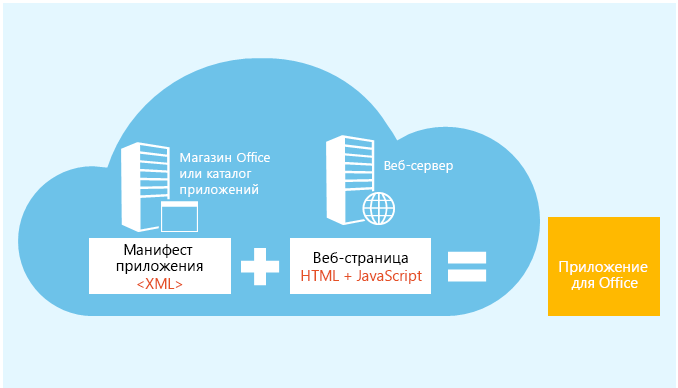
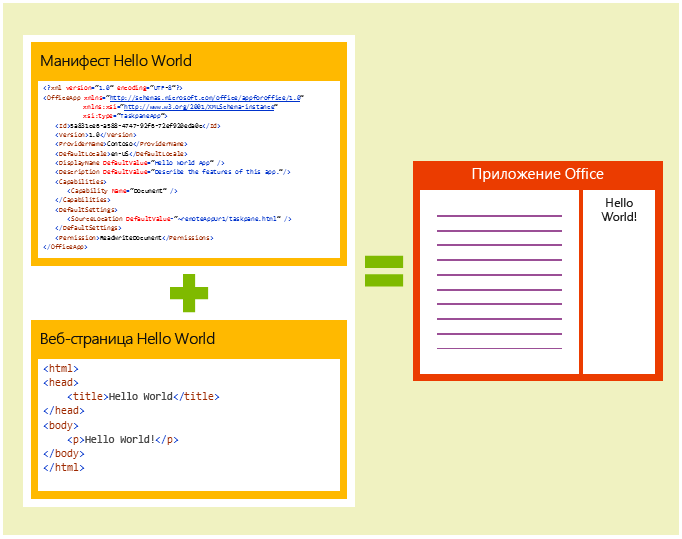

# Обзор платформы надстроек Office

Платформу надстроек Office можно использовать для создания решений, которые расширяют возможности приложений Office и взаимодействуют с содержимым документов Office. В случае надстроек Office можно использовать привычные веб-технологии, например HTML, CSS и JavaScript, для взаимодействия с Word, Excel, PowerPoint, OneNote, Project и Outlook, а также для расширения возможностей этих приложений. Ваше решение может работать в Office на нескольких платформах, включая Office для Windows, Office Online, Office для Mac и Office для iPad.

Надстройки Office могут делать почти все, что может делать веб-страница в браузере. Ниже представлены возможности использования платформы надстроек Office.

-  **Добавление новых возможностей для клиентов Office.** Подключите внешние данные к Office, автоматизируйте обработку документов Office, привнесите функции сторонних решений в клиенты Office, а также сделайте многое другое.  Например, воспользуйтесь API Microsoft Graph для подключения к данным, повышающим производительность. 
    
-  **Создание оснащенных различными функциями интерактивных объектов, которые можно внедрить в документы Office.** Внедряйте карты, диаграммы и интерактивные визуализации, которые пользователи могут добавлять в свои электронные таблицы Excel и презентации PowerPoint. 
    
## Как надстройки Office отличаются от надстроек COM и VSTO? 

Надстройки COM и VSTO представляют собой более ранние решения для интеграции Office, которые работают только в Office для Windows. В отличие от надстроек COM, надстройкам Office не требуется код, который выполняется на устройстве пользователя или в клиенте Office. Ведущее приложение, например Excel, считывает манифест надстройки и подключает дополнительные кнопки ленты и команды меню надстройки в пользовательском интерфейсе. Затем оно загружает JavaScript и HTML-код надстройки, который выполняется в контексте браузера в песочнице. 

Преимущества надстроек Office над надстройками, созданными с помощью VBA, модели COM или VSTO: 

- Кроссплатформенная поддержка. Надстройки Office запускаются в Office для Windows, Mac, iOS и Office Online. 

- Единый вход (SSO). Надстройки Office легко интегрируются с учетными записями пользователей Office 365. 

- Централизованное развертывание и распространение. Администраторы могут развертывать надстройки Office централизованно в организации. 

- Легкий доступ через Магазин Office. Вы можете сделать свое решение доступным широкой аудитории, отправив его в Магазин Office. 

- Стандартная веб-технология. Вы можете использовать любую библиотеку для создания надстроек Office. 

## Компоненты надстройки Office 

Надстройка Office включает в себя два основных компонента — XML-файл манифеста и веб-приложение. Манифест определяет различные параметры, включая способ интеграции надстройки с клиентами Office. Веб-приложение должно быть размещено на веб-сервере или в службе веб-хостинга, например в Microsoft Azure.

**Манифест + веб-страница = надстройка Office**

### Манифест 

Этот манифест представляет собой XML-файл, который определяет следующие параметры и возможности надстройки: 

- Отображаемое имя, описание, идентификатор, версию и языковой стандарт по умолчанию надстройки. 

- Способ интеграции надстройки с Office.  

- Уровень разрешений и требования для доступа к данным для надстройки. 

### Веб-приложение 

Самая простая надстройка Office состоит из статической HTML-страницы, отображаемой в приложении Office, но не взаимодействующей ни с документом Office, ни с каким-либо другим ресурсом в Интернете. Для создания кода, который взаимодействует с документами Office или позволяет пользователю взаимодействовать с веб-ресурсами из ведущего приложения Office, можно применять любые технологии, как клиентские, так и серверные, которые поддерживает ваш поставщик услуг размещения (например, ASP.NET, PHP или Node.js). Для взаимодействия с клиентами и документами Office можно использовать интерфейсы API JavaScript Office.js. 

**Компоненты надстройки Hello World для Office**

## Расширение возможностей и взаимодействие с клиентами Office 

Что позволяют надстройки Office в ведущем приложении Office: 

-  расширение функциональных возможностей (в любом приложении Office); 

-  создание новых объектов (Excel или PowerPoint). 
 
### Расширение функциональных возможностей Office 

Добавить новые возможности в приложения Office можно посредством следующего:  

-  настраиваемые кнопки ленты и команды меню (в совокупности зовутся "командами надстройки"); 

-  вставляемые области задач. 

Пользовательский интерфейс и области задач указаны в манифесте надстройки.  

#### Настраиваемые кнопки и команды меню  

Можно добавить настраиваемые кнопки ленты и элементы меню на ленту в Office для Windows Desktop и Office Online. Это упрощает пользователям доступ к надстройке непосредственно из приложения Office. С помощью кнопок можно запускать различные действия, например отображение области задач с пользовательским HTML или выполнение функции JavaScript.  

**Команды надстройки, выполняемые в Excel Desktop**

#### Области задач  

Для работы с решением пользователи могут использовать области задач в дополнение к командам надстройки. Клиенты, не поддерживающие команды надстройки (Office 2013 и Office для iPad), будут запускать надстройку как область задач. Пользователи запускают надстройки области задач с помощью кнопки **Мои надстройки** на вкладке "Вставка". 

**Область задач**

### Расширение возможностей Outlook 

Надстройки Outlook могут расширять функциональные возможности ленты Office и в зависимости от контекста отображаться рядом с просматриваемым или создаваемым элементом Outlook. Они могут взаимодействовать с письмами, приглашениями на собрания, ответами на приглашения на собрания, сообщениями об отмене собраний или данными о встречах, когда пользователь просматривает полученный элемент, отвечает на него или создает новый. 

Надстройки Outlook могут получать доступ к контекстным данным элемента (например, адресу или идентификатору отслеживания), а затем с помощью этих данных получать доступ к дополнительным сведениям на сервере и из веб-служб для повышения удобства работы пользователей. В большинстве случаев надстройка Outlook работает одинаково в различных ведущих приложениях, поддерживающих ее, включая Outlook, Outlook для Mac, Outlook Web App для устройств и Outlook Web App, чтобы обеспечить единообразный способ использования в Интернете, а также на компьютере, планшете и мобильных устройствах. 

Обзор надстроек Outlook см. в статье [Общие сведения о надстройках Outlook](https://docs.microsoft.com/en-us/outlook/add-ins/). 

### Создание новых объектов в документах Office 

Вы можете внедрить веб-объекты, или контентные надстройки, в документы Excel и PowerPoint. Благодаря контентным надстройкам можно интегрировать мультимедиа (например, видеопроигрыватель YouTube или галерею рисунков), полнофункциональные веб-визуализации данных и другое внешнее содержимое.

**Контентная надстройка**

## API-интерфейсы JavaScript для Office 

API JavaScript для Office содержат объекты и элементы для создания надстроек и взаимодействия с содержимым Office и веб-службами. Excel, Outlook, Word, PowerPoint, OneNote и Project имеют общую объектную модель. Также существуют расширенные объектные модели для Excel и Word.  Эти API предоставляют доступ к известным объектам, таким как абзацы и книги, что упрощает создание надстройки для определенного ведущего приложения.  

## Дальнейшие действия 

Чтобы узнать больше о том, как приступить к созданию надстройки Office, перейдите к разделу [Начало работы](https://dev.office.com/getting-started/addins). Сразу же приступить к созданию надстроек можно с помощью [Visual Studio](../get-started/create-and-debug-office-add-ins-in-visual-studio.md) или [собственных инструментов](../get-started/create-an-office-add-in-using-any-editor). 

Чтобы начать планировать создание решений, обеспечивающих удобную работу пользователей, ознакомьтесь с [рекомендациями по дизайну](../design/add-in-design) и другими [рекомендациями](../add-ins/overview/add-in-development-best-practices), касающимися надстроек Office.    
   
## Дополнительные ресурсы

- [Примеры надстроек Office](https://dev.office.com/code-samples)
    
- [Общие сведения об API JavaScript для Office](../develop/understanding-the-javascript-api-for-office.md)

- [Доступность ведущих приложений и платформ для надстроек Office](https://dev.office.com/add-in-availability)

    
