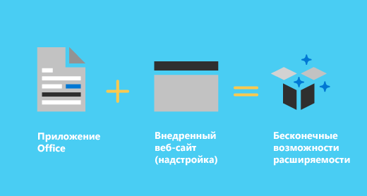
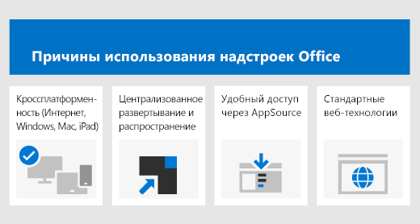
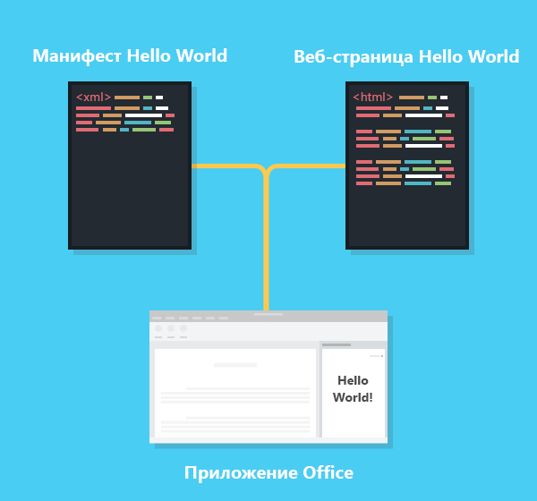

# Обзор платформы надстроек OfficeOffice Add-ins platform overview

Платформу надстроек Office можно использовать для создания решений, которые расширяют возможности приложений Office и взаимодействуют с содержимым документов Office. В случае надстроек Office можно использовать привычные веб-технологии, например HTML, CSS и JavaScript, для взаимодействия с Word, Excel, PowerPoint, OneNote, Project и Outlook, а также для расширения возможностей этих приложений. Ваше решение может работать в Office на нескольких платформах, включая Windows, Mac, iPad и браузеры.You can use the Office Add-ins platform to build solutions that extend Office applications and interact with content in Office documents. With Office Add-ins, you can use familiar web technologies such as HTML, CSS, and JavaScript to extend and interact with Word, Excel, PowerPoint, OneNote, Project, and Outlook. Your solution can run in Office across multiple platforms, including Windows, Mac, iPad, and in a browser.

Надстройки Office могут делать почти все, на что способна веб-страница в браузере. Платформу надстроек Office можно использовать для следующих целей:Office Add-ins can do almost anything a webpage can do inside a browser. Use the Office Add-ins platform to:

-  **Добавление новых возможностей к клиентам Office.** Подключайте внешние данные к Office, автоматизируйте обработку документов Office, добавляйте в клиенты Office функции сторонних решений и многое другое. Например, с помощью API Microsoft Graph можно подключаться к данным, повышая производительность.**Add new functionality to Office clients** - Bring external data into Office, automate Office documents, expose third-party functionality in Office clients, and more. For example, use Microsoft Graph API to connect to data that drives productivity.

-  **Создание оснащенных различными функциями интерактивных объектов, которые можно внедрить в документы Office.** Внедряйте карты, диаграммы и интерактивные визуализации, которые пользователи могут добавлять в свои электронные таблицы Excel и презентации PowerPoint.**Create new rich, interactive objects that can be embedded in Office documents** - Embed maps, charts, and interactive visualizations that users can add to their own Excel spreadsheets and PowerPoint presentations.

## Чем надстройки Office отличаются от надстроек COM и VSTO?How are Office Add-ins different from COM and VSTO add-ins?

Надстройки COM и VSTO представляют собой более ранние решения для интеграции Office, которые работают только в Office для Windows. В отличие от надстроек COM, надстройкам Office не требуется код, который выполняется на устройстве пользователя или в клиенте Office. В надстройках Office ведущее приложение, например Excel, считывает манифест надстройки и подключает настраиваемые кнопки ленты и команды меню надстройки в пользовательском интерфейсе. При необходимости оно загружает JavaScript и HTML-код надстройки, который выполняется в "песочнице" в контексте браузера.COM or VSTO add-ins are earlier Office integration solutions that run only on Office on Windows. Unlike COM add-ins, Office Add-ins don't involve code that runs on the user's device or in the Office client. For an Office Add-in, the host application, for example Excel, reads the add-in manifest and hooks up the add-in’s custom ribbon buttons and menu commands in the UI. When needed, it loads the add-in's JavaScript and HTML code, which executes in the context of a browser in a sandbox.

Преимущества надстроек Office над надстройками, созданными с помощью VBA, модели COM или VSTO:Office Add-ins provide the following advantages over add-ins built using VBA, COM, or VSTO:

- Кроссплатформенная поддержка. Надстройки Office работают в Office в Интернете, Office для Windows, Office для Mac и Office для iPad.Cross-platform support. Office Add-ins run in Office on the web, Windows, Mac, and iPad.

- Централизованное развертывание и распространение. Администраторы могут централизованно развертывать надстройки Office в организации.Centralized deployment and distribution. Admins can deploy Office Add-ins centrally across an organization.

- Легкий доступ через AppSource. Вы можете сделать свое решение доступным широкой аудитории, отправив его в AppSource.Easy access via AppSource. You can make your solution available to a broad audience by submitting it to AppSource.

- Стандартная веб-технология. Вы можете использовать любую библиотеку для создания надстроек Office.Based on standard web technology. You can use any library you like to build Office Add-ins.

## Компоненты надстройки OfficeComponents of an Office Add-in

Надстройка Office включает в себя два основных компонента — XML-файл манифеста и веб-приложение. Манифест определяет различные параметры, включая способ интеграции надстройки с клиентами Office. Веб-приложение должно быть размещено на веб-сервере или в службе веб-хостинга, например в Microsoft Azure.An Office Add-in includes two basic components: an XML manifest file, and your own web application. The manifest defines various settings, including how your add-in integrates with Office clients. Your web application needs to be hosted on a web server, or web hosting service, such as Microsoft Azure.

### МанифестManifest

Этот манифест представляет собой XML-файл, который определяет следующие параметры и возможности надстройки:The manifest is an XML file that specifies settings and capabilities of the add-in, such as:

- Отображаемое имя, описание, идентификатор, версию и языковой стандарт по умолчанию надстройки.The add-in's display name, description, ID, version, and default locale.

- Способ интеграции надстройки с Office.How the add-in integrates with Office.  

- Уровень разрешений и требования для доступа к данным для надстройки.The permission level and data access requirements for the add-in.

### Веб-приложениеWeb app

Самая простая надстройка Office представляет собой статическую HTML-страницу, которая отображается в приложении Office, но не взаимодействует ни с документом Office, ни с каким-либо другим ресурсом в Интернете. Для создания кода, который взаимодействует с документами Office или позволяет пользователю взаимодействовать с веб-ресурсами из ведущего приложения Office, можно применять любые технологии, как клиентские, так и серверные, которые поддерживает ваш поставщик услуг размещения (например, ASP.NET, PHP или Node.js). Для взаимодействия с клиентами и документами Office можно использовать интерфейсы API JavaScript Office.js.The most basic Office Add-in consists of a static HTML page that is displayed inside an Office application, but that doesn't interact with either the Office document or any other Internet resource. However, to create an experience that interacts with Office documents or allows the user to interact with online resources from an Office host application, you can use any technologies, both client and server side, that your hosting provider supports (such as ASP.NET, PHP, or Node.js). To interact with Office clients and documents, you use the Office.js JavaScript APIs.

*Рисунок 2. Компоненты надстройки Hello World для Office**Figure 2. Components of a Hello World Office Add-in*

## Расширение возможностей и взаимодействие с клиентами OfficeExtending and interacting with Office clients

Что позволяют надстройки Office в ведущем приложении Office:Office Add-ins can do the following within an Office host application:

-  расширение функциональных возможностей (в любом приложении Office);Extend functionality (any Office application)

-  создание новых объектов (Excel или PowerPoint).Create new objects (Excel or PowerPoint)
 
### Расширение функциональных возможностей OfficeExtend Office functionality

Добавить новые возможности в приложения Office можно посредством следующего:You can add new functionality to Office applications via the following:  

-  настраиваемые кнопки ленты и команды меню (в совокупности зовутся "командами надстройки");Custom ribbon buttons and menu commands (collectively called “add-in commands”)

-  вставляемые области задач.Insertable task panes

Пользовательский интерфейс и области задач указаны в манифесте надстройки.Custom UI and task panes are specified in the add-in manifest.  

#### Настраиваемые кнопки и команды менюCustom buttons and menu commands  

Вы можете добавлять настраиваемые кнопки ленты и элементы меню на ленту в Office в Интернете и Office для Windows. Благодаря этому пользователям будет проще получать доступ к надстройке непосредственно из приложения Office. С помощью кнопок можно выполнять различные действия, например отображение области задач с пользовательским HTML или выполнение функции JavaScript.You can add custom ribbon buttons and menu items to the ribbon in Office on the web and Windows. This makes it easy for users to access your add-in directly from their Office application. Command buttons can launch different actions such as showing a task pane with custom HTML or executing a JavaScript function.  

*Рис. 3. Команды надстройки на ленте**Figure 3. Add-in commands in the ribbon*

#### Области задачTask panes  

Для работы с решением пользователи могут использовать не только команды надстройки, но и области задач. В клиентах, не поддерживающих команды надстроек (Office 2013 и Office для iPad), надстройка запускается в виде области задач. Пользователи запускают надстройки области задач с помощью кнопки **Мои надстройки** на вкладке **Вставка**.You can use task panes in addition to add-in commands to enable users to interact with your solution. Clients that do not support add-in commands (Office 2013 and Office on iPad) run your add-in as a task pane. Users launch task pane add-ins via the **My Add-ins** button on the **Insert** tab.

*Рис. 4. Область задач**Figure 4. Task pane*

### Расширение возможностей OutlookExtend Outlook functionality

Надстройки Outlook могут расширять функциональные возможности ленты Office и в зависимости от контекста отображаться рядом с просматриваемым или создаваемым элементом Outlook. Они могут взаимодействовать с письмами, приглашениями на собрания, ответами на приглашения на собрания, сообщениями об отмене собраний или данными о встречах, когда пользователь просматривает полученный элемент, отвечает на него или создает новый.Outlook add-ins can extend the Office ribbon and also display contextually next to an Outlook item when you're viewing or composing it. They can work with an email message, meeting request, meeting response, meeting cancellation, or appointment when a user is viewing a received item or replying or creating a new item. 

Надстройки Outlook могут получать доступ к зависящей от контекста информации, предоставляемой элементом, например к адресу или идентификатору для отслеживания, а затем использовать эти данные для доступа к дополнительным сведениям на сервере и в веб-службах с целью повышения удобства работы пользователей. В большинстве случаев надстройка Outlook может без изменений работать в ведущем приложении Outlook, обеспечивая согласованность интерфейса на компьютерах, в Интернете, на планшетах и на мобильных устройствах.Outlook add-ins can access contextual information from the item, such as an address or tracking ID, and then use that data to access additional information on the server and from web services to create compelling user experiences. In most cases, an Outlook add-in runs without modification in the Outlook host application to provide a seamless experience on the desktop, web, and tablet and mobile devices.

Обзор надстроек Outlook см. в статье [Общие сведения о надстройках Outlook](/outlook/add-ins/).For an overview of Outlook add-ins, see [Outlook add-ins overview](/outlook/add-ins/).

### Создание новых объектов в документах OfficeCreate new objects in Office documents

Вы можете внедрить веб-объекты, или контентные надстройки, в документы Excel и PowerPoint. Благодаря контентным надстройкам можно интегрировать мультимедиа (например, видеопроигрыватель YouTube или галерею рисунков), полнофункциональные веб-визуализации данных и другое внешнее содержимое.You can embed web-based objects called content add-ins within Excel and PowerPoint documents. With content add-ins, you can integrate rich, web-based data visualizations, media (such as a YouTube video player or a picture gallery), and other external content.

*Рис. 5. Контентная надстройка**Figure 5. Content add-in*

## API JavaScript для OfficeOffice JavaScript APIs

API JavaScript для Office содержат объекты и элементы для создания надстроек и взаимодействия с содержимым Office и веб-службами. В Excel, Outlook, Word, PowerPoint, OneNote и Project используется общая объектная модель. Кроме того, существуют расширенные объектные модели для Excel и Word. Эти API предоставляют доступ к известным объектам, таким как абзацы и книги, что упрощает создание надстройки для определенного ведущего приложения.The Office JavaScript APIs contain objects and members for building add-ins and interacting with Office content and web services. There is a common object model that is shared by Excel, Outlook, Word, PowerPoint, OneNote and Project. There are also more extensive host-specific object models for Excel and Word. These APIs provide access to well-known objects such as paragraphs and workbooks, which makes it easier to create an add-in for a specific host.  

## Дальнейшие действия:Next steps

Дополнительные вводные сведения о разработке надстроек Office см. в статье [Создание надстроек Office](../overview/office-add-ins-fundamentals.md).For a more detailed introduction to developing Office Add-ins, see [Building Office Add-ins](../overview/office-add-ins-fundamentals.md).

## См. такжеSee also

- [Создание надстроек OfficeBuilding Office Add-ins](../overview/office-add-ins-fundamentals.md)
- [Основные принципы надстроек OfficeCore concepts for Office Add-ins](../overview/core-concepts-office-add-ins.md)
- [Разработка надстроек OfficeDevelop Office Add-ins](../develop/develop-overview.md)
- [Проектирование надстроек OfficeDesign Office Add-ins](../design/add-in-design.md)
- [Тестирование и отладка надстроек OfficeTest and debug Office Add-ins](../testing/test-debug-office-add-ins.md)
- [Публикация надстроек OfficePublish Office Add-ins](../publish/publish.md)
