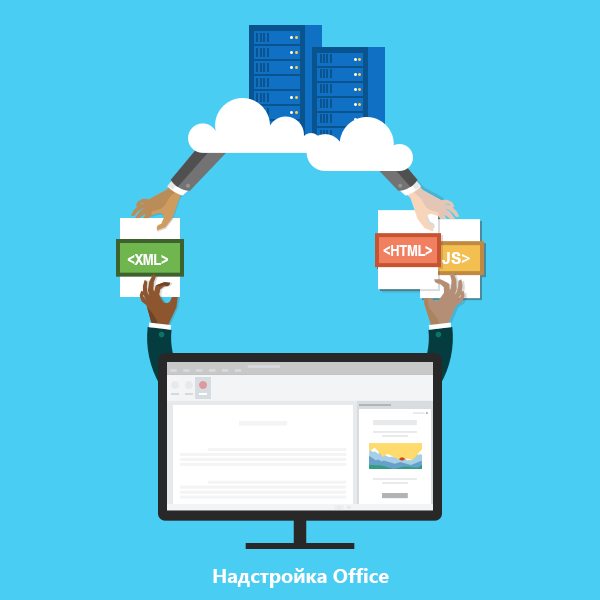

# Обзор платформы надстроек Office

Платформу надстроек Office можно использовать для создания решений, которые расширяют возможности приложений Office и взаимодействуют с содержимым документов Office. В случае надстроек Office можно использовать привычные веб-технологии, например HTML, CSS и JavaScript, для взаимодействия с Word, Excel, PowerPoint, OneNote, Project и Outlook, а также для расширения возможностей этих приложений. Ваше решение может работать в Office на нескольких платформах, включая Office для Windows, Office Online, Office для Mac и Office для iPad.

Надстройки Office могут делать почти все, на что способна веб-страница в браузере. Платформу надстроек Office можно использовать для следующих целей:

-  **Добавление новых возможностей к клиентам Office.** Подключайте внешние данные к Office, автоматизируйте обработку документов Office, добавляйте в клиенты Office функции сторонних решений и многое другое. Например, с помощью API Microsoft Graph можно подключаться к данным, повышая производительность. 
    
-  **Создание оснащенных различными функциями интерактивных объектов, которые можно внедрить в документы Office.** Внедряйте карты, диаграммы и интерактивные визуализации, которые пользователи могут добавлять в свои электронные таблицы Excel и презентации PowerPoint. 
    
## Чем надстройки Office отличаются от надстроек COM и VSTO? 

Надстройки COM и VSTO представляют собой более ранние решения для интеграции Office, которые работают только в Office для Windows. В отличие от надстроек COM, надстройкам Office не требуется код, который выполняется на устройстве пользователя или в клиенте Office. В надстройках Office ведущее приложение, например Excel, считывает манифест надстройки и подключает настраиваемые кнопки ленты и команды меню надстройки в пользовательском интерфейсе. При необходимости оно загружает JavaScript и HTML-код надстройки, который выполняется в "песочнице" в контексте браузера. 

Преимущества надстроек Office над надстройками, созданными с помощью VBA, модели COM или VSTO: 

- Кроссплатформенная поддержка. Надстройки Office запускаются в Office для Windows, Mac, iOS и Office Online. 

- Централизованное развертывание и распространение. Администраторы могут централизованно развертывать надстройки Office в организации. 

- Легкий доступ через AppSource. Вы можете сделать свое решение доступным широкой аудитории, отправив его в AppSource. 

- Стандартная веб-технология. Вы можете использовать любую библиотеку для создания надстроек Office. 

## Компоненты надстройки Office 

Надстройка Office включает в себя два основных компонента — XML-файл манифеста и веб-приложение. Манифест определяет различные параметры, включая способ интеграции надстройки с клиентами Office. Веб-приложение должно быть размещено на веб-сервере или в службе веб-хостинга, например в Microsoft Azure.

*Рис. 1. Манифест надстройки (XML) + веб-страница (HTML, JS) = надстройка Office*

### Манифест 

Этот манифест представляет собой XML-файл, который определяет следующие параметры и возможности надстройки: 

- Отображаемое имя, описание, идентификатор, версию и языковой стандарт по умолчанию надстройки. 

- Способ интеграции надстройки с Office.  

- Уровень разрешений и требования для доступа к данным для надстройки. 

### Веб-приложение 

Самая простая надстройка Office представляет собой статическую HTML-страницу, которая отображается в приложении Office, но не взаимодействует ни с документом Office, ни с каким-либо другим ресурсом в Интернете. Для создания кода, который взаимодействует с документами Office или позволяет пользователю взаимодействовать с веб-ресурсами из ведущего приложения Office, можно применять любые технологии, как клиентские, так и серверные, которые поддерживает ваш поставщик услуг размещения (например, ASP.NET, PHP или Node.js). Для взаимодействия с клиентами и документами Office можно использовать интерфейсы API JavaScript Office.js. 

*Рисунок 2. Компоненты надстройки Hello World для Office*

## Расширение возможностей и взаимодействие с клиентами Office 

Что позволяют надстройки Office в ведущем приложении Office: 

-  расширение функциональных возможностей (в любом приложении Office); 

-  создание новых объектов (Excel или PowerPoint). 
 
### Расширение функциональных возможностей Office 

Добавить новые возможности в приложения Office можно посредством следующего:  

-  настраиваемые кнопки ленты и команды меню (в совокупности зовутся "командами надстройки"); 

-  вставляемые области задач. 

Пользовательский интерфейс и области задач указаны в манифесте надстройки.  

#### Настраиваемые кнопки и команды меню  

Можно добавить настраиваемые кнопки ленты и элементы меню на ленту в Office для Windows Desktop и Office Online. Это упрощает пользователям доступ к надстройке непосредственно из приложения Office. С помощью кнопок можно запускать различные действия, например отображение области задач с пользовательским HTML или выполнение функции JavaScript.  

*Рис. 3. Команды надстройки на ленте*

#### Области задач  

Для работы с решением пользователи могут использовать не только команды надстройки, но и области задач. В клиентах, не поддерживающих команды надстроек (Office 2013 и Office для iPad), надстройка запускается в виде области задач. Пользователи запускают надстройки области задач с помощью кнопки **Мои надстройки** на вкладке **Вставка**. 

*Рис. 4. Область задач*

### Расширение возможностей Outlook 

Надстройки Outlook могут расширять функциональные возможности ленты Office и в зависимости от контекста отображаться рядом с просматриваемым или создаваемым элементом Outlook. Они могут взаимодействовать с письмами, приглашениями на собрания, ответами на приглашения на собрания, сообщениями об отмене собраний или данными о встречах, когда пользователь просматривает полученный элемент, отвечает на него или создает новый. 

Надстройки Outlook могут получать доступ к контекстным данным элемента (например, адресу или идентификатору отслеживания), а затем с помощью этих данных получать доступ к дополнительным сведениям на сервере и из веб-служб для повышения удобства работы пользователей. В большинстве случаев надстройка Outlook работает одинаково в различных ведущих приложениях, поддерживающих ее, включая Outlook, Outlook для Mac, Outlook Web App для устройств и Outlook Web App, чтобы обеспечить согласованную работу в Интернете, на компьютерах, планшетах и мобильных устройствах. 

Обзор надстроек Outlook см. в статье [Общие сведения о надстройках Outlook](https://docs.microsoft.com/outlook/add-ins/). 

### Создание новых объектов в документах Office 

Вы можете внедрить веб-объекты, или контентные надстройки, в документы Excel и PowerPoint. Благодаря контентным надстройкам можно интегрировать мультимедиа (например, видеопроигрыватель YouTube или галерею рисунков), полнофункциональные веб-визуализации данных и другое внешнее содержимое.

*Рис. 5. Контентная надстройка*

## API JavaScript для Office 

API JavaScript для Office содержат объекты и элементы для создания надстроек и взаимодействия с содержимым Office и веб-службами. В Excel, Outlook, Word, PowerPoint, OneNote и Project используется общая объектная модель. Кроме того, существуют расширенные объектные модели для Excel и Word. Эти API предоставляют доступ к известным объектам, таким как абзацы и книги, что упрощает создание надстройки для определенного ведущего приложения.  

## Дальнейшие действия 

Чтобы узнать больше о том, как начать создавать надстройки Office, воспользуйтесь [5-минутными краткими руководствами](https://docs.microsoft.com/office/dev/add-ins/). Сразу же приступить к созданию надстроек можно с помощью Visual Studio или любого другого редактора. 

Чтобы начать планировать создание решений с удобным и привлекательным интерфейсом, ознакомьтесь с [рекомендациями по проектированию](../design/add-in-design.md) и другими [рекомендациями](../concepts/add-in-development-best-practices.md), касающимися надстроек Office.    
   
## См. также

- [Примеры надстроек Office](https://developer.microsoft.com/office/gallery/?filterBy=Samples)
- [Общие сведения об API JavaScript для Office](../develop/understanding-the-javascript-api-for-office.md)
- [Доступность ведущих приложений и платформ для надстроек Office](../overview/office-add-in-availability.md)

    
