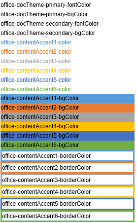

# <a name="use-document-themes-in-your-powerpoint-add-ins"></a>Использование тем документов в надстройках PowerPoint

[Тема Office](https://support.office.com/Article/What-is-a-theme--7528ccc2-4327-4692-8bf5-9b5a3f2a5ef5) состоит из визуально согласованного набора шрифтов и цветов, которые можно применять к презентациям, документам, электронным таблицам и письмам. Чтобы применить или настроить тему презентации в PowerPoint, используйте группы **Темы** и **Варианты** на вкладке **Дизайн**. По умолчанию PowerPoint присваивает новой пустой презентации **тему Office**, но вы можете выбрать другие темы, доступные на вкладке **Дизайн**, скачать дополнительные темы с веб-сайта Office.com или создать и настроить собственную тему.

Используя файл OfficeThemes.css, можно создавать надстройки, согласованные с PowerPoint, двумя способами:

- **Контентные надстройки для PowerPoint**. Укажите шрифты и цвета, соответствующие теме презентации контентной надстройки, используя классы OfficeThemes.css для темы документа. Эти шрифты и цвета будут динамически обновляться при изменении или настройке темы презентации.
    
- **Надстройки области задач для PowerPoint**. Укажите шрифты и фоновые цвета, используемые в пользовательском интерфейсе, используя классы OfficeThemes.css для темы пользовательского интерфейса Office, чтобы цвета ваших надстроек области задач соответствовали цветам встроенных областей задач. Эти цвета будут динамически обновляться при изменении темы интерфейса Office.

### <a name="document-theme-colors"></a>Цвета темы документа

Каждая тема документа Office определяет 12 цветов. Десять из них доступны при выборе шрифта, фона и других цветовых настроек презентации с помощью палитры.


Чтобы просмотреть или настроить все 12 цветов темы в PowerPoint, в группе **Варианты** на вкладке **Дизайн** нажмите кнопку раскрывающегося меню **Дополнительные параметры** и выберите **Цвета** > **Настроить цвета**, чтобы открыть диалоговое окно **Создание новых цветов темы**.


Первые четыре цвета предназначены для текста и фона. Текст, выполненный в светлых тонах, всегда лучше читается на темном фоне, а текст темных тонов — на светлом фоне. Следующие шесть цветов — это контрастные цвета, которые всегда четко видны на четырех возможных фоновых цветах. Последние два цвета применяются для непросмотренных и просмотренных гиперссылок.

### <a name="document-theme-fonts"></a>Шрифты темы документа

Каждая тема документа Office также определяет два шрифта: один для заголовков и один для основного текста. PowerPoint использует их для создания автоматических текстовых стилей. Кроме того, они используются в коллекциях текстовых **экспресс-стилей** и **WordArt**. Эти два шрифта отображаются вверху средства выбора шрифтов.


Чтобы просмотреть или изменить шрифты темы в PowerPoint, в группе **Варианты** на вкладке **Дизайн** нажмите кнопку раскрывающегося меню **Дополнительные параметры** и выберите **Шрифты** > **Настроить шрифты**, чтобы открыть диалоговое окно **Создание новых шрифтов темы**.


### <a name="office-ui-theme-fonts-and-colors"></a>Шрифты и цвета темы для пользовательского интерфейса Office

Office также позволяет выбирать между несколькими стандартными темами, которые определяют несколько цветов и шрифтов, используемых в пользовательском интерфейсе всех приложений Office. Для этого воспользуйтесь выпадающим меню, которое находится в меню **Файл**  >  **Учетная запись**  >  **Тема Office** (в любом приложении Office).


Файл OfficeThemes.css содержит классы, которые можно использовать в надстройках области задач для PowerPoint, чтобы в них применялись аналогичные шрифты и цвета. Это позволит вам создавать свои надстройки области задач, внешний вид которых совпадает с внешним видом встроенных областей задач.

## <a name="using-officethemescss"></a>Использование OfficeThemes.css

Использование файла OfficeThemes.css вместе с контентными надстройками для PowerPoint позволит вам согласовать внешний вид надстройка с темой презентации, а использование этого файла с надстройками областей задач для PowerPoint позволит согласовать внешний вид надстройка со шрифтами и цветами пользовательского интерфейса Office.

### <a name="adding-the-officethemescss-file-to-your-project"></a>Добавление файла OfficeThemes.css в проект

Чтобы добавить файл OfficeThemes.css и ссылку на него в проекте надстройка, выполните описанные ниже действия.

#### <a name="to-add-officethemescss-to-your-visual-studio-project"></a>Добавление файла OfficeThemes.css в проект Visual Studio

> [!NOTE]
> Действия этой процедуры применимы только к Visual Studio 2015. Если используется Visual Studio 2017, файл OfficeThemes.css создается автоматически для любых создаваемых проектов надстроек PowerPoint.

1. В **обозревателе решений** щелкните правой кнопкой мыши папку **Content** в проекте _**имя_проекта**_**Web** и выберите **Добавить** > **Таблица стилей**.
    
2. Назовите новую таблицу стилей **OfficeThemes**.
    
   > [!IMPORTANT]
   > Таблица стилей должна называться OfficeThemes, в противном случае не будет работать динамическое обновление шрифтов и цветов надстроек.
   
3. Удалите из файла класс **body** по умолчанию (`body {}`) и скопируйте в файл представленный ниже CSS-код.
    
    ```css
    /* The following classes describe the common theme information for office documents */ 

    /* Basic Font and Background Colors for text */ 
    .office-docTheme-primary-fontColor { color:#000000; } 
    .office-docTheme-primary-bgColor { background-color:#ffffff; } 
    .office-docTheme-secondary-fontColor { color: #000000; } 
    .office-docTheme-secondary-bgColor { background-color: #ffffff; } 

    /* Accent color definitions for fonts */ 
    .office-contentAccent1-color { color:#5b9bd5; } 
    .office-contentAccent2-color { color:#ed7d31; } 
    .office-contentAccent3-color { color:#a5a5a5; } 
    .office-contentAccent4-color { color:#ffc000; } 
    .office-contentAccent5-color { color:#4472c4; } 
    .office-contentAccent6-color { color:#70ad47; } 

    /* Accent color for backgrounds */ 
    .office-contentAccent1-bgColor { background-color:#5b9bd5; } 
    .office-contentAccent2-bgColor { background-color:#ed7d31; } 
    .office-contentAccent3-bgColor { background-color:#a5a5a5; } 
    .office-contentAccent4-bgColor { background-color:#ffc000; } 
    .office-contentAccent5-bgColor { background-color:#4472c4; } 
    .office-contentAccent6-bgColor { background-color:#70ad47; } 

    /* Accent color for borders */ 
    .office-contentAccent1-borderColor { border-color:#5b9bd5; } 
    .office-contentAccent2-borderColor { border-color:#ed7d31; } 
    .office-contentAccent3-borderColor { border-color:#a5a5a5; } 
    .office-contentAccent4-borderColor { border-color:#ffc000; } 
    .office-contentAccent5-borderColor { border-color:#4472c4; } 
    .office-contentAccent6-borderColor { border-color:#70ad47; } 

    /* links */ 
    .office-a { color: #0563c1; } 
    .office-a:visited { color: #954f72; } 

    /* Body Fonts */ 
    .office-bodyFont-eastAsian { } /* East Asian name of the Font */ 
    .office-bodyFont-latin { font-family:"Calibri"; } /* Latin name of the Font */ 
    .office-bodyFont-script { } /* Script name of the Font */ 
    .office-bodyFont-localized { font-family:"Calibri"; } /* Localized name of the Font. Corresponds to the default font of the culture currently used in Office.*/ 

    /* Headers Font */ 
    .office-headerFont-eastAsian { } 
    .office-headerFont-latin { font-family:"Calibri Light"; } 
    .office-headerFont-script { } 
    .office-headerFont-localized { font-family:"Calibri Light"; } 

    /* The following classes define font and background colors for Office UI themes. These classes should only be used in task pane add-ins */ 

    /* Basic Font and Background Colors for PPT */ 
    .office-officeTheme-primary-fontColor { color:#b83b1d; } 
    .office-officeTheme-primary-bgColor { background-color:#dedede; } 
    .office-officeTheme-secondary-fontColor { color:#262626; } 
    .office-officeTheme-secondary-bgColor { background-color:#ffffff; }
    ```
4. Если вы используете отличный от Visual Studio инструмент для создания надстройка, скопируйте CSS-код из третьего шага в текстовый файл, сохранив его под именем OfficeThemes.css.   

### <a name="referencing-officethemescss-in-your-add-ins-html-pages"></a>Добавление ссылок на файл OfficeThemes.css в HTML-страницах надстройки

Чтобы использовать файл OfficeThemes.css в проекте надстройки, добавьте тег `<link>`, который ссылается на файл OfficeThemes.css, внутри тега `<head>` веб-страницы надстройки (HTML, ASPX или PHP) в следующем формате:

```HTML
<link href="<local_path_to_OfficeThemes.css>" rel="stylesheet" type="text/css" />
```

Чтобы сделать это в Visual Studio, выполните указанные ниже действия.

#### <a name="to-reference-officethemescss-in-your-add-in-for-powerpoint"></a>Добавление ссылки на OfficeThemes.css в надстройке для PowerPoint

1. В Visual Studio 2017 откройте или создайте проект **Надстройка Office**.
    
2. На HTML-страницах надстройки, например Home.html в шаблоне по умолчанию, добавьте следующий тег `<link>`, который ссылается на файл OfficeThemes.css, внутри тега `<head>`:
    
    ```HTML
    <link href="../../Content/OfficeThemes.css" rel="stylesheet" type="text/css" />
    ```

При использовании другого инструмента добавьте тег `<link>` в таком же формате, указав относительный путь к копии файла OfficeThemes.css, которая будет разворачиваться с вашей надстройкой.

### <a name="using-officethemescss-document-theme-classes-in-your-content-add-ins-html-page"></a>Использование классов OfficeThemes.css для темы документа на HTML-странице контентной надстройки

Ниже представлен простой пример HTML-кода в контентной надстройке, которая использует классы OfficeTheme.css для темы документа. Более подробные сведения о классах OfficeThemes.css, которые соответствуют используемым в теме документа 12 цветам и 2 шрифтам, можно узнать в разделе [Классы тем для контентных надстроек](#theme-classes-for-content-add-ins).

```HTML
<body>
    <div id="themeSample" class="office-docTheme-primary-fontColor ">
        <h1 class="office-headerFont-latin">Hello world!</h1> 
        <h1 class="office-headerFont-latin office-contentAccent1-bgColor">Hello world!</h1> 
        <h1 class="office-headerFont-latin office-contentAccent2-bgColor">Hello world!</h1> 
        <h1 class="office-headerFont-latin office-contentAccent3-bgColor">Hello world!</h1> 
        <h1 class="office-headerFont-latin office-contentAccent4-bgColor">Hello world!</h1> 
        <h1 class="office-headerFont-latin office-contentAccent5-bgColor">Hello world!</h1> 
        <h1 class="office-headerFont-latin office-contentAccent6-bgColor">Hello world!</h1> 
        <p class="office-bodyFont-latin office-docTheme-secondary-fontColor">Hello world!</p> 
    </div>
</body>
```

В презентации, которая использует **тему Office** по умолчанию, контентная надстройка принимает следующий вид:


Если вы измените тему презентации или настроите текущую тему, шрифты и цвета, указанные с помощью классов OfficeThemes.css, динамически обновятся. Если презентация, в которую вставляется надстройка, использует тему **Аспект**, описанная выше HTML-страница надстройки будет выглядеть так:


### <a name="using-officethemescss-office-ui-theme-classes-in-your-task-pane-add-ins-html-page"></a>Использование классов OfficeThemes.css для темы пользовательского интерфейса Office в HTML-странице надстройки области задач

Помимо темы документа, пользователи могут настраивать цветовую схему приложения Office. Для этого используется раскрывающийся список **Файл** > **Учетная запись** > **Тема Office**.

Ниже показан пример простого HTML-кода в надстройка области задач, который использует классы OfficeTheme.css для указания цвета шрифта и фона. Более подробную информацию о классах OfficeThemes.css, которые соответствуют шрифтам и цветам темы пользовательского интерфейса Office, можно получить в разделе [Классы тем для надстроек области задач](#theme-classes-for-task-pane-add-ins).

```HTML
<body> 
    <div id="content-header" class="office-officeTheme-primary-fontColor office-officeTheme-primary-bgColor"> 
        <div class="padding">
            <h1>Welcome</h1>
        </div> 
    </div> 
    <div id="content-main" class="office-officeTheme-secondary-fontColor office-officeTheme-secondary-bgColor"> 
        <div class="padding"> 
            <p>Add home screen content here.</p> 
            <p>For example:</p> 
            <button id="get-data-from-selection">Get data from selection</button> 
            <p><a target="_blank" class="office-a" href="https://go.microsoft.com/fwlink/?LinkId=276812">Find more samples online...</a></p>
        </div>
    </div>
</body> 
```

<br/>

Если в PowerPoint выбрать в раскрывающемся списке **Файл** > **Учетная запись** > **Тема Office** значение **Белая**, то надстройка области задач будет выглядеть так:


<br/>

Если вы измените **тему Office** на **темно-серую**, шрифты и цвета, указанные с помощью классов в OfficeThemes.css, динамически обновятся и станут выглядеть так:


<br/>

## <a name="officethemecss-classes"></a>Классы OfficeTheme.css

Файл OfficeThemes.css содержит два набора классов, которые вы можете использовать с контентными надстройками и надстройками области задач для PowerPoint.

### <a name="theme-classes-for-content-add-ins"></a>Классы тем для контентных надстроек

Файл OfficeThemes.css предоставляет классы, соответствующие 2 шрифтам и 12 цветам, используемым в теме документа. Эти классы предназначены для использования с контентными надстройками для PowerPoint, чтобы шрифты и цвета вашей надстройки были согласованы с презентацией, в которую она вставлена.

#### <a name="theme-fonts-for-content-add-ins"></a>Шрифты тем для контентных надстроек

|**Класс**|**Описание**|
|:-----|:-----|
| `office-bodyFont-eastAsian`|Восточноазиатское имя шрифта основного текста.|
| `office-bodyFont-latin`|Латинское название шрифта основного текста. По умолчанию "Calabri"|
| `office-bodyFont-script`|Имя сценария шрифта основного текста.|
| `office-bodyFont-localized`|Локализованное имя шрифта основного текста. Задает название шрифта по умолчанию в соответствии с текущей культурой, используемой в Office|
| `office-headerFont-eastAsian`|Восточноазиатское название шрифта заголовков|
| `office-headerFont-latin`|Латинское название шрифта заголовков. По умолчанию "Calabri Light"|
| `office-headerFont-script`|Имя сценариев шрифта заголовков|
| `office-headerFont-localized`|Локализованное название шрифта заголовков. Задает название шрифта по умолчанию в соответствии с текущей культурой, используемой в Office|

<br/>

#### <a name="theme-colors-for-content-add-ins"></a>Цвета тем для контентных надстроек

|**Класс**|**Описание**|
|:-----|:-----|
| `office-docTheme-primary-fontColor`|Основной цвет шрифта. По умолчанию #000000|
| `office-docTheme-primary-bgColor`|Основной цвет фона шрифта. По умолчанию #FFFFFF|
| `office-docTheme-secondary-fontColor`|Дополнительный цвет шрифта. По умолчанию #000000|
| `office-docTheme-secondary-bgColor`|Дополнительный цвет фона шрифта. По умолчанию #FFFFFF|
| `office-contentAccent1-color`|Контрастный цвет шрифта 1. По умолчанию #5B9BD5|
| `office-contentAccent2-color`|Контрастный цвет шрифта 2. По умолчанию #ED7D31|
| `office-contentAccent3-color`|Контрастный цвет шрифта 3. По умолчанию #A5A5A5|
| `office-contentAccent4-color`|Контрастный цвет шрифта 4. По умолчанию #FFC000|
| `office-contentAccent5-color`|Контрастный цвет шрифта 5. По умолчанию #4472C4|
| `office-contentAccent6-color`|Контрастный цвет шрифта 6. По умолчанию #70AD47|
| `office-contentAccent1-bgColor`|Контрастный цвет фона 1. По умолчанию #5B9BD5|
| `office-contentAccent2-bgColor`|Контрастный цвет фона 2. По умолчанию #ED7D31|
| `office-contentAccent3-bgColor`|Контрастный цвет фона 3. По умолчанию #A5A5A5|
| `office-contentAccent4-bgColor`|Контрастный цвет фона 4. По умолчанию #FFC000|
| `office-contentAccent5-bgColor`|Контрастный цвет фона 5. По умолчанию #4472C4|
| `office-contentAccent6-bgColor`|Контрастный цвет фона 6. По умолчанию #70AD47|
| `office-contentAccent1-borderColor`|Контрастный цвет границы 1. По умолчанию #5B9BD5|
| `office-contentAccent2-borderColor`|Контрастный цвет границы 2. По умолчанию #ED7D31|
| `office-contentAccent3-borderColor`|Контрастный цвет границы 3. По умолчанию #A5A5A5|
| `office-contentAccent4-borderColor`|Контрастный цвет границы 4. По умолчанию #FFC000|
| `office-contentAccent5-borderColor`|Контрастный цвет границы 5. По умолчанию #4472C4|
| `office-contentAccent6-borderColor`|Контрастный цвет границы 6. По умолчанию #70AD47|
| `office-a`|Цвет гиперссылки. По умолчанию #0563C1|
| `office-a:visited`|Цвет просмотренной гиперссылки. По умолчанию #954F72|

<br/>

На следующем снимке экрана представлены примеры всех классов цветов темы (за исключением двух цветов для гиперссылок), указанных для текста надстройка при использовании темы Office по умолчанию.




### <a name="theme-classes-for-task-pane-add-ins"></a>Классы тем для надстроек области задач

В файле OfficeThemes.css представлены классы, соответствующие 4 цветам, которые указаны для шрифтов и фонов, использующихся темой пользовательского интерфейса приложения Office. Эти классы предназначены для использования с надстройками области задач для PowerPoint, поэтому цвета вашей надстройки будут согласованы с цветами других встроенных областей задач в Office.

#### <a name="theme-font-and-background-colors-for-task-pane-add-ins"></a>Цвета шрифта и фона тем для надстроек области задач

|**Класс**|**Описание**|
|:-----|:-----|
| `office-officeTheme-primary-fontColor`|Основной цвет шрифта. Значение по умолчанию — #B83B1D.|
| `office-officeTheme-primary-bgColor`|Основной цвет фона. Значение по умолчанию — #DEDEDE.|
| `office-officeTheme-secondary-fontColor`|Дополнительный цвет шрифта. По умолчанию #262626|
| `office-officeTheme-secondary-bgColor`|Дополнительный цвет фона. Значение по умолчанию — #FFFFFF.|

## <a name="see-also"></a>См. также

- [Создание контентных надстроек и надстроек области задач для PowerPoint](../powerpoint/powerpoint-add-ins.md)
