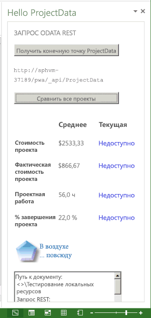

# <a name="create-a-project-add-in-that-uses-rest-with-an-on-premises-project-server-odata-service"></a>???????? ?????????? Project, ???????????? REST ? ????????? ??????? OData Project Server

? ???? ?????? ??????????? ???????? ?????????? ??????? ????? ??? Project ???????????????? 2013, ??????? ?????????? ?????? ?? ???????????? ? ???????? ???????? ? ???????? ??????? ?? ???????? ?????????? ?? ???? ???????? ? ??????? ?????????? Project Web App. ?????????? ?????????? REST ? ??????????? jQuery ??? ????????? ??????? ? ?????? ??????? OData **ProjectData** ? Project Server 2013.


??? ? ?????? ?????? ??????? ?? ???????, ????????????? ????????? ??????? (Saurabh Sanghvi) ? ???????? ?????? (Arvind Iyer), ???????????? ?????????? ??????????.

## <a name="prerequisites-for-creating-a-task-pane-add-in-that-reads-project-server-reporting-data"></a>??????????? ??????? ??? ???????? ????????? ??????? ?????, ???????? ?????? ??????? Project Server


????? ?????????? ??????????? ??????? ??? ???????? ?????????? ??????? ????? Project, ??????????? ?????? ?? ?????? **ProjectData** ? ?????????? Project Web App ????????? ????????? Project Server 2013:


- ?????????, ??? ?? ????????? ?????????? ???????????? ??????????? ????? ????????? ?????? ?????????? ? ?????????? Windows. ???????????? ???????? ????? ???? Windows 7, Windows 8, Windows Server 2008 ??? Windows Server 2012.
    
- Project ???????????????? 2013 ????????? ??? ??????????? ? Project Web App. ?? ?????????? ???????????? ?????? ???? ?????????? Project ???????????????? 2013, ????? ???????? ??????? ?? ??????? **F5** ? ??????? Visual Studio.
    
    > [!NOTE]
    > ? ??????? Project ??????????? 2013 ????? ????????? ?????????? ??????? ?????, ?? ?????????? ????? ? Project Web App.

- Visual Studio 2015 ? ??????????? ???????????? Office ??? Visual Studio ???????? ???????, ??????????? ????????? ?????????? Office ? SharePoint. ?????????, ??? ? ??? ??????????? ????? ????????? ?????? Office Developer Tools. ??. ?????? _????????_ ?????? [?????????? Office ? ??????????? ????? ??? SharePoint](http://msdn.microsoft.com/en-us/office/apps/fp123627.aspx).
    
- ????????? ? ??????? ????, ??????????? ? ???? ??????, ???????? ?????? ? ?????? **ProjectData**, ??????????????? Project Server 2013 ? ????????? ??????. ?????? jQuery ? ???? ?????? ?? ???????? ? Project Online.
    
    ?????????, ??? ?????? **ProjectData** ???????? ?? ?????????? ????????????.
    

### <a name="procedure-1-to-verify-that-the-projectdata-service-is-accessible"></a>????????? 1. ???????? ??????????? ?????? ProjectData


1. ????? ????????? ???????? ???????? ?????????? XML-?????? ?? ??????? REST, ????????? ??? ?????? ??????. ?????????????? ???????? ? ???, ??? ??? ??????? ? Internet Explorer, ??. ? ????????? 1, ??? 4 ? ?????? [???????? ???????? ???-??????? OData ??? ?????? ??????? Project](http://msdn.microsoft.com/library/3eafda3b-f006-48be-baa6-961b2ed9fe01%28Office.15%29.aspx).
    
2. ????????? ?????? ??????  **ProjectData** ? ??????? ???-????????????, ????????? ????????? URL-?????: **http://ServerName /ProjectServerName /_api/ProjectData**. ????????, ???? `http://MyServer/pwa` ? ??? ????????? Project Web App, ?? ? ???????? ????? ???????? ????????? ??????????:
    
    ```xml
    <?xml version="1.0" encoding="utf-8"?>
        <service xml:base="http://myserver/pwa/_api/ProjectData/" 
        xmlns="http://www.w3.org/2007/app" 
        xmlns:atom="http://www.w3.org/2005/Atom">
        <workspace>
            <atom:title>Default</atom:title>
            <collection href="Projects">
                <atom:title>Projects</atom:title>
            </collection>
            <collection href="ProjectBaselines">
                <atom:title>ProjectBaselines</atom:title>
            </collection>
            <!-- ... and 33 more collection elements -->
        </workspace>
        </service>
    ```

3. ??? ????? ????????????? ???????????? ???? ??????? ??????? ??????, ????? ??????? ??????????. ???? ??????? ?????????? ????????? "?????? 403, ?????? ????????", ?? ???? ? ??? ???? ??? ?????????? ?? ???? ??? ????????? ?????????? Project Web App, ???? ??????? ???????? ????, ????????? ?????? ??????????????.
    

## <a name="using-visual-studio-to-create-a-task-pane-add-in-for-project"></a>???????? ?????????? ??????? ????? ??? Project ? ??????? Visual Studio

??????????? ???????????? Office ??? Visual Studio ???????? ?????? ????????? ??????? ????? ??? Project 2013. ???? ?? ???????? ??????? ? ?????? **HelloProjectOData**, ??? ???????? ????????? ??? ??????? Visual Studio:


- ?????? ?????????? ???????? ??? ???????. ??? ???????? ? ???? XML-???? ????????? ??? ?????????? ? ????????????? ?? ??????? ????????? .NET Framework 4.5. ? ????????? 3 ???????? ???? ?? ????????? ????????? ?????????? **HelloProjectOData**.
    
- ???-?????? ???????? ??? **HelloProjectODataWeb**. ??? ???????? ????? JavaScript ???-???????, ????? CSS, ???????, ?????? ? ????? ???????????? ??? ???-???????? ? ??????? ?????. ???-?????? ????????????? ?? ???????? ????????? .NET Framework 4. ? ????????? 4 ? ????????? 5 ????????, ??? ???????? ??? ????? ? ???-???????, ????? ??????? ???????????????? ?????????? **HelloProjectOData**.
    

### <a name="procedure-2-to-create-the-helloprojectodata-add-in-for-project"></a>????????? 2. ???????? ?????????? HelloProjectOData ??? Project


1. ????????? Visual Studio 2015 ?? ????? ?????????????? ? ???????? ??????? **??????? ??????** ?? ????????? ????????.
    
2. ? ?????????? ???? **????? ??????** ?????????? ???? **???????** > **Visual C#** > **Office/SharePoint** ? ???????? **?????????? Office**. ???????? **.NET Framework 4.5.2** ? ?????????????? ?????? ? ??????? ????? ??????????? ??????, ? ????? ???????? **?????????? Office** (??. ????????? ?????? ??????).
    
3. ????? ?????????? ??? ??????? Visual Studio ? ????? ?????, ???????? **??????? ??????? ??? ???????** ? ??????? ????????? ????????????.
    
4. ? ???? **???** ??????? HelloProjectOData ? ??????? ?????? **??**.
    
    *???. 1. ???????? ?????????? Office*

    

5. ? ?????????? ???? **????? ???? ??????????** ???????? ????? **?????????? ??????? ?????** ? ??????? ?????? **?????** (??. ????????? ?????? ??????).
    
    *???. 2. ????? ???? ??????????? ??????????*

    

6. ? ?????????? ???? **????? ??????? ??????????** ??????? ??? ??????, ????? ?????? **Project** (??. ????????? ?????? ??????), ? ????? ??????? ?????? **??????**.
    
    *???. 3. ????? ???????? ??????????*

    
    
    ? ??????? Visual Studio ????? ????????? ??????? **HelloProjectOdata** ? **HelloProjectODataWeb**.
    
? ????? **AddIn** (??. ????????? ?????? ??????) ????????? ???? App.css ??? ???????????????? ?????? CSS. ? ???????? ????? **Home** ????????? ???? Home.html, ??????? ???????? ?????? ?? CSS-????? ? ????? JavaScript, ??????? ?????????? ??????????, ? ??? HTML5 ??? ??????????. ????? ????, ???? Home.js ???????????? ??? ????????????????? ???? JavaScript. ? ????? **Scripts** ????????? ????? ????????? jQuery. ? ???????? ????? **Office** ????????? ?????????? JavaScript, ???????? office.js ? project-15.js, ? ????? ???????? ?????????? ??? ??????????? ????? ? ??????????? Office. ? ????? **Content** ????????? ???? Office.css, ??????? ???????? ????? ?? ????????? ??? ???? ????????? Office.

*???. 4. ???????? ?????? ???-??????? ?? ????????? ? ???????????? ???????*


???????? ??????? **HelloProjectOData** ? ??? ???? HelloProjectOData.xml. ??? ????? ???????? ??? ?????????????, ????? ???????? ???????? ??????????, ?????? ?? ??????, ???????? ? ?????????????? ?????? ? ?????? ?????????. ? ????????? 3 ?????????? ?????? ???????????? ??? ?????????? ? ???????? ? ??????????? ??????.

?????????????? ???????? ? ????????? ??. ? ??????? [XML-???????? ????????? ??? Office](../develop/add-in-manifests.md) ? [??????? ?? ????? ??? ?????????? ????????? Office (?????? 1.1)](../develop/add-in-manifests.md#see-also).

### <a name="procedure-3-to-modify-the-add-in-manifest"></a>????????? 3. ????????? ????????? ??????????


1. ???????? ???? HelloProjectOData.xml ? Visual Studio.
    
2. ???????????? ??? ?? ????????? ? ??? ??? ??????? Visual Studio ("HelloProjectOData"). ????????, ???????? ???????? ?? ????????? ???????? **DisplayName** ?? ????????"Hello ProjectData".
    
3. ???????? ?? ????????? ? "HelloProjectOData". ????????, ???????? ???????? ?? ????????? ???????? Description ?? "Test REST queries of the ProjectData service" (???????????? ???????? REST ?????? ProjectData).
    
4. ???????? ?????? ??? ??????????? ? ?????????????? ?????? **?????????? Office** ?? ??????? **??????** ?????. ?? ?????? ???????? ???? ?????? ? ??????? Visual Studio ??? ???????????? URL-????? ??????. 

???? ???????, ??? ???????? ???? ?????? ? ??????? Visual Studio:
    
1. ? **???????????? ???????** ???????? ????? Images.
    
2. ????? ???????????? ? ?????????????? ?????? **?????????? Office**, ?????? ?????? ????? ?????? 32 x 32 ???????. ????????, ?????????? ????? SDK Project 2013, ????? ???????? ????? **Images** ? ???????? ????????? ???? ?? ?????? SDK: `\Samples\Apps\HelloProjectOData\HelloProjectODataWeb\Images\NewIcon.png`
    
    ?? ?????? ???????????? ??????????? ?????? ???????? 32 x 32 ??????? ??? ??????????? ????????? ??????????? ? ???? ? ?????? NewIcon.png, ? ????? ???????? ???? ???? ? ????? `HelloProjectODataWeb\Images`:
    
    

3. ? ????????? HelloProjectOData.xml ???????? ??????? **IconUrl** ??? ????????? **Description**. ????????? URL-?????? ?????? ???????? ????????????? ???? ?? ???? ?????? ???????? 32 x 32. ????????, ???????? ????????? ??????: **<IconUrl DefaultValue="~remoteAppUrl/Images/NewIcon.png" />**. ?????? ???? ????????? HelloProjectOData.xml ???????? ????????? ????? (???? ???????? **Id** ????? ??????):

    ```XML
    <?xml version="1.0" encoding="UTF-8"?>
    <OfficeApp xmlns="http://schemas.microsoft.com/office/appforoffice/1.1" 
            xmlns:xsi="http://www.w3.org/2001/XMLSchema-instance" xsi:type="TaskPaneApp">
        <Id>c512df8d-a1c5-4d74-8a34-d30f6bbcbd82 </Id>
        <Version>1.0</Version>
        <ProviderName> [Provider name]</ProviderName>
        <DefaultLocale>en-US</DefaultLocale>
        <DisplayName DefaultValue="Hello ProjectData" />
        <Description DefaultValue="Test REST queries of the ProjectData service"/>
        <IconUrl DefaultValue="~remoteAppUrl/Images/NewIcon.png" />

        <Hosts>
            <Host Name="Project" />
        </Hosts>
        <DefaultSettings>
            <SourceLocation DefaultValue="~remoteAppUrl/AddIn/Home/Home.html" />
        </DefaultSettings>
        <Permissions>ReadWriteDocument</Permissions>
    </OfficeApp>
    ```

## <a name="creating-the-html-content-for-the-helloprojectodata-add-in"></a>???????? HTML-???????? ??? ?????????? HelloProjectOData

?????????? **HelloProjectOData** ? ??? ??????, ??????? ???????? ????????? ??????? ? ????????? ?? ???????. ??? ?? ????????????? ??? ????????????? ? ??????? ?????. ????? ??????? ????????? ???? HTML-???????? ???????????? ???????????????? ????????? ? ???????? ?????? ???????????? ? ???????????, ? ????? ???????? ??????? JavaScript, ????????????????? ? HTML-?????. ?????????????? ???????? ??. ? ??????[???????????? ?? ?????????????? ????????? Office](../design/add-in-design.md). 

? ??????? ????? ??????? ????? ??????????? ???????????? ??? ??????????, ??????????????? ???????? ???????? **DisplayName** ? ?????????. ??????? **body** ? ????? HelloProjectOData.html ???????? ?????? ???????? ????????????????? ??????????:

- ????????????, ??????????? ?? ????? ???????????????? ??? ??? ??????, ????????: **ODATA REST QUERY**.
    
- ?????? **Get ProjectData Endpoint** ???????? ??????? **setOdataUrl** ??? ????????? ???????? ????? ?????? **ProjectData** ? ??????????? ?? ? ????????? ????. ???? Project ?? ????????? ? Project Web App, ?????????? ??????? ?????????? ?????? ??? ??????????? ???????????? ????????? ?? ??????.
    
- ?????? **Compare All Projects** ????????? ?? ??? ???, ???? ?????????? ?? ??????? ?????????????? ???????? ????? OData. ????? ???????????? ???????? ??? ??????, ??? ???????? ??????? **retrieveOData**, ??????? ?????????? ?????? REST ??? ????????? ???????? ? ???????????? ? ???????? ???????? ??????? ?? ?????? **ProjectData**.
    
- ??????? ?????????? ??????? ???????? ?????? ???????, ??????????? ??????, ??????????? ? ??????? ??????????. ? ??????? ????? ???????????? ???????? ???????? ????????? ??????? ?? ????????. ???? ??????? ???????? ?????? ???????? ?? ???? ????????, ???????? ???????????? ??????? ??????. ???? ??????? ???????? ?????? ????????, ??? ???????????? ??????? ??????. ???? ??????? ???????? ??????????, ? ??????? ???????????? ???????? **NA** ????? ??????.
    
    ??????? **retrieveOData** ???????? ??????? **parseODataResult**, ??????? ????????? ? ?????????? ???????? ???????.
    
    > [!NOTE]
    > ? ???? ??????? ?????? ? ???????????? ? ???????? ???????? ?? ????????? ??????? ??????????? ?? ?????????????? ????????. ???? ???????? ???????? ? Project, ?????? **ProjectData** ?? ????? ????? ?? ?????????? ?? ??? ???, ???? ?????? ?? ????? ???????????.


### <a name="procedure-4-to-create-the-html-content"></a>????????? 4. ???????? HTML-????????

1. ? ???????? **head** ????? Home.html ???????? ????? ?????????????? ???????? **link** ??? CSS-??????, ???????????? ? ??????????. ?????? ??????? Visual Studio ???????? ?????? ?? ???? App.css, ??????? ????? ???????????? ??? ????????????? ?????? CSS.
    
2. ???????? ????? ?????????????? ???????? **script** ??? ????????? JavaScript, ???????????? ? ??????????. ?????? ??????? ???????? ?????? ?? ????? jQuery- _[??????]_.js, office.js ? MicrosoftAjax.js ?? ????? **Scripts**.
    
    > [!NOTE]
    > ????? ?????????????? ?????????? ???????? ?????? office.js ? ?????? jQuery ?? ?????? ???? ???????? ??????????? (CDN). ?????? CDN ????????????? ????? ????????? ?????? ? ???????????? ??????????? ??????????????????.

    ?????????? **HelloProjectOData** ????? ?????????? ???? SurfaceErrors.js, ? ??????? ???????? ?? ??????????? ?????????? ???????????? ??????. ????? ??????????? ??? ?? ??????? _???????? ????????????????_ ?????? [???????? ?????? ?????????? ??????? ????? ??? Project 2013 ? ??????? ?????????? ?????????](../project/create-your-first-task-pane-add-in-for-project-by-using-a-text-editor.md), ? ????? ???????? ???? SurfaceErrors.js ? ????? **Scripts\Office** ??????? **HelloProjectODataWeb**.
    
    ???? ???????? ??????????? HTML-??? ???????? **head** ? ?????????????? ??????? ??? ????? SurfaceErrors.js.
    
    ```HTML
    <!DOCTYPE html>
    <html>
    <head>
    <meta charset="UTF-8" />
    <meta http-equiv="X-UA-Compatible" content="IE=Edge" />
    <title>Test ProjectData Service</title>
    
    <link rel="stylesheet" type="text/css" href="../Content/Office.css" />
    
    <!-- Add your CSS styles to the following file -->
    <link rel="stylesheet" type="text/css" href="../Content/App.css" />
    
    <!-- Use the CDN reference to the mini-version of jQuery when deploying your add-in. -->
    <!--<script src="http://ajax.aspnetcdn.com/ajax/jquery/jquery-1.9.0.min.js"></script> -->
    <script src="../Scripts/jquery-1.7.1.js"></script>
    
    <!-- Use the CDN reference to office.js when deploying your add-in. -->
    <!--<script src="https://appsforoffice.microsoft.com/lib/1/hosted/office.js"></script>-->
    
    <!-- Use the local script references for Office.js to enable offline debugging -->
    <script src="../Scripts/Office/1.0/MicrosoftAjax.js"></script>
    <script src="../Scripts/Office/1.0/Office.js"></script>
    
    <!-- Add your JavaScript to the following files -->
    <script src="../Scripts/HelloProjectOData.js"></script>
    <script src="../Scripts/SurfaceErrors.js"></script>
    </head>
    <body>
    <!-- See the code in Step 3. -->
    </body>
    </html>
    ```

3. ? ???????? **body** ??????? ????????? ??? ?? ???????, ? ????? ???????? ??? ??? ????????????????? ??????????. ???? ??????? ????????? ????????? ??????? ??? ???????? ? ??????? ????????? jQuery, ?? ?? ?????? ????????? ?????????? ??????? **id**. ? ??????????? ???? ???? ???????? **id** ????????? **button**, **span** ? **td** (??????????? ?????? ???????), ???????????? ????????? jQuery, ???????? ?????????? ???????.
    
   ? ??????? ???????????? ???? HTML-???? ????? ???????? ??????????? ??????????? (????????, ??????? ????????). ????? ???????????? ??????? ?? ???? ????? ??? ?? ??????????? ???? NewLogo.png ?? ?????????? ?????? SDK ??? Project 2013, ? ????? ? ??????? **???????????? ???????** ???????? ???? ? ????? `HelloProjectODataWeb\Images`.
    
    ```HTML
    <body>
        <div id="SectionContent">
        <div id="odataQueries">
            ODATA REST QUERY
        </div>
        <div id="odataInfo">
            <button class="button-wide" onclick="setOdataUrl()">Get ProjectData Endpoint</button>
            <br /><br />
            <span class="rest" id="projectDataEndPoint">Endpoint of the 
            <strong>ProjectData</strong> service</span>
            <br />
        </div>
        <div id="compareProjectData">
            <button class="button-wide" disabled="disabled" id="compareProjects"
            onclick="retrieveOData()">Compare All Projects</button>
            <br />
        </div>
        </div>
        <div id="corpInfo">
            <table class="infoTable" aria-readonly="True" style="width: 100%;">
                <tr>
                    <td class="heading_leftCol"></td>
                    <td class="heading_midCol"><strong>Average</strong></td>
                    <td class="heading_rightCol"><strong>Current</strong></td>
                </tr>
                <tr>
                    <td class="row_leftCol"><strong>Project Cost</strong></td>
                    <td class="row_midCol" id="AverageProjectCost">&amp;nbsp;</td>
                    <td class="row_rightCol" id="CurrentProjectCost">&amp;nbsp;</td>
                </tr>
                <tr>
                    <td class="row_leftCol"><strong>Project Actual Cost</strong></td>
                    <td class="row_midCol" id="AverageProjectActualCost">&amp;nbsp;</td>
                    <td class="row_rightCol" id="CurrentProjectActualCost">&amp;nbsp;</td>
                </tr>
                <tr>
                    <td class="row_leftCol"><strong>Project Work</strong></td>
                    <td class="row_midCol" id="AverageProjectWork">&amp;nbsp;</td>
                    <td class="row_rightCol" id="CurrentProjectWork">&amp;nbsp;</td>
                </tr>
                <tr>
                    <td class="row_leftCol"><strong>Project % Complete</strong></td>
                    <td class="row_midCol" id="AverageProjectPercentComplete">&amp;nbsp;</td>
                    <td class="row_rightCol" id="CurrentProjectPercentComplete">&amp;nbsp;</td>
                </tr>
            </table>
        </div>
        
        <br />
        <textarea id="odataText" rows="12" cols="40"></textarea>
    </body>
    ```


## <a name="creating-the-javascript-code-for-the-add-in"></a>???????? ???? JavaScript ??? ??????????

?????? ?????????? ??????? ????? ??? Project ???????? ??? ????????????? ?? ?????????, ??????? ???????????? ??? ???????????? ??????? ???????? ????????? ? ?????? ?????? ? ????????? ??? ???????? ?????????? Office 2013. ??? ??? Project 2013 ?? ???????????? ???????? ?????? ? ???????? ??????, ? ?????????? **HelloProjectOData** ?? ?????????? ????? **getSelectedDataAsync**, ?? ????? ??????? ?????? ? ??????? **Office.initialize** ? ??????? ??????? **setData** ? ??????? **getData** ? ????? HelloProjectOData.js ?? ?????????.

? JavaScript ?????????? ?????????? ????????? ??? ??????? REST ? ?????????? ??????????, ???????????? ? ?????????? ????????. ?????? **Get ProjectData Endpoint (???????? ???????? ????? ProjectData)** ???????? ??????? **setOdataUrl**, ???????????????? ?????????? ?????????? ? ????????????, ????????? ?? Project ? Project Web App.

?????????? ????? ????? HelloProjectOData.js ???????? ??? ???????: parseODataResult ? retrieveOData. ??????? **retrieveOData** ?????????? ????? ???????????? ???????? ??????? **Compare All Projects (???????? ??? ???????)**. ??????? **parseODataResult** ????????? ??????? ????????, ? ????? ????????? ??????? ????????? ??????????, ?????????????????? ? ???????????? ? ?????? ? ????????? ?????????.

### <a name="procedure-5-to-create-the-javascript-code"></a>????????? 5. ???????? ???? JavaScript

1. ??????? ???? ??? ? ????? HelloProjectOData.js ?? ????????? ? ????? ???????? ?????????? ?????????? ? ??????? **Office.initialize**. ????? ??????????, ?????????? ????????? ?????????? ??????? ?????????????, ??? ??? ???????? ???????????; ??? ????? ????? ?????????????? ? ?????????? **_pwa** ??? ???????? ??????? REST ? ???? ???????.
    
    ```js
    var PROJDATA = "/_api/ProjectData";
    var PROJQUERY = "/Projects?";
    var QUERY_FILTER = "$filter=ProjectName ne 'Timesheet Administrative Work Items'";
    var QUERY_SELECT1 = "&amp;$select=ProjectId, ProjectName";
    var QUERY_SELECT2 = ", ProjectCost, ProjectWork, ProjectPercentCompleted, ProjectActualCost";
    var _pwa;           // URL of Project Web App.
    var _projectUid;    // GUID of the active project.
    var _docUrl;        // Path of the project document.
    var _odataUrl = ""; // URL of the OData service: http[s]://ServerName /ProjectServerName /_api/ProjectData
    
    // The initialize function is required for all add-ins.
    Office.initialize = function (reason) {
        // Checks for the DOM to load using the jQuery ready function.
        $(document).ready(function () {
            // After the DOM is loaded, app-specific code can run.
        });
    }
    ```

2. ???????? ??????? **setOdataUrl** ? ????????? ???????. ??????? **setOdataUrl** ???????? **getProjectGuid** ? **getDocumentUrl** ??? ????????????? ?????????? ??????????. ? [?????? getProjectFieldAsync](https://dev.office.com/reference/add-ins/shared/projectdocument.getprojectfieldasync) ????????? ??????? ??? ????????? _callback_ ???????? ?????? **Compare All Projects** (???????? ??? ???????) ? ??????? ?????? **removeAttr** ?? ?????????? jQuery, ? ????? ?????????? URL-????? ?????? **ProjectData**. ???? Project ?? ????????? ? Project Web App, ??????? ???????? ??????, ??????? ?????????? ??????????? ????????? ?? ??????. ???? SurfaceErrors.js ???????? ????? **throwError**.
    
   > [!NOTE]
   > ???? ?? ????????? ? Visual Studio ?? ?????????? ? Project Server, ???????????????? ??? ????? ??????, ?????????? ?? ????????????? ?????????? ?????????? **_pwa**, ????? ????? ???? ????????? ??? ??????? ? ??????? ??????? **F5**. ????? ???????????? ????? jQuery **ajax** ?? ????? ??????? ?? ?????????? ? Project Server, ??????? ?????? ???????? **localhost** ??? URL-?????? PWA. ??? ?????? ? Visual Studio ?? ????????? ?????????? URL-????? **localhost** ?? ?????????. ????? ?????????????? ?????????? ??????????????? ???? ???.

    ```js
    function setOdataUrl() {
        Office.context.document.getProjectFieldAsync(
            Office.ProjectProjectFields.ProjectServerUrl,
            function (asyncResult) {
                if (asyncResult.status == Office.AsyncResultStatus.Succeeded) {
                    _pwa = String(asyncResult.value.fieldValue);
    
                    // If you debug with Visual Studio on a local Project Server computer, 
                    // uncomment the following lines to use the localhost URL.
                    //var localhost = location.host.split(":", 1);
                    //var pwaStartPosition = _pwa.lastIndexOf("/");
                    //var pwaLength = _pwa.length - pwaStartPosition;
                    //var pwaName = _pwa.substr(pwaStartPosition, pwaLength);
                    //_pwa = location.protocol + "//" + localhost + pwaName;
    
                    if (_pwa.substring(0, 4) == "http") {
                        _odataUrl = _pwa + PROJDATA;
                        $("#compareProjects").removeAttr("disabled");
                        getProjectGuid();
                    }
                    else {
                        _odataUrl = "No connection!";
                        throwError(_odataUrl, "You are not connected to Project Web App.");
                    }
                    getDocumentUrl();
                    $("#projectDataEndPoint").text(_odataUrl);
                }
                else {
                    throwError(asyncResult.error.name, asyncResult.error.message);
                }
            }
        );
    }

    // Get the GUID of the active project.
    function getProjectGuid() {
        Office.context.document.getProjectFieldAsync(
            Office.ProjectProjectFields.GUID,
            function (asyncResult) {
                if (asyncResult.status == Office.AsyncResultStatus.Succeeded) {
                    _projectUid = asyncResult.value.fieldValue;
                }
                else {
                    throwError(asyncResult.error.name, asyncResult.error.message);
                }
            }
        );
    }
    
    // Get the path of the project in Project web app, which is in the form <>\ProjectName .
    function getDocumentUrl() {
        _docUrl = "Document path:\r\n" + Office.context.document.url;
    }
    ```

3. ???????? ??????? **retrieveOData**, ??????? ?????????? ???????? ??? ??????? REST ? ????? ???????? ??????? **ajax** ? jQuery ??? ????????? ??????????? ?????? ?? ?????? **ProjectData**. ?????????? **support.cors** ????????? ??????????? ???????????????? ????? ????????? (CORS) ? ???????? **ajax**. ???? ???????? **support.cors** ???????? ??? ????? ???????? **false**, ??????? **ajax** ?????????? ?????? **No transport (??? ????????)**.
    
   > [!NOTE]
   > ??????????? ???? ??? ???????? ??? ?????????? ??????? Project Server 2013. ? Project Online ????? ???????????? OAuth ??? ???????? ??????????? ?? ?????? ???????. ?????????????? ???????? ??. ? ?????? [????? ???????????, ????????? ? ????????? ??????????? ?????????, ? ??????????? Office](../develop/addressing-same-origin-policy-limitations.md).

   ??? ?????? **ajax** ????? ???????????? ???????? _headers_ ??? _beforeSend_. ???????? _complete_ ? ????????? ???????, ??????? ????????? ? ??? ?? ???????, ??? ? ?????????? ? **retrieveOData**. ??????? ??? ????????? _complete_ ??????? ?????????? ? ???????? ?????????? **odataText**, ? ????? ???????? ????? **parseODataResult** ??? ??????? ? ??????????? ??????? JSON. ???????? _error_ ????????? ??????????? ??????? **getProjectDataErrorHandler**, ??????? ?????????? ????????? ?? ?????? ? ??????? ?????????? **odataText**, ? ????? ??????? ??????????? ????????? ? ??????? ?????? **throwError**.

    ```js
    /****************************************************************
    * Functions to get and parse the Project Server reporting data.
    *****************************************************************/
    
    // Get data about all projects on Project Server, 
    // by using a REST query with the ajax method in jQuery.
    function retrieveOData() {
        var restUrl = _odataUrl + PROJQUERY + QUERY_FILTER + QUERY_SELECT1 + QUERY_SELECT2;
        var accept = "application/json; odata=verbose";
        accept.toLocaleLowerCase();
    
        // Enable cross-origin scripting (required by jQuery 1.5 and later).
        // This does not work with Project Online.
        $.support.cors = true;
    
        $.ajax({
            url: restUrl,
            type: "GET",
            contentType: "application/json",
            data: "",      // Empty string for the optional data.
            //headers: { "Accept": accept },
            beforeSend: function (xhr) {
                xhr.setRequestHeader("ACCEPT", accept);
            },
            complete: function (xhr, textStatus) {
                // Create a message to display in the text box.
                var message = "\r\ntextStatus: " + textStatus +
                    "\r\nContentType: " + xhr.getResponseHeader("Content-Type") +
                    "\r\nStatus: " + xhr.status +
                    "\r\nResponseText:\r\n" + xhr.responseText;
    
                // xhr.responseText is the result from an XmlHttpRequest, which 
                // contains the JSON response from the OData service.
                parseODataResult(xhr.responseText, _projectUid);
    
                // Write the document name, response header, status, and JSON to the odataText control.
                $("#odataText").text(_docUrl);
                $("#odataText").append("\r\nREST query:\r\n" + restUrl);
                $("#odataText").append(message);
    
                if (xhr.status != 200 &amp;&amp; xhr.status != 1223 &amp;&amp; xhr.status != 201) {
                    $("#odataInfo").append("<div>" + htmlEncode(restUrl) + "</div>");
                }
            },
            error: getProjectDataErrorHandler
        });
    }
    
    function getProjectDataErrorHandler(data, errorCode, errorMessage) {
        $("#odataText").text("Error code: " + errorCode + "\r\nError message: \r\n"
        + errorMessage);
        throwError(errorCode, errorMessage);
    }
    ```

4. ???????? ????? **parseODataResult**, ??????? ????????????? ? ???????????? ?????? JSON ?? ?????? OData. ????? **parseODataResult** ????????? ??????? ???????? ???????????? ? ???????? ?????? ? ????????? ?? ?????? ??? ???? ?????????? ??????, ??????????? ???????? ??????????? ?????? ? ????????? ??????? ????????? (**$**, **hrs** ??? **%**), ? ????? ??????? ???????? ? ???????? ??????? ???????.
    
   ???? GUID ????????? ??????? ????????????? ???????? **ProjectId**, ?????????? **myProjectIndex** ????????????? ?????? ???????. ???? **myProjectIndex** ?????????, ??? ???????? ?????? ??????????? ?? ??????? Project Server, ????? **parseODataResult** ??????????? ? ?????????? ?????? ? ???????? ? ?????? ??? ????? ???????. ???? ???????? ?????? ?? ???????????, ???????? ??? ???? ???????????? ??? **??** ? ????? ?????.

    ```js
    // Calculate the average values of actual cost, cost, work, and percent complete   
    // for all projects, and compare with the values for the current project.
    function parseODataResult(oDataResult, currentProjectGuid) {
        // Deserialize the JSON string into a JavaScript object.
        var res = Sys.Serialization.JavaScriptSerializer.deserialize(oDataResult);
        var len = res.d.results.length;
        var projActualCost = 0;
        var projCost = 0;
        var projWork = 0;
        var projPercentCompleted = 0;
        var myProjectIndex = -1;
        for (i = 0; i < len; i++) {
            // If the current project GUID matches the GUID from the OData query,  
            // store the project index.
            if (currentProjectGuid.toLocaleLowerCase() == res.d.results[i].ProjectId) {
                myProjectIndex = i;
            }
            projCost += Number(res.d.results[i].ProjectCost);
            projWork += Number(res.d.results[i].ProjectWork);
            projActualCost += Number(res.d.results[i].ProjectActualCost);
            projPercentCompleted += Number(res.d.results[i].ProjectPercentCompleted);
        }
        var avgProjCost = projCost / len;
        var avgProjWork = projWork / len;
        var avgProjActualCost = projActualCost / len;
        var avgProjPercentCompleted = projPercentCompleted / len;
        
        // Round off cost to two decimal places, and round off other values to one decimal place.
        avgProjCost = avgProjCost.toFixed(2);
        avgProjWork = avgProjWork.toFixed(1);
        avgProjActualCost = avgProjActualCost.toFixed(2);
        avgProjPercentCompleted = avgProjPercentCompleted.toFixed(1);
        
        // Display averages in the table, with the correct units. 
        document.getElementById("AverageProjectCost").innerHTML = "$"
            + avgProjCost;
        document.getElementById("AverageProjectActualCost").innerHTML
            = "$" + avgProjActualCost;
        document.getElementById("AverageProjectWork").innerHTML
            = avgProjWork + " hrs";
        document.getElementById("AverageProjectPercentComplete").innerHTML
            = avgProjPercentCompleted + "%";
            
        // Calculate and display values for the current project.
        if (myProjectIndex != -1) {
            var myProjCost = Number(res.d.results[myProjectIndex].ProjectCost);
            var myProjWork = Number(res.d.results[myProjectIndex].ProjectWork);
            var myProjActualCost = Number(res.d.results[myProjectIndex].ProjectActualCost);
            var myProjPercentCompleted =
            Number(res.d.results[myProjectIndex].ProjectPercentCompleted);
            
            myProjCost = myProjCost.toFixed(2);
            myProjWork = myProjWork.toFixed(1);
            myProjActualCost = myProjActualCost.toFixed(2);
            myProjPercentCompleted = myProjPercentCompleted.toFixed(1);
            
            document.getElementById("CurrentProjectCost").innerHTML = "$" + myProjCost;
            
            if (Number(myProjCost) <= Number(avgProjCost)) {
                document.getElementById("CurrentProjectCost").style.color = "green"
            }
            else {
                document.getElementById("CurrentProjectCost").style.color = "red"
            }
            
            document.getElementById("CurrentProjectActualCost").innerHTML = "$" + myProjActualCost;
            
            if (Number(myProjActualCost) <= Number(avgProjActualCost)) {
                document.getElementById("CurrentProjectActualCost").style.color = "green"
            }
            else {
                document.getElementById("CurrentProjectActualCost").style.color = "red"
            }
            
            document.getElementById("CurrentProjectWork").innerHTML = myProjWork + " hrs";
            
            if (Number(myProjWork) <= Number(avgProjWork)) {
                document.getElementById("CurrentProjectWork").style.color = "red"
            }
            else {
                document.getElementById("CurrentProjectWork").style.color = "green"
            }
            
            document.getElementById("CurrentProjectPercentComplete").innerHTML = myProjPercentCompleted + "%";
            
            if (Number(myProjPercentCompleted) <= Number(avgProjPercentCompleted)) {
                document.getElementById("CurrentProjectPercentComplete").style.color = "red"
            }
            else {
                document.getElementById("CurrentProjectPercentComplete").style.color = "green"
            }
        }
        else {
            document.getElementById("CurrentProjectCost").innerHTML = "NA";
            document.getElementById("CurrentProjectCost").style.color = "blue"
            
            document.getElementById("CurrentProjectActualCost").innerHTML = "NA";
            document.getElementById("CurrentProjectActualCost").style.color = "blue"
            
            document.getElementById("CurrentProjectWork").innerHTML = "NA";
            document.getElementById("CurrentProjectWork").style.color = "blue"
            
            document.getElementById("CurrentProjectPercentComplete").innerHTML = "NA";
            document.getElementById("CurrentProjectPercentComplete").style.color = "blue"
        }
    }
    ```


## <a name="testing-the-helloprojectodata-add-in"></a>???????????? ?????????? HelloProjectOData

??? ???????????? ? ??????? ?????????? **HelloProjectOData** ? ??????? Visual Studio 2015 ?? ?????????? ?????????? ?????? ???? ?????????? Project ???????????????? 2013. ??? ?????? ? ?????????? ????????? ?????????? ?????????, ??? ????? ??????? ???????? ?????? Project ?? ????????? ?????????? ??? ??????????? ? Project Web App. ????????, ????????? ????????? ????????.

1. ?? ??????? **????** ?? ????? ???????? ??????? **????????** ? ????????????? Backstage, ? ????? ???????? **?????????? ???????? ????????**.
    
2. ? ?????????? ???? **??????? ?????? Project Web App** ?????? **????????? ??????? ??????** ????? ????????? ????????? ??????? ??????? Project Web App ?????? ????????? ??????? ?????? **?????????**. ? ??????? **?? ????? ???????** ???????? **??????? ??????? ??????**.
    
3. ???????? Project, ????? ????? Visual Studio ????? ????????? ??? ??? ??????? ??????????.
    
??????? ????? ?????? ???? ?????????:

- ????????? ?????????? ? Visual Studio ? ???????? ?????????????? ?????? ?? Project Web App, ??????????? ?????? ? ???????????? ? ???????? ????????. ?????????, ??? ?????????? ?????????? ???????? ????? **ProjectData** ? ????????? ?????????? ?????? ? ???????????? ? ???????? ???????? ? ???????. ????? ???????????? ???????? ?????? ? ???????? ?????????? **odataText** ??? ???????? ??????? REST ? ?????? ????????.
    
- ????????? ?????????? ??? ??? ? ???????? ??????? ?????????? ?????????? ? ??????? ??????????? ???? **????** ?? ????? ??????? Project. ???????? ????????? MPP-???? ? ????????????? ??????????. ?????????, ??? ??? ?????????? ????????? ?? ?????? ??? ??????? ???????? ???????? ????? **ProjectData**.
    
- ????????? ?????????? ??? ??? ? ???????? ??????, ?????????? ?????? ? ??????? ? ???????????? ? ???????? ????????. ???? ?????? ????? ????????? ? Project Web App, ?? ?? ???????????. ?????????, ??? ?????????? ?????????? ?????? ? Project Server, ?? ?????????? **NA** ??? ???????? ???????.
    

### <a name="procedure-6-to-test-the-add-in"></a>????????? 6. ???????????? ??????????

1. ????????? Project ???????????????? 2013, ???????????? ? Project Web App ? ???????? ???????? ??????. ????????? ?????? ????????? ???????? ??? ???????? ???????????, ????????? ????????? ???????? ???????? ?????????? ??? ????????? ????? ? ????? ??????????? ??????. ???????? Project, ??? ???????? Visual Studio ????????? Project ??? ??????? ??????????.
    
2. ? Visual Studio ??????? ??????? **F5**. ??????? ? Project Web App ? ????? ???????? ??????, ????????? ?? ?????????? ????. ?????? ????? ??????? ? ?????? ?????? ??? ? ?????? ??????????????.
    
3. ?? ??????? **??????** ????? ? ?????????????? ?????? **?????????? Office** ???????? **Hello ProjectData** (??. ???. 5). ?????? **Compare All Projects** (???????? ??? ???????) ?????? ???? ?????????.
    
    *???. 5. ?????? ?????????? HelloProjectOData*

    

4. ? ??????? ????? **Hello ProjectData** ??????? ?????? **Get ProjectData Endpoint** (???????? ???????? ????? ProjectData). ? ?????? **projectDataEndPoint** ?????? ???????????? URL-????? ?????? **ProjectData**, ? ?????? **Compare All Projects** (???????? ??? ???????) ?????? ???? ???????? (??. ???. 6).
    
5. ??????? ?????? **Compare All Projects**. ?????????? ????? ????????????? ?????? ?? ????? ????????? ?????? ?? ?????? **ProjectData**, ? ????? ??? ?????? ?????????? ????????????????? ??????? ? ??????? ???????? ? ???????.
    
    *???. 6. ???????? ??????????? ??????? REST*

    

6. ????????? ???????? ?????? ? ????????? ????. ??? ?????? ?????????? ???? ? ?????????, ?????? REST, ???????? ? ????????? ? ?????????? JSON ?? ??????? **ajax** ? **parseODataResult**. ???????? ?????? ???????? ??????, ??????? ? ???????? ??? ? ?????? **parseODataResult**, ????? ??? `projCost += Number(res.d.results[i].ProjectCost);`.
    
    ???? ???????? ?????? ???????? ?????? ??? ???? ???????? ? ?????????? Project Web App ? ????????? ?????? ? ?????????, ???????????? ??? ???????.

    ```json
    Document path: <>\WinProj test1

    REST query:
    http://sphvm-37189/pwa/_api/ProjectData/Projects?$filter=ProjectName ne 'Timesheet Administrative Work Items'
        &amp;$select=ProjectId, ProjectName, ProjectCost, ProjectWork, ProjectPercentCompleted, ProjectActualCost
    
    textStatus: success
    ContentType: application/json;odata=verbose;charset=utf-8
    Status: 200
    
    ResponseText:
    {"d":{"results":[
    {"__metadata":
        {"id":"http://sphvm-37189/pwa/_api/ProjectData/Projects(guid'ce3d0d65-3904-e211-96cd-00155d157123')",
        "uri":"http://sphvm-37189/pwa/_api/ProjectData/Projects(guid'ce3d0d65-3904-e211-96cd-00155d157123')",
        "type":"ReportingData.Project"},
        "ProjectId":"ce3d0d65-3904-e211-96cd-00155d157123",
        "ProjectActualCost":"0.000000",
        "ProjectCost":"0.000000",
        "ProjectName":"Task list created in PWA",
        "ProjectPercentCompleted":0,
        "ProjectWork":"16.000000"},
    {"__metadata":
        {"id":"http://sphvm-37189/pwa/_api/ProjectData/Projects(guid'c31023fc-1404-e211-86b2-3c075433b7bd')",
        "uri":"http://sphvm-37189/pwa/_api/ProjectData/Projects(guid'c31023fc-1404-e211-86b2-3c075433b7bd')",
        "type":"ReportingData.Project"},
        "ProjectId":"c31023fc-1404-e211-86b2-3c075433b7bd",
        "ProjectActualCost":"700.000000",
        "ProjectCost":"2400.000000",
        "ProjectName":"WinProj test 2",
        "ProjectPercentCompleted":29,
        "ProjectWork":"48.000000"},
    {"__metadata":
        {"id":"http://sphvm-37189/pwa/_api/ProjectData/Projects(guid'dc81fbb2-b801-e211-9d2a-3c075433b7bd')",
        "uri":"http://sphvm-37189/pwa/_api/ProjectData/Projects(guid'dc81fbb2-b801-e211-9d2a-3c075433b7bd')",
        "type":"ReportingData.Project"},
        "ProjectId":"dc81fbb2-b801-e211-9d2a-3c075433b7bd",
        "ProjectActualCost":"1900.000000",
        "ProjectCost":"5200.000000",
        "ProjectName":"WinProj test1",
        "ProjectPercentCompleted":37,
        "ProjectWork":"104.000000"}
    ]}}
    ```

7. ?????????? ??????? (??????? ??????? **SHIFT+F5**), ? ????? ??? ??? ??????? ??????? **F5**, ????? ????????? ????? ????????? Project. ? ?????????? ???? **????** ???????? ????????? ??????? **?????????**, ? ?? Project Web App. ???????? ??? ???????? ????????? MPP-???? ???????, ???????? ??????? ????? **Hello ProjectData** ? ??????? ?????? **Get ProjectData Endpoint** (???????? ???????? ????? ProjectData). ? ?????????? ?????? ????????? ?????? **No connection!** (??. ???. 7), ? ?????? **Compare All Projects** (???????? ??? ???????) ?????? ???????? ???????????.
    
   *???. 7. ????????????? ?????????? ??? ??????????? Project Web App*

   

8. ?????????? ??????? ? ??????? ??????? **F5** ?????. ??????? ? Project Web App ? ???????? ??????, ?????????? ?????? ? ???????????? ? ???????? ????????. ?????? ????? ?????????, ?? ?? ?????????? ???.
    
   ????? ?? ????????? ?????? **Compare All Projects** (???????? ??? ???????) ? ??????? ????? **Hello ProjectData**, ? ????? ??????? **???????** ?????? ????????? ???????? **NA**, ?????????? ????? ?????? (??. ???. 8).
    
   *???. 8. ????????? ????????????????? ??????? ? ??????? ?????????*

   

???? ???? ???? ?????????? ???????? ????????? ? ?????????? ??????, ???? ?????? ?????, ??????? ?????????? ?????????. ????????:

- ???????? ? Project Web App ??????, ??????? ?? ???????? ?????? ? ???????????? ? ???????? ???????? ??? ?????. ? ????? ??????? **Current (???????)** ?????? ???????????? ????.
    
- ????????????? ??????, ?? ?????????? ??????.
    
- ???? ?? ???????? ?????????? ? ??????????? ??, ?????????? ????????? ??????????? ????? ????? ? ?????????????? ???????????. ?????? ??????? ??. ? ??????? [?????????? ????????](#next-steps).
    

> [!NOTE]
> ??????? ??????????? ?? ????? ??????, ??????? ????? ???? ????????? ? ????? ??????? ?????? **ProjectData**. ??? ???????? ??????? ?? ?????????? ????????. ????????, ??? ?????? ????????? **Projects** ?? ????????? ????????? ??????????? ? 100 ???????? ?? ??????, ?? ??? ?????? ????????? **Risks** ? 200. ??? ????????? ? ??????? ????? ??? ??????? **HelloProjectOData** ?????????? ????????, ????? ?????????????? ???????, ?????????? ????? 100 ????????. ?????????????? ???????? ??. ? ??????? [?????????? ????????](#next-steps) ? ?????? [???????? ???????? ???-??????? OData ??? ?????? ??????? Project](http://msdn.microsoft.com/library/3eafda3b-f006-48be-baa6-961b2ed9fe01%28Office.15%29.aspx).


## <a name="example-code-for-the-helloprojectodata-add-in"></a>?????? ???? ??? ?????????? HelloProjectOData


### <a name="helloprojectodatahtml-file"></a>???? HelloProjectOData.html

??????????? ???? ??? ????????? ? ????? `Pages\HelloProjectOData.html` ??????? **HelloProjectODataWeb**.

```HTML
<!DOCTYPE html>
<html>
    <head>
        <meta charset="UTF-8" />
        <meta http-equiv="X-UA-Compatible" content="IE=Edge" />
        <title>Test ProjectData Service</title>

        <link rel="stylesheet" type="text/css" href="../Content/Office.css" />

        <!-- Add your CSS styles to the following file -->
        <link rel="stylesheet" type="text/css" href="../Content/App.css" />

        <!-- Use the CDN reference to the mini-version of jQuery when deploying your add-in. -->
        <!--<script src="http://ajax.aspnetcdn.com/ajax/jquery/jquery-1.9.0.min.js"></script> -->
        <script src="../Scripts/jquery-1.7.1.js"></script>

        <!-- Use the CDN reference to Office.js when deploying your add-in -->
        <!--<script src="https://appsforoffice.microsoft.com/lib/1/hosted/office.js"></script>-->

        <!-- Use the local script references for Office.js to enable offline debugging -->
        <script src="../Scripts/Office/1.0/MicrosoftAjax.js"></script>
        <script src="../Scripts/Office/1.0/Office.js"></script>

        <!-- Add your JavaScript to the following files -->
        <script src="../Scripts/HelloProjectOData.js"></script>
        <script src="../Scripts/SurfaceErrors.js"></script>
    </head>
    <body>
        <div id="SectionContent">
        <div id="odataQueries">
            ODATA REST QUERY
        </div>
        <div id="odataInfo">
            <button class="button-wide" onclick="setOdataUrl()">Get ProjectData Endpoint</button>
            <br />
            <br />
            <span class="rest" id="projectDataEndPoint">Endpoint of the 
            <strong>ProjectData</strong> service</span>
            <br />
        </div>
        <div id="compareProjectData">
            <button class="button-wide" disabled="disabled" id="compareProjects"
            onclick="retrieveOData()">
            Compare All Projects</button>
            <br />
        </div>
        </div>
        <div id="corpInfo">
        <table class="infoTable" aria-readonly="True" style="width: 100%;">
            <tr>
            <td class="heading_leftCol"></td>
            <td class="heading_midCol"><strong>Average</strong></td>
            <td class="heading_rightCol"><strong>Current</strong></td>
            </tr>
            <tr>
            <td class="row_leftCol"><strong>Project Cost</strong></td>
            <td class="row_midCol" id="AverageProjectCost">&amp;nbsp;</td>
            <td class="row_rightCol" id="CurrentProjectCost">&amp;nbsp;</td>
            </tr>
            <tr>
            <td class="row_leftCol"><strong>Project Actual Cost</strong></td>
            <td class="row_midCol" id="AverageProjectActualCost">&amp;nbsp;</td>
            <td class="row_rightCol" id="CurrentProjectActualCost">&amp;nbsp;</td>
            </tr>
            <tr>
            <td class="row_leftCol"><strong>Project Work</strong></td>
            <td class="row_midCol" id="AverageProjectWork">&amp;nbsp;</td>
            <td class="row_rightCol" id="CurrentProjectWork">&amp;nbsp;</td>
            </tr>
            <tr>
            <td class="row_leftCol"><strong>Project % Complete</strong></td>
            <td class="row_midCol" id="AverageProjectPercentComplete">&amp;nbsp;</td>
            <td class="row_rightCol" id="CurrentProjectPercentComplete">&amp;nbsp;</td>
            </tr>
        </table>
        </div>
        
        <br />
        <textarea id="odataText" rows="12" cols="40"></textarea>
    </body>
</html>
```


### <a name="helloprojectodatajs-file"></a>???? HelloProjectOData.js

??????????? ???? ??? ????????? ? ????? `Scripts\Office\HelloProjectOData.js` ??????? **HelloProjectODataWeb**.

```js
/* File: HelloProjectOData.js
* JavaScript functions for the HelloProjectOData example task pane app.
* October 2, 2012
*/

var PROJDATA = "/_api/ProjectData";
var PROJQUERY = "/Projects?";
var QUERY_FILTER = "$filter=ProjectName ne 'Timesheet Administrative Work Items'";
var QUERY_SELECT1 = "&amp;$select=ProjectId, ProjectName";
var QUERY_SELECT2 = ", ProjectCost, ProjectWork, ProjectPercentCompleted, ProjectActualCost";
var _pwa;           // URL of Project Web App.
var _projectUid;    // GUID of the active project.
var _docUrl;        // Path of the project document.
var _odataUrl = ""; // URL of the OData service: http[s]://ServerName /ProjectServerName /_api/ProjectData

// The initialize function is required for all add-ins.
Office.initialize = function (reason) {
    // Checks for the DOM to load using the jQuery ready function.
    $(document).ready(function () {
        // After the DOM is loaded, app-specific code can run.
    });
}

// Set the global variables, enable the Compare All Projects button,
// and display the URL of the ProjectData service.
// Display an error if Project is not connected with Project Web App.
function setOdataUrl() {
    Office.context.document.getProjectFieldAsync(
        Office.ProjectProjectFields.ProjectServerUrl,
        function (asyncResult) {
            if (asyncResult.status == Office.AsyncResultStatus.Succeeded) {
                _pwa = String(asyncResult.value.fieldValue);

                // If you debug with Visual Studio on a local Project Server computer, 
                // uncomment the following lines to use the localhost URL.
                //var localhost = location.host.split(":", 1);
                //var pwaStartPosition = _pwa.lastIndexOf("/");
                //var pwaLength = _pwa.length - pwaStartPosition;
                //var pwaName = _pwa.substr(pwaStartPosition, pwaLength);
                //_pwa = location.protocol + "//" + localhost + pwaName;

                if (_pwa.substring(0, 4) == "http") {
                    _odataUrl = _pwa + PROJDATA;
                    $("#compareProjects").removeAttr("disabled");
                    getProjectGuid();
                }
                else {
                    _odataUrl = "No connection!";
                    throwError(_odataUrl, "You are not connected to Project Web App.");
                }
                getDocumentUrl();
                $("#projectDataEndPoint").text(_odataUrl);
            }
            else {
                throwError(asyncResult.error.name, asyncResult.error.message);
            }
        }
    );
}

// Get the GUID of the active project.
function getProjectGuid() {
    Office.context.document.getProjectFieldAsync(
        Office.ProjectProjectFields.GUID,
        function (asyncResult) {
            if (asyncResult.status == Office.AsyncResultStatus.Succeeded) {
                _projectUid = asyncResult.value.fieldValue;
            }
            else {
                throwError(asyncResult.error.name, asyncResult.error.message);
            }
        }
    );
}

// Get the path of the project in Project web app, which is in the form <>\ProjectName .
function getDocumentUrl() {
    _docUrl = "Document path:\r\n" + Office.context.document.url;
}

/****************************************************************
* Functions to get and parse the Project Server reporting data.
*****************************************************************/

// Get data about all projects on Project Server, 
// by using a REST query with the ajax method in jQuery.
function retrieveOData() {
    var restUrl = _odataUrl + PROJQUERY + QUERY_FILTER + QUERY_SELECT1 + QUERY_SELECT2;
    var accept = "application/json; odata=verbose";
    accept.toLocaleLowerCase();

    // Enable cross-origin scripting (required by jQuery 1.5 and later).
    // This does not work with Project Online.
    $.support.cors = true;

    $.ajax({
        url: restUrl,
        type: "GET",
        contentType: "application/json",
        data: "",      // Empty string for the optional data.
        //headers: { "Accept": accept },
        beforeSend: function (xhr) {
            xhr.setRequestHeader("ACCEPT", accept);
        },
        complete: function (xhr, textStatus) {
            // Create a message to display in the text box.
            var message = "\r\ntextStatus: " + textStatus +
                "\r\nContentType: " + xhr.getResponseHeader("Content-Type") +
                "\r\nStatus: " + xhr.status +
                "\r\nResponseText:\r\n" + xhr.responseText;

            // xhr.responseText is the result from an XmlHttpRequest, which 
            // contains the JSON response from the OData service.
            parseODataResult(xhr.responseText, _projectUid);

            // Write the document name, response header, status, and JSON to the odataText control.
            $("#odataText").text(_docUrl);
            $("#odataText").append("\r\nREST query:\r\n" + restUrl);
            $("#odataText").append(message);

            if (xhr.status != 200 &amp;&amp; xhr.status != 1223 &amp;&amp; xhr.status != 201) {
                $("#odataInfo").append("<div>" + htmlEncode(restUrl) + "</div>");
            }
        },
        error: getProjectDataErrorHandler
    });
}

function getProjectDataErrorHandler(data, errorCode, errorMessage) {
    $("#odataText").text("Error code: " + errorCode + "\r\nError message: \r\n"
        + errorMessage);
    throwError(errorCode, errorMessage);
}

// Calculate the average values of actual cost, cost, work, and percent complete   
// for all projects, and compare with the values for the current project.
function parseODataResult(oDataResult, currentProjectGuid) {
    // Deserialize the JSON string into a JavaScript object.
    var res = Sys.Serialization.JavaScriptSerializer.deserialize(oDataResult);
    var len = res.d.results.length;
    var projActualCost = 0;
    var projCost = 0;
    var projWork = 0;
    var projPercentCompleted = 0;
    var myProjectIndex = -1;

    for (i = 0; i < len; i++) {
        // If the current project GUID matches the GUID from the OData query,  
        // then store the project index.
        if (currentProjectGuid.toLocaleLowerCase() == res.d.results[i].ProjectId) {
            myProjectIndex = i;
        }
        projCost += Number(res.d.results[i].ProjectCost);
        projWork += Number(res.d.results[i].ProjectWork);
        projActualCost += Number(res.d.results[i].ProjectActualCost);
        projPercentCompleted += Number(res.d.results[i].ProjectPercentCompleted);

    }
    var avgProjCost = projCost / len;
    var avgProjWork = projWork / len;
    var avgProjActualCost = projActualCost / len;
    var avgProjPercentCompleted = projPercentCompleted / len;

    // Round off cost to two decimal places, and round off other values to one decimal place.
    avgProjCost = avgProjCost.toFixed(2);
    avgProjWork = avgProjWork.toFixed(1);
    avgProjActualCost = avgProjActualCost.toFixed(2);
    avgProjPercentCompleted = avgProjPercentCompleted.toFixed(1);

    // Display averages in the table, with the correct units. 
    document.getElementById("AverageProjectCost").innerHTML = "$"
        + avgProjCost;
    document.getElementById("AverageProjectActualCost").innerHTML
        = "$" + avgProjActualCost;
    document.getElementById("AverageProjectWork").innerHTML
        = avgProjWork + " hrs";
    document.getElementById("AverageProjectPercentComplete").innerHTML
        = avgProjPercentCompleted + "%";

    // Calculate and display values for the current project.
    if (myProjectIndex != -1) {

        var myProjCost = Number(res.d.results[myProjectIndex].ProjectCost);
        var myProjWork = Number(res.d.results[myProjectIndex].ProjectWork);
        var myProjActualCost = Number(res.d.results[myProjectIndex].ProjectActualCost);
        var myProjPercentCompleted = Number(res.d.results[myProjectIndex].ProjectPercentCompleted);

        myProjCost = myProjCost.toFixed(2);
        myProjWork = myProjWork.toFixed(1);
        myProjActualCost = myProjActualCost.toFixed(2);
        myProjPercentCompleted = myProjPercentCompleted.toFixed(1);

        document.getElementById("CurrentProjectCost").innerHTML = "$" + myProjCost;

        if (Number(myProjCost) <= Number(avgProjCost)) {
            document.getElementById("CurrentProjectCost").style.color = "green"
        }
        else {
            document.getElementById("CurrentProjectCost").style.color = "red"
        }

        document.getElementById("CurrentProjectActualCost").innerHTML = "$" + myProjActualCost;

        if (Number(myProjActualCost) <= Number(avgProjActualCost)) {
            document.getElementById("CurrentProjectActualCost").style.color = "green"
        }
        else {
            document.getElementById("CurrentProjectActualCost").style.color = "red"
        }

        document.getElementById("CurrentProjectWork").innerHTML = myProjWork + " hrs";

        if (Number(myProjWork) <= Number(avgProjWork)) {
            document.getElementById("CurrentProjectWork").style.color = "red"
        }
        else {
            document.getElementById("CurrentProjectWork").style.color = "green"
        }

        document.getElementById("CurrentProjectPercentComplete").innerHTML = myProjPercentCompleted + "%";

        if (Number(myProjPercentCompleted) <= Number(avgProjPercentCompleted)) {
            document.getElementById("CurrentProjectPercentComplete").style.color = "red"
        }
        else {
            document.getElementById("CurrentProjectPercentComplete").style.color = "green"
        }
    }
    else {    // The current project is not published.
        document.getElementById("CurrentProjectCost").innerHTML = "NA";
        document.getElementById("CurrentProjectCost").style.color = "blue"

        document.getElementById("CurrentProjectActualCost").innerHTML = "NA";
        document.getElementById("CurrentProjectActualCost").style.color = "blue"

        document.getElementById("CurrentProjectWork").innerHTML = "NA";
        document.getElementById("CurrentProjectWork").style.color = "blue"

        document.getElementById("CurrentProjectPercentComplete").innerHTML = "NA";
        document.getElementById("CurrentProjectPercentComplete").style.color = "blue"
    }
}
```

### <a name="appcss-file"></a>???? App.css

??????????? ???? ??? ????????? ? ????? `Content\App.css` ??????? **HelloProjectODataWeb**.

```css
/*
*  File: App.css for the HelloProjectOData app.
*  Updated: 10/2/2012
*/
 
body
{
    font-size: 11pt;
}
h1 
{
    font-size: 22pt;
}
h2 
{
    font-size: 16pt;
}

/******************************************************************
Code label class
******************************************************************/

.rest 
{
    font-family: 'Courier New';
    font-size: 0.9em;
}

/******************************************************************
Button classes
******************************************************************/

.button-wide {
    width: 210px;
    margin-top: 2px;
}
.button-narrow 
{
    width: 80px;
    margin-top: 2px;
}

/******************************************************************
Table styles
******************************************************************/

.infoTable
{
    text-align: center; 
    vertical-align: middle
}
.heading_leftCol
{
    width: 20px;
    height: 20px;
}
.heading_midCol
{
    width: 100px;
    height: 20px;
    font-size: medium; 
    font-weight: bold; 
}
.heading_rightCol
{
    width: 101px;
    height: 20px;
    font-size: medium; 
    font-weight: bold; 
}
.row_leftCol
{
    width: 20px;
    font-size: small; 
    font-weight: bold; 
}
.row_midCol
{
    width: 100px;
}
.row_rightCol
{
    width: 101px;
}
.logo
{
    width: 135px;
    height: 53px;
}
```

### <a name="surfaceerrorsjs-file"></a>???? SurfaceErrors.js

?? ?????? ??????????? ??? ??? ????? SurfaceErrors.js ?? ??????? _???????? ????????????????_ ?????? [???????? ?????? ?????????? ??????? ????? ??? Project 2013 ? ??????? ?????????? ?????????](../project/create-your-first-task-pane-add-in-for-project-by-using-a-text-editor.md).


## <a name="next-steps"></a>?????????? ????????

???? ?? ?????????? **HelloProjectOData** ???? ??????? ???????????, ??????????????? ??? ??????? ? AppSource ??? ??????????????? ? ???????? ????????? SharePoint, ??? ???????????????? ?? ??-???????. ????????, ????? ?? ???? ?? ???????? ?????? ??????? ? ????????? ???? ?, ????????, ?? ???? ?? ?????? ??? ????????? ???????? ????? **ProjectData**. ??? ????? ????????? ?? ?????????? ??????? **retireveOData** ??? ????????? ??????????? Project Web App, ?????????? ????? 100 ????????.

?????????? ?????? ????????? ?????????????? ???????? ??????, ? ????? ?????? ??? ??????, ?????????? ??? ???????????? ??????????? ???????. ????????, ???? ????????? Project Web App ???????? 1000 ???????? ?? ??????? ?????????????????? ? ???? ???? ? ???????? ????????? ? $2400, ? ???????? ?????? ???????? ???????????? ? ?????????????????? ????? 20 ????, ?? ????????? ???????????? ? ???????? ?????? ????? ???? ??????????. ??? ????? ???? ???????? ? ??????? ????????? ?????????. ??? ?????????? ???????? ??????? ??? ??????????? ?????????????????, ????????? ???????? ? ?????????? ?????????????????? ??? ????????? ???????? ?? ?????? ??? ?????? ???????. ???? ???????? ??????????? ???????????? ???????? ?? ?????? ?????, ??????? ????????? ??????????.

??? ?????? ???????? ?????? **ProjectData** ??????? ??????????? ?? ????? ?????? ???????, ??? ?????? ?? ????? ?????, ??????? ?????? ????? ??????????? ??? ??????? ?? ???????????? ????????? ? ?????? ? ???????? ?????????. ????????, ??????????? ?????? **Projects** ? **Tasks** ??? ????????? ????????? ????? ????????, ?? ??????????? ??????, ????? ??? **Projects** ? **Tasks** ? **Assignments**, ??? ????????? ???????? ?????????? ????? ????????? ???????????? ????? URL-?????? ?? ?????????. ?????????????? ???????? ??. ? ??????? [???????? ???????? ???-??????? OData ??? ?????? ??????? Project](http://msdn.microsoft.com/library/3eafda3b-f006-48be-baa6-961b2ed9fe01%28Office.15%29.aspx).

???? ?? ????????? ?????????? **HelloProjectOData** ??? ????????????? ? ??????? ?????, ????????? ????????? ????????.

- ? ????? HelloProjectOData.html ??? ?????? ?????????????????? ???????? ?????? office.js ?? ?????????? ??????? ?? ?????? CDN:
    
    ```HTML
    <script src="https://appsforoffice.microsoft.com/lib/1/hosted/office.js"></script>
    ```

- ?????????? ??????? **retrieveOData** ??? ?????????? ????????, ?????????????? ????? 100 ????????. ????????, ????? ???????? ????? ???????? ? ??????? ??????? `~/ProjectData/Projects()/$count` ? ???????? ?????? ??????? ? ??????? ?????????? _$skip_ ? _$top_ ? ??????? REST. ????????? ????????? ???????? ? ?????, ? ????? ????????? ?????? ?? ???? ????????. ?????? ?????? ?????? ??????? ????? ????????? ???: 

  `~/ProjectData/Projects()?skip= [numSkipped]&amp;$top=100&amp;$filter=[filter]&amp;$select=[field1,field2, ???????]`
    
  ?????????????? ???????? ??. ? ?????? [OData System Query Options Using the REST Endpoint](http://msdn.microsoft.com/library/8a938b9b-7fdb-45a3-a04c-4d2d5cf2e353.aspx). ????? ????? ???????????? ??????? [Set-SPProjectOdataConfiguration](http://technet.microsoft.com/library/jj219516%28v=office.15%29.aspx) ? Windows PowerShell, ????? ?????????????? ?????? ???????? ?? ????????? ??? ??????? ?????? ????????? **Projects** (??? ?????? ??????? ?? 33 ??????? ?????????). ??. [ProjectData ? ?????????? ?? ?????? Project OData](http://msdn.microsoft.com/library/1ed14ee9-1a1a-4960-9b66-c24ef92cdf6b%28Office.15%29.aspx).
    
- ???????? ? ????????????? ?????????? ??. ? ?????? [?????????? ?????????? Office](../publish/publish.md).
    

## <a name="see-also"></a>??. ?????

- [?????????? ??????? ????? ??? Project](project-add-ins.md)
- [???????? ?????? ?????????? ??????? ????? ??? Project 2013 ? ??????? ?????????? ?????????](create-your-first-task-pane-add-in-for-project-by-using-a-text-editor.md)
- [ProjectData ? ?????????? ?? ?????? Project OData](http://msdn.microsoft.com/library/1ed14ee9-1a1a-4960-9b66-c24ef92cdf6b%28Office.15%29.aspx) 
- [XML-???????? ?????????? Office](../develop/add-in-manifests.md) 
- [?????????? ?????????? Office](../publish/publish.md)
    
