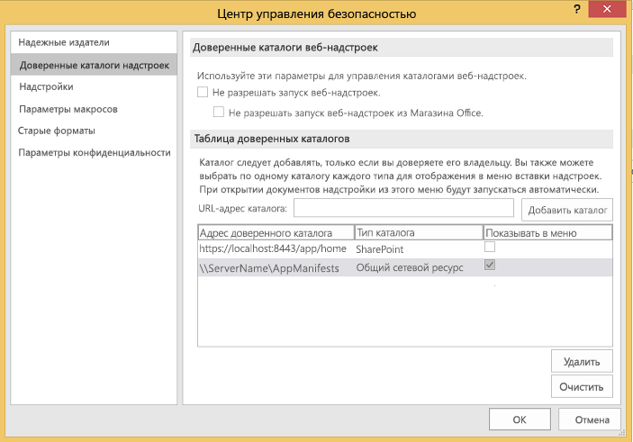
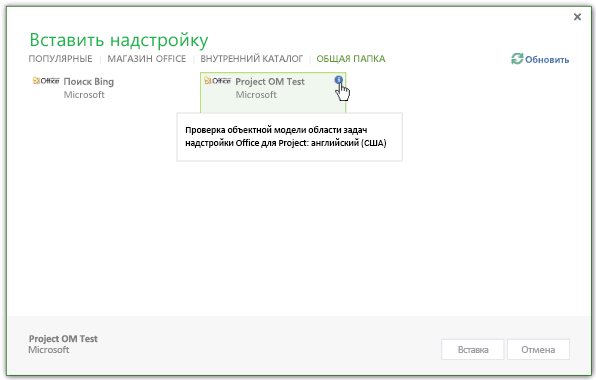
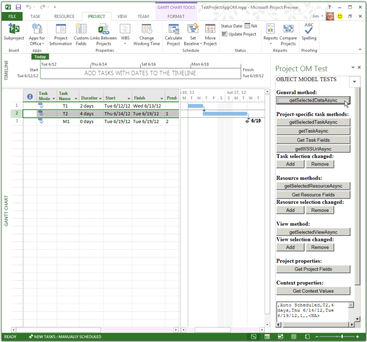
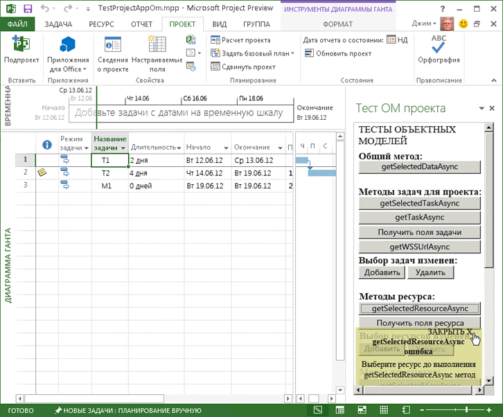

# <a name="create-your-first-task-pane-add-in-for-microsoft-project-by-using-a-text-editor"></a>Создание первой надстройки области задач для Microsoft Project с помощью текстового редактора

Надстройку области задач для Project стандартный 2013, Project профессиональный 2013 или более поздних версий можно создать с помощью генератора Yeoman для надстроек Office. В этой статье описывается, как создать простую надстройку, в которой используется манифест XML, указывающий на HTML-файл в общей папке. Пример надстройки Project OM Test проверяет некоторые функции JavaScript, которые используют объектную модель для надстроек. После использования **центра управления безопасностью** в Project для регистрации общей папки, содержащей файл манифеста, можно открыть надстройку области задач на вкладке ленты **Проект**. (Код примера в этой статье основан на тестовом приложении, написанном Арвиндом Айером (Arvind Iyer), специалистом корпорации Майкрософт).

В Project используется та же схема манифеста надстройки, что и в других клиентах Microsoft Office, и такой же API-интерфейс JavaScript (в основном). Полный код надстройки, описанной в этой статье, доступен в подкаталоге `Samples\Apps` загружаемого пакета SDK для Project 2013.

Пример надстройки Project OM Test может получить GUID задачи, а также свойства приложения и активного проекта. Если в Project профессиональный 2013 открыт проект, находящийся в библиотеке SharePoint, то надстройка может показать URL-адрес проекта. 

[Пакет SDK для Project 2013](https://www.microsoft.com/download/details.aspx?id=30435%20) включает весь исходный код. Извлекая и устанавливая пакет SDK и примеры из файла Project2013SDK.msi, в подкаталоге `\Samples\Apps\Copy_to_AppManifests_FileShare` вы найдете файл манифеста, а в подкаталоге `\Samples\Apps\Copy_to_AppSource_FileShare` — исходный код. 

В примере JSOMCall.html используются функции JavaScript из файлов office.js и project-15.js, включенных в пакет. Вы можете изучать функции, используя соответствующие файлы отладки (office.debug.js и project-15.debug.js).

Общие сведения об использовании JavaScript в надстройках Office представлены в статье [Общие сведения об интерфейсе API JavaScript для Office](../develop/understanding-the-javascript-api-for-office.md).

## <a name="procedure-1-to-create-the-add-in-manifest-file"></a>Процедура 1. Создание файла манифеста надстройки

Создайте XML-файл в локальном каталоге. XML-файл включает элемент **OfficeApp** и дочерние элементы, которые описаны в статье, посвященной [XML-манифесту надстроек для Office](../develop/add-in-manifests.md). Например, создайте файл с именем JSOM_SimpleOMCalls.xml, содержащий приведенный ниже XML-код (измените значение GUID элемента **Id**).
    
```XML
<?xml version="1.0" encoding="utf-8"?>
   <OfficeApp xmlns="http://schemas.microsoft.com/office/appforoffice/1.1" 
              xmlns:xsi="https://www.w3.org/2001/XMLSchema-instance" 
              xsi:type="TaskPaneApp">
     <Id>93A26520-9414-492F-994B-4983A1C7A607</Id>
     <Version>15.0</Version>
     <ProviderName>Microsoft</ProviderName>
     <DefaultLocale>en-us</DefaultLocale>
     <DisplayName DefaultValue="Project OM Test">
       <Override Locale="fr-fr" Value="Le Project OM Test"/>
     </DisplayName>
     <Description DefaultValue="Test the task pane add-in object model for Project - English (US)">
       <Override Locale="fr-fr" Value="Test the task pane add-in object model for Project - French (France)"/>
     </Description>
     <Hosts>
       <Host Name="Project"/>
       <Host Name="Workbook"/>
       <Host Name="Document"/>
     </Hosts>
    <DefaultSettings>
       <SourceLocation DefaultValue="\\ServerName\AppSource\JSOMCall.html">
         <Override Locale="fr-fr" Value="\\ServerName\AppSource\JSOMCall.html"/>
       </SourceLocation>
     </DefaultSettings>
     <Permissions>ReadWriteDocument</Permissions>
     <IconUrl DefaultValue="http://officeimg.vo.msecnd.net/_layouts/images/general/office_logo.jpg">
       <Override Locale="fr-fr" Value="http://officeimg.vo.msecnd.net/_layouts/images/general/office_logo.jpg"/>
     </IconUrl>
     <AllowSnapshot>true</AllowSnapshot>
   </OfficeApp>
```

Применительно к Project элемент **OfficeApp** должен включать значение атрибута `xsi:type="TaskPaneApp"`. Элемент **Id** является идентификатором GUID. Значение **SourceLocation** должно представлять собой путь к общей папке или URL-адрес SharePoint для исходного HTML-файла надстройки или для веб-приложения, которое работает в области задач. Описание других элементов файла манифеста см. в статье [Надстройки области задач для Project](../project/project-add-ins.md).
    
В процедуре 2 показано, как создавать файл HTML, который манифест JSOM_SimpleOMCalls.xml определяет как тестовую надстройку для Project. Кнопки, определенные в HTML-файле, вызывают связанные функции JavaScript. Можно добавить функции JavaScript в HTML-файл или поместить их в отдельный JS-файл.

## <a name="procedure-2-to-create-the-source-files-for-the-project-om-test-add-in"></a>Процедура 2. Создание исходных файлов для надстройки Project OM Test

1. Создайте HTML-файл с именем, указанным в элементе **SourceLocation** манифеста JSOM_SimpleOMCalls.xml. 

   Например, создайте файл JSOMCall.html в каталоге `C:\Project\AppSource`. Хотя вы можете создавать исходные файлы с помощью простого текстового редактора, проще использовать такой инструмент, как Visual Studio Code, который работает с определенными типами документов (например, HTML и JavaScript) и содержит различные вспомогательные компоненты, упрощающие редактирование. Если вы еще не создавали пример с поиском Bing, описанный в статье [Надстройки области задач для Project](../project/project-add-ins.md), просмотрите процедуру 3, чтобы узнать, как создавать общую папку `\\ServerName\AppSource`, на которую указывает манифест.
    
   Файл JSOMCall.html использует общий файл MicrosoftAjax.js для функций AJAX, а файл Office.js — для функций надстройки в приложениях Microsoft Office 2013.

    ```HTML
    <!DOCTYPE html>
    <html>
        <head>
            <title>Project OM Sample Code</title>
            <meta http-equiv="X-UA-Compatible" content="IE=Edge" />
            <script type="text/javascript" src="MicrosoftAjax.js"></script>

            <!-- Use the CDN reference to office.js when deploying your add-in. -->
            <!-- <script src="https://appsforoffice.microsoft.com/lib/1/hosted/Office.js"></script> -->
            <script type="text/javascript" src="Office.js"></script>
            <script type="text/javascript" src="JSOM_Sample.js"></script>
        </head>
        <body>
            <div id="Common_JSOM_API">
                OBJECT MODEL TESTS
            </div>

            <textarea id="text" rows="6" cols="25">This is the text result.</textarea>
        </body>
    </html>
    ```

   Элемент **textarea** задает текстовое поле, в котором отображаются результаты выполнения функций JavaScript.
    
   > [!NOTE]
   > Чтобы пример Project OM Test заработал, скопируйте следующие файлы из пакета SDK Project 2013 в тот же каталог, где находится файл JSOMCall.html: Office.js, Project-15.js и MicrosoftAjax.js.

   На этапе 2 добавляется файл JSOM_Sample.js для выполнения определенных функций, используемых примером надстройки Project OM Test. На последующих этапах будут добавлены другие элементы HTML для кнопок, вызывающих функции JavaScript.
    
2. Создайте файл JavaScript с именем JSOM_Sample.js в том же каталоге, где находится файл JSOMCall.html. 

   Приведенный ниже код получает контекст приложения и сведения о документе с помощью функций из файла Office.js. Объект **text** представляет собой идентификатор элемента управления **textarea** в HTML-файле.
    
   Переменная **\_projDoc** инициализируется с объектом **ProjectDocument**. Код включает функции обработки простых ошибок, а также функцию **getContextValues**, которая получает контекст приложения и свойства контекста для документа проекта. Дополнительные сведения об объектной модели JavaScript для Project см. в статье [API JavaScript для Office](https://docs.microsoft.com/office/dev/add-ins/reference/javascript-api-for-office).

    ```javascript
    /*
    * JavaScript functions for the Project OM Test example app
    * in the Project 2013 SDK.
    */

    var _projDoc;
    var _app;
    var taskGuid;
    var resourceGuid;

    // The initialize function is required for all add-ins.
    Office.initialize = function (reason) {
        // Checks for the DOM to load using the jQuery ready function.
        $(document).ready(function () {
            // After the DOM is loaded, app-specific code can run.
            _projDoc = Office.context.document;
            _app = Office.context;
        });
    }

    function logError(errorText) {
        text.value = "Error in " + errorText;
    }

    function logEventError(erroneousEvent) {
        logError("event " + erroneousEvent);
    }

    function logMethodError(methodName, errorName, errorMessage) {
        logError(methodName + " method.\nError name: " + errorName + "\nMessage: " + errorMessage);
    }

    // . . . Add other JavaScript functions here.

    function getContextValues() {
        getDocumentUrl();
        getDocumentMode();
        getApplicationContentLanguage();
        getApplicationDisplayLanguage();
    }

    function getDocumentUrl() {
        text.value ="Document URL:\n" +_projDoc.url;
    }

    function getDocumentMode() {
        var docMode = _projDoc.mode;
        text.value = text.value + "\n\nDocument mode: " + docMode;
    }

    function getApplicationContentLanguage() {
        text.value = text.value + "\nApp language: " + _app.contentLanguage;
    }

    function getApplicationDisplayLanguage() {
        text.value = text.value + "\nDisplay language: " + _app.displayLanguage;
    }
    ```

   Сведения о функциях в файле Office.debug.js см. в разделе [JavaScript API for Office](https://docs.microsoft.com/office/dev/add-ins/reference/javascript-api-for-office). Например, функция **getDocumentUrl** получает URL-адрес или путь к файлу открытого проекта.
    
3. Добавьте функции JavaScript, которые вызывают асинхронные функции из файлов Office.js и Project-15.js для получения выбранных данных.
    
   - Например, **getSelectedDataAsync** — это общая функция в Office.js, которая принимает неформатированный текст из выбранных данных. Дополнительные сведения см. в статье [Объект AsyncResult](https://docs.microsoft.com/javascript/api/office/office.asyncresult).
    
   - Функция **getSelectedTaskAsync** из файла Project-15.js принимает идентификатор GUID выбранной задачи. Аналогичным образом функция **getSelectedResourceAsync** получает GUID выбранного ресурса. Если вызвать какую-либо из этих функций, не выбрав задачу или ресурс, функция выдает неопределенную ошибку.
    
   - Функция **getTaskAsync** получает имя задачи и имена назначенных ресурсов. Если задача находится в синхронизированном списке задач SharePoint, функция **getTaskAsync** получает идентификатор задач из списка SharePoint. В противном случае идентификатор задачи SharePoint равен 0.
    
     > [!NOTE]
     > В демонстрационных целях образец кода содержит ошибку. Если значение **taskGuid** не определено, функция **getTaskAsync** выдает ошибку. Если получить допустимый GUID задачи, а затем выбрать другую задачу, функция **getTaskAsync** получает данные для самой последней задачи, с которой работала функция **getSelectedTaskAsync**.
  
   - **getTaskFields**, **getResourceFields** и **getProjectFields** — это локальные функции, которые вызывают функции **getTaskFieldAsync**, **getResourceFieldAsync** или **getProjectFieldAsync** несколько раз для получения указанных полей задачи или ресурса. В файле project-15.debug.js перечисления **ProjectTaskFields** и **ProjectResourceFields** показывают, какие поля поддерживаются.
    
   - Функция **getSelectedViewAsync** получает тип представления (определяется в перечислении **ProjectViewTypes** в файле project-15.debug.js) и его имя.
    
   - Если проект синхронизируется со списком задач SharePoint, функция **getWSSUrlAsync** получает URL-адрес и имя списка задач. Если проект не синхронизируется со списком задач SharePoint, функция **getWSSUrlAsync** выдает ошибку.
    
     > [!NOTE]
     > Чтобы получить URL-адрес SharePoint и имя списка задач, рекомендуется использовать функцию **getProjectFieldAsync** с константами **WSSUrl** и **WSSList** в перечислении [ProjectProjectFields](https://docs.microsoft.com/javascript/api/office/office.projectprojectfields).

   Все функции в коде ниже содержат анонимную функцию, которую определяет `function (asyncResult)`обратная функция, получающая асинхронный результат. Вместо анонимных можно использовать именованные функции. Благодаря этому будет удобней обеспечивать поддержку сложных надстроек.

    ```javascript
    // Get the data in the selected cells of the grid in the active view.
    function getSelectedDataAsync() {
        _projDoc.getSelectedDataAsync(
            Office.CoercionType.Text,
            { ValueFormat: "Formatted" },
            function (asyncResult) {
                if (asyncResult.status == Office.AsyncResultStatus.Succeeded)
                    text.value = asyncResult.value;
                else
                    logMethodError("getSelectedDataAsync", asyncResult.error.name,
                                   asyncResult.error.message);
            }
        );
    }

    // Get the GUID of the selected task.
    function getSelectedTaskAsync() {
        _projDoc.getSelectedTaskAsync(function (asyncResult) {
            if (asyncResult.status == Office.AsyncResultStatus.Succeeded) {
                text.value = asyncResult.value;
                taskGuid = asyncResult.value;
            }
            else {
                logMethodError("getSelectedTaskAsync", asyncResult.error.name,
                                   asyncResult.error.message);
            }
        });
    }

    // Get the GUID of the selected resource.
    function getSelectedResourceAsync() {
        _projDoc.getSelectedResourceAsync(function (asyncResult) {
            if (asyncResult.status == Office.AsyncResultStatus.Succeeded) {
                text.value = asyncResult.value;
                resourceGuid = asyncResult.value;
            }
            else {
                logMethodError("getSelectedResourceAsync", asyncResult.error.name,
                                   asyncResult.error.message);
            }
        });
    }

    // Get data for the specified task.
    function getTaskAsync() {
        if (taskGuid != undefined) {
            _projDoc.getTaskAsync(
                taskGuid,
                function (asyncResult) {
                    if (asyncResult.status === Office.AsyncResultStatus.Failed) {
                        logMethodError("getTaskAsync", asyncResult.error.name,
                                   asyncResult.error.message);
                    } else {
                        var taskInfo = asyncResult.value;
                        var taskOutput = "Task name: " + taskInfo.taskName +
                                         "\nGUID: " + taskGuid +
                                         "\nWSS Id: " + taskInfo.wssTaskId +
                                         "\nResourceNames: " + taskInfo.resourceNames;
                        text.value = taskOutput;
                    }
                }
            );
        } else {
            text.value = 'Task GUID not valid:\n' + taskGuid;
        } 
    }

    // Get additional data for task fields.
    function getTaskFields() {
        text.value = "";

        _projDoc. getTaskFieldAsync(taskGuid, Office.ProjectTaskFields.Name,
            function (asyncResult) {
                if (asyncResult.status == Office.AsyncResultStatus.Succeeded) {
                    text.value = text.value + "Name: "
                        + asyncResult.value.fieldValue + "\n";
                }
                else {
                    logMethodError("getTaskFieldAsync", asyncResult.error.name,
                                   asyncResult.error.message);
                }
            }
        );

        _projDoc.getTaskFieldAsync(taskGuid, Office.ProjectTaskFields.ID,
            function (asyncResult) {
                if (asyncResult.status == Office.AsyncResultStatus.Succeeded) {
                    text.value = text.value + "ID: "
                        + asyncResult.value.fieldValue + "\n";
                }
                else {
                    logMethodError("getTaskFieldAsync", asyncResult.error.name,
                                   asyncResult.error.message);
                }
            }
        );

        _projDoc.getTaskFieldAsync(taskGuid, Office.ProjectTaskFields.Start,
            function (asyncResult) {
                if (asyncResult.status == Office.AsyncResultStatus.Succeeded) {
                    text.value = text.value + "Start: "
                        + asyncResult.value.fieldValue + "\n";
                }
                else {
                    logMethodError("getTaskFieldAsync", asyncResult.error.name,
                                   asyncResult.error.message);
                }
            }
        );

        _projDoc.getTaskFieldAsync(taskGuid, Office.ProjectTaskFields.Duration,
            function (asyncResult) {
                if (asyncResult.status == Office.AsyncResultStatus.Succeeded) {
                    text.value = text.value + "Duration: "
                        + asyncResult.value.fieldValue + "\n";
                }
                else {
                    logMethodError("getTaskFieldAsync", asyncResult.error.name,
                                   asyncResult.error.message);
                }
            }
        );

        _projDoc.getTaskFieldAsync(taskGuid, Office.ProjectTaskFields.Priority,
            function (asyncResult) {
                if (asyncResult.status == Office.AsyncResultStatus.Succeeded) {
                    text.value = text.value + "Priority: "
                        + asyncResult.value.fieldValue + "\n";
                }
                else {
                    logMethodError("getTaskFieldAsync", asyncResult.error.name,
                                   asyncResult.error.message);
                }
            }
        );

        _projDoc.getTaskFieldAsync(taskGuid, Office.ProjectTaskFields.Notes,
            function (asyncResult) {
                if (asyncResult.status == Office.AsyncResultStatus.Succeeded) {
                    text.value = text.value + "Notes: "
                        + asyncResult.value.fieldValue + "\n";
                }
                else {
                    logMethodError("getTaskFieldAsync", asyncResult.error.name,
                                   asyncResult.error.message);
                }
            }
        ); 
    }

    // Get data for the specified resource fields.
    function getResourceFields() {
        text.value = "";

        _projDoc.getResourceFieldAsync(resourceGuid, Office.ProjectResourceFields.Name,
            function (asyncResult) {
                if (asyncResult.status == Office.AsyncResultStatus.Succeeded) {
                    text.value = text.value + "Resource name: " + asyncResult.value.fieldValue + "\n";
                }
                else {
                    logMethodError("getResourceFieldAsync", asyncResult.error.name,
                                   asyncResult.error.message);
                }
            }
        );

        _projDoc.getResourceFieldAsync(resourceGuid, Office.ProjectResourceFields.Cost,
            function (asyncResult) {
                if (asyncResult.status == Office.AsyncResultStatus.Succeeded) {
                    text.value = text.value + "Cost: " + asyncResult.value.fieldValue + "\n";
                }
                else {
                    logMethodError("getResourceFieldAsync", asyncResult.error.name,
                                   asyncResult.error.message);
                }
            }
        );

        _projDoc.getResourceFieldAsync(resourceGuid, Office.ProjectResourceFields.StandardRate,
            function (asyncResult) {
                if (asyncResult.status == Office.AsyncResultStatus.Succeeded) {
                    text.value = text.value + "Standard Rate: " + asyncResult.value.fieldValue + "\n";
                }
                else {
                    logMethodError("getResourceFieldAsync", asyncResult.error.name, asyncResult.error.message);
                }
            }
        );

        _projDoc.getResourceFieldAsync(resourceGuid, Office.ProjectResourceFields.ActualCost,
            function (asyncResult) {
                if (asyncResult.status == Office.AsyncResultStatus.Succeeded) {
                    text.value = text.value + "Actual Cost: " + asyncResult.value.fieldValue + "\n";
                }
                else {
                    logMethodError("getResourceFieldAsync", asyncResult.error.name, asyncResult.error.message);
                }
            }
        );

        _projDoc.getResourceFieldAsync(resourceGuid, Office.ProjectResourceFields.ActualWork,
            function (asyncResult) {
                if (asyncResult.status == Office.AsyncResultStatus.Succeeded) {
                    text.value = text.value + "Actual Work: " + asyncResult.value.fieldValue + "\n";
                }
                else {
                    logMethodError("getResourceFieldAsync", asyncResult.error.name,
                                   asyncResult.error.message);
                }
            }
        );

        _projDoc.getResourceFieldAsync(resourceGuid, Office.ProjectResourceFields.Units,
            function (asyncResult) {
                if (asyncResult.status == Office.AsyncResultStatus.Succeeded) {
                    text.value = text.value + "Units: " + asyncResult.value.fieldValue + "\n";
                }
                else {
                    logMethodError("getResourceFieldAsync", asyncResult.error.name,
                                   asyncResult.error.message);
                }
            }
        );
    }

    // Get the URL and list name of the synchronized SharePoint task list.
    // Recommended: use getProjectField instead.
    function getWSSUrlAsync() {
        _projDoc.getWSSUrlAsync(function (asyncResult) {
            if (asyncResult.status == Office.AsyncResultStatus.Succeeded) {
                text.value = "SharePoint URL:\n" + asyncResult.value.serverUrl
                    + "\nList name: " + asyncResult.value.listName;
            }
            else {
                logMethodError("getWSSUrlAsync", asyncResult.error.name, asyncResult.error.message);
            }
        });
    }

    // Get the type and name of the selected view.
    function getSelectedViewAsync() {
        _projDoc.getSelectedViewAsync(function (asyncResult) {
            text.value = "View type: " + asyncResult.value.viewType
                + "\nName: " + asyncResult.value.viewName;
        });
    }

    // Get information about the active project.
    function getProjectFields() {
        text.value = "";

        _projDoc.getProjectFieldAsync(Office.ProjectProjectFields.GUID,
            function (asyncResult) {
                if (asyncResult.status == Office.AsyncResultStatus.Succeeded) {
                    text.value = text.value + "Project GUID: " + asyncResult.value.fieldValue + "\n";
                }
                else {
                    logMethodError("getProjectFieldAsync", asyncResult.error.name, asyncResult.error.message);
                }
            }
        );

        _projDoc.getProjectFieldAsync(Office.ProjectProjectFields.Start,
            function (asyncResult) {
                if (asyncResult.status == Office.AsyncResultStatus.Succeeded) {
                    text.value = text.value + "\nStart: " + asyncResult.value.fieldValue + "\n";
                }
                else {
                    logMethodError("getProjectFieldAsync", asyncResult.error.name, asyncResult.error.message);
                }
            }
        );

        _projDoc.getProjectFieldAsync(Office.ProjectProjectFields.Finish,
            function (asyncResult) {
                if (asyncResult.status == Office.AsyncResultStatus.Succeeded) {
                    text.value = text.value + "\nFinish: " + asyncResult.value.fieldValue + "\n";
                }
                else {
                    logMethodError("getProject " + errorText);
                }
            }
        );

        _projDoc.getProjectFieldAsync(Office.ProjectProjectFields.CurrencyDigits,
            function (asyncResult) {
                if (asyncResult.status == Office.AsyncResultStatus.Succeeded) {
                    text.value = text.value + "\nCurrency digits: " + asyncResult.value.fieldValue + "\n";
                }
                else {
                    logMethodError("getProjectFieldAsync", asyncResult.error.name, asyncResult.error.message);
                }
            }
        );

        _projDoc.getProjectFieldAsync(Office.ProjectProjectFields.CurrencySymbol,
            function (asyncResult) {
                if (asyncResult.status == Office.AsyncResultStatus.Succeeded) {
                    text.value = text.value + "Currency symbol: " + asyncResult.value.fieldValue + "\n";
                }
                else {
                    logMethodError("getProjectFieldAsync", asyncResult.error.name, asyncResult.error.message);
                }
            }
        );

        _projDoc.getProjectFieldAsync(Office.ProjectProjectFields.CurrencySymbolPosition,
            function (asyncResult) {
                if (asyncResult.status == Office.AsyncResultStatus.Succeeded) {
                    text.value = text.value + "\nSymbol position: " + asyncResult.value.fieldValue + "\n";
                }
                else {
                    logMethodError("getProjectFieldAsync", asyncResult.error.name, asyncResult.error.message);
                }
            }
        );

        _projDoc.getProjectFieldAsync(Office.ProjectProjectFields.ProjectServerUrl,
            function (asyncResult) {
                if (asyncResult.status == Office.AsyncResultStatus.Succeeded) {
                    text.value = text.value + "\nProject web app URL:\n  " + asyncResult.value.fieldValue + "\n";
                }
                else {
                    logMethodError("getProjectFieldAsync", asyncResult.error.name, asyncResult.error.message);
                }
            }
        );

        _projDoc.getProjectFieldAsync(Office.ProjectProjectFields.WSSUrl,
            function (asyncResult) {
                if (asyncResult.status == Office.AsyncResultStatus.Succeeded) {
                    text.value = text.value + "\nSharePoint URL:\n  " + asyncResult.value.fieldValue + "\n";
                }
                else {
                    logMethodError("getProjectFieldAsync", asyncResult.error.name, asyncResult.error.message);
                }
            }
        );

        _projDoc.getProjectFieldAsync(Office.ProjectProjectFields.WSSList,
            function (asyncResult) {
                if (asyncResult.status == Office.AsyncResultStatus.Succeeded) {
                    text.value = text.value + "\nSharePoint list: " + asyncResult.value.fieldValue + "\n";
                }
                else {
                    logMethodError("getProjectFieldAsync", asyncResult.error.name, asyncResult.error.message);
                }
            }
        );
    }
    ```

4. Добавьте обратные вызовы и функции обработчика событий JavaScript, чтобы зарегистрировать обработчики событий изменения выбранных задач, ресурсов и представлений, а также отменить их регистрацию. Функция **manageEventHandlerAsync** добавляет или удаляет указанный обработчик события в зависимости от параметра _operation_. Поддерживаются операции **addHandlerAsync** и **removeHandlerAsync**.
    
   С помощью функций **manageTaskEventHandler**, **manageResourceEventHandler** и **manageViewEventHandler** можно добавлять и удалять обработчики событий в соответствии с параметром _docMethod_.

    ```javascript
    // Task selection changed event handler.
    function onTaskSelectionChanged(eventArgs) {
        text.value = "In task selection change event handler";
    }

    // Resource selection changed event handler.
    function onResourceSelectionChanged(eventArgs) {
        text.value = "In Resource selection changed event handler";
    }

    // View selection changed event handler.
    function onViewSelectionChanged(eventArgs) {
        text.value = "In View selection changed event handler";
    }

    // Add or remove the specified event handler.
    function manageEventHandlerAsync(eventType, handler, operation, onComplete) {
        _projDoc[operation]   //The operation is addHandlerAsync or removeHandlerAsync.
        (
            eventType,
            handler,
            function (asyncResult) {
                if (onComplete) {
                    onComplete(asyncResult, operation);
                } else {
                    var message = "Operation: " + operation;
                    message = message + "\nStatus: " + asyncResult.status + "\n";
                    text.value = message;
                }
            }
        );
    }

    // Write the asyncResult status from the manageEventHandlerAsync function (optional). 
    function onComplete(asyncResult, operation) {
        var message = "In onComplete function for " + operation;
        message = message + "\nStatus: " + asyncResult.status;
        text.value = message;
    }

    // Add or remove a task selection changed event handler.
    function manageTaskEventHandler(docMethod) {
        manageEventHandlerAsync(
            Office.EventType.TaskSelectionChanged,      // The task selection changed event.
            onTaskSelectionChanged,                     // The event handler.
            docMethod,                // The Office.Document method to add or remove an event handler.
            onComplete                // Manages the successful asyncResult data (optional).
        );
    }

    // Add or remove a resource selection changed event handler.
    function manageResourceEventHandler(docMethod) {
        manageEventHandlerAsync(
            Office.EventType.ResourceSelectionChanged,  // The resource selection changed event.
            onResourceSelectionChanged,                 // The event handler.
            docMethod,                // The Office.Document method to add or remove an event handler.
            onComplete                // Manages the successful asyncResult data (optional).
        );
    }

    // Add or remove a view selection changed event handler.
    function manageViewEventHandler(docMethod) {
        manageEventHandlerAsync(
            Office.EventType.ViewSelectionChanged,      // The view selection changed event.
            onViewSelectionChanged,                     // The event handler.
            docMethod,                // The Office.Document method to add or remove an event handler.
            onComplete                // Manages the successful asyncResult data (optional).
        );
    }
    ```

5. Что касается основной части документа HTML, добавьте кнопки, которые вызывают функции JavaScript для тестирования. Например, добавьте в элемент **div** интерфейса JSOM API кнопку ввода, которая вызывает общую функцию **getSelectedDataAsync**.
    
    ```HTML
    <body>
        <div id="Common_JSOM_API">
        OBJECT MODEL TESTS
        <br /><br />       
        <strong>General function:</strong>
        <br />
        <input id="Button5" class="button-wide" type="button" onclick="getSelectedDataAsync()" 
            value="getSelectedDataAsync" />
        </div>
        <!--  more code . . .  -->
    ```

6. Добавьте раздел **div** с кнопками для функций задач, относящихся к проекту, а также для события **TaskSelectionChanged**.
    
    ```HTML
    <div id="ProjectSpecificTask">
      <br />
      <strong>Project-specific task methods:</strong><br />
      <button class="button-wide" onclick="getSelectedTaskAsync()">getSelectedTaskAsync</button><br />
      <button class="button-wide" onclick="getTaskAsync()">getTaskAsync</button><br />
      <button class="button-wide" onclick="getTaskFields()">Get Task Fields</button><br />
      <button class="button-wide" onclick="getWSSUrlAsync()">getWSSUrlAsync</button>
      <strong>Task selection changed:</strong>
      <button class="button-narrow" onclick="manageTaskEventHandler('addHandlerAsync')">Add</button>
      <button class="button-narrow" onclick="manageTaskEventHandler('removeHandlerAsync')">Remove</button>         
    </div>
    ```

7. Добавьте разделы **div** с кнопками для методов и событий ресурсов и представлений, а также свойств проекта и контекста.
    
    ```HTML
    <div id="ResourceMethods">
      <br />
      <strong>Resource methods:</strong>
      <button class="button-wide" onclick="getSelectedResourceAsync()">getSelectedResourceAsync</button><br />
      <button class="button-wide" onclick="getResourceFields()">Get Resource Fields</button><br />
      <strong>Resource selection changed:</strong>
      <button class="button-narrow" onclick="manageResourceEventHandler('addHandlerAsync')">Add</button>
      <button class="button-narrow" onclick="manageResourceEventHandler('removeHandlerAsync')">Remove</button>
    </div>
    <div id="ViewMethods">
      <br />
      <strong>View method:</strong>
      <button class="button-wide" onclick="getSelectedViewAsync()">getSelectedViewAsync</button><br />
      <strong>View selection changed:</strong>
      <button class="button-narrow" onclick="manageViewEventHandler('addHandlerAsync')">Add</button>
      <button class="button-narrow" onclick="manageViewEventHandler('removeHandlerAsync')">Remove</button>         
    </div>
    <div id="ProjectMethods">
      <br />
      <strong>Project properties:</strong>
      <button class="button-wide" onclick="getProjectFields()">Get Project Fields</button><br />
    </div>
    <div id="ContextVariables">
      <br />
      <strong>Context properties:</strong>
      <button class="button-wide" onclick="getContextValues()">Get Context Values</button>
    </div>
    ```

8. Чтобы отформатировать элементы кнопок, добавьте элемент таблицы стилей **style**. Например, добавьте следующий код, как дочерний объект элемента **head**.
    
    ```HTML
    <style type="text/css">
        .button-wide
        {
            width: 210px;
            margin-top: 2px;
        }
        .button-narrow
        {
            width: 80px;
            margin-top: 2px;
        }
    </style>
    ```

В процедуре 3 показано, как устанавливать и использовать функциональные возможности надстройки Project OM Test.

## <a name="procedure-3-to-install-and-use-the-project-om-test-add-in"></a>Процедура 3. Установка и использование надстройки Project OM Test

1. Создайте общую папку для хранения манифеста JSOM_SimpleOMCalls.xml. Можно создать общую папку на локальном компьютере или на удаленном компьютере, если к нему есть доступ из сети. Например, если манифест расположен в каталоге `C:\Project\AppManifests` на локальном компьютере, выполните следующую команду:
    
    `Net share AppManifests=C:\Project\AppManifests`
    
2. Создайте сетевую папку для размещения файлов HTML и JavaScript, относящихся к надстройке Project OM Test. Убедитесь, что путь к сетевой папке совпадает с путем, указанным в манифесте JSOM_SimpleOMCalls.xml. Например, если файлы расположены в каталоге `C:\Project\AppSource` на локальном компьютере, выполните следующую команду:
    
    `net share AppSource=C:\Project\AppSource`

3. Откройте в Project диалоговое окно **Параметры Project**, выберите **Центр управления безопасностью**, а затем — **Параметры центра управления безопасностью**.
    
   В статье [Надстройки области задач для Project](../project/project-add-ins.md) представлено руководство по регистрации надстройки, а также дополнительные сведения.
    
4. В диалоговом окне **Центр управления безопасностью** выберите в левой области **Доверенные каталоги надстроек**.
    
5. Если вы уже добавляли путь `\\ServerName\AppManifests` для надстройки "Поиск Bing", пропустите этот этап. В противном случае в области **Доверенные каталоги надстроек** укажите путь `\\ServerName\AppManifests` в текстовом окне **URL-адрес каталога**, выберите пункт **Добавить каталог**, включите сетевую общую папку как источник по умолчанию (см. рис. 1), а затем нажмите кнопку **ОК**.
    
   *Рис. 1. Добавление сетевой общей папки для манифестов надстроек*

   

6. После добавления новых надстроек или изменения исходного кода перезапустите Project. На ленте **ПРОЕКТ** выберите в раскрывающемся меню **Надстройки Office** значение **Просмотреть все**. В диалоговом окне **Вставить надстройку** выберите **ОБЩАЯ ПАПКА** (см. рис. 2), выберите **Project OM Test**, затем **Вставить**. Надстройка Project OM Test запустится в области задач.
    
   *Рис. 2. Запуск надстройки Project OM Test, расположенной в общей папке*

   

7. В Project создайте и сохраните простой проект, который содержит хотя бы две задачи. Например, создайте задачи с именами T1, T2 и веху с именем M1, затем задайте длительности задач и их предшественников примерно как показано на рис. 3. Выберите вкладку **ПРОЕКТ** на ленте выберите всю строку задачи T2, затем нажмите кнопку **getSelectedDataAsync** в области задач. На рис. 3 показаны данные, выбранные в текстовом окне надстройки **Project OM Test**.
    
   *Рис. 3. Использование надстройки Project OM Test*

   

8. В столбце **Длительность** выберите ячейку, относящуюся к первой задаче, а затем нажмите кнопку **getSelectedDataAsync** в надстройке **Project OM Test**. Функция **getSelectedDataAsync** приведет к отображению в текстовом поле значения `2 days`. 
    
9. Выберите три ячейки **Длительность** для всех трех задач. Функция **getSelectedDataAsync** возвращает текстовые значения, разделенные точками с запятой, для ячеек, выбранных в различных строках, например: `2 days;4 days;0 days`.
    
   Функция **getSelectedDataAsync** возвращает разделенные запятыми текстовые значения для ячеек, выбранных в одной строке. Например, на рис. 3 для задачи T2 выбрана вся строка. Если выбрана функция **getSelectedDataAsync**, в текстовом поле отобразятся следующие данные: `,Auto Scheduled,T2,4 days,Thu 6/14/12,Tue 6/19/12,1,,<NA>`
    
   В текстовом массиве отображаются пустые значения для столбцов **Indicators** и **Resource Names**, так как оба они не заполнены. Для ячейки **Добавить новый столбец** отображается значение `<NA>`.
    
10. Выберите любую ячейку в строке задачи T2 или всю строку задачи T2, затем нажмите кнопку **getSelectedTaskAsync**. В текстовом поле появится значение GUID задачи, например: `{25D3E03B-9A7D-E111-92FC-00155D3BA208}`. Project сохраняет значение в глобальной переменной **taskGuid** надстройки **Project OM Test**.
    
11. Нажмите кнопку **getTaskAsync**. Если переменная **taskGuid** содержит GUID задачи T2, в текстовом поле появятся сведения о задаче. Значение **ResourceNames** будет пустым.
    
    Создайте два локальных ресурса R1 и R2, назначьте каждому из них по 50 % задачи T2 и снова выберите функцию **getTaskAsync**. Результаты в текстовом поле содержат сведения о ресурсе. Если задача включена в синхронизированный список задач SharePoint, в результатах также будет отображаться идентификатор задачи SharePoint.
    
    - Имя задачи: `T2`
    - GUID: `{25D3E03B-9A7D-E111-92FC-00155D3BA208}`
    - Идентификатор WSS: `0`
    - ResourceNames: `R1[50%],R2[50%]`

12. Нажмите кнопку **Get Task Fields** (Получать поля задачи). Функция **getTaskFields** несколько раз вызывает функцию **getTaskfieldAsync**, чтобы получить имя задачи, индекс, дату начала, длительность, приоритет и примечания.

    - Имя: `T2`
    - ИД: `2`
    - Начало: `Thu 6/14/12`
    - Продолжительность: `4d`
    - Приоритет: `500`
    - Примечания: "Это примечание для задачи T2. Это лишь тестовое примечание. Если бы оно было настоящим, тут были бы настоящие сведения".

13. Нажмите кнопку **getWSSUrlAsync**. Если проект относится к одному из указанных ниже типов, то в результатах появятся список задач, URL-адрес и имя.
    
    - Список задач SharePoint, импортированный в Project Server.
    - Список задач SharePoint, импортированный в Project профессиональный, а затем снова сохраненный в SharePoint (без использования Project Server).
    
    > [!NOTE]
    > Если Project профессиональный устанавливается на компьютере с Windows Server, то чтобы иметь возможность снова сохранить проект в SharePoint, можно с помощью **диспетчера серверов** добавить функцию **Возможности рабочего стола**.

    Если проект локальный или вы используете Project профессиональный, чтобы открыть проект, управляемый Project Server, метод **getWSSUrlAsync** возвращает неопределенную ошибку.

    - URL-адрес SharePoint: `http://ServerName`
    - Имя списка: `Test task list`
    

14. Нажмите кнопку **Добавить** в разделе **события TaskSelectionChanged**. Будет вызвана функция **manageTaskEventHandler** для регистрации события изменения выбранной задачи, а затем в текстовом поле появится сообщение `In onComplete function for addHandlerAsync Status: succeeded`. Выберите другую задачу. В текстовом поле появится надпись `In task selection changed event handler` — выходные данные функции обратного вызова для события изменения выбранной задачи. Нажмите кнопку **Удалить**, чтобы отменить регистрацию обработчика события.
    
15. Чтобы использовать методы ресурсов, сначала выберите представление, например **Таблица ресурсов**, **Использование ресурсов** или **Форма ресурсов**, затем выберите ресурс в этом представлении. Выберите **getSelectedResourceAsync** для инициализации переменной **resourceGuid**, затем выберите **Получить поля ресурсов**, чтобы несколько раз вызвать **getResourceFieldAsync** для свойств ресурсов. Можно также добавить или удалить обработчик событий для случаев изменения выделения ресурса.
    
    - Имя ресурса: `R1`
    - Затраты: `$800.00`
    - Стандартная ставка: `$50.00/h`
    - Фактические затраты: `$0.00`
    - Фактические трудозатраты: `0h`
    - Единицы: `100%`

16. Нажмите кнопку **getSelectedViewAsync**, чтобы показать тип и имя активного представления. Вы также можете добавить или удалить обработчик события изменения выбранного события. Например, если активно представление **Форма ресурсов**, то функция **getSelectedViewAsync** выведет в текстовом поле следующие сведения:
    
    - Тип представления: `6`
    - Имя: `Resource Form`
    
17. Нажмите кнопку **Получить поля проекта**, чтобы несколько раз вызвать функцию **getProjectFieldAsync** для разных свойств активного проекта. Если проект открыт из Project Web App, то функция **getProjectFieldAsync** может получить URL-адрес экземпляра Project Web App.
    
    - GUID проекта: `9845922E-DAB4-E111-8AF3-00155D3BA208`
    - Начало: `Tue 6/12/12`
    - Окончание: `Tue 6/19/12`
    - Денежные цифры: `2`
    - Символ валюты: `$`
    - Положение символа: `0`
    - URL-адрес Project Web App: `http://servername/pwa`
  
18. Нажмите кнопку **Get Context Values** (Получить значения контекста), чтобы получить свойства документа и приложения, в котором запущена надстройка, считывая свойства объектов **Office.Context.document** и **Office.context.application**. Например, если файл Project1.mpp находится на рабочем столе локального компьютера, URL-адресом документа будет `C:\Users\UserAlias\Desktop\Project1.mpp`. Если MPP-файл находится в библиотеке SharePoint, значением будет URL-адрес документа. Если вы используете Project профессиональный 2013, то для открытия проекта с именем Project1 в Project Web App следует использовать URL-адрес документа `<>\Project1`.
    
    - URL-адрес документа: `<>\Project1`
    - Режим документа: `readWrite`
    - Язык приложения: `en-US`
    - Язык интерфейса: `en-US`
    
19. Можно обновить надстройку после изменения исходного кода, закрыв и перезапустив Project. Недавно использовавшиеся надстройки содержатся на ленте **Проект** в раскрывающемся списке **Надстройки Office**.
    
## <a name="example"></a>Пример

В пакете загрузки SDK для Project 2013 в файле JSOMCall.html содержится полный код, файл JSOM_Sample.js, а также связанные файлы Office.js, Office.debug.js, Project-15.js и Project-15.debug.js. Ниже приведен код, содержащийся в файле JSOMCall.html.

```HTML
<!DOCTYPE html>
<html>
    <head>
        <title>Project OM Sample Code</title>
        <meta http-equiv="X-UA-Compatible" content="IE=Edge"/>

        <script type="text/javascript" src="MicrosoftAjax.js"></script>

        <!-- Use the CDN reference to office.js when deploying your add-in. -->
        <!-- <script src="https://appsforoffice.microsoft.com/lib/1/hosted/Office.js"></script> -->
        <script type="text/javascript" src="Office.js"></script>
        <script type="text/javascript" src="JSOM_Sample.js"></script>

        <style type="text/css">           
            .button-wide {
                width: 210px;
                margin-top: 2px;
            }
            .button-narrow 
            {
                width: 80px;
                margin-top: 2px;
            }
        </style>
    </head>

    <body>
        <div id="Common_JSOM_API">
            OBJECT MODEL TESTS
            <br /><br />       
            <strong>General method:</strong>
            <br />
            <input id="Button5" class="button-wide" type="button" onclick="getSelectedDataAsync()" 
                value="getSelectedDataAsync" />
        </div>
        <div id="ProjectSpecificTask">
            <br />
            <strong>Project-specific task methods:</strong><br />
            <button class="button-wide" onclick="getSelectedTaskAsync()">getSelectedTaskAsync</button><br />
            <button class="button-wide" onclick="getTaskAsync()">getTaskAsync</button><br />
            <button class="button-wide" onclick="getTaskFields()">Get Task Fields</button><br />
            <button class="button-wide" onclick="getWSSUrlAsync()">getWSSUrlAsync</button>
            <strong>Task selection changed:</strong>
            <button class="button-narrow" onclick="manageTaskEventHandler('addHandlerAsync')">Add</button>
            <button class="button-narrow" onclick="manageTaskEventHandler('removeHandlerAsync')">Remove</button>         
        </div>
        <div id="ResourceMethods">
            <br />
            <strong>Resource methods:</strong>
            <button class="button-wide" onclick="getSelectedResourceAsync()">getSelectedResourceAsync</button><br />
            <button class="button-wide" onclick="getResourceFields()">Get Resource Fields</button><br />
            <strong>Resource selection changed:</strong>
            <button class="button-narrow" onclick="manageResourceEventHandler('addHandlerAsync')">Add</button>
            <button class="button-narrow" onclick="manageResourceEventHandler('removeHandlerAsync')">Remove</button>
        </div>
        <div id="ViewMethods">
            <br />
            <strong>View method:</strong>
            <button class="button-wide" onclick="getSelectedViewAsync()">getSelectedViewAsync</button><br />
            <strong>View selection changed:</strong>
            <button class="button-narrow" onclick="manageViewEventHandler('addHandlerAsync')">Add</button>
            <button class="button-narrow" onclick="manageViewEventHandler('removeHandlerAsync')">Remove</button>         
        </div>
        <div id="ProjectMethods">
            <br />
            <strong>Project properties:</strong>
            <button class="button-wide" onclick="getProjectFields()">Get Project Fields</button><br />
        </div>
        <div id="ContextVariables">
            <br />
            <strong>Context properties:</strong>
            <button class="button-wide" onclick="getContextValues()">Get Context Values</button>
        </div>
        <br />
        <textarea id="text" rows="10" cols="25">This is the text result.</textarea>
    </body>
</html
```

## <a name="robust-programming"></a>Надежное программирование

На примере надстройки **Project OM Test** показано использование некоторых функций JavaScript в Project 2013, которые включены в файлы Project-15.js и Office.js. Этот пример предназначен исключительно для тестирования, поэтому не содержит комплексной обработки ошибок. Например, если не выбрать ресурс и выполнить функцию **getSelectedResourceAsync**, переменная **resourceGuid** не инициализируется и вызовы **getResourceFieldAsync** возвращают ошибку. При разработке надстройки для производственной среды следует проверять поведение при возникновении определенных ошибок и игнорировать результаты, скрывать ненужные функциональные возможности или уведомлять пользователей о необходимости выбора представления и надлежащего параметра, прежде чем использовать функцию.

В качестве простого примера, вывод ошибки в следующем коде включает переменную **actionMessage**, указывающую действие, которое следует предпринять, чтобы избежать ошибки в функции **getSelectedResourceAsync**.

```javascript
function logError(errorText) {
    text.value = "Error in " + errorText;
}

function logMethodError(methodName, errorName, errorMessage, actionMessage) {
    logError(methodName + " method.\nError name: " + errorName
        + "\nMessage: " + errorMessage
        + "\n\nAction: " + actionMessage);
}

// Get the GUID of the selected resource.
function getSelectedResourceAsync() {
    _projDoc.getSelectedResourceAsync(function (asyncResult) {
        if (asyncResult.status == Office.AsyncResultStatus.Succeeded) {
            text.value = asyncResult.value;
            resourceGuid = asyncResult.value;
        }
        else {
            var actionMessage = "Select a resource before running the getSelectedResourceAsync method.";
            logMethodError("getSelectedResourceAsync", asyncResult.error.name,
                               asyncResult.error.message, actionMessage);
        }
    });
}
```

Пример **HelloProject_OData** в пакете SDK для Project 2013 включает файл SurfaceErrors.js, использующий библиотеку JQuery для отображения всплывающего сообщения об ошибке. На рисунке 4 показано сообщение об ошибке во всплывающем уведомлении.

Приведенный ниже код, который содержится в файле SurfaceErrors.js, включает функцию **throwError**, создающую объект **Toast**.

```javascript
/*
 * Show error messages in a "toast" notification.
 */

// Throws a custom defined error.
function throwError(errTitle, errMessage) {
    try {
        // Define and throw a custom error.
        var customError = { name: errTitle, message: errMessage }
        throw customError;
    }
    catch (err) {
        // Catch the error and display it to the user.
        Toast.showToast(err.name, err.message);
    }
}

// Add a dynamically-created div "toast" for displaying errors to the user.
var Toast = {

    Toast: "divToast",
    Close: "btnClose",
    Notice: "lblNotice",
    Output: "lblOutput",

    // Show the toast with the specified information.
    showToast: function (title, message) {

        if (document.getElementById(this.Toast) == null) {
            this.createToast();
        }

        document.getElementById(this.Notice).innerText = title;
        document.getElementById(this.Output).innerText = message;

        $("#" + this.Toast).hide();
        $("#" + this.Toast).show("slow");
    },

    // Create the display for the toast.
    createToast: function () {
        var divToast;
        var lblClose;
        var btnClose;
        var divOutput;
        var lblOutput;
        var lblNotice;

        // Create the container div.
        divToast = document.createElement("div");
        var toastStyle = "background-color:rgba(220, 220, 128, 0.80);" +
            "position:absolute;" +
            "bottom:0px;" +
            "width:90%;" +
            "text-align:center;" +
            "font-size:11pt;";
        divToast.setAttribute("style", toastStyle);
        divToast.setAttribute("id", this.Toast);

        // Create the close button.
        lblClose = document.createElement("div");
        lblClose.setAttribute("id", this.Close);
        var btnStyle = "text-align:right;" +
            "padding-right:10px;" +
            "font-size:10pt;" +
            "cursor:default";
        lblClose.setAttribute("style", btnStyle);
        lblClose.appendChild(document.createTextNode("CLOSE "));

        btnClose = document.createElement("span");
        btnClose.setAttribute("style", "cursor:pointer;");
        btnClose.setAttribute("onclick", "Toast.close()");
        btnClose.innerText = "X";
        lblClose.appendChild(btnClose);

        // Create the div to contain the toast title and message.
        divOutput = document.createElement("div");
        divOutput.setAttribute("id", "divOutput");
        var outputStyle = "margin-top:0px;";
        divOutput.setAttribute("style", outputStyle);

        lblNotice = document.createElement("span");
        lblNotice.setAttribute("id", this.Notice);
        var labelStyle = "font-weight:bold;margin-top:0px;";
        lblNotice.setAttribute("style", labelStyle);

        lblOutput = document.createElement("span");
        lblOutput.setAttribute("id", this.Output);

        // Add the child nodes to the toast div.
        divOutput.appendChild(lblNotice);
        divOutput.appendChild(document.createElement("br"));
        divOutput.appendChild(lblOutput);
        divToast.appendChild(lblClose);
        divToast.appendChild(divOutput);

        // Add the toast div to the document body.
        document.body.appendChild(divToast);
    },

    // Close the toast.
    close: function () {
        $("#" + this.Toast).hide("slow");
    }
}
```

Чтобы использовать функцию **throwError**, включите библиотеку JQuery и сценарий SurfaceErrors.js в файл JSOMCall.html, а также добавьте вызов **throwError** в другие функции JavaScript, такие как **logMethodError**.

> [!NOTE]
> Перед развертыванием надстройки измените ссылку office.js и ссылку jQuery на ссылку сети доставки содержимого (CDN). Ссылка CDN предоставляет самую последнюю версию и обеспечивает оптимальную производительность.

```HTML
<!DOCTYPE html>
<html>
<head>
    <title>Project OM Sample Code</title>
    <meta http-equiv="X-UA-Compatible" content="IE=Edge" />

    <script type="text/javascript" src="MicrosoftAjax.js"></script>

    <!-- Use the CDN reference to Office.js and jQuery when deploying your add-in. -->
    <!-- <script src="https://appsforoffice.microsoft.com/lib/1/hosted/Office.js"></script> -->
    <script type="text/javascript" src="Office.js"></script>
    <script type="text/javascript" src="http://ajax.microsoft.com/ajax/jQuery/jquery-1.9.0.min.js"></script>

    <script type="text/javascript" src="JSOM_Sample.js"></script>
    <script type="text/javascript" src="SurfaceErrors.js"></script>

    <!-- . . . INVALID USE OF SYMBOLS . . . -->
</head>

```

<br/>


```javascript
function logMethodError(methodName, errorName, errorMessage, actionMessage) {
    logError(methodName + " method.\nError name: " + errorName
        + "\nMessage: " + errorMessage
        + "\n\nAction: " + actionMessage);

    throwError(methodName + " error", actionMessage);
}
```

<br/>

*Рис. 4. Функции в файле SurfaceErrors.js могут показывать всплывающее уведомление*




## <a name="see-also"></a>См. также

- [Надстройки области задач для Project](../project/project-add-ins.md)
- [Общие сведения об API JavaScript для надстроек](../develop/understanding-the-javascript-api-for-office.md)
- [API JavaScript для надстроек Office](https://docs.microsoft.com/office/dev/add-ins/reference/javascript-api-for-office)
- [Справочник по схеме для манифестов надстроек Office (версия 1.1)](../develop/add-in-manifests.md)     
- [Загрузка пакета SDK для Project 2013](https://www.microsoft.com/download/details.aspx?id=30435%20)
    
