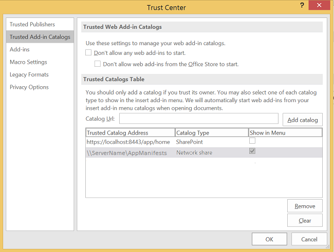

# <a name="create-your-first-task-pane-add-in-for-microsoft-project-by-using-a-text-editor"></a><span data-ttu-id="9aa0c-102">Создание первой надстройки области задач для Microsoft Project с помощью текстового редактора</span><span class="sxs-lookup"><span data-stu-id="9aa0c-102">Create your first task pane add-in for Microsoft Project by using a text editor</span></span>

<span data-ttu-id="9aa0c-103">Вы можете создать надстройку области задач для Project Standard 2013, Project профессиональный 2013 или более поздней версии с помощью генератора Yeoman для надстроек Office. В этой статье описано, как создать простую надстройку, использующую XML-манифест, указывающий на HTML-файл в общей папке.</span><span class="sxs-lookup"><span data-stu-id="9aa0c-103">You can create a task pane add-in for Project Standard 2013, Project Professional 2013, or later versions using the Yeoman generator for Office Add-ins. This article describes how to create a simple add-in that uses an XML manifest that points to an HTML file on a file share.</span></span> <span data-ttu-id="9aa0c-104">Пример надстройки Project OM Test проверяет некоторые функции JavaScript, которые используют объектную модель для надстроек. После использования **центра управления безопасностью** в Project для регистрации общей папки, содержащей файл манифеста, можно открыть надстройку области задач на вкладке ленты **Проект**.</span><span class="sxs-lookup"><span data-stu-id="9aa0c-104">The Project OM Test sample add-in tests some JavaScript functions that use the object model for add-ins. After you use the  **Trust Center** in Project to register the file share that contains the manifest file, you can open the task pane add-in from the **Project** tab on the ribbon.</span></span> <span data-ttu-id="9aa0c-105">(Код примера в этой статье основан на тестовом приложении, написанном Арвиндом Айером (Arvind Iyer), специалистом корпорации Майкрософт).</span><span class="sxs-lookup"><span data-stu-id="9aa0c-105">(The sample code in this article is based on a test application by Arvind Iyer, Microsoft Corporation.)</span></span>

<span data-ttu-id="9aa0c-106">В Project используется та же схема манифеста надстройки, что и в других клиентах Microsoft Office, и такой же API-интерфейс JavaScript (в основном).</span><span class="sxs-lookup"><span data-stu-id="9aa0c-106">Project uses the same add-in manifest schema that other Microsoft Office clients use, and much of the same JavaScript API.</span></span> <span data-ttu-id="9aa0c-107">Полный код надстройки, описанной в этой статье, доступен в подкаталоге `Samples\Apps` загружаемого пакета SDK для Project 2013.</span><span class="sxs-lookup"><span data-stu-id="9aa0c-107">The complete code for the add-in that is described in this article is available in the  `Samples\Apps` subdirectory of the Project 2013 SDK download.</span></span>

<span data-ttu-id="9aa0c-108">Пример надстройки Project OM Test может получить GUID задачи, а также свойства приложения и активного проекта.</span><span class="sxs-lookup"><span data-stu-id="9aa0c-108">The Project OM Test sample add-in can get the GUID of a task and properties of the application and the active project.</span></span> <span data-ttu-id="9aa0c-109">Если в Project профессиональный 2013 открыт проект, находящийся в библиотеке SharePoint, то надстройка может показать URL-адрес проекта.</span><span class="sxs-lookup"><span data-stu-id="9aa0c-109">If Project Professional 2013 opens a project that is in a SharePoint library, the add-in can show the URL of the project.</span></span> 

<span data-ttu-id="9aa0c-p104">[Пакет SDK для Project 2013](https://www.microsoft.com/download/details.aspx?id=30435%20) включает весь исходный код. Извлекая и устанавливая пакет SDK и примеры из файла Project2013SDK.msi, в подкаталоге `\Samples\Apps\Copy_to_AppManifests_FileShare` вы найдете файл манифеста, а в подкаталоге `\Samples\Apps\Copy_to_AppSource_FileShare` — исходный код.</span><span class="sxs-lookup"><span data-stu-id="9aa0c-p104">The [Project 2013 SDK download](https://www.microsoft.com/download/details.aspx?id=30435%20) includes the complete source code. When you extract and install the SDK and samples that are in the Project2013SDK.msi file, see the `\Samples\Apps\Copy_to_AppManifests_FileShare` subdirectory for the manifest file and the `\Samples\Apps\Copy_to_AppSource_FileShare` subdirectory for the source code.</span></span> 

<span data-ttu-id="9aa0c-112">В примере JSOMCall.html используются функции JavaScript из файлов office.js и project-15.js, включенных в пакет.</span><span class="sxs-lookup"><span data-stu-id="9aa0c-112">The JSOMCall.html sample uses JavaScript functions in the office.js file and project-15.js file, which are included.</span></span> <span data-ttu-id="9aa0c-113">Вы можете изучать функции, используя соответствующие файлы отладки (office.debug.js и project-15.debug.js).</span><span class="sxs-lookup"><span data-stu-id="9aa0c-113">You can use the corresponding debug files (office.debug.js and project-15.debug.js) to examine the functions.</span></span>

<span data-ttu-id="9aa0c-114">Общие сведения об использовании JavaScript в надстройках Office представлены в статье [Общие сведения об интерфейсе API JavaScript для Office](../develop/understanding-the-javascript-api-for-office.md).</span><span class="sxs-lookup"><span data-stu-id="9aa0c-114">For an introduction to using JavaScript in Office Add-ins, see [Understanding the JavaScript API for Office](../develop/understanding-the-javascript-api-for-office.md).</span></span>

## <a name="procedure-1-to-create-the-add-in-manifest-file"></a><span data-ttu-id="9aa0c-p106">Процедура 1. Создание файла манифеста надстройки</span><span class="sxs-lookup"><span data-stu-id="9aa0c-p106">Procedure 1. To create the add-in manifest file</span></span>

<span data-ttu-id="9aa0c-p107">Создайте XML-файл в локальном каталоге. XML-файл включает элемент **OfficeApp** и дочерние элементы, которые описаны в статье, посвященной [XML-манифесту надстроек для Office](../develop/add-in-manifests.md). Например, создайте файл с именем JSOM_SimpleOMCalls.xml, содержащий приведенный ниже XML-код (измените значение GUID элемента **Id**).</span><span class="sxs-lookup"><span data-stu-id="9aa0c-p107">Create an XML file in a local directory. The XML file includes the **OfficeApp** element and child elements, which are described in the [Office Add-ins XML manifest](../develop/add-in-manifests.md). For example, create a file named JSOM_SimpleOMCalls.xml that contains the following XML (change the GUID value of the **Id** element).</span></span>

```XML
<?xml version="1.0" encoding="utf-8"?>
   <OfficeApp xmlns="http://schemas.microsoft.com/office/appforoffice/1.1"
              xmlns:xsi="https://www.w3.org/2001/XMLSchema-instance"
              xsi:type="TaskPaneApp">
     <Id>93A26520-9414-492F-994B-4983A1C7A607</Id>
     <Version>15.0</Version>
     <ProviderName>Microsoft</ProviderName>
     <DefaultLocale>en-us</DefaultLocale>
     <DisplayName DefaultValue="Project OM Test">
       <Override Locale="fr-fr" Value="Le Project OM Test"/>
     </DisplayName>
     <Description DefaultValue="Test the task pane add-in object model for Project - English (US)">
       <Override Locale="fr-fr" Value="Test the task pane add-in object model for Project - French (France)"/>
     </Description>
     <Hosts>
       <Host Name="Project"/>
       <Host Name="Workbook"/>
       <Host Name="Document"/>
     </Hosts>
    <DefaultSettings>
       <SourceLocation DefaultValue="\\ServerName\AppSource\JSOMCall.html">
         <Override Locale="fr-fr" Value="\\ServerName\AppSource\JSOMCall.html"/>
       </SourceLocation>
     </DefaultSettings>
     <Permissions>ReadWriteDocument</Permissions>
     <IconUrl DefaultValue="http://officeimg.vo.msecnd.net/_layouts/images/general/office_logo.jpg">
       <Override Locale="fr-fr" Value="http://officeimg.vo.msecnd.net/_layouts/images/general/office_logo.jpg"/>
     </IconUrl>
     <AllowSnapshot>true</AllowSnapshot>
   </OfficeApp>
```

<span data-ttu-id="9aa0c-p108">Применительно к Project элемент **OfficeApp** должен включать значение атрибута `xsi:type="TaskPaneApp"`. Элемент **Id** является идентификатором GUID. Значение **SourceLocation** должно представлять собой путь к общей папке или URL-адрес SharePoint для исходного HTML-файла надстройки или для веб-приложения, которое работает в области задач. Описание других элементов файла манифеста см. в статье [Надстройки области задач для Project](../project/project-add-ins.md).</span><span class="sxs-lookup"><span data-stu-id="9aa0c-p108">For Project, the **OfficeApp** element must include the `xsi:type="TaskPaneApp"` attribute value. The **Id** element is a GUID. The **SourceLocation** value must be a file share path or a SharePoint URL for the add-in HTML source file or the web application that runs in the task pane. For an explanation of the other elements in manifest file, see [Task pane add-ins for Project](../project/project-add-ins.md).</span></span>

<span data-ttu-id="9aa0c-p109">В процедуре 2 показано, как создавать файл HTML, который манифест JSOM_SimpleOMCalls.xml определяет как тестовую надстройку для Project. Кнопки, определенные в HTML-файле, вызывают связанные функции JavaScript. Можно добавить функции JavaScript в HTML-файл или поместить их в отдельный JS-файл.</span><span class="sxs-lookup"><span data-stu-id="9aa0c-p109">Procedure 2 shows how to create the HTML file that the JSOM_SimpleOMCalls.xml manifest specifies for the Project test add-in. Buttons that are specified in the HTML file call related JavaScript functions. You can add the JavaScript functions within the HTML file, or put them in a separate .js file.</span></span>

## <a name="procedure-2-to-create-the-source-files-for-the-project-om-test-add-in"></a><span data-ttu-id="9aa0c-p110">Процедура 2. Создание исходных файлов для надстройки Project OM Test</span><span class="sxs-lookup"><span data-stu-id="9aa0c-p110">Procedure 2. To create the source files for the Project OM Test add-in</span></span>

1. <span data-ttu-id="9aa0c-129">Создайте HTML-файл с именем, указанным в элементе **SourceLocation** манифеста JSOM_SimpleOMCalls.xml.</span><span class="sxs-lookup"><span data-stu-id="9aa0c-129">Create an HTML file with a name that is specified by the **SourceLocation** element in the JSOM_SimpleOMCalls.xml manifest.</span></span> 

   <span data-ttu-id="9aa0c-130">Например, создайте файл JSOMCall.html в каталоге `C:\Project\AppSource`.</span><span class="sxs-lookup"><span data-stu-id="9aa0c-130">For example, create theJSOMCall.html file in the `C:\Project\AppSource` directory.</span></span> <span data-ttu-id="9aa0c-131">Хотя вы можете создавать исходные файлы с помощью простого текстового редактора, проще использовать такой инструмент, как Visual Studio Code, который работает с определенными типами документов (например, HTML и JavaScript) и содержит различные вспомогательные компоненты, упрощающие редактирование.</span><span class="sxs-lookup"><span data-stu-id="9aa0c-131">Although you can use a simple text editor to create the source files, it is easier to use a tool such as Visual Studio code, which works with specific document types (such as HTML and JavaScript) and has other editing aids.</span></span> <span data-ttu-id="9aa0c-132">Если вы еще не создавали пример с поиском Bing, описанный в статье [Надстройки области задач для Project](../project/project-add-ins.md), просмотрите процедуру 3, чтобы узнать, как создавать общую папку `\\ServerName\AppSource`, на которую указывает манифест.</span><span class="sxs-lookup"><span data-stu-id="9aa0c-132">If you have not already done the Bing Search example that is described in [Task pane add-ins for Project](../project/project-add-ins.md), Procedure 3 shows how to create the `\\ServerName\AppSource` file share that the manifest specifies.</span></span>

   <span data-ttu-id="9aa0c-133">Файл JSOMCall.html использует общий файл MicrosoftAjax.js для функций AJAX, а файл Office.js — для функций надстройки в приложениях Microsoft Office 2013.</span><span class="sxs-lookup"><span data-stu-id="9aa0c-133">The JSOMCall.html file uses the common MicrosoftAjax.js file for AJAX functionality and the Office.js file for the add-in functionality in Microsoft Office 2013 applications.</span></span>

    ```HTML
    <!DOCTYPE html>
    <html>
        <head>
            <title>Project OM Sample Code</title>
            <meta http-equiv="X-UA-Compatible" content="IE=Edge" />
            <script type="text/javascript" src="MicrosoftAjax.js"></script>

            <!-- Use the CDN reference to office.js when deploying your add-in. -->
            <!-- <script src="https://appsforoffice.microsoft.com/lib/1/hosted/Office.js"></script> -->
            <script type="text/javascript" src="Office.js"></script>
            <script type="text/javascript" src="JSOM_Sample.js"></script>
        </head>
        <body>
            <div id="Common_JSOM_API">
                OBJECT MODEL TESTS
            </div>

            <textarea id="text" rows="6" cols="25">This is the text result.</textarea>
        </body>
    </html>
    ```

   <span data-ttu-id="9aa0c-134">Элемент **textarea** задает текстовое поле, в котором отображаются результаты выполнения функций JavaScript.</span><span class="sxs-lookup"><span data-stu-id="9aa0c-134">The **textarea** element specifies a text box that shows results of the JavaScript functions.</span></span>

   > [!NOTE]
   > <span data-ttu-id="9aa0c-135">Чтобы пример Project OM Test заработал, скопируйте следующие файлы из пакета SDK Project 2013 в тот же каталог, где находится файл JSOMCall.html: Office.js, Project-15.js и MicrosoftAjax.js.</span><span class="sxs-lookup"><span data-stu-id="9aa0c-135">For the Project OM Test sample to work, copy the following files from the Project 2013 SDK download to the same directory as the JSOMCall.html file: Office.js, Project-15.js, and MicrosoftAjax.js.</span></span>

   <span data-ttu-id="9aa0c-p112">На этапе 2 добавляется файл JSOM_Sample.js для выполнения определенных функций, используемых примером надстройки Project OM Test. На последующих этапах будут добавлены другие элементы HTML для кнопок, вызывающих функции JavaScript.</span><span class="sxs-lookup"><span data-stu-id="9aa0c-p112">Step 2 adds the JSOM_Sample.js file for specific functions that the Project OM Test sample add-in uses. In later steps, you will add other HTML elements for buttons that call JavaScript functions.</span></span>

2. <span data-ttu-id="9aa0c-138">Создайте файл JavaScript с именем JSOM_Sample.js в том же каталоге, где находится файл JSOMCall.html.</span><span class="sxs-lookup"><span data-stu-id="9aa0c-138">Create a JavaScript file named JSOM_Sample.js in the same directory as the JSOMCall.html file.</span></span> 

   <span data-ttu-id="9aa0c-p113">Приведенный ниже код получает контекст приложения и сведения о документе с помощью функций из файла Office.js. Объект **text** представляет собой идентификатор элемента управления **textarea** в HTML-файле.</span><span class="sxs-lookup"><span data-stu-id="9aa0c-p113">The following code gets the application context and document information by using functions in the Office.js file. The **text** object is the ID of the **textarea** control in the HTML file.</span></span>

   <span data-ttu-id="9aa0c-p114">Переменная **\_projDoc** инициализируется с объектом **ProjectDocument**. Код включает функции обработки простых ошибок, а также функцию **getContextValues**, которая получает контекст приложения и свойства контекста для документа проекта. Дополнительные сведения об объектной модели JavaScript для Project см. в статье [API JavaScript для Office](/office/dev/add-ins/reference/javascript-api-for-office).</span><span class="sxs-lookup"><span data-stu-id="9aa0c-p114">The **\_projDoc** variable is initialized with a **ProjectDocument** object. The code includes some simple error handling functions, and the **getContextValues** function that gets application context and project document context properties. For more information about the JavaScript object model for Project, see [JavaScript API for Office](/office/dev/add-ins/reference/javascript-api-for-office).</span></span>

    ```javascript
    /*
    * JavaScript functions for the Project OM Test example app
    * in the Project 2013 SDK.
    */

    var _projDoc;
    var _app;
    var taskGuid;
    var resourceGuid;

    // The initialize function is required for all add-ins.
    Office.initialize = function (reason) {
        // Checks for the DOM to load using the jQuery ready function.
        $(document).ready(function () {
            // After the DOM is loaded, app-specific code can run.
            _projDoc = Office.context.document;
            _app = Office.context;
        });
    }

    function logError(errorText) {
        text.value = "Error in " + errorText;
    }

    function logEventError(erroneousEvent) {
        logError("event " + erroneousEvent);
    }

    function logMethodError(methodName, errorName, errorMessage) {
        logError(methodName + " method.\nError name: " + errorName + "\nMessage: " + errorMessage);
    }

    // . . . Add other JavaScript functions here.

    function getContextValues() {
        getDocumentUrl();
        getDocumentMode();
        getApplicationContentLanguage();
        getApplicationDisplayLanguage();
    }

    function getDocumentUrl() {
        text.value ="Document URL:\n" +_projDoc.url;
    }

    function getDocumentMode() {
        var docMode = _projDoc.mode;
        text.value = text.value + "\n\nDocument mode: " + docMode;
    }

    function getApplicationContentLanguage() {
        text.value = text.value + "\nApp language: " + _app.contentLanguage;
    }

    function getApplicationDisplayLanguage() {
        text.value = text.value + "\nDisplay language: " + _app.displayLanguage;
    }
    ```

   <span data-ttu-id="9aa0c-p115">Сведения о функциях в файле Office.debug.js см. в разделе [JavaScript API for Office](/office/dev/add-ins/reference/javascript-api-for-office). Например, функция **getDocumentUrl** получает URL-адрес или путь к файлу открытого проекта.</span><span class="sxs-lookup"><span data-stu-id="9aa0c-p115">For information about the functions in the Office.debug.js file, see [JavaScript API for Office](/office/dev/add-ins/reference/javascript-api-for-office). For example, the **getDocumentUrl** function gets the URL or file path of the open project.</span></span>

3. <span data-ttu-id="9aa0c-146">Добавьте функции JavaScript, которые вызывают асинхронные функции из файлов Office.js и Project-15.js для получения выбранных данных.</span><span class="sxs-lookup"><span data-stu-id="9aa0c-146">Add JavaScript functions that call asynchronous functions in Office.js and Project-15.js to get selected data:</span></span>

   - <span data-ttu-id="9aa0c-p116">Например, **getSelectedDataAsync** — это общая функция в Office.js, которая принимает неформатированный текст из выбранных данных. Дополнительные сведения см. в статье [Объект AsyncResult](/javascript/api/office/office.asyncresult).</span><span class="sxs-lookup"><span data-stu-id="9aa0c-p116">For example, **getSelectedDataAsync** is a general function in Office.js that gets unformatted text for the selected data. For more information, see [AsyncResult object](/javascript/api/office/office.asyncresult).</span></span>

   - <span data-ttu-id="9aa0c-p117">Функция **getSelectedTaskAsync** из файла Project-15.js принимает идентификатор GUID выбранной задачи. Аналогичным образом функция **getSelectedResourceAsync** получает GUID выбранного ресурса. Если вызвать какую-либо из этих функций, не выбрав задачу или ресурс, функция выдает неопределенную ошибку.</span><span class="sxs-lookup"><span data-stu-id="9aa0c-p117">The **getSelectedTaskAsync** function in Project-15.js gets the GUID of the selected task. Similarly, the **getSelectedResourceAsync** function gets the GUID of the selected resource. If you call those functions when a task or a resource is not selected, the functions show an undefined error.</span></span>

   - <span data-ttu-id="9aa0c-p118">Функция **getTaskAsync** получает имя задачи и имена назначенных ресурсов. Если задача находится в синхронизированном списке задач SharePoint, функция **getTaskAsync** получает идентификатор задач из списка SharePoint. В противном случае идентификатор задачи SharePoint равен 0.</span><span class="sxs-lookup"><span data-stu-id="9aa0c-p118">The **getTaskAsync** function gets the task name and the names of the assigned resources. If the task is in a synchronized SharePoint task list, **getTaskAsync** gets the task ID in the SharePoint list; otherwise, the SharePoint task ID is 0.</span></span>

     > [!NOTE]
     > <span data-ttu-id="9aa0c-p119">В демонстрационных целях образец кода содержит ошибку. Если значение **taskGuid** не определено, функция **getTaskAsync** выдает ошибку. Если получить допустимый GUID задачи, а затем выбрать другую задачу, функция **getTaskAsync** получает данные для самой последней задачи, с которой работала функция **getSelectedTaskAsync**.</span><span class="sxs-lookup"><span data-stu-id="9aa0c-p119">For demonstration purposes, the example code includes a bug. If  **taskGuid** is undefined, the **getTaskAsync** function errors off. If you get a valid task GUID and then select a different task, the **getTaskAsync** function gets data for the most recent task that was operated on by the **getSelectedTaskAsync** function.</span></span>
  
   - <span data-ttu-id="9aa0c-p120">**getTaskFields**, **getResourceFields** и **getProjectFields** — это локальные функции, которые вызывают функции **getTaskFieldAsync**, **getResourceFieldAsync** или **getProjectFieldAsync** несколько раз для получения указанных полей задачи или ресурса. В файле project-15.debug.js перечисления **ProjectTaskFields** и **ProjectResourceFields** показывают, какие поля поддерживаются.</span><span class="sxs-lookup"><span data-stu-id="9aa0c-p120">**getTaskFields**, **getResourceFields**, and **getProjectFields** are local functions that call **getTaskFieldAsync**, **getResourceFieldAsync**, or **getProjectFieldAsync** multiple times to get specified fields of a task or a resource. In the project-15.debug.js file, the **ProjectTaskFields** enumeration and the **ProjectResourceFields** enumeration show which fields are supported.</span></span>

   - <span data-ttu-id="9aa0c-159">Функция **getSelectedViewAsync** получает тип представления (определяется в перечислении **ProjectViewTypes** в файле project-15.debug.js) и его имя.</span><span class="sxs-lookup"><span data-stu-id="9aa0c-159">The **getSelectedViewAsync** function gets the type of view (defined in the **ProjectViewTypes** enumeration in project-15.debug.js) and the name of the view.</span></span>

   - <span data-ttu-id="9aa0c-p121">Если проект синхронизируется со списком задач SharePoint, функция **getWSSUrlAsync** получает URL-адрес и имя списка задач. Если проект не синхронизируется со списком задач SharePoint, функция **getWSSUrlAsync** выдает ошибку.</span><span class="sxs-lookup"><span data-stu-id="9aa0c-p121">If the project is synchronized with a SharePoint tasks list, the  **getWSSUrlAsync** function gets the URL and the name of the tasks list. If the project is not synchronized with a SharePoint tasks list, the **getWSSUrlAsync** function errors off.</span></span>

     > [!NOTE]
     > <span data-ttu-id="9aa0c-162">Чтобы получить URL-адрес SharePoint и имя списка задач, рекомендуется использовать функцию **getProjectFieldAsync** с константами **WSSUrl** и **WSSList** в перечислении [ProjectProjectFields](/javascript/api/office/office.projectprojectfields).</span><span class="sxs-lookup"><span data-stu-id="9aa0c-162">To get the SharePoint URL and name of the tasks list, we recommend that you use the  **getProjectFieldAsync** function with the **WSSUrl** and **WSSList** constants in the [ProjectProjectFields](/javascript/api/office/office.projectprojectfields) enumeration.</span></span>

   <span data-ttu-id="9aa0c-p122">Все функции в коде ниже содержат анонимную функцию, которую определяет `function (asyncResult)`обратная функция, получающая асинхронный результат. Вместо анонимных можно использовать именованные функции. Благодаря этому будет удобней обеспечивать поддержку сложных надстроек.</span><span class="sxs-lookup"><span data-stu-id="9aa0c-p122">Each of the functions in the following code includes an anonymous function that is specified by  `function (asyncResult)`, which is a callback that gets the asynchronous result. Instead of anonymous functions, you could use named functions, which can help with maintainability of complex add-ins.</span></span>

    ```javascript
    // Get the data in the selected cells of the grid in the active view.
    function getSelectedDataAsync() {
        _projDoc.getSelectedDataAsync(
            Office.CoercionType.Text,
            { ValueFormat: "Formatted" },
            function (asyncResult) {
                if (asyncResult.status == Office.AsyncResultStatus.Succeeded)
                    text.value = asyncResult.value;
                else
                    logMethodError("getSelectedDataAsync", asyncResult.error.name,
                                   asyncResult.error.message);
            }
        );
    }

    // Get the GUID of the selected task.
    function getSelectedTaskAsync() {
        _projDoc.getSelectedTaskAsync(function (asyncResult) {
            if (asyncResult.status == Office.AsyncResultStatus.Succeeded) {
                text.value = asyncResult.value;
                taskGuid = asyncResult.value;
            }
            else {
                logMethodError("getSelectedTaskAsync", asyncResult.error.name,
                                   asyncResult.error.message);
            }
        });
    }

    // Get the GUID of the selected resource.
    function getSelectedResourceAsync() {
        _projDoc.getSelectedResourceAsync(function (asyncResult) {
            if (asyncResult.status == Office.AsyncResultStatus.Succeeded) {
                text.value = asyncResult.value;
                resourceGuid = asyncResult.value;
            }
            else {
                logMethodError("getSelectedResourceAsync", asyncResult.error.name,
                                   asyncResult.error.message);
            }
        });
    }

    // Get data for the specified task.
    function getTaskAsync() {
        if (taskGuid != undefined) {
            _projDoc.getTaskAsync(
                taskGuid,
                function (asyncResult) {
                    if (asyncResult.status === Office.AsyncResultStatus.Failed) {
                        logMethodError("getTaskAsync", asyncResult.error.name,
                                   asyncResult.error.message);
                    } else {
                        var taskInfo = asyncResult.value;
                        var taskOutput = "Task name: " + taskInfo.taskName +
                                         "\nGUID: " + taskGuid +
                                         "\nWSS Id: " + taskInfo.wssTaskId +
                                         "\nResourceNames: " + taskInfo.resourceNames;
                        text.value = taskOutput;
                    }
                }
            );
        } else {
            text.value = 'Task GUID not valid:\n' + taskGuid;
        } 
    }

    // Get additional data for task fields.
    function getTaskFields() {
        text.value = "";

        _projDoc. getTaskFieldAsync(taskGuid, Office.ProjectTaskFields.Name,
            function (asyncResult) {
                if (asyncResult.status == Office.AsyncResultStatus.Succeeded) {
                    text.value = text.value + "Name: "
                        + asyncResult.value.fieldValue + "\n";
                }
                else {
                    logMethodError("getTaskFieldAsync", asyncResult.error.name,
                                   asyncResult.error.message);
                }
            }
        );

        _projDoc.getTaskFieldAsync(taskGuid, Office.ProjectTaskFields.ID,
            function (asyncResult) {
                if (asyncResult.status == Office.AsyncResultStatus.Succeeded) {
                    text.value = text.value + "ID: "
                        + asyncResult.value.fieldValue + "\n";
                }
                else {
                    logMethodError("getTaskFieldAsync", asyncResult.error.name,
                                   asyncResult.error.message);
                }
            }
        );

        _projDoc.getTaskFieldAsync(taskGuid, Office.ProjectTaskFields.Start,
            function (asyncResult) {
                if (asyncResult.status == Office.AsyncResultStatus.Succeeded) {
                    text.value = text.value + "Start: "
                        + asyncResult.value.fieldValue + "\n";
                }
                else {
                    logMethodError("getTaskFieldAsync", asyncResult.error.name,
                                   asyncResult.error.message);
                }
            }
        );

        _projDoc.getTaskFieldAsync(taskGuid, Office.ProjectTaskFields.Duration,
            function (asyncResult) {
                if (asyncResult.status == Office.AsyncResultStatus.Succeeded) {
                    text.value = text.value + "Duration: "
                        + asyncResult.value.fieldValue + "\n";
                }
                else {
                    logMethodError("getTaskFieldAsync", asyncResult.error.name,
                                   asyncResult.error.message);
                }
            }
        );

        _projDoc.getTaskFieldAsync(taskGuid, Office.ProjectTaskFields.Priority,
            function (asyncResult) {
                if (asyncResult.status == Office.AsyncResultStatus.Succeeded) {
                    text.value = text.value + "Priority: "
                        + asyncResult.value.fieldValue + "\n";
                }
                else {
                    logMethodError("getTaskFieldAsync", asyncResult.error.name,
                                   asyncResult.error.message);
                }
            }
        );

        _projDoc.getTaskFieldAsync(taskGuid, Office.ProjectTaskFields.Notes,
            function (asyncResult) {
                if (asyncResult.status == Office.AsyncResultStatus.Succeeded) {
                    text.value = text.value + "Notes: "
                        + asyncResult.value.fieldValue + "\n";
                }
                else {
                    logMethodError("getTaskFieldAsync", asyncResult.error.name,
                                   asyncResult.error.message);
                }
            }
        ); 
    }

    // Get data for the specified resource fields.
    function getResourceFields() {
        text.value = "";

        _projDoc.getResourceFieldAsync(resourceGuid, Office.ProjectResourceFields.Name,
            function (asyncResult) {
                if (asyncResult.status == Office.AsyncResultStatus.Succeeded) {
                    text.value = text.value + "Resource name: " + asyncResult.value.fieldValue + "\n";
                }
                else {
                    logMethodError("getResourceFieldAsync", asyncResult.error.name,
                                   asyncResult.error.message);
                }
            }
        );

        _projDoc.getResourceFieldAsync(resourceGuid, Office.ProjectResourceFields.Cost,
            function (asyncResult) {
                if (asyncResult.status == Office.AsyncResultStatus.Succeeded) {
                    text.value = text.value + "Cost: " + asyncResult.value.fieldValue + "\n";
                }
                else {
                    logMethodError("getResourceFieldAsync", asyncResult.error.name,
                                   asyncResult.error.message);
                }
            }
        );

        _projDoc.getResourceFieldAsync(resourceGuid, Office.ProjectResourceFields.StandardRate,
            function (asyncResult) {
                if (asyncResult.status == Office.AsyncResultStatus.Succeeded) {
                    text.value = text.value + "Standard Rate: " + asyncResult.value.fieldValue + "\n";
                }
                else {
                    logMethodError("getResourceFieldAsync", asyncResult.error.name, asyncResult.error.message);
                }
            }
        );

        _projDoc.getResourceFieldAsync(resourceGuid, Office.ProjectResourceFields.ActualCost,
            function (asyncResult) {
                if (asyncResult.status == Office.AsyncResultStatus.Succeeded) {
                    text.value = text.value + "Actual Cost: " + asyncResult.value.fieldValue + "\n";
                }
                else {
                    logMethodError("getResourceFieldAsync", asyncResult.error.name, asyncResult.error.message);
                }
            }
        );

        _projDoc.getResourceFieldAsync(resourceGuid, Office.ProjectResourceFields.ActualWork,
            function (asyncResult) {
                if (asyncResult.status == Office.AsyncResultStatus.Succeeded) {
                    text.value = text.value + "Actual Work: " + asyncResult.value.fieldValue + "\n";
                }
                else {
                    logMethodError("getResourceFieldAsync", asyncResult.error.name,
                                   asyncResult.error.message);
                }
            }
        );

        _projDoc.getResourceFieldAsync(resourceGuid, Office.ProjectResourceFields.Units,
            function (asyncResult) {
                if (asyncResult.status == Office.AsyncResultStatus.Succeeded) {
                    text.value = text.value + "Units: " + asyncResult.value.fieldValue + "\n";
                }
                else {
                    logMethodError("getResourceFieldAsync", asyncResult.error.name,
                                   asyncResult.error.message);
                }
            }
        );
    }

    // Get the URL and list name of the synchronized SharePoint task list.
    // Recommended: use getProjectField instead.
    function getWSSUrlAsync() {
        _projDoc.getWSSUrlAsync(function (asyncResult) {
            if (asyncResult.status == Office.AsyncResultStatus.Succeeded) {
                text.value = "SharePoint URL:\n" + asyncResult.value.serverUrl
                    + "\nList name: " + asyncResult.value.listName;
            }
            else {
                logMethodError("getWSSUrlAsync", asyncResult.error.name, asyncResult.error.message);
            }
        });
    }

    // Get the type and name of the selected view.
    function getSelectedViewAsync() {
        _projDoc.getSelectedViewAsync(function (asyncResult) {
            text.value = "View type: " + asyncResult.value.viewType
                + "\nName: " + asyncResult.value.viewName;
        });
    }

    // Get information about the active project.
    function getProjectFields() {
        text.value = "";

        _projDoc.getProjectFieldAsync(Office.ProjectProjectFields.GUID,
            function (asyncResult) {
                if (asyncResult.status == Office.AsyncResultStatus.Succeeded) {
                    text.value = text.value + "Project GUID: " + asyncResult.value.fieldValue + "\n";
                }
                else {
                    logMethodError("getProjectFieldAsync", asyncResult.error.name, asyncResult.error.message);
                }
            }
        );

        _projDoc.getProjectFieldAsync(Office.ProjectProjectFields.Start,
            function (asyncResult) {
                if (asyncResult.status == Office.AsyncResultStatus.Succeeded) {
                    text.value = text.value + "\nStart: " + asyncResult.value.fieldValue + "\n";
                }
                else {
                    logMethodError("getProjectFieldAsync", asyncResult.error.name, asyncResult.error.message);
                }
            }
        );

        _projDoc.getProjectFieldAsync(Office.ProjectProjectFields.Finish,
            function (asyncResult) {
                if (asyncResult.status == Office.AsyncResultStatus.Succeeded) {
                    text.value = text.value + "\nFinish: " + asyncResult.value.fieldValue + "\n";
                }
                else {
                    logMethodError("getProject " + errorText);
                }
            }
        );

        _projDoc.getProjectFieldAsync(Office.ProjectProjectFields.CurrencyDigits,
            function (asyncResult) {
                if (asyncResult.status == Office.AsyncResultStatus.Succeeded) {
                    text.value = text.value + "\nCurrency digits: " + asyncResult.value.fieldValue + "\n";
                }
                else {
                    logMethodError("getProjectFieldAsync", asyncResult.error.name, asyncResult.error.message);
                }
            }
        );

        _projDoc.getProjectFieldAsync(Office.ProjectProjectFields.CurrencySymbol,
            function (asyncResult) {
                if (asyncResult.status == Office.AsyncResultStatus.Succeeded) {
                    text.value = text.value + "Currency symbol: " + asyncResult.value.fieldValue + "\n";
                }
                else {
                    logMethodError("getProjectFieldAsync", asyncResult.error.name, asyncResult.error.message);
                }
            }
        );

        _projDoc.getProjectFieldAsync(Office.ProjectProjectFields.CurrencySymbolPosition,
            function (asyncResult) {
                if (asyncResult.status == Office.AsyncResultStatus.Succeeded) {
                    text.value = text.value + "\nSymbol position: " + asyncResult.value.fieldValue + "\n";
                }
                else {
                    logMethodError("getProjectFieldAsync", asyncResult.error.name, asyncResult.error.message);
                }
            }
        );

        _projDoc.getProjectFieldAsync(Office.ProjectProjectFields.ProjectServerUrl,
            function (asyncResult) {
                if (asyncResult.status == Office.AsyncResultStatus.Succeeded) {
                    text.value = text.value + "\nProject web app URL:\n  " + asyncResult.value.fieldValue + "\n";
                }
                else {
                    logMethodError("getProjectFieldAsync", asyncResult.error.name, asyncResult.error.message);
                }
            }
        );

        _projDoc.getProjectFieldAsync(Office.ProjectProjectFields.WSSUrl,
            function (asyncResult) {
                if (asyncResult.status == Office.AsyncResultStatus.Succeeded) {
                    text.value = text.value + "\nSharePoint URL:\n  " + asyncResult.value.fieldValue + "\n";
                }
                else {
                    logMethodError("getProjectFieldAsync", asyncResult.error.name, asyncResult.error.message);
                }
            }
        );

        _projDoc.getProjectFieldAsync(Office.ProjectProjectFields.WSSList,
            function (asyncResult) {
                if (asyncResult.status == Office.AsyncResultStatus.Succeeded) {
                    text.value = text.value + "\nSharePoint list: " + asyncResult.value.fieldValue + "\n";
                }
                else {
                    logMethodError("getProjectFieldAsync", asyncResult.error.name, asyncResult.error.message);
                }
            }
        );
    }
    ```

4. <span data-ttu-id="9aa0c-p123">Добавьте обратные вызовы и функции обработчика событий JavaScript, чтобы зарегистрировать обработчики событий изменения выбранных задач, ресурсов и представлений, а также отменить их регистрацию. Функция **manageEventHandlerAsync** добавляет или удаляет указанный обработчик события в зависимости от параметра _operation_. Поддерживаются операции **addHandlerAsync** и **removeHandlerAsync**.</span><span class="sxs-lookup"><span data-stu-id="9aa0c-p123">Add JavaScript event handler callbacks and functions to register the task selection, resource selection, and view selection change event handlers and to unregister the event handlers. The **manageEventHandlerAsync** function adds or removes the specified event handler, depending on the _operation_ parameter. The operation can be **addHandlerAsync** or **removeHandlerAsync**.</span></span>

   <span data-ttu-id="9aa0c-168">С помощью функций **manageTaskEventHandler**, **manageResourceEventHandler** и **manageViewEventHandler** можно добавлять и удалять обработчики событий в соответствии с параметром _docMethod_.</span><span class="sxs-lookup"><span data-stu-id="9aa0c-168">The **manageTaskEventHandler**, **manageResourceEventHandler**, and **manageViewEventHandler** functions can add or remove an event handler, as specified by the _docMethod_ parameter.</span></span>

    ```javascript
    // Task selection changed event handler.
    function onTaskSelectionChanged(eventArgs) {
        text.value = "In task selection change event handler";
    }

    // Resource selection changed event handler.
    function onResourceSelectionChanged(eventArgs) {
        text.value = "In Resource selection changed event handler";
    }

    // View selection changed event handler.
    function onViewSelectionChanged(eventArgs) {
        text.value = "In View selection changed event handler";
    }

    // Add or remove the specified event handler.
    function manageEventHandlerAsync(eventType, handler, operation, onComplete) {
        _projDoc[operation]   //The operation is addHandlerAsync or removeHandlerAsync.
        (
            eventType,
            handler,
            function (asyncResult) {
                if (onComplete) {
                    onComplete(asyncResult, operation);
                } else {
                    var message = "Operation: " + operation;
                    message = message + "\nStatus: " + asyncResult.status + "\n";
                    text.value = message;
                }
            }
        );
    }

    // Write the asyncResult status from the manageEventHandlerAsync function (optional). 
    function onComplete(asyncResult, operation) {
        var message = "In onComplete function for " + operation;
        message = message + "\nStatus: " + asyncResult.status;
        text.value = message;
    }

    // Add or remove a task selection changed event handler.
    function manageTaskEventHandler(docMethod) {
        manageEventHandlerAsync(
            Office.EventType.TaskSelectionChanged,      // The task selection changed event.
            onTaskSelectionChanged,                     // The event handler.
            docMethod,                // The Office.Document method to add or remove an event handler.
            onComplete                // Manages the successful asyncResult data (optional).
        );
    }

    // Add or remove a resource selection changed event handler.
    function manageResourceEventHandler(docMethod) {
        manageEventHandlerAsync(
            Office.EventType.ResourceSelectionChanged,  // The resource selection changed event.
            onResourceSelectionChanged,                 // The event handler.
            docMethod,                // The Office.Document method to add or remove an event handler.
            onComplete                // Manages the successful asyncResult data (optional).
        );
    }

    // Add or remove a view selection changed event handler.
    function manageViewEventHandler(docMethod) {
        manageEventHandlerAsync(
            Office.EventType.ViewSelectionChanged,      // The view selection changed event.
            onViewSelectionChanged,                     // The event handler.
            docMethod,                // The Office.Document method to add or remove an event handler.
            onComplete                // Manages the successful asyncResult data (optional).
        );
    }
    ```

5. <span data-ttu-id="9aa0c-p124">Что касается основной части документа HTML, добавьте кнопки, которые вызывают функции JavaScript для тестирования. Например, добавьте в элемент **div** интерфейса JSOM API кнопку ввода, которая вызывает общую функцию **getSelectedDataAsync**.</span><span class="sxs-lookup"><span data-stu-id="9aa0c-p124">For the body of the HTML document, add buttons that call the JavaScript functions for testing. For example, in the  **div** element for the common JSOM API, add an input button that calls the general **getSelectedDataAsync** function.</span></span>

    ```HTML
    <body>
        <div id="Common_JSOM_API">
        OBJECT MODEL TESTS
        <br /><br />
        <strong>General function:</strong>
        <br />
        <input id="Button5" class="button-wide" type="button" onclick="getSelectedDataAsync()" 
            value="getSelectedDataAsync" />
        </div>
        <!--  more code . . .  -->
    ```

6. <span data-ttu-id="9aa0c-171">Добавьте раздел **div** с кнопками для функций задач, относящихся к проекту, а также для события **TaskSelectionChanged**.</span><span class="sxs-lookup"><span data-stu-id="9aa0c-171">Add a **div** section with buttons for project-specific task functions and for the **TaskSelectionChanged** event.</span></span>

    ```HTML
    <div id="ProjectSpecificTask">
      <br />
      <strong>Project-specific task methods:</strong><br />
      <button class="button-wide" onclick="getSelectedTaskAsync()">getSelectedTaskAsync</button><br />
      <button class="button-wide" onclick="getTaskAsync()">getTaskAsync</button><br />
      <button class="button-wide" onclick="getTaskFields()">Get Task Fields</button><br />
      <button class="button-wide" onclick="getWSSUrlAsync()">getWSSUrlAsync</button>
      <strong>Task selection changed:</strong>
      <button class="button-narrow" onclick="manageTaskEventHandler('addHandlerAsync')">Add</button>
      <button class="button-narrow" onclick="manageTaskEventHandler('removeHandlerAsync')">Remove</button>
    </div>
    ```

7. <span data-ttu-id="9aa0c-172">Добавьте разделы **div** с кнопками для методов и событий ресурсов и представлений, а также свойств проекта и контекста.</span><span class="sxs-lookup"><span data-stu-id="9aa0c-172">Add  **div** sections with buttons for the resource methods and events, view methods and events, project properties, and context properties</span></span>

    ```HTML
    <div id="ResourceMethods">
      <br />
      <strong>Resource methods:</strong>
      <button class="button-wide" onclick="getSelectedResourceAsync()">getSelectedResourceAsync</button><br />
      <button class="button-wide" onclick="getResourceFields()">Get Resource Fields</button><br />
      <strong>Resource selection changed:</strong>
      <button class="button-narrow" onclick="manageResourceEventHandler('addHandlerAsync')">Add</button>
      <button class="button-narrow" onclick="manageResourceEventHandler('removeHandlerAsync')">Remove</button>
    </div>
    <div id="ViewMethods">
      <br />
      <strong>View method:</strong>
      <button class="button-wide" onclick="getSelectedViewAsync()">getSelectedViewAsync</button><br />
      <strong>View selection changed:</strong>
      <button class="button-narrow" onclick="manageViewEventHandler('addHandlerAsync')">Add</button>
      <button class="button-narrow" onclick="manageViewEventHandler('removeHandlerAsync')">Remove</button>
    </div>
    <div id="ProjectMethods">
      <br />
      <strong>Project properties:</strong>
      <button class="button-wide" onclick="getProjectFields()">Get Project Fields</button><br />
    </div>
    <div id="ContextVariables">
      <br />
      <strong>Context properties:</strong>
      <button class="button-wide" onclick="getContextValues()">Get Context Values</button>
    </div>
    ```

8. <span data-ttu-id="9aa0c-p125">Чтобы отформатировать элементы кнопок, добавьте элемент таблицы стилей **style**. Например, добавьте следующий код, как дочерний объект элемента **head**.</span><span class="sxs-lookup"><span data-stu-id="9aa0c-p125">To format the button elements, add a CSS  **style** element. For example, add the following as a child of the **head** element.</span></span>

    ```HTML
    <style type="text/css">
        .button-wide
        {
            width: 210px;
            margin-top: 2px;
        }
        .button-narrow
        {
            width: 80px;
            margin-top: 2px;
        }
    </style>
    ```

<span data-ttu-id="9aa0c-175">В процедуре 3 показано, как устанавливать и использовать функциональные возможности надстройки Project OM Test.</span><span class="sxs-lookup"><span data-stu-id="9aa0c-175">Procedure 3 shows how to install and use the Project OM Test add-in features.</span></span>

## <a name="procedure-3-to-install-and-use-the-project-om-test-add-in"></a><span data-ttu-id="9aa0c-p126">Процедура 3. Установка и использование надстройки Project OM Test</span><span class="sxs-lookup"><span data-stu-id="9aa0c-p126">Procedure 3. To install and use the Project OM Test add-in</span></span>

1. <span data-ttu-id="9aa0c-p127">Создайте общую папку для хранения манифеста JSOM_SimpleOMCalls.xml. Можно создать общую папку на локальном компьютере или на удаленном компьютере, если к нему есть доступ из сети. Например, если манифест расположен в каталоге `C:\Project\AppManifests` на локальном компьютере, выполните следующую команду:</span><span class="sxs-lookup"><span data-stu-id="9aa0c-p127">Create a file share for the directory that contains the JSOM_SimpleOMCalls.xml manifest. You can create the file share on the local computer or on a remote computer that is accessible on the network. For example, if the manifest is in the  `C:\Project\AppManifests` directory on the local computer, run the following command:</span></span>

    `Net share AppManifests=C:\Project\AppManifests`

2. <span data-ttu-id="9aa0c-p128">Создайте сетевую папку для размещения файлов HTML и JavaScript, относящихся к надстройке Project OM Test. Убедитесь, что путь к сетевой папке совпадает с путем, указанным в манифесте JSOM_SimpleOMCalls.xml. Например, если файлы расположены в каталоге `C:\Project\AppSource` на локальном компьютере, выполните следующую команду:</span><span class="sxs-lookup"><span data-stu-id="9aa0c-p128">Create a file share for the directory that contains the HTML and JavaScript files for the Project OM Test add-in. Ensure the file share path matches the path that is specified in the JSOM_SimpleOMCalls.xml manifest. For example, if the files are in the  `C:\Project\AppSource` directory on the local computer, run the following command:</span></span>

    `net share AppSource=C:\Project\AppSource`

3. <span data-ttu-id="9aa0c-184">Откройте в Project диалоговое окно **Параметры Project**, выберите **Центр управления безопасностью**, а затем — **Параметры центра управления безопасностью**.</span><span class="sxs-lookup"><span data-stu-id="9aa0c-184">In Project, open the **Project Options** dialog box, choose **Trust Center**, and then choose  **Trust Center Settings**.</span></span>

   <span data-ttu-id="9aa0c-185">В статье [Надстройки области задач для Project](../project/project-add-ins.md) представлено руководство по регистрации надстройки, а также дополнительные сведения.</span><span class="sxs-lookup"><span data-stu-id="9aa0c-185">The procedure for registering an add-in is also described in [Task pane add-ins for Project](../project/project-add-ins.md), with additional information.</span></span>

4. <span data-ttu-id="9aa0c-186">В диалоговом окне **Центр управления безопасностью** выберите в левой области **Доверенные каталоги надстроек**.</span><span class="sxs-lookup"><span data-stu-id="9aa0c-186">In the **Trust Center** dialog box, in the left pane, choose **Trusted Add-in Catalogs**.</span></span>

5. <span data-ttu-id="9aa0c-p129">Если вы уже добавляли путь `\\ServerName\AppManifests` для надстройки "Поиск Bing", пропустите этот этап. В противном случае в области **Доверенные каталоги надстроек** укажите путь `\\ServerName\AppManifests` в текстовом окне **URL-адрес каталога**, выберите пункт **Добавить каталог**, включите сетевую общую папку как источник по умолчанию (см. рис. 1), а затем нажмите кнопку **ОК**.</span><span class="sxs-lookup"><span data-stu-id="9aa0c-p129">If you have already added the `\\ServerName\AppManifests` path for the Bing Search add-in, skip this step. Otherwise, in the **Trusted Add-in Catalogs** pane, add the `\\ServerName\AppManifests` path in the **Catalog Url** text box, choose **Add catalog**, enable the network share as a default source (see Figure 1), and then choose  **OK**.</span></span>

   <span data-ttu-id="9aa0c-189">*Рис. 1. Добавление сетевой общей папки для манифестов надстроек*</span><span class="sxs-lookup"><span data-stu-id="9aa0c-189">*Figure 1. Adding a network file share for add-in manifests*</span></span>

   

6. <span data-ttu-id="9aa0c-p130">После добавления новых надстроек или изменения исходного кода перезапустите Project. На ленте **ПРОЕКТ** выберите в раскрывающемся меню **Надстройки Office** значение **Просмотреть все**. В диалоговом окне **Вставить надстройку** выберите **ОБЩАЯ ПАПКА** (см. рис. 2), выберите **Project OM Test**, затем **Вставить**. Надстройка Project OM Test запустится в области задач.</span><span class="sxs-lookup"><span data-stu-id="9aa0c-p130">After you add new add-ins, or change the source code, restart Project. On the  **PROJECT** ribbon, choose the **Office Add-ins** drop-down menu, and then choose **See All**. In the  **Insert Add-in** dialog box, choose **SHARED FOLDER** (see Figure 2), select **Project OM Test**, and then choose  **Insert**. The Project OM Test add-in starts in a task pane.</span></span>

   <span data-ttu-id="9aa0c-195">*Рис. 2. Запуск надстройки Project OM Test, расположенной в общей папке*</span><span class="sxs-lookup"><span data-stu-id="9aa0c-195">*Figure 2. Starting the Project OM Test add-in that is on a file share*</span></span>

   

7. <span data-ttu-id="9aa0c-p131">В Project создайте и сохраните простой проект, который содержит хотя бы две задачи. Например, создайте задачи с именами T1, T2 и веху с именем M1, затем задайте длительности задач и их предшественников примерно как показано на рис. 3. Выберите вкладку **ПРОЕКТ** на ленте выберите всю строку задачи T2, затем нажмите кнопку **getSelectedDataAsync** в области задач. На рис. 3 показаны данные, выбранные в текстовом окне надстройки **Project OM Test**.</span><span class="sxs-lookup"><span data-stu-id="9aa0c-p131">In Project, create and save a simple project that has at least two tasks. For example, create tasks named T1, T2, and a milestone named M1, and then set the task durations and predecessors to be similar to those in Figure 3. Choose the  **PROJECT** tab on the ribbon, select the entire row for task T2, and then choose the **getSelectedDataAsync** button in the task pane. Figure 3 shows the data that is selected in the text box of the **Project OM Test** add-in.</span></span>

   <span data-ttu-id="9aa0c-201">*Рис. 3. Использование надстройки Project OM Test*</span><span class="sxs-lookup"><span data-stu-id="9aa0c-201">*Figure 3. Using the Project OM Test add-in*</span></span>

   

8. <span data-ttu-id="9aa0c-p132">В столбце **Длительность** выберите ячейку, относящуюся к первой задаче, а затем нажмите кнопку **getSelectedDataAsync** в надстройке **Project OM Test**. Функция **getSelectedDataAsync** приведет к отображению в текстовом поле значения `2 days`.</span><span class="sxs-lookup"><span data-stu-id="9aa0c-p132">Select the cell in the  **Duration** column for the first task, and then choose the **getSelectedDataAsync** button in the **Project OM Test** add-in. The **getSelectedDataAsync** function sets the text box value to show `2 days`.</span></span> 

9. <span data-ttu-id="9aa0c-p133">Выберите три ячейки **Длительность** для всех трех задач. Функция **getSelectedDataAsync** возвращает текстовые значения, разделенные точками с запятой, для ячеек, выбранных в различных строках, например: `2 days;4 days;0 days`.</span><span class="sxs-lookup"><span data-stu-id="9aa0c-p133">Select the three  **Duration** cells for all three tasks. The **getSelectedDataAsync** function returns semicolon-separated text values for cells selected in different rows, for example, `2 days;4 days;0 days`.</span></span>

   <span data-ttu-id="9aa0c-p134">Функция **getSelectedDataAsync** возвращает разделенные запятыми текстовые значения для ячеек, выбранных в одной строке. Например, на рис. 3 для задачи T2 выбрана вся строка. Если выбрана функция **getSelectedDataAsync**, в текстовом поле отобразятся следующие данные: `,Auto Scheduled,T2,4 days,Thu 6/14/12,Tue 6/19/12,1,,<NA>`</span><span class="sxs-lookup"><span data-stu-id="9aa0c-p134">The  **getSelectedDataAsync** function returns comma-separated text values for cells selected within a row. For example in Figure 3, the entire row for task T2 is selected. When you choose **getSelectedDataAsync**, the text box shows the following:  `,Auto Scheduled,T2,4 days,Thu 6/14/12,Tue 6/19/12,1,,<NA>`</span></span>

   <span data-ttu-id="9aa0c-p135">В текстовом массиве отображаются пустые значения для столбцов **Indicators** и **Resource Names**, так как оба они не заполнены. Для ячейки **Добавить новый столбец** отображается значение `<NA>`.</span><span class="sxs-lookup"><span data-stu-id="9aa0c-p135">The  **Indicators** column and the **Resource Names** column are both empty, so the text array shows empty values for those columns. The `<NA>` value is for the **Add New Column** cell.</span></span>

10. <span data-ttu-id="9aa0c-p136">Выберите любую ячейку в строке задачи T2 или всю строку задачи T2, затем нажмите кнопку **getSelectedTaskAsync**. В текстовом поле появится значение GUID задачи, например: `{25D3E03B-9A7D-E111-92FC-00155D3BA208}`. Project сохраняет значение в глобальной переменной **taskGuid** надстройки **Project OM Test**.</span><span class="sxs-lookup"><span data-stu-id="9aa0c-p136">Select any cell in the row for task T2, or the entire row for task T2, and then choose  **getSelectedTaskAsync**. The text box shows the task GUID value, for example,  `{25D3E03B-9A7D-E111-92FC-00155D3BA208}`. Project stores that value in the global  **taskGuid** variable of the **Project OM Test** add-in.</span></span>

11. <span data-ttu-id="9aa0c-p137">Нажмите кнопку **getTaskAsync**. Если переменная **taskGuid** содержит GUID задачи T2, в текстовом поле появятся сведения о задаче. Значение **ResourceNames** будет пустым.</span><span class="sxs-lookup"><span data-stu-id="9aa0c-p137">Select **getTaskAsync**. If the **taskGuid** variable contains the GUID for task T2, the text box displays the task information. The **ResourceNames** value is empty.</span></span>

    <span data-ttu-id="9aa0c-p138">Создайте два локальных ресурса R1 и R2, назначьте каждому из них по 50 % задачи T2 и снова выберите функцию **getTaskAsync**. Результаты в текстовом поле содержат сведения о ресурсе. Если задача включена в синхронизированный список задач SharePoint, в результатах также будет отображаться идентификатор задачи SharePoint.</span><span class="sxs-lookup"><span data-stu-id="9aa0c-p138">Create two local resources R1 andR2, assign them to task T2 at 50% each, and choose  **getTaskAsync** again. The results in the text box include the resource information. If the task is in a synchronized SharePoint task list, the results also include the SharePoint task ID.</span></span>

    - <span data-ttu-id="9aa0c-221">Имя задачи: `T2`</span><span class="sxs-lookup"><span data-stu-id="9aa0c-221">Task name: `T2`</span></span>
    - <span data-ttu-id="9aa0c-222">GUID: `{25D3E03B-9A7D-E111-92FC-00155D3BA208}`</span><span class="sxs-lookup"><span data-stu-id="9aa0c-222">GUID: `{25D3E03B-9A7D-E111-92FC-00155D3BA208}`</span></span>
    - <span data-ttu-id="9aa0c-223">Идентификатор WSS: `0`</span><span class="sxs-lookup"><span data-stu-id="9aa0c-223">WSS Id: `0`</span></span>
    - <span data-ttu-id="9aa0c-224">ResourceNames: `R1[50%],R2[50%]`</span><span class="sxs-lookup"><span data-stu-id="9aa0c-224">ResourceNames: `R1[50%],R2[50%]`</span></span>

12. <span data-ttu-id="9aa0c-p139">Нажмите кнопку **Get Task Fields** (Получать поля задачи). Функция **getTaskFields** несколько раз вызывает функцию **getTaskfieldAsync**, чтобы получить имя задачи, индекс, дату начала, длительность, приоритет и примечания.</span><span class="sxs-lookup"><span data-stu-id="9aa0c-p139">Select the **Get Task Fields** button. The **getTaskFields** function calls the **getTaskfieldAsync** function multiple times for the task name, index, start date, duration, priority, and task notes.</span></span>

    - <span data-ttu-id="9aa0c-227">Имя: `T2`</span><span class="sxs-lookup"><span data-stu-id="9aa0c-227">Name: `T2`</span></span>
    - <span data-ttu-id="9aa0c-228">ИД: `2`</span><span class="sxs-lookup"><span data-stu-id="9aa0c-228">ID: `2`</span></span>
    - <span data-ttu-id="9aa0c-229">Начало: `Thu 6/14/12`</span><span class="sxs-lookup"><span data-stu-id="9aa0c-229">Start: `Thu 6/14/12`</span></span>
    - <span data-ttu-id="9aa0c-230">Продолжительность: `4d`</span><span class="sxs-lookup"><span data-stu-id="9aa0c-230">Duration: `4d`</span></span>
    - <span data-ttu-id="9aa0c-231">Приоритет: `500`</span><span class="sxs-lookup"><span data-stu-id="9aa0c-231">Priority: `500`</span></span>
    - <span data-ttu-id="9aa0c-232">Примечания: "Это примечание для задачи T2.</span><span class="sxs-lookup"><span data-stu-id="9aa0c-232">Notes: This is a note for task T2.</span></span> <span data-ttu-id="9aa0c-233">Это лишь тестовое примечание.</span><span class="sxs-lookup"><span data-stu-id="9aa0c-233">It is only a test note.</span></span> <span data-ttu-id="9aa0c-234">Если бы оно было настоящим, тут были бы настоящие сведения".</span><span class="sxs-lookup"><span data-stu-id="9aa0c-234">If it had been a real note, there would be some real information.</span></span>

13. <span data-ttu-id="9aa0c-p141">Нажмите кнопку **getWSSUrlAsync**. Если проект относится к одному из указанных ниже типов, то в результатах появятся список задач, URL-адрес и имя.</span><span class="sxs-lookup"><span data-stu-id="9aa0c-p141">Select the **getWSSUrlAsync** button. If the project is one of the following kinds, the results show the task list URL and name.</span></span>

    - <span data-ttu-id="9aa0c-237">Список задач SharePoint, импортированный в Project Server.</span><span class="sxs-lookup"><span data-stu-id="9aa0c-237">A SharePoint task list that was imported to Project Server.</span></span>
    - <span data-ttu-id="9aa0c-238">Список задач SharePoint, импортированный в Project профессиональный, а затем снова сохраненный в SharePoint (без использования Project Server).</span><span class="sxs-lookup"><span data-stu-id="9aa0c-238">A SharePoint task list that was imported to Project Professional, and then saved back in SharePoint (not using Project Server).</span></span>

    > [!NOTE]
    > <span data-ttu-id="9aa0c-239">Если Project профессиональный устанавливается на компьютере с Windows Server, то чтобы иметь возможность снова сохранить проект в SharePoint, можно с помощью **диспетчера серверов** добавить функцию **Возможности рабочего стола**.</span><span class="sxs-lookup"><span data-stu-id="9aa0c-239">If Project Professional is installed on a Windows Server computer, to be able to save the project back to SharePoint, you can use the  **Server Manager** to add the **Desktop Experience** feature.</span></span>

    <span data-ttu-id="9aa0c-240">Если проект локальный или вы используете Project профессиональный, чтобы открыть проект, управляемый Project Server, метод **getWSSUrlAsync** возвращает неопределенную ошибку.</span><span class="sxs-lookup"><span data-stu-id="9aa0c-240">If the project is a local project, or if you use Project Professional to open a project that is managed by Project Server, the  **getWSSUrlAsync** method shows an undefined error.</span></span>

    - <span data-ttu-id="9aa0c-241">URL-адрес SharePoint: `http://ServerName`</span><span class="sxs-lookup"><span data-stu-id="9aa0c-241">SharePoint URL: `http://ServerName`</span></span>
    - <span data-ttu-id="9aa0c-242">Имя списка: `Test task list`</span><span class="sxs-lookup"><span data-stu-id="9aa0c-242">List name: `Test task list`</span></span>

14. <span data-ttu-id="9aa0c-p142">Нажмите кнопку **Добавить** в разделе **события TaskSelectionChanged**. Будет вызвана функция **manageTaskEventHandler** для регистрации события изменения выбранной задачи, а затем в текстовом поле появится сообщение `In onComplete function for addHandlerAsync Status: succeeded`. Выберите другую задачу. В текстовом поле появится надпись `In task selection changed event handler` — выходные данные функции обратного вызова для события изменения выбранной задачи. Нажмите кнопку **Удалить**, чтобы отменить регистрацию обработчика события.</span><span class="sxs-lookup"><span data-stu-id="9aa0c-p142">Select the **Add** button in the **TaskSelectionChanged event** section, which calls the **manageTaskEventHandler** function to register a task selection changed event and returns `In onComplete function for addHandlerAsync Status: succeeded` in the text box. Select a different task; the text box shows `In task selection changed event handler`, which is the output of the callback function for the task selection changed event. Choose the  **Remove** button to unregister the event handler.</span></span>

15. <span data-ttu-id="9aa0c-p143">Чтобы использовать методы ресурсов, сначала выберите представление, например **Таблица ресурсов**, **Использование ресурсов** или **Форма ресурсов**, затем выберите ресурс в этом представлении. Выберите **getSelectedResourceAsync** для инициализации переменной **resourceGuid**, затем выберите **Получить поля ресурсов**, чтобы несколько раз вызвать **getResourceFieldAsync** для свойств ресурсов. Можно также добавить или удалить обработчик событий для случаев изменения выделения ресурса.</span><span class="sxs-lookup"><span data-stu-id="9aa0c-p143">To use the resource methods, first select a view such as  **Resource Sheet**,  **Resource Usage**, or  **Resource Form**, and then select a resource in that view. Choose  **getSelectedResourceAsync** to initialize the **resourceGuid** variable, and then choose **Get Resource Fields** to call **getResourceFieldAsync** multiple times for the resource properties. You can also add or remove the resource selection changed event handler.</span></span>

    - <span data-ttu-id="9aa0c-249">Имя ресурса: `R1`</span><span class="sxs-lookup"><span data-stu-id="9aa0c-249">Resource name: `R1`</span></span>
    - <span data-ttu-id="9aa0c-250">Затраты: `$800.00`</span><span class="sxs-lookup"><span data-stu-id="9aa0c-250">Cost: `$800.00`</span></span>
    - <span data-ttu-id="9aa0c-251">Стандартная ставка: `$50.00/h`</span><span class="sxs-lookup"><span data-stu-id="9aa0c-251">Standard Rate: `$50.00/h`</span></span>
    - <span data-ttu-id="9aa0c-252">Фактические затраты: `$0.00`</span><span class="sxs-lookup"><span data-stu-id="9aa0c-252">Actual Cost: `$0.00`</span></span>
    - <span data-ttu-id="9aa0c-253">Фактические трудозатраты: `0h`</span><span class="sxs-lookup"><span data-stu-id="9aa0c-253">Actual Work: `0h`</span></span>
    - <span data-ttu-id="9aa0c-254">Единицы: `100%`</span><span class="sxs-lookup"><span data-stu-id="9aa0c-254">Units: `100%`</span></span>

16. <span data-ttu-id="9aa0c-p144">Нажмите кнопку **getSelectedViewAsync**, чтобы показать тип и имя активного представления. Вы также можете добавить или удалить обработчик события изменения выбранного события. Например, если активно представление **Форма ресурсов**, то функция **getSelectedViewAsync** выведет в текстовом поле следующие сведения:</span><span class="sxs-lookup"><span data-stu-id="9aa0c-p144">Select **getSelectedViewAsync** to show the type and name of the active view. You can also add or remove the view selection changed event handler. For example, if **Resource Form** is the active view, the **getSelectedViewAsync** function shows the following in the text box:</span></span>

    - <span data-ttu-id="9aa0c-258">Тип представления: `6`</span><span class="sxs-lookup"><span data-stu-id="9aa0c-258">View type: `6`</span></span>
    - <span data-ttu-id="9aa0c-259">Имя: `Resource Form`</span><span class="sxs-lookup"><span data-stu-id="9aa0c-259">Name: `Resource Form`</span></span>

17. <span data-ttu-id="9aa0c-p145">Нажмите кнопку **Получить поля проекта**, чтобы несколько раз вызвать функцию **getProjectFieldAsync** для разных свойств активного проекта. Если проект открыт из Project Web App, то функция **getProjectFieldAsync** может получить URL-адрес экземпляра Project Web App.</span><span class="sxs-lookup"><span data-stu-id="9aa0c-p145">Select **Get Project Fields** to call the **getProjectFieldAsync** function multiple times for different properties of the active project. If the project is opened from Project Web App, the **getProjectFieldAsync** function can get the URL of the Project Web App instance.</span></span>

    - <span data-ttu-id="9aa0c-262">GUID проекта: `9845922E-DAB4-E111-8AF3-00155D3BA208`</span><span class="sxs-lookup"><span data-stu-id="9aa0c-262">Project GUID: `9845922E-DAB4-E111-8AF3-00155D3BA208`</span></span>
    - <span data-ttu-id="9aa0c-263">Начало: `Tue 6/12/12`</span><span class="sxs-lookup"><span data-stu-id="9aa0c-263">Start: `Tue 6/12/12`</span></span>
    - <span data-ttu-id="9aa0c-264">Окончание: `Tue 6/19/12`</span><span class="sxs-lookup"><span data-stu-id="9aa0c-264">Finish: `Tue 6/19/12`</span></span>
    - <span data-ttu-id="9aa0c-265">Денежные цифры: `2`</span><span class="sxs-lookup"><span data-stu-id="9aa0c-265">Currency digits: `2`</span></span>
    - <span data-ttu-id="9aa0c-266">Символ валюты: `$`</span><span class="sxs-lookup"><span data-stu-id="9aa0c-266">Currency symbol: `$`</span></span>
    - <span data-ttu-id="9aa0c-267">Положение символа: `0`</span><span class="sxs-lookup"><span data-stu-id="9aa0c-267">Symbol position: `0`</span></span>
    - <span data-ttu-id="9aa0c-268">URL-адрес Project Web App: `http://servername/pwa`</span><span class="sxs-lookup"><span data-stu-id="9aa0c-268">Project web app URL: `http://servername/pwa`</span></span>
  
18. <span data-ttu-id="9aa0c-p146">Нажмите кнопку **Get Context Values** (Получить значения контекста), чтобы получить свойства документа и приложения, в котором запущена надстройка, считывая свойства объектов **Office.Context.document** и **Office.context.application**. Например, если файл Project1.mpp находится на рабочем столе локального компьютера, URL-адресом документа будет `C:\Users\UserAlias\Desktop\Project1.mpp`. Если MPP-файл находится в библиотеке SharePoint, значением будет URL-адрес документа. Если вы используете Project профессиональный 2013, то для открытия проекта с именем Project1 в Project Web App следует использовать URL-адрес документа `<>\Project1`.</span><span class="sxs-lookup"><span data-stu-id="9aa0c-p146">Select  the **Get Context Values** button get properties of the document and the application in which the add-in is running, by getting properties of the **Office.Context.document** object and the **Office.context.application** object. For example, if the Project1.mpp file is on the local computer desktop, the document URL is `C:\Users\UserAlias\Desktop\Project1.mpp`. If the .mpp file is in a SharePoint library, the value is the URL of the document. If you use Project Professional 2013 to open a project named Project1 from Project Web App, the document URL is  `<>\Project1`.</span></span>

    - <span data-ttu-id="9aa0c-273">URL-адрес документа: `<>\Project1`</span><span class="sxs-lookup"><span data-stu-id="9aa0c-273">Document URL: `<>\Project1`</span></span>
    - <span data-ttu-id="9aa0c-274">Режим документа: `readWrite`</span><span class="sxs-lookup"><span data-stu-id="9aa0c-274">Document mode: `readWrite`</span></span>
    - <span data-ttu-id="9aa0c-275">Язык приложения: `en-US`</span><span class="sxs-lookup"><span data-stu-id="9aa0c-275">App language: `en-US`</span></span>
    - <span data-ttu-id="9aa0c-276">Язык интерфейса: `en-US`</span><span class="sxs-lookup"><span data-stu-id="9aa0c-276">Display language: `en-US`</span></span>

19. <span data-ttu-id="9aa0c-p147">Можно обновить надстройку после изменения исходного кода, закрыв и перезапустив Project. Недавно использовавшиеся надстройки содержатся на ленте **Проект** в раскрывающемся списке **Надстройки Office**.</span><span class="sxs-lookup"><span data-stu-id="9aa0c-p147">You can refresh the add-in after you edit the source code by closing and restarting Project. In the  **Project** ribbon, the **Office Add-ins** drop-down list maintains the list of recently used add-ins.</span></span>

## <a name="example"></a><span data-ttu-id="9aa0c-279">Пример</span><span class="sxs-lookup"><span data-stu-id="9aa0c-279">Example</span></span>

<span data-ttu-id="9aa0c-p148">В пакете загрузки SDK для Project 2013 в файле JSOMCall.html содержится полный код, файл JSOM_Sample.js, а также связанные файлы Office.js, Office.debug.js, Project-15.js и Project-15.debug.js. Ниже приведен код, содержащийся в файле JSOMCall.html.</span><span class="sxs-lookup"><span data-stu-id="9aa0c-p148">The Project 2013 SDK download contains the complete code in the JSOMCall.html file, the JSOM_Sample.js file, and the related Office.js, Office.debug.js, Project-15.js, and Project-15.debug.js files. Following is the code in the JSOMCall.html file.</span></span>

```HTML
<!DOCTYPE html>
<html>
    <head>
        <title>Project OM Sample Code</title>
        <meta http-equiv="X-UA-Compatible" content="IE=Edge"/>

        <script type="text/javascript" src="MicrosoftAjax.js"></script>

        <!-- Use the CDN reference to office.js when deploying your add-in. -->
        <!-- <script src="https://appsforoffice.microsoft.com/lib/1/hosted/Office.js"></script> -->
        <script type="text/javascript" src="Office.js"></script>
        <script type="text/javascript" src="JSOM_Sample.js"></script>

        <style type="text/css">
            .button-wide {
                width: 210px;
                margin-top: 2px;
            }
            .button-narrow 
            {
                width: 80px;
                margin-top: 2px;
            }
        </style>
    </head>

    <body>
        <div id="Common_JSOM_API">
            OBJECT MODEL TESTS
            <br /><br />
            <strong>General method:</strong>
            <br />
            <input id="Button5" class="button-wide" type="button" onclick="getSelectedDataAsync()" 
                value="getSelectedDataAsync" />
        </div>
        <div id="ProjectSpecificTask">
            <br />
            <strong>Project-specific task methods:</strong><br />
            <button class="button-wide" onclick="getSelectedTaskAsync()">getSelectedTaskAsync</button><br />
            <button class="button-wide" onclick="getTaskAsync()">getTaskAsync</button><br />
            <button class="button-wide" onclick="getTaskFields()">Get Task Fields</button><br />
            <button class="button-wide" onclick="getWSSUrlAsync()">getWSSUrlAsync</button>
            <strong>Task selection changed:</strong>
            <button class="button-narrow" onclick="manageTaskEventHandler('addHandlerAsync')">Add</button>
            <button class="button-narrow" onclick="manageTaskEventHandler('removeHandlerAsync')">Remove</button>
        </div>
        <div id="ResourceMethods">
            <br />
            <strong>Resource methods:</strong>
            <button class="button-wide" onclick="getSelectedResourceAsync()">getSelectedResourceAsync</button><br />
            <button class="button-wide" onclick="getResourceFields()">Get Resource Fields</button><br />
            <strong>Resource selection changed:</strong>
            <button class="button-narrow" onclick="manageResourceEventHandler('addHandlerAsync')">Add</button>
            <button class="button-narrow" onclick="manageResourceEventHandler('removeHandlerAsync')">Remove</button>
        </div>
        <div id="ViewMethods">
            <br />
            <strong>View method:</strong>
            <button class="button-wide" onclick="getSelectedViewAsync()">getSelectedViewAsync</button><br />
            <strong>View selection changed:</strong>
            <button class="button-narrow" onclick="manageViewEventHandler('addHandlerAsync')">Add</button>
            <button class="button-narrow" onclick="manageViewEventHandler('removeHandlerAsync')">Remove</button>
        </div>
        <div id="ProjectMethods">
            <br />
            <strong>Project properties:</strong>
            <button class="button-wide" onclick="getProjectFields()">Get Project Fields</button><br />
        </div>
        <div id="ContextVariables">
            <br />
            <strong>Context properties:</strong>
            <button class="button-wide" onclick="getContextValues()">Get Context Values</button>
        </div>
        <br />
        <textarea id="text" rows="10" cols="25">This is the text result.</textarea>
    </body>
</html
```

## <a name="robust-programming"></a><span data-ttu-id="9aa0c-282">Надежное программирование</span><span class="sxs-lookup"><span data-stu-id="9aa0c-282">Robust programming</span></span>

<span data-ttu-id="9aa0c-p149">На примере надстройки **Project OM Test** показано использование некоторых функций JavaScript в Project 2013, которые включены в файлы Project-15.js и Office.js. Этот пример предназначен исключительно для тестирования, поэтому не содержит комплексной обработки ошибок. Например, если не выбрать ресурс и выполнить функцию **getSelectedResourceAsync**, переменная **resourceGuid** не инициализируется и вызовы **getResourceFieldAsync** возвращают ошибку. При разработке надстройки для производственной среды следует проверять поведение при возникновении определенных ошибок и игнорировать результаты, скрывать ненужные функциональные возможности или уведомлять пользователей о необходимости выбора представления и надлежащего параметра, прежде чем использовать функцию.</span><span class="sxs-lookup"><span data-stu-id="9aa0c-p149">The  **Project OM Test** add-in is an example that shows the use of some JavaScript functions for Project 2013 in the Project-15.js and Office.js files. The example is for testing only and does not include robust error checks. For example, if you do not select a resource and run the **getSelectedResourceAsync** function, the **resourceGuid** variable is not initialized, and calls to **getResourceFieldAsync** return an error. For a production add-in, you should check for specific errors and ignore the results, hide functionality that does not apply, or notify the user to choose a view and make a valid selection before using a function.</span></span>

<span data-ttu-id="9aa0c-287">В качестве простого примера, вывод ошибки в следующем коде включает переменную **actionMessage**, указывающую действие, которое следует предпринять, чтобы избежать ошибки в функции **getSelectedResourceAsync**.</span><span class="sxs-lookup"><span data-stu-id="9aa0c-287">For a simple example, the error output in the following code includes the  **actionMessage** variable that specifies the action to take to avoid an error in the **getSelectedResourceAsync** function.</span></span>

```javascript
function logError(errorText) {
    text.value = "Error in " + errorText;
}

function logMethodError(methodName, errorName, errorMessage, actionMessage) {
    logError(methodName + " method.\nError name: " + errorName
        + "\nMessage: " + errorMessage
        + "\n\nAction: " + actionMessage);
}

// Get the GUID of the selected resource.
function getSelectedResourceAsync() {
    _projDoc.getSelectedResourceAsync(function (asyncResult) {
        if (asyncResult.status == Office.AsyncResultStatus.Succeeded) {
            text.value = asyncResult.value;
            resourceGuid = asyncResult.value;
        }
        else {
            var actionMessage = "Select a resource before running the getSelectedResourceAsync method.";
            logMethodError("getSelectedResourceAsync", asyncResult.error.name,
                               asyncResult.error.message, actionMessage);
        }
    });
}
```

<span data-ttu-id="9aa0c-288">Пример **HelloProject_OData** в пакете SDK для Project 2013 включает файл SurfaceErrors.js, использующий библиотеку JQuery для отображения всплывающего сообщения об ошибке.</span><span class="sxs-lookup"><span data-stu-id="9aa0c-288">The **HelloProject_OData** sample in the Project 2013 SDK download includes the SurfaceErrors.js file that uses the JQuery library to display a pop-up error message.</span></span> <span data-ttu-id="9aa0c-289">На рисунке 4 показано сообщение об ошибке во всплывающем уведомлении.</span><span class="sxs-lookup"><span data-stu-id="9aa0c-289">Figure 4 shows the error message in a "toast" notification.</span></span>

<span data-ttu-id="9aa0c-290">Приведенный ниже код, который содержится в файле SurfaceErrors.js, включает функцию **throwError**, создающую объект **Toast**.</span><span class="sxs-lookup"><span data-stu-id="9aa0c-290">The following code in the SurfaceErrors.js file includes the  **throwError** function that creates a **Toast** object.</span></span>

```javascript
/*
 * Show error messages in a "toast" notification.
 */

// Throws a custom defined error.
function throwError(errTitle, errMessage) {
    try {
        // Define and throw a custom error.
        var customError = { name: errTitle, message: errMessage }
        throw customError;
    }
    catch (err) {
        // Catch the error and display it to the user.
        Toast.showToast(err.name, err.message);
    }
}

// Add a dynamically-created div "toast" for displaying errors to the user.
var Toast = {

    Toast: "divToast",
    Close: "btnClose",
    Notice: "lblNotice",
    Output: "lblOutput",

    // Show the toast with the specified information.
    showToast: function (title, message) {

        if (document.getElementById(this.Toast) == null) {
            this.createToast();
        }

        document.getElementById(this.Notice).innerText = title;
        document.getElementById(this.Output).innerText = message;

        $("#" + this.Toast).hide();
        $("#" + this.Toast).show("slow");
    },

    // Create the display for the toast.
    createToast: function () {
        var divToast;
        var lblClose;
        var btnClose;
        var divOutput;
        var lblOutput;
        var lblNotice;

        // Create the container div.
        divToast = document.createElement("div");
        var toastStyle = "background-color:rgba(220, 220, 128, 0.80);" +
            "position:absolute;" +
            "bottom:0px;" +
            "width:90%;" +
            "text-align:center;" +
            "font-size:11pt;";
        divToast.setAttribute("style", toastStyle);
        divToast.setAttribute("id", this.Toast);

        // Create the close button.
        lblClose = document.createElement("div");
        lblClose.setAttribute("id", this.Close);
        var btnStyle = "text-align:right;" +
            "padding-right:10px;" +
            "font-size:10pt;" +
            "cursor:default";
        lblClose.setAttribute("style", btnStyle);
        lblClose.appendChild(document.createTextNode("CLOSE "));

        btnClose = document.createElement("span");
        btnClose.setAttribute("style", "cursor:pointer;");
        btnClose.setAttribute("onclick", "Toast.close()");
        btnClose.innerText = "X";
        lblClose.appendChild(btnClose);

        // Create the div to contain the toast title and message.
        divOutput = document.createElement("div");
        divOutput.setAttribute("id", "divOutput");
        var outputStyle = "margin-top:0px;";
        divOutput.setAttribute("style", outputStyle);

        lblNotice = document.createElement("span");
        lblNotice.setAttribute("id", this.Notice);
        var labelStyle = "font-weight:bold;margin-top:0px;";
        lblNotice.setAttribute("style", labelStyle);

        lblOutput = document.createElement("span");
        lblOutput.setAttribute("id", this.Output);

        // Add the child nodes to the toast div.
        divOutput.appendChild(lblNotice);
        divOutput.appendChild(document.createElement("br"));
        divOutput.appendChild(lblOutput);
        divToast.appendChild(lblClose);
        divToast.appendChild(divOutput);

        // Add the toast div to the document body.
        document.body.appendChild(divToast);
    },

    // Close the toast.
    close: function () {
        $("#" + this.Toast).hide("slow");
    }
}
```

<span data-ttu-id="9aa0c-291">Чтобы использовать функцию **throwError**, включите библиотеку JQuery и сценарий SurfaceErrors.js в файл JSOMCall.html, а также добавьте вызов **throwError** в другие функции JavaScript, такие как **logMethodError**.</span><span class="sxs-lookup"><span data-stu-id="9aa0c-291">To use the  **throwError** function, include the JQuery library and the SurfaceErrors.js script in the JSOMCall.html file, and then add a call to **throwError** in other JavaScript functions such as **logMethodError**.</span></span>

> [!NOTE]
> <span data-ttu-id="9aa0c-p151">Перед развертыванием надстройки измените ссылку office.js и ссылку jQuery на ссылку сети доставки содержимого (CDN). Ссылка CDN предоставляет самую последнюю версию и обеспечивает оптимальную производительность.</span><span class="sxs-lookup"><span data-stu-id="9aa0c-p151">Before you deploy the add-in, change the office.js reference and the jQuery reference to the content delivery network (CDN) reference. The CDN reference provides the most recent version and better performance.</span></span>

```HTML
<!DOCTYPE html>
<html>
<head>
    <title>Project OM Sample Code</title>
    <meta http-equiv="X-UA-Compatible" content="IE=Edge" />

    <script type="text/javascript" src="MicrosoftAjax.js"></script>

    <!-- Use the CDN reference to Office.js and jQuery when deploying your add-in. -->
    <!-- <script src="https://appsforoffice.microsoft.com/lib/1/hosted/Office.js"></script> -->
    <script type="text/javascript" src="Office.js"></script>
    <script type="text/javascript" src="http://ajax.microsoft.com/ajax/jQuery/jquery-1.9.0.min.js"></script>

    <script type="text/javascript" src="JSOM_Sample.js"></script>
    <script type="text/javascript" src="SurfaceErrors.js"></script>

    <!-- . . . INVALID USE OF SYMBOLS . . . -->
</head>

```

<br/>

```javascript
function logMethodError(methodName, errorName, errorMessage, actionMessage) {
    logError(methodName + " method.\nError name: " + errorName
        + "\nMessage: " + errorMessage
        + "\n\nAction: " + actionMessage);

    throwError(methodName + " error", actionMessage);
}
```

<br/>

<span data-ttu-id="9aa0c-294">*Рис. 4. Функции в файле SurfaceErrors.js могут показывать всплывающее уведомление*</span><span class="sxs-lookup"><span data-stu-id="9aa0c-294">*Figure 4. Functions in the SurfaceErrors.js file can show a "toast" notification*</span></span>


## <a name="see-also"></a><span data-ttu-id="9aa0c-296">См. также</span><span class="sxs-lookup"><span data-stu-id="9aa0c-296">See also</span></span>

- [<span data-ttu-id="9aa0c-297">Надстройки области задач для Project</span><span class="sxs-lookup"><span data-stu-id="9aa0c-297">Task pane add-ins for Project</span></span>](../project/project-add-ins.md)
- [<span data-ttu-id="9aa0c-298">Общие сведения об API JavaScript для надстроек</span><span class="sxs-lookup"><span data-stu-id="9aa0c-298">Understanding the JavaScript API for add-ins</span></span>](../develop/understanding-the-javascript-api-for-office.md)
- [<span data-ttu-id="9aa0c-299">API JavaScript для надстроек Office</span><span class="sxs-lookup"><span data-stu-id="9aa0c-299">JavaScript API for Office Add-ins</span></span>](/office/dev/add-ins/reference/javascript-api-for-office)
- [<span data-ttu-id="9aa0c-300">Справочник по схеме для манифестов надстроек Office (версия 1.1)</span><span class="sxs-lookup"><span data-stu-id="9aa0c-300">Schema reference for Office Add-ins manifests (v1.1)</span></span>](../develop/add-in-manifests.md)
- [<span data-ttu-id="9aa0c-301">Загрузка пакета SDK для Project 2013</span><span class="sxs-lookup"><span data-stu-id="9aa0c-301">Project 2013 SDK download</span></span>](https://www.microsoft.com/download/details.aspx?id=30435%20)
