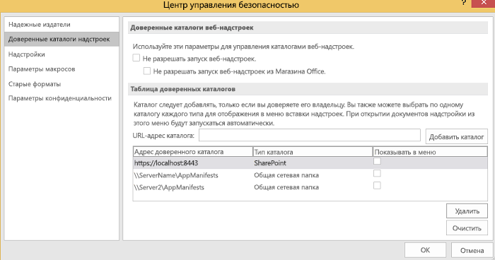
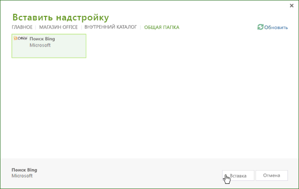
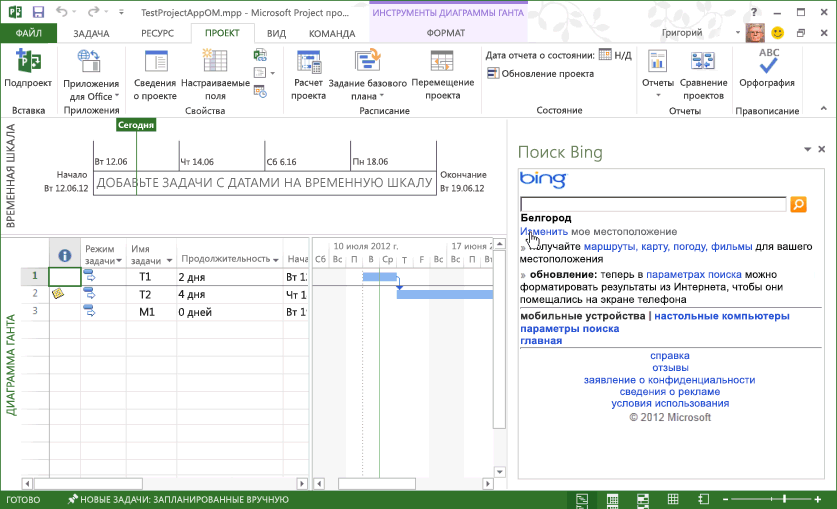

# <a name="task-pane-add-ins-for-project"></a>Надстройки области задач для Project

Project стандартный 2013 и Project профессиональный 2013 (версии 15.1 или более поздней) поддерживают надстройки области задач. Вы можете запускать стандартные надстройки области задач, разработанные для Word и Excel. Вы также можете разрабатывать собственные надстройки, которые обрабатывают события выбора в Project и интегрируют данные задачи, ресурса, представления и другие данные уровня ячейки в проект со списками SharePoint, надстройками SharePoint, веб-частями, веб-службами и корпоративными приложениями.

> [!NOTE]
> [Загружаемый пакет SDK Project 2013](https://www.microsoft.com/download/details.aspx?id=30435%20) включает в себя примеры надстроек, показывающие, как использовать объектную модель надстроек для Project и как использовать службу OData для отчетности в Project Server 2013. При извлечении и установке пакета SDK см. подкаталог `\Samples\Apps\`.

Общие сведения о надстройках Office см. в статье [Обзор платформы надстроек Office](../overview/office-add-ins.md).

## <a name="add-in-scenarios-for-project"></a>Сценарии надстроек для Project

Руководители проектов могут использовать надстройки области задач Project, чтобы упростить управление проектом. Вместо переключения из Project и открытия другого приложения для поиска часто используемой информации, руководители проектов могут осуществлять прямой доступ к этой информации в Project. Контент в надстройке области задач может быть контекстно-зависимым на основании выбранной задачи, ресурсов, представления или других данных из ячейки на диаграмме Ганта, в представлении использования задач или представлении использования ресурсов.

> [!NOTE]
> С помощью Project профессиональный 2013 вы можете разрабатывать надстройки области задач, которые получают доступ к Project в Интернете, локальным установкам Project Server 2013, а также SharePoint 2013 в локальной среде и в сети. Project стандартный 2013 не поддерживает прямую интеграцию с данными Project Server или списками задач SharePoint, синхронизированными с Project Server.

Возможны следующие сценарии использования надстроек для Project.

- **Составление графика проекта**. Просматривайте данные из связанных проектов, которые могут затрагивать график. Надстройка области задач может интегрировать необходимые данные из других проектов в Project Server 2013. Например, вы можете просматривать наборы проектов и даты этапов разработки для подразделений или просматривать данные на определенную дату из других проектов, основанных на выбранном настраиваемом поле.

- **Управление ресурсами**. Просматривайте полный пул ресурсов в Project Server 2013 или подмножество, основанное на указанных навыках, включая данные о затратах и доступность ресурсов, чтобы подобрать необходимые ресурсы.

- **Определение состояния и утверждения**. Используйте веб-приложение в надстройке области задач, чтобы обновить или просмотреть данные из внешнего приложения планирования ресурсов предприятия (ERP), системы управления расписаниями или приложения учета. Либо создайте настраиваемую веб-часть утверждения состояния, которую можно использовать как в Project Web App, так и в Project профессиональный 2013.

- **Общение в группе**. Взаимодействуйте с членами команды и ресурсами непосредственно из надстройки области задач в рамках контекста проекта. Либо с легкостью ведите для себя контекстно-зависимые заметки по мере работы над проектом.

- **Рабочие пакеты**. Выполняйте поиск определенных видов шаблонов проектов в библиотеках SharePoint и коллекциях шаблонов в Интернете. Например, выполняйте поиск шаблонов для строительных проектов и добавляйте их в коллекцию шаблонов Project.

- **Связанные элементы**. Просматривайте метаданные, документы и сообщения, связанные с определенными задачами в плане проекта. Например, вы можете использовать Project профессиональный 2013 для управления проектом, импортированным из списка задач SharePoint, и одновременно синхронизировать этот список задач с изменениями в проекте. Надстройка области задач может отображать дополнительные поля или метаданные, которые не были импортированы Project для задач в списке SharePoint.

- **Использование объектных моделей Project Server**. Используйте GUID выбранной задачи с методами в интерфейсе Project Server (PSI) или клиентской объектной модели (CSOM) Project Server. Например, веб-приложение для надстройки может считывать и обновлять данные определения состояния для выбранной задачи или выбранного ресурса либо осуществлять интеграцию с внешним приложением управления расписаниями.

- **Получение данных отчетов**. Используйте запросы REST, JavaScript или LINQ, чтобы найти связанные сведения для выбранной задачи или выбранного ресурса в службе OData для отчетных таблиц в Project Web App. Запросы, использующие службу OData, можно выполнять с помощью интернет-версии или локальной установки Project Server 2013.

    Пример представлен в статье [Создание надстройки Project, использующей REST с локальной службой OData Project Server](../project/create-a-project-add-in-that-uses-rest-with-an-on-premises-odata-service.md).

## <a name="developing-project-add-ins"></a>Разработка надстроек для Project

Библиотека JavaScript для надстройки для Project содержит расширения псевдонима пространства имен  **Office**, позволяющие разработчикам осуществлять доступ к свойствам приложения Project, а также задач, ресурсов и представлений в проекте. Расширения библиотеки JavaScript в файле Project-15.js используются в надстройке для Project, созданной с использованием Visual Studio 2015. Office.js, Office.debug.js, Project-15.js, Project-15.debug.js и другие связанные файлы также предоставлены в загружаемом пакете SDK Project 2013.

Чтобы создать надстройку, вы можете использовать простой текстовый редактор для создания веб-страницы HTML, а также связанных файлов JavaScript, файлов CSS и запросов REST. Кроме HTML-страницы или веб-приложения, для конфигурации надстройки требуется XML-файл манифеста. Project может использовать файл манифеста, который включает в себя атрибут **type**, указанный в виде  **TaskPaneExtension**. Файл манифеста может использоваться несколькими клиентскими приложениями Office 2013, либо вы можете создать файл манифеста специально для Project 2013. Подробнее см. в разделе _Основы разработки_ статьи [Обзор платформы надстроек Office](../overview/office-add-ins.md).

При установке загружаемого пакета SDK для Project 2013 подкаталог `\Samples\Apps\` содержит следующие примеры надстроек:

- **Поиск Bing**. Файл манифеста BingSearch.xml указывает на страницу поиска Bing для мобильных устройств. Поскольку в Интернете уже присутствует веб-приложение Bing, надстройка поиска Bing не использует другие файлы исходного кода или объектную модель надстроек для Project.

- **Тест объектной модели Project**. Вместе файл манифеста JSOM_SimpleOMCalls.xml и файл JSOM_Call.html представляют собой пример, тестирующий объектную модель и функциональные возможности надстройки в Project 2013. HTML-файл ссылается на файл JSOM_Sample.js, функции JavaScript которого используют файл Office.js и файлы Project-15.js для реализации основных функциональных возможностей. Загружаемый пакет SDK включает в себя все необходимые файлы исходного кода и XML-файл манифеста надстройки теста объектной модели Project. Разработка и установка примера теста объектной модели Project описана в статье [Создание первой надстройки области задач для Project 2013 с помощью текстового редактора](../project/create-your-first-task-pane-add-in-for-project-by-using-a-text-editor.md).

- **HelloProject_OData**. Это решение Visual Studio для Project профессиональный 2013, которое формирует сводные данные по активному проекту, например, сведения о стоимости, работе и проценте завершения, а также сравнивает их со средними показателями для всех опубликованных проектов в том экземпляре Project Web App, где хранится активный проект. Разработка, установка и тестирование примера, использующего протокол REST в службе  **ProjectData** в Project Web App, описаны в статье [Создание надстройки Project, использующей REST с локальной службой OData Project Server](../project/create-a-project-add-in-that-uses-rest-with-an-on-premises-odata-service.md).

### <a name="creating-an-add-in-manifest-file"></a>Создание файла манифеста надстройки

Файл манифеста указывает URL-адрес веб-страницы надстройки или веб-приложения, вид надстройки (надстройка области задач для Project), дополнительные URL-адреса контента для других языков и региональных параметров и другие свойства.

### <a name="procedure-1-to-create-the-add-in-manifest-file-for-bing-search"></a>Процедура 1. Создание файла манифеста для надстройки поиска Bing

- Создайте XML-файл в локальном каталоге. Этот XML-файл включает в себя элемент  **OfficeApp** и дочерние элементы, описанные в статье [XML-манифест надстроек для Office](../develop/add-in-manifests.md). Например, создайте файл BingSearch.xml со следующим XML-кодом.

    ```XML
    <?xml version="1.0" encoding="utf-8"?>
    <OfficeApp xmlns="http://schemas.microsoft.com/office/appforoffice/1.0"
                xmlns:xsi="https://www.w3.org/2001/XMLSchema-instance"
              xsi:type="TaskPaneApp">
      <Id>1234-5678</Id>
      <Version>15.0</Version>
      <ProviderName>Microsoft</ProviderName>
      <DefaultLocale>en-us</DefaultLocale>
      <DisplayName DefaultValue="Bing Search">
      </DisplayName>
      <Description DefaultValue="Search selected data on Bing">
      </Description>
      <IconUrl DefaultValue="http://officeimg.vo.msecnd.net/_layouts/images/general/office_logo.jpg">
      </IconUrl>
      <Capabilities>
        <Capability Name="Project"/>
      </Capabilities>
      <DefaultSettings>
        <SourceLocation DefaultValue="http://m.bing.com">
        </SourceLocation>
      </DefaultSettings>
      <Permissions>ReadWriteDocument</Permissions>
    </OfficeApp>
    ```

- Ниже приведены обязательные элементы манифеста надстройки:
  - Атрибут  `xsi:type="TaskPaneApp"` в элементе **OfficeApp** указывает, что эта надстройка относится к типу области задач.
  - Элемент  **Id** является UUID и должен быть уникальным.
  - Элемент  **Version** указывает версию надстройки. Элемент **ProviderName** указывает название компании или имя разработчика, предоставивших надстройку. Элемент **DefaultLocale** указывает язык и региональные параметры по умолчанию для строк манифеста.
  - Элемент  **DisplayName** представляет собой имя, отображаемое в раскрывающемся списке **Надстройка области задач** на вкладке **Вид** ленты Project 2013. Это значение может содержать до 32 символов.
  - Элемент  **Description** содержит описание надстройки на языке по умолчанию. Это значение может содержать до 2000 символов.
  - Элемент  **Capabilities** содержит один или несколько дочерних элементов **Capability**, указывающих ведущее приложение.
  - Элемент  **DefaultSettings** включает в себя элемент **SourceLocation**, который указывает путь к HTML-файлу в общей папке или URL-адрес веб-страницы, используемой надстройкой. Надстройка области задач игнорирует элементы  **RequestedHeight** и **RequestedWidth**.
  - Элемент **IconUrl** является необязательным. Он может быть значком в общей папке или URL-адресом значка в веб-приложении.

- (Необязательно) Добавьте элементы  **Override**, имеющие значения для других региональных параметров и языка. Например, следующий манифест предоставляет элементы  **Override** для значений **DisplayName**,  **Description**,  **IconUrl** и **SourceLocation** для французского языка.

    ```XML
    <?xml version="1.0" encoding="utf-8"?>
    <OfficeApp xmlns="http://schemas.microsoft.com/office/appforoffice/1.0"
                xmlns:xsi="https://www.w3.org/2001/XMLSchema-instance"
              xsi:type="TaskPaneApp">
      <Id>1234-5678</Id>
      <Version>15.0</Version>
      <ProviderName>Microsoft</ProviderName>
      <DefaultLocale>en-us</DefaultLocale>
      <DisplayName DefaultValue="Bing Search">
        <Override Locale="fr-fr" Value="Bing Search"/>
      </DisplayName>
      <Description DefaultValue="Search selected data on Bing">
        <Override Locale="fr-fr" Value="Search selected data on Bing"></Override>
      </Description>
      <IconUrl DefaultValue="http://officeimg.vo.msecnd.net/_layouts/images/general/office_logo.jpg">
        <Override Locale="fr-fr" Value="http://officeimg.vo.msecnd.net/_layouts/images/general/office_logo.jpg"/>
      </IconUrl>
      <Capabilities>
        <Capability Name="Project"/>
      </Capabilities>
      <DefaultSettings>
        <SourceLocation DefaultValue="http://m.bing.com">
          <Override Locale="fr-fr" Value="http://m.bing.com"/>
        </SourceLocation>
      </DefaultSettings>
      <Permissions>ReadWriteDocument</Permissions>
    </OfficeApp>
    ```

## <a name="installing-project-add-ins"></a>Установка надстроек Project

В Project 2013 вы можете устанавливать надстройки в виде изолированных решений в общей папке или в частном каталоге надстроек. Вы также можете просматривать и приобретать надстройки в AppSource.

Общая папка может содержать несколько XML-файлов манифестов и несколько подкаталогов. Вы можете добавлять и удалять каталоги для хранения манифестов с помощью вкладки  **Надежные каталоги надстроек** диалогового окна **Центр управления безопасностью** в Project 2013. Для отображения надстройки в Project элемент **SourceLocation** в манифесте должен указывать на существующий веб-сайт или исходный HTML-файл.

> [!NOTE]
> Требуется установленный браузер Internet Explorer 9 (или более поздней версии), который может и не использоваться по умолчанию. Приложениям Надстройки Office необходимы компоненты Internet Explorer 9. В качестве браузера по умолчанию может выступать Internet Explorer 9, Safari 5.0.6, Firefox 5, Chrome 13 или один из этих браузеров более поздней версии.

В процедуре 2 надстройка поиска Bing устанавливается на локальный компьютер с установленным Project 2013. Однако из-за того, что инфраструктура надстроек не использует локальные пути для файлов, такие как  `C:\Project\AppManifests`, вы можете создать на локальном компьютере сетевую папку. При необходимости вы можете создать общую папку на удаленном компьютере.

### <a name="procedure-2-to-install-the-bing-search-add-in"></a>Процедура 2. Установка надстройки поиска Bing

1. Создайте локальный каталог для манифестов надстроек. Например, создайте каталог  `C:\Project\AppManifests`.

2. Разрешите для каталога  `C:\Project\AppManifests` общий доступ с именем AppManifests, чтобы сетевой путь к общей папке выглядел следующим образом: `\\ServerName\AppManifests`.

3. Скопируйте файл манифеста BingSearch.xml в каталог  `C:\Project\AppManifests`.

4. В Project 2013 откройте диалоговое окно  **Параметры Project**, выберите  **Центр управления безопасностью** и затем **Параметры центра управления безопасностью**.

5. В диалоговом окне  **Центр управления безопасностью** выберите в левой области **Надежные каталоги надстроек**.

6. В области  **Надежные каталоги надстроек** (см. рис. 1) добавьте путь `\\ServerName\AppManifests` в текстовое поле **URL-адрес каталога**, выберите элемент  **Добавить каталог** и нажмите кнопку **ОК**.

    > [!NOTE]
    > На рис. 1 показаны две общие папки и один гипотетический URL-адрес частного каталога в списке **Адрес доверенного каталога**. Только одна общая папка может использоваться по умолчанию, и только один URL-адрес может указывать каталог по умолчанию. Например, если сделать `\\Server2\AppManifests` папкой по умолчанию, то Project снимет флажок **По умолчанию** для папки `\\ServerName\AppManifests`. Если выделение по умолчанию будет изменено, вы можете нажать кнопку **Очистить**, чтобы удалить установленные надстройки, а затем перезапустить Project. Если вы добавите надстройку в общую папку по умолчанию или каталог SharePoint при запущенном приложении Project, необходимо перезапустить Project.

    *Рис. 1. Добавление каталогов с манифестами надстроек с помощью центра управления безопасностью*

    

7. На ленте  **Project** выберите раскрывающееся меню **Apps Надстройки Office** и выберите элемент **Просмотреть все**. В диалоговом окне  **Вставка надстройки** выберите **ОБЩАЯ ПАПКА** (см. рис. 2).

    *Рис. 2. Запуск надстройки, расположенной в общей папке*

    

8. Выберите надстройку поиска Bing и нажмите кнопку  **Вставить**.

    Надстройка поиска Bing отображается в области задач, как показано на рисунке 3. Вы можете вручную изменить размер области задач и использовать надстройку поиска Bing.

    *Рис. 3. Использование приложения поиска Bing*

    

## <a name="distributing-project-add-ins"></a>Распространение надстроек Project

Вы можете распространять надстройки через общую папку, каталог приложений в библиотеке SharePoint или AppSource. Дополнительные сведения см. в статье [Публикация надстройки Office](../publish/publish.md).

## <a name="see-also"></a>См. также

- [Обзор платформы надстроек Office](../overview/office-add-ins.md)
- [XML-манифест надстройки Office](../develop/add-in-manifests.md)
- [API JavaScript для Office](/office/dev/add-ins/reference/javascript-api-for-office)
- [Создание первой надстройки области задач для Project 2013 с помощью текстового редактора](create-your-first-task-pane-add-in-for-project-by-using-a-text-editor.md)
- [Создание надстройки Project, использующей REST с локальной службой OData Project Server](create-a-project-add-in-that-uses-rest-with-an-on-premises-odata-service.md)
- [Загрузка пакета SDK для Project 2013](https://www.microsoft.com/download/details.aspx?id=30435%20)
