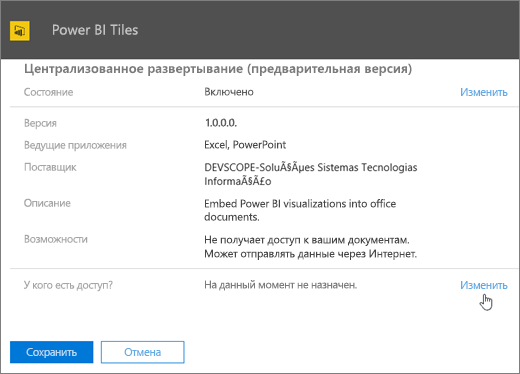
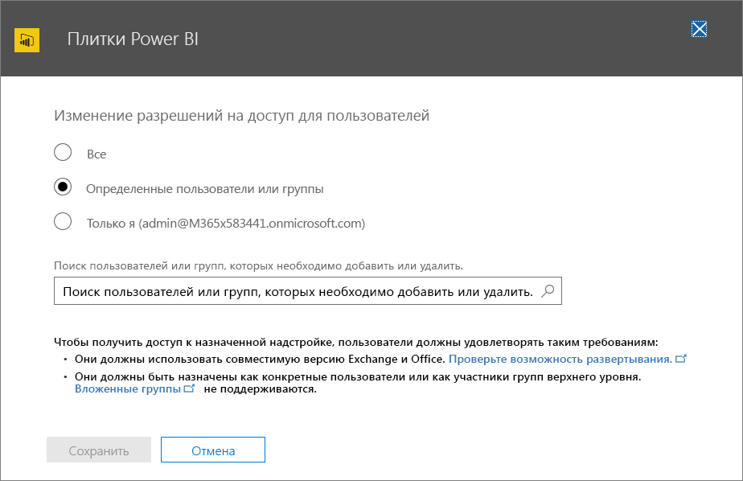

# Публикация надстроек Office с использованием централизованного развертывания в Центре администрирования Office 365Publish Office Add-ins using Centralized Deployment via the Office 365 admin center

С помощью Центра администрирования Office 365 администраторы могут с легкостью развертывать надстройки Office для пользователей и групп в организации. В этом случае надстройки становятся доступны в приложениях Office сразу. Настраивать клиенты не требуется. Используя централизованное развертывание, можно развертывать как внутренние надстройки, так и те, что предоставляются независимыми поставщиками программного обеспечения.The Office 365 admin center makes it easy for an administrator to deploy Office Add-ins to users and groups within their organization. Add-ins deployed via the admin center are available to users in their Office applications right away, with no client configuration required. You can use Centralized Deployment to deploy internal add-ins as well as add-ins provided by ISVs.

В настоящее время Центр администрирования Office 365 поддерживает указанные ниже сценарии.The Office 365 admin center currently supports the following scenarios:

- Централизованное развертывание новых и обновленных надстроек для отдельных пользователей, групп или организации.Centralized Deployment of new and updated add-ins to individuals, groups, or an organization.
- Развертывание нескольких платформ, в том числе Windows и Office Online. В дальнейшем будет добавлена поддержка Mac.Deployment to multiple platforms, including Windows and Office Online, with Mac coming soon.
- Развертывание на клиентах на английском и других языках.Deployment to English language and worldwide tenants.
- Развертывание надстроек, размещаемых в облаке.Deployment of cloud-hosted add-ins.
- Развертывание надстроек, размещаемых в брандмауэре.Deployment of add-ins that are hosted within a firewall.
- Развертывание надстроек AppSource.Deployment of AppSource add-ins.
- Автоматическая установка надстройки для пользователей при запуске приложения Office.Automatic installation of an add-in for users when they launch the Office application.
- Автоматическое удаление надстройки для пользователей, если администратор отключит или удалит ее либо пользователь будет удален из службы Azure Active Directory или группы, в которой была развернута надстройка.Automatic removal of an add-in for users if the admin turns off or deletes the add-in, or if users are removed from Azure Active Directory or from a group to which the add-in has been deployed.

Централизованное развертывание — рекомендуемый для администраторов Office 365 способ развертывания надстроек Office в организации при условии, что организация отвечает всем требованиям для использования централизованного развертывания.Centralized Deployment is the recommended way for an Office 365 admin to deploy Office add-ins within an organization, provided that the organization meets all requirements for using Centralized Deployment. Сведения о том, как определить, можно ли использовать централизованное развертывание в вашей организации, см. в статье [Оценка соответствия организации Office 365 требованиям для централизованного развертывания надстроек](https://support.office.com/en-us/article/Determine-if-Centralized-Deployment-of-add-ins-works-for-your-Office-365-organization-B4527D49-4073-4B43-8274-31B7A3166F92).For information about how to determine if your organization can use Centralized Deployment, see [Determine if Centralized Deployment of add-ins works for your Office 365 organization](https://support.office.com/en-us/article/Determine-if-Centralized-Deployment-of-add-ins-works-for-your-Office-365-organization-B4527D49-4073-4B43-8274-31B7A3166F92).

> [!NOTE]
> В локальной среде без подключения к Office 365, а также для развертывания надстроек SharePoint или Office, рассчитанных на Office 2013, используйте [каталог надстроек SharePoint](publish-task-pane-and-content-add-ins-to-an-add-in-catalog.md).In an on-premises environment with no connection to Office 365, or to deploy SharePoint add-ins or Office Add-ins that target Office 2013, use a [SharePoint add-in catalog](publish-task-pane-and-content-add-ins-to-an-add-in-catalog.md). Для развертывания надстроек COM и VSTO используйте ClickOnce или установщик Windows, как описано в статье [Развертывание решения Office](https://msdn.microsoft.com/en-us/library/bb386179.aspx).To deploy COM/VSTO add-ins, use ClickOnce or Windows Installer, as described in [Deploying an Office solution](https://msdn.microsoft.com/en-us/library/bb386179.aspx).

## Рекомендуемый подход к развертыванию надстроек OfficeRecommended approach for deploying Office Add-ins

Во избежание проблем развертывание надстроек Office можно производить поэтапно. Мы рекомендуем следующий план.Consider deploying Office Add-ins in a phased approach to help ensure that the deployment goes smoothly. We recommend the following plan:

1. Разверните надстройку для небольшой группы заинтересованных лиц и сотрудников ИТ-отдела.Deploy the add-in to a small set of business stakeholders and members of the IT department. Если развертывание прошло успешно, переходите к этапу 2.If the deployment is successful, move on to step 2.

2. Разверните надстройку для большей группы пользователей в предприятии, которые будут работать с надстройкой.Deploy the add-in to a larger set of individuals within the business who will be using the add-in. Если развертывание прошло успешно, переходите к этапу 3.If the deployment is successful, move on to step 3.

3. Разверните надстройку для всех пользователей, которые будут работать с надстройкой.Deploy the add-in to the full set of individuals who will be using the add-in.

В зависимости от размера целевой аудитории может потребоваться добавить или убрать этапы этой процедуры.Depending on the size of the target audience, you may want to add steps to or remove steps from this procedure.

## Публикация надстройки Office путем централизованного развертыванияPublish an Office Add-in via Centralized Deployment

Прежде чем приступать к работе, убедитесь, что организация отвечает всем требованиям для использования централизованного развертывания, как описано в статье [Оценка соответствия организации Office 365 требованиям для централизованного развертывания надстроек](https://support.office.com/en-us/article/Determine-if-Centralized-Deployment-of-add-ins-works-for-your-Office-365-organization-B4527D49-4073-4B43-8274-31B7A3166F92).Before you begin, confirm that your organization meets all requirements for using Centralized Deployment, as described in [Determine if Centralized Deployment of add-ins works for your Office 365 organization](https://support.office.com/en-us/article/Determine-if-Centralized-Deployment-of-add-ins-works-for-your-Office-365-organization-B4527D49-4073-4B43-8274-31B7A3166F92).

Если организация отвечает всем требованиям, выполните указанные ниже действия, чтобы опубликовать надстройку Office путем централизованного развертывания.If your organization meets all requirements, complete the following steps to publish an Office Add-in via Centralized Deployment:

1. Войдите в Office 365 с рабочей или учебной учетной записью.Sign in to Office 365 with your work or school account.
2. В левом верхнем углу нажмите значок средства запуска приложений и выберите элемент **Администратор**.Select the app launcher icon in the upper-left and choose **Admin**.
3. В меню навигации выберите **Параметры** > **Службы и надстройки**.In the navigation menu, choose **Settings** > **Services & add-ins**.
4. Если в верхней части страницы появится сообщение о новом Центре администрирования Office 365, нажмите его, чтобы перейти к ознакомительной версии центра администрирования (см. статью [О Центре администрирования Office 365](https://support.office.com/en-ie/article/About-the-Office-365-admin-center-758befc4-0888-4009-9f14-0d147402fd23)).If you see a message on the top of the page announcing the new Office 365 admin center, choose the message to go to the Admin Center Preview (see [About the Office 365 admin center](https://support.office.com/en-ie/article/About-the-Office-365-admin-center-758befc4-0888-4009-9f14-0d147402fd23)).
5. В верхней части страницы нажмите **Отправить надстройку**.Choose **Upload Add-in** at the top of the page. 
6. На странице **Централизованное развертывание** выберите один из следующих вариантов:Choose one of the following options on the **Centralized Deployment** page:

    - **Я хочу добавить надстройку из AppSource.****I want to add an Add-in from AppSource.**
    - **У меня есть файл манифеста (.xml) на данном устройстве.****I have the manifest file (.xml) on this device.** Если выбран этот вариант, нажмите кнопку **Обзор**, чтобы найти нужный файл манифеста (XML).For this option, choose **Browse** to locate the manifest file (.xml) that you want to use.
    - **У меня есть URL-адрес для файла манифеста.****I have a URL for the manifest file.** Если выбран этот вариант, укажите URL-адрес манифеста в предоставленном поле.For this option, type the manifest's URL in the field provided.

    

7.  Нажмите кнопку **Далее**.Choose **Next**.

8.  Если добавляется надстройка из AppSource, выберите ее.If you selected the option to add an Add-in from AppSource, select the add-in. Обратите внимание на то, что вы можете просматривать доступные надстройки по категориям **Рекомендуемое**, **Оценка** и **Имя**.Notice that you can view available add-ins via categories of **Suggested for you**, **Rating**, or **Name**. Из AppSource можно добавлять только бесплатные надстройки. В настоящее время добавление платных надстроек не поддерживается.You may only add free add-ins from AppSource; adding paid add-ins isn't currently supported.

    > [!NOTE]
    > Если выбран вариант с AppSource, то обновления и улучшения надстройки будут автоматически предоставляться пользователям без вашего вмешательства.With the AppSource option, updates and enhancements to the add-in will automatically be made available to users without your intervention.

    

9. Надстройка теперь доступна для назначения.The add-in is now available for assignment. На странице надстройки отображается состояние **Включено**, аналогичное тому, которое показано на приведенном ниже экранном снимке для надстройки Power BI Tiles.On the page for the add-in, its status is **On**, like that shown for the Power BI Tiles add-in in the screenshot below. В разделе **У кого есть доступ** нажмите **Изменить**, чтобы назначить надстройку пользователям и/или группам.In the **Who has access** section, choose **Edit** to assign the add-in to users and/or groups.

    

10. На странице **Изменение разрешений на доступ для пользователей** выберите пункт **Все** или **Определенные пользователи или группы**.On the **Edit who has access page**, choose either **Everyone** or **Specific Users/Groups**. С помощью поля поиска найдите пользователей и/или группы, для которых нужно развернуть надстройку.Use the Search box to find the users and/or groups to whom you want to deploy the add-in.

    

    > [!NOTE]
    > В случае надстроек, для которых возможен единый вход, назначенным пользователям и группам также будет предоставлен доступ к надстройкам с таким же идентификатором приложения Azure.For single sign-on (SSO) add-ins, the users and groups assigned will also be shared with add-ins that share the same Azure App ID. Все изменения, касающиеся назначений пользователей, также будут применяться к этим надстройкам. На этой странице будут показаны связанные надстройки.Any changes to user assignments will also apply to those add-ins. The related add-ins will be shown on this page. На этой странице отображается список разрешений Microsoft Graph, необходимых надстройке, только для надстроек с поддержкой единого входа.For SSO add-ins only, this page will display the list of Microsoft Graph permissions that the add-in requires.

11. По завершении нажмите **Сохранить**, просмотрите параметры надстройки и нажмите кнопку **Закрыть**.When finished, choose **Save**, review the add-in settings, and then choose **Close**. Теперь надстройка будет отображаться вместе с другими приложениями в Office 365.You now see your add-in along with other apps in Office 365.

    > [!NOTE]
    >  Когда администратор нажимает кнопку **Сохранить**, предоставляется согласие для всех пользователей.When an administrator chooses **Save**, consent is given for all users. 

    

> [!TIP]
> При развертывании новой надстройки для пользователей и/или групп в организации рекомендуем отправлять им электронные сообщения с указаниями по использованию надстройки и ссылками на соответствующие разделы справки, часто задаваемые вопросы и другие вспомогательные ресурсы.When you deploy a new add-in to users and/or groups in your organization, consider sending them an email that describes when and how to use the add-in, and includes links to relevant Help content, FAQs, or other support resources.

## Рекомендации по предоставлению доступа к надстройкеConsiderations when granting access to an add-in

Администраторы могут назначить надстройку всем или только определенным пользователям и/или группам в организации.Admins can assign an add-in to everyone in the organization or to specific users and/or groups within the organization. В приведенном ниже списке описываются последствия выбора каждого из вариантов.The following list describes the implications of each option:

- **Все**. Как понятно из названия, надстройка назначается всем пользователям в клиенте.**Everyone**: As the name implies, this option assigns the add-in to every user in the tenant. Используйте этот вариант осторожно и только для тех надстроек, которые действительно применяются во всей организации.Use this option sparingly and only for add-ins that are truly universal to your organization.

- **Пользователи**. Если назначить надстройку отдельным пользователям, вам придется обновлять параметры централизованного развертывания надстройки каждый раз, когда нужно назначить ее дополнительным пользователям.**Users**: If you assign an add-in to individual users, you'll need to update the Central Deployment settings for the add-in each time you want to assign it additional users. Параметры централизованного развертывания придется обновлять каждый раз, когда нужно запретить пользователю доступ к надстройке.Likewise, you'll need to update the Central Deployment settings for the add-in each time you want to remove a user's access to the add-in.

- **Группы**. Если назначить надстройку группе, члены этой группы автоматически получат доступ к ней.**Groups**: If you assign an add-in to a group, users who are added to the group will automatically be assigned the add-in. При удалении пользователя из группы он автоматически теряет доступ к надстройке.Likewise, when a user is removed from a group, the user automatically loses access to the add-in. В обоих случаях от администратора Office 365 не требуется никаких действий.In either case, no additional action is required from the Office 365 admin.

В общем случае для простоты обслуживания рекомендуем по мере возможности назначать надстройки группам.In general, for ease of maintenance, we recommend assigning add-ins by using groups whenever possible. Однако в тех случаях, когда надстройка должна быть доступна узкому кругу пользователей, может быть практичнее назначить ее определенным пользователям.However, in situations where you want to restrict add-in access to a very small number of users, it may be more practical to assign the add-in to specific users. 

## Состояния надстроекAdd-in states

В приведенной ниже таблице описываются различные состояния надстройки.The following table describes the different states of an add-in.

|СостояниеState|ПричиныHow the state occurs|ВлияниеImpact|
|-----|--------------------|------|
|**Активна****Active**|Администратор отправил надстройку и назначил ее пользователям и/или группам.Admin uploaded the add-in and assigned it to users and/or groups.|Надстройка видна назначенным пользователям и/или группам в соответствующих клиентах Office.Users and/or groups assigned to the add-in see it in the relevant Office clients.|
|**Отключена****Turned off**|Администратор отключил надстройку.Admin turned off the add-in.|Надстройка недоступна назначенным пользователям и/или группам.Users and/or groups assigned to the add-in no longer have access to it. Если состояние **Отключена** надстройки поменялось на **Активна**, то она снова доступна пользователям и группам.If the add-in state is changed from **Turned off** to **Active**, the users and groups will regain access to it.|
|**Удалена****Deleted**|Администратор удалил надстройку.Admin deleted the add-in.|Надстройка недоступна назначенным пользователям и/или группам.Users and/or groups assigned the add-in no longer have access to it.|

## Обновление надстроек Office, опубликованных с использованием централизованного развертыванияUpdating Office Add-ins that are published via Centralized Deployment

После публикации надстройки Office путем централизованного развертывания все изменения, внесенные в веб-приложение надстройки, автоматически становятся доступны всем пользователям сразу после их реализации в веб-приложении.After an Office Add-in has been published via Centralized Deployment, any changes made to the add-in's web application will automatically be available to all users as soon as those changes are implemented in the web application. Изменения, внесенные в [XML-файл манифеста](../develop/add-in-manifests.md) надстройки (например, обновление значка, текста или команд надстройки), выполняются следующим образом:Changes made to an add-in's [XML manifest file](../develop/add-in-manifests.md), for example, to update the add-in's icon, text, or add-in commands, happen as follows:

- **Бизнес-надстройка**. Если администратор явно отправил файл манифеста при реализации централизованного развертывания в Центре администрирования Office 365, то администратор должен отправить новый файл манифеста, содержащий нужные изменения.**Line-of-business add-in**: If an admin explicitly uploaded a manifest file when implementing Centralized Deployment via the Office 365 admin center, the admin must upload a new manifest file that contains the desired changes. После отправки обновленного файла манифеста надстройка обновится при следующем запуске соответствующего приложения Office.After the updated manifest file has been uploaded, the next time the relevant Office applications start, the add-in will update.

- **Надстройка AppSource.** Если администратор выбрал надстройку из AppSource во время реализации централизованного развертывания в Центре администрирования Office 365 и надстройка обновилась в AppSource, она обновится при следующем запуске соответствующего приложения Office.**AppSource add-in**: If an admin selected an add-in from AppSource when implementing Centralized Deployment via the Office 365 admin center, and the add-in updates in AppSource, the add-in will update later via Centralized Deployment. The next time the relevant Office applications start, the add-in will update.

## Работа пользователей с надстройкамиEnd user experience with add-ins

После публикации надстройки с применением централизованного развертывания пользователи могут приступить к работе с ней на любой платформе, которую поддерживает надстройка.After an add-in has been published via Centralized Deployment, end users may start using it on any platform that the add-in supports. 

Если в надстройке предусмотрена поддержка команд надстройки, они отображаются на ленте приложения Office для всех пользователей, для которых развернута эта надстройка.If the add-in supports add-in commands, the commands will appear on the Office application ribbon for all users to whom the add-in is deployed. В приведенном ниже примере команда **Search Citation** (Поиск ссылки) отображается на ленте для надстройки **Citations** (Ссылки).In the following example, the command **Search Citation** appears in the ribbon for the **Citations** add-in. 

Если команды надстройки не поддерживаются, пользователи могут добавить надстройку в свое приложение Office, выполнив указанные ниже действия.If the add-in does not support add-in commands, users can add it to their Office application by doing the following:

1.  В Word 2016, Excel 2016 или PowerPoint 2016 выберите **Вставка** > **Мои надстройки**.In Word 2016, Excel 2016, or PowerPoint 2016, choose **Insert** > **My Add-ins**.
2.  В окне надстройки перейдите на вкладку **Управляемые администратором**.Choose the **Admin Managed** tab in the add-in window.
3.  Выберите нужную надстройку и нажмите **Добавить**.Choose the add-in, and then choose **Add**. 

    
    
Однако для Outlook пользователи могут выполнить следующие действия.However, for Outlook, users can do the following:

1.  В Outlook 2016 выберите **Главная** > **Магазин**.In Outlook 2016, choose **Home** > **Store**.
2.  Выберите элемент **Управляется администратором** под вкладкой надстройки.Choose the **Admin-managed** item under the add-in tab.
3.  Выберите нужную надстройку и нажмите **Добавить**.Choose the add-in, and then choose **Add**.

    

## См. такжеSee also
[Определите возможность централизованного развертывания надстроек для Office 365 в вашей организацииDetermine if Centralized Deployment of add-ins works for your Office 365 organization](https://support.office.com/en-us/article/Determine-if-Centralized-Deployment-of-add-ins-works-for-your-Office-365-organization-b4527d49-4073-4b43-8274-31b7a3166f92)
    
