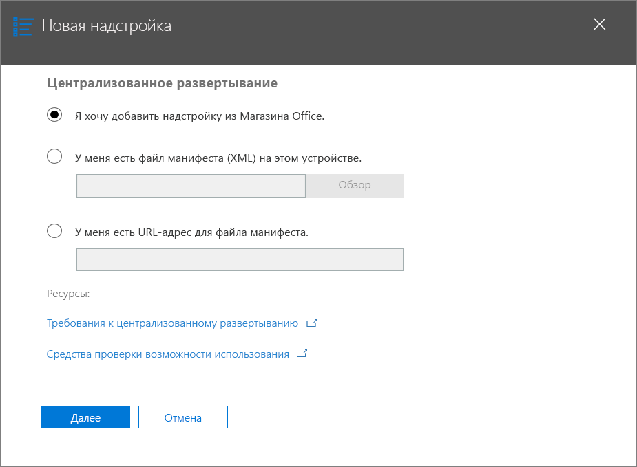
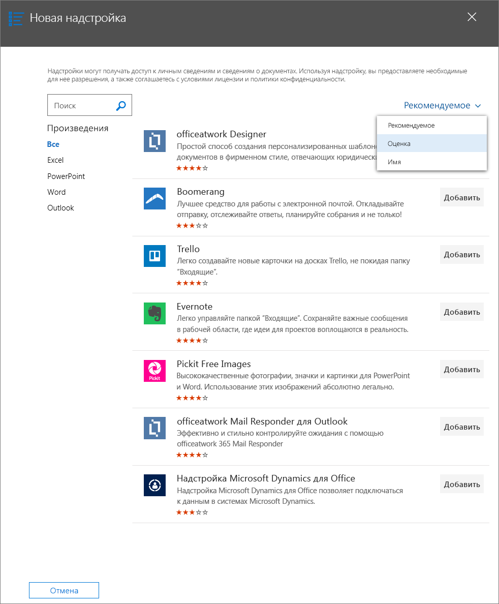
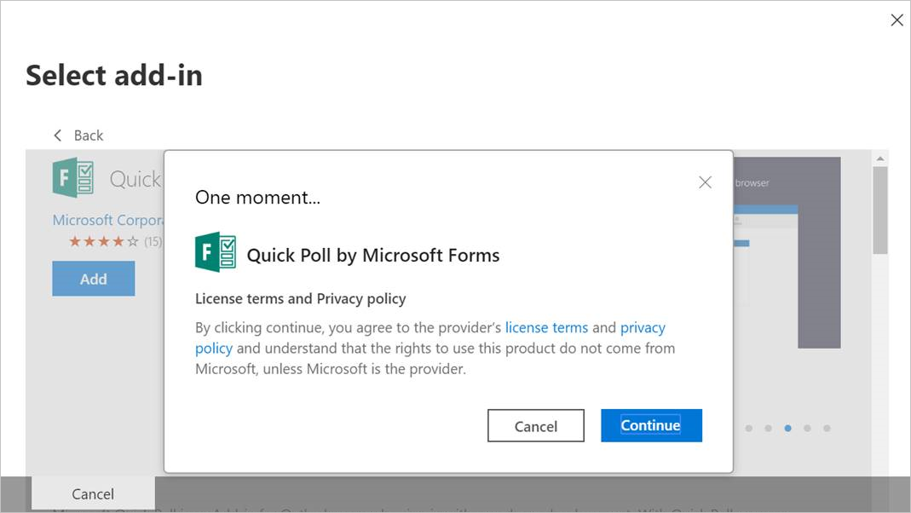
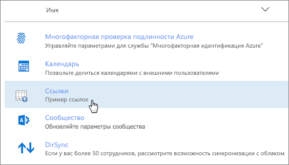
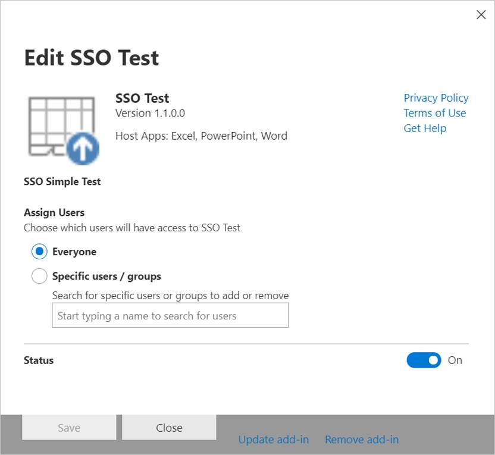
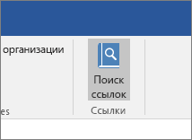
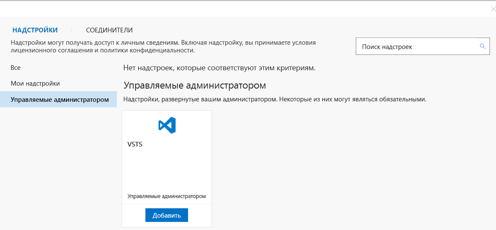

# Публикация надстроек Office с помощью централизованного развертывания с помощью центра администрирования Microsoft 365Publish Office Add-ins using Centralized Deployment via the Microsoft 365 admin center

Центр администрирования Microsoft 365 позволяет администратору развертывать надстройки Office для пользователей и групп в своей организации.The Microsoft 365 admin center makes it easy for an administrator to deploy Office Add-ins to users and groups within their organization. При развертывании с помощью Центра администрирования надстройки становятся доступны в приложениях Office немедленно. Настраивать клиенты не требуется.Add-ins deployed via the admin center are available to users in their Office applications right away, with no client configuration required. Используя централизованное развертывание, можно распространять как внутренние надстройки, так и те, что предоставляются независимыми поставщиками программного обеспечения (ISV).You can use Centralized Deployment to deploy internal add-ins as well as add-ins provided by ISVs.

В настоящее время центр администрирования Microsoft 365 поддерживает следующие сценарии.The Microsoft 365 admin center currently supports the following scenarios.

- Централизованное развертывание новых и обновленных надстроек для отдельных пользователей, групп или организации.Centralized Deployment of new and updated add-ins to individuals, groups, or an organization.
- Развертывание на нескольких клиентских платформах, в том числе Windows, Mac и Интернет.Deployment to multiple client platforms, including Windows, Mac, and the web. Для Outlook также поддерживается развертывание в iOS и Android.For Outlook, deployment to iOS and Android is also supported. (Тем **не** менее, при установке надстроек Excel, Outlook, Word и PowerPoint на iPad не поддерживается централизованное развертывание для iPad.)(However, while user installation of Excel, Outlook, Word, and PowerPoint add-ins on iPad is supported, Centralized Deployment to iPad is **not** supported.)
- Развертывание на клиентах на английском и других языках.Deployment to English language and worldwide tenants.
- Развертывание надстроек, размещаемых в облаке.Deployment of cloud-hosted add-ins.
- Развертывание надстроек, размещаемых в брандмауэре.Deployment of add-ins that are hosted within a firewall.
- Развертывание надстроек AppSource.Deployment of AppSource add-ins.
- Автоматическая установка надстройки для пользователей при запуске приложения Office.Automatic installation of an add-in for users when they launch the Office application.
- Автоматическое удаление надстройки для пользователей, если администратор отключит или удалит ее либо пользователь будет удален из службы Azure Active Directory или группы, в которой была развернута надстройка.Automatic removal of an add-in for users if the admin turns off or deletes the add-in, or if users are removed from Azure Active Directory or from a group to which the add-in has been deployed.

Централизованное развертывание — это рекомендуемый способ развертывания надстроек Office в Организации администратором Microsoft 365 при условии, что организация отвечает всем требованиям для использования централизованного развертывания.Centralized Deployment is the recommended way for a Microsoft 365 admin to deploy Office Add-ins within an organization, provided that the organization meets all requirements for using Centralized Deployment. Сведения о том, как определить, может ли Организация использовать централизованное развертывание, можно узнать [в статье определение того, работает ли централизованное развертывание надстроек для вашей организации Microsoft 365](/office365/admin/manage/centralized-deployment-of-add-ins).For information about how to determine if your organization can use Centralized Deployment, see [Determine if Centralized Deployment of add-ins works for your Microsoft 365 organization](/office365/admin/manage/centralized-deployment-of-add-ins).

> [!NOTE]
> В локальной среде без подключения к Microsoft 365, а также для развертывания надстроек SharePoint или надстроек Office, предназначенных для Office 2013, используйте [Каталог приложений SharePoint](publish-task-pane-and-content-add-ins-to-an-add-in-catalog.md).In an on-premises environment with no connection to Microsoft 365, or to deploy SharePoint add-ins or Office Add-ins that target Office 2013, use a [SharePoint app catalog](publish-task-pane-and-content-add-ins-to-an-add-in-catalog.md). Для развертывания надстроек COM и VSTO используйте ClickOnce или установщик Windows, как описано в статье [Развертывание решения Office](/visualstudio/vsto/deploying-an-office-solution).To deploy COM/VSTO add-ins, use ClickOnce or Windows Installer, as described in [Deploying an Office solution](/visualstudio/vsto/deploying-an-office-solution).

## Рекомендуемый подход к развертыванию надстроек OfficeRecommended approach for deploying Office Add-ins

Вы можете развертывать надстройки Office поэтапно, чтобы предотвратить возникновение проблем. Рекомендуем такой план:Consider deploying Office Add-ins in a phased approach to help ensure that the deployment goes smoothly. We recommend the following plan:

1. Разверните надстройку для небольшой группы заинтересованных лиц и сотрудников ИТ-отдела. Если развертывание прошло успешно, переходите к этапу 2.Deploy the add-in to a small set of business stakeholders and members of the IT department. If the deployment is successful, move on to step 2.

2. Разверните надстройку для большей группы пользователей в предприятии, которые будут работать с надстройкой. Если развертывание прошло успешно, переходите к этапу 3.Deploy the add-in to a larger set of individuals within the business who will be using the add-in. If the deployment is successful, move on to step 3.

3. Разверните надстройку для всех пользователей, которые будут работать с надстройкой.Deploy the add-in to the full set of individuals who will be using the add-in.

В зависимости от размера целевой аудитории может потребоваться добавить или убрать этапы этой процедуры.Depending on the size of the target audience, you may want to add steps to or remove steps from this procedure.

## Публикация надстройки Office путем централизованного развертыванияPublish an Office Add-in via Centralized Deployment

Прежде чем приступать к работе, убедитесь, что ваша организация отвечает всем требованиям для использования централизованного развертывания, как описано в разделе [Определение того, работает ли централизованное развертывание надстроек для вашей организации Microsoft 365](/microsoft-365/admin/manage/centralized-deployment-of-add-ins).Before you begin, confirm that your organization meets all requirements for using Centralized Deployment, as described in [Determine if Centralized Deployment of add-ins works for your Microsoft 365 organization](/microsoft-365/admin/manage/centralized-deployment-of-add-ins).

Если организация отвечает всем требованиям, выполните указанные ниже действия, чтобы опубликовать надстройку Office путем централизованного развертывания.If your organization meets all requirements, complete the following steps to publish an Office Add-in via Centralized Deployment:

1. Войдите в Microsoft 365 с помощью рабочей или учебной учетной записи.Sign in to Microsoft 365 with your work or education account.
2. В левом верхнем углу щелкните значок средства запуска приложений и выберите **Администратор**.Select the app launcher icon in the upper-left and choose **Admin**.
3. В меню навигации нажмите **Больше**, а затем выберите **Параметры** > **Службы и надстройки**.In the navigation menu, press **Show more**, then choose **Settings** > **Services & add-ins**.
4. Если в верхней части страницы отображается сообщение с сообщением о новом центре администрирования Microsoft 365, выберите сообщение, которое нужно перейти к предварительной версии центра администрирования (см. раздел [о центре администрирования microsoft 365](/microsoft-365/admin/admin-overview/about-the-admin-center)).If you see a message on the top of the page announcing the new Microsoft 365 admin center, choose the message to go to the Admin Center Preview (see [About the Microsoft 365 admin center](/microsoft-365/admin/admin-overview/about-the-admin-center)).
5. В верхней части страницы выберите **Развернуть надстройку**.Choose **Deploy Add-In** at the top of the page.
6. Просмотрев требования, нажмите кнопку **Далее**.Choose **Next** after reviewing the requirements.
7. На странице **Централизованное развертывание** выберите один из следующих вариантов:Choose one of the following options on the **Centralized Deployment** page:

    - **Я хочу добавить надстройку из Магазина Office**.**I want to add an Add-In from the Office Store.**
    - **У меня есть файл манифеста (.xml) на данном устройстве.** Если выбран этот вариант, нажмите кнопку **Обзор**, чтобы найти нужный файл манифеста (XML).**I have the manifest file (.xml) on this device.** For this option, choose **Browse** to locate the manifest file (.xml) that you want to use.
    - **У меня есть URL-адрес для файла манифеста.** Если выбран этот вариант, укажите URL-адрес манифеста в предоставленном поле.**I have a URL for the manifest file.** For this option, type the manifest's URL in the field provided.

    

8. Если добавляется надстройка из Магазина Office, выберите ее.If you selected the option to add an add-in from the Office Store, select the add-in. Вы можете просматривать доступные надстройки по категориям **Рекомендуемое**, **Оценка** и **Имя**.You can view available add-ins via categories of **Suggested for you**, **Rating**, or **Name**. Из Магазина Office можно добавлять только бесплатные надстройки.You may only add free add-ins from Office Store. Добавление платных надстроек сейчас не поддерживается.Adding paid add-ins isn't currently supported.

    > [!NOTE]
    > Если выбран вариант с Магазином Office, то обновления и улучшения надстройки автоматически предоставляются пользователям без вашего участия.With the Office Store option, updates and enhancements to the add-in are automatically available to users without your intervention.

    

9. Нажмите кнопку **Continue (продолжить** ) после просмотра сведений о надстройках, политики конфиденциальности и условий лицензионного соглашения.Choose **Continue** after reviewing the add-in details, Privacy Policy, and License Terms.

    

10. На странице **Назначение пользователей** выберите **все**, **конкретные пользователи/группы**или **только я**.On the **Assign Users** page, choose **Everyone**, **Specific Users/Groups**, or **Only me**. С помощью поля поиска найдите пользователей и группы, для которых нужно развернуть надстройку.Use the search box to find the users and groups to whom you want to deploy the add-in. Для надстроек Outlook также можно выбрать метод развертывания **fixed**, **Available**или **Optional**.For Outlook add-ins, you can also choose the deployment method **Fixed**, **Available**, or **Optional**.

    

    > [!NOTE]
    > Надстройки, использующие [единый вход в систему (SSO)](../develop/sso-in-office-add-ins.md) , будут запрашивать разрешение администратора на действия, указанные в манифесте надстройки.Add-ins that utilize [single sign-on (SSO)](../develop/sso-in-office-add-ins.md) will prompt the admin to consent to the scopes listed in the add-in manifest.  Если одна и та же служба резервного копирования используется в нескольких надстройках (для единого входа в разных надстройках используется один и тот же идентификатор приложения Azure), то для каждой надстройки будет предлагаться согласие с каждым развертыванием.If the same backing service is used across multiple add-ins (the same Azure App ID is used with SSO in different add-ins), the scopes for each add-in will be prompted for consent with each deployment. На этой странице также будет отображаться список разрешений, необходимых для надстройки.This page will also display the list of permissions that the add-in requires.

11. По завершении нажмите кнопку **развернуть**.When finished, choose **Deploy**. Этот процесс может занять до трех минут.This process may take up to three minutes. Затем нажмите кнопку **Далее**, чтобы завершить выполнение пошаговых инструкций.Then, finish the walkthrough by pressing **Next**. Теперь надстройка будет отображаться вместе с другими приложениями в Office 365.You now see your add-in along with other apps in Office 365.

    > [!NOTE]
    > Когда администратор выбирает **развертывание**, согласие предоставляется всем пользователям.When an administrator chooses **Deploy**, consent is given for all users.

    

> [!TIP]
> При развертывании новой надстройки для пользователей и/или групп в организации рекомендуем отправлять им электронные сообщения с указаниями по использованию надстройки и ссылками на соответствующие разделы справки, часто задаваемые вопросы и другие вспомогательные ресурсы.When you deploy a new add-in to users and/or groups in your organization, consider sending them an email that describes when and how to use the add-in, and includes links to relevant Help content, FAQs, or other support resources.

## Рекомендации по предоставлению доступа к надстройкеConsiderations when granting access to an add-in

Администраторы могут назначить надстройку всем или только определенным пользователям и/или группам в организации. В приведенном ниже списке описываются последствия выбора каждого из вариантов.Admins can assign an add-in to everyone in the organization or to specific users and/or groups within the organization. The following list describes the implications of each option:

- **Все.** Как следует из названия, этот вариант позволяет назначить надстройку всем пользователям в клиенте. Используйте этот вариант с осторожностью и только для надстроек, которые являются действительно универсальными для вашей организации.**Everyone**: As the name implies, this option assigns the add-in to every user in the tenant. Use this option sparingly and only for add-ins that are truly universal to your organization.

- **Пользователи**. Если назначить надстройку отдельным пользователям, вам придется обновлять параметры централизованного развертывания надстройки каждый раз, когда нужно назначить ее дополнительным пользователям. Параметры централизованного развертывания придется обновлять каждый раз, когда нужно запретить пользователю доступ к надстройке.**Users**: If you assign an add-in to individual users, you'll need to update the Central Deployment settings for the add-in each time you want to assign it additional users. Likewise, you'll need to update the Central Deployment settings for the add-in each time you want to remove a user's access to the add-in.

- **Группы**. Если назначить надстройку группе, члены этой группы автоматически получат доступ к ней.**Groups**: If you assign an add-in to a group, users who are added to the group will automatically be assigned the add-in. При удалении пользователя из группы он автоматически теряет доступ к надстройке.Likewise, when a user is removed from a group, the user automatically loses access to the add-in. В любом случае никаких дополнительных действий от администратора Microsoft 365 не нужно.In either case, no additional action is required from the Microsoft 365 admin.

В общем случае для простоты обслуживания рекомендуем по мере возможности назначать надстройки группам. Однако в тех случаях, когда надстройка должна быть доступна узкому кругу пользователей, может быть практичнее назначить ее определенным пользователям.In general, for ease of maintenance, we recommend assigning add-ins by using groups whenever possible. However, in situations where you want to restrict add-in access to a very small number of users, it may be more practical to assign the add-in to specific users.

## Состояния надстроекAdd-in states

В приведенной ниже таблице описываются различные состояния надстройки.The following table describes the different states of an add-in.

|СостояниеState|ПричиныHow the state occurs|ВлияниеImpact|
|-----|--------------------|------|
|**Активна****Active**|Администратор отправил надстройку и назначил ее пользователям и/или группам.Admin uploaded the add-in and assigned it to users and/or groups.|Надстройка видна назначенным пользователям и/или группам в соответствующих клиентах Office.Users and/or groups assigned to the add-in see it in the relevant Office clients.|
|**Отключена****Turned off**|Администратор отключил надстройку.Admin turned off the add-in.|Надстройка недоступна назначенным пользователям и/или группам. Если состояние **Отключена** надстройки поменялось на **Активна**, то она снова доступна пользователям и группам.Users and/or groups assigned to the add-in no longer have access to it. If the add-in state is changed from **Turned off** to **Active**, the users and groups will regain access to it.|
|**Deleted****Deleted**|Администратор удалил надстройку.Admin deleted the add-in.|Надстройка недоступна назначенным пользователям и/или группам.Users and/or groups assigned the add-in no longer have access to it.|

## Обновление надстроек Office, опубликованных с использованием централизованного развертыванияUpdating Office Add-ins that are published via Centralized Deployment

После публикации надстройки Office путем централизованного развертывания все изменения, внесенные в веб-приложение надстройки, автоматически становятся доступны всем пользователям сразу после их реализации в веб-приложении. Изменения, внесенные в [XML-файл манифеста](../develop/add-in-manifests.md) надстройки (например, обновление значка, текста или команд надстройки), выполняются следующим образом:After an Office Add-in has been published via Centralized Deployment, any changes made to the add-in's web application will automatically be available to all users as soon as those changes are implemented in the web application. Changes made to an add-in's [XML manifest file](../develop/add-in-manifests.md), for example, to update the add-in's icon, text, or add-in commands, happen as follows:

- **Бизнес-надстройка**: если администратор явно отправил файл манифеста при реализации централизованного развертывания с помощью центра администрирования Microsoft 365, администратор должен отправить новый файл манифеста, который содержит нужные изменения.**Line-of-business add-in**: If an admin explicitly uploaded a manifest file when implementing Centralized Deployment via the Microsoft 365 admin center, the admin must upload a new manifest file that contains the desired changes. После отправки обновленного файла манифеста надстройка обновится при следующем запуске соответствующего приложения Office.After the updated manifest file has been uploaded, the next time the relevant Office applications start, the add-in will update.

  > [!NOTE]
  > Администратору не нужно удалять бизнес-надстройку, чтобы выполнить обновление.An admin doesn't need to remove a LOB add-in to make an update. В разделе надстройки администратор может просто выбрать бизнес-надстройку и вызвать эту функцию, нажав кнопку **обновить надстройку** в правом нижнем углу.In the Add-ins section, the admin can simply choose the LOB add-in and invoke this functionality by pressing the **Update add-in** button present in the bottom right corner.
  > 
  > 

- **Надстройка магазина Office**: если администратор выбрал надстройку в магазине Office при реализации централизованного развертывания с помощью центра администрирования Microsoft 365 и обновления надстройки в магазине Office, надстройка будет обновлена позже с помощью централизованного развертывания.**Office Store add-in**: If an admin selected an add-in from the Office Store when implementing Centralized Deployment via the Microsoft 365 admin center, and the add-in updates in the Office Store, the add-in will update later via Centralized Deployment. Надстройка обновится при следующем запуске соответствующего приложения Office.The next time the relevant Office applications start, the add-in will update.

## Работа пользователей с надстройкамиEnd user experience with add-ins

После публикации надстройки с применением централизованного развертывания пользователи могут приступить к работе с ней на любой платформе, которую поддерживает надстройка.After an add-in has been published via Centralized Deployment, end users may start using it on any platform that the add-in supports.

Если в надстройке предусмотрена поддержка команд надстройки, они отображаются на ленте приложения Office для всех пользователей, для которых развернута эта надстройка. В приведенном ниже примере команда **Search Citation** (Поиск ссылки) отображается на ленте для надстройки **Citations** (Ссылки).If the add-in supports add-in commands, the commands will appear on the Office application ribbon for all users to whom the add-in is deployed. In the following example, the command **Search Citation** appears in the ribbon for the **Citations** add-in.

Если команды надстройки не поддерживаются, пользователи могут добавить надстройку в свое приложение Office, сделав вот что:If the add-in does not support add-in commands, users can add it to their Office application by doing the following:

1. В Word 2016, Excel 2016 или PowerPoint 2016 либо более поздних версий выберите **Вставка** > **Мои надстройки**.In Word 2016 or later, Excel 2016 or later, or PowerPoint 2016 or later, choose **Insert** > **My Add-ins**.
2. В окне надстройки перейдите на вкладку **Управляемые администратором**.Choose the **Admin Managed** tab in the add-in window.
3. Выберите нужную надстройку и нажмите **Добавить**.Choose the add-in, and then choose **Add**.

    

Однако в Outlook 2016 или более поздних версий можно сделать вот что:However, for Outlook 2016 or later, users can do the following:

1. В Outlook выберите **Главная** > **Магазин**.In Outlook, choose **Home** > **Store**.
2. На вкладке надстройки выберите элемент **Управляемые администратором**.Choose the **Admin-managed** item under the add-in tab.
3. Выберите нужную надстройку и нажмите **Добавить**.Choose the add-in, and then choose **Add**.

    

## См. такжеSee also

- [Определение работы централизованного развертывания надстроек для вашей организации Microsoft 365Determine if Centralized Deployment of add-ins works for your Microsoft 365 organization](/office365/admin/manage/centralized-deployment-of-add-ins)
