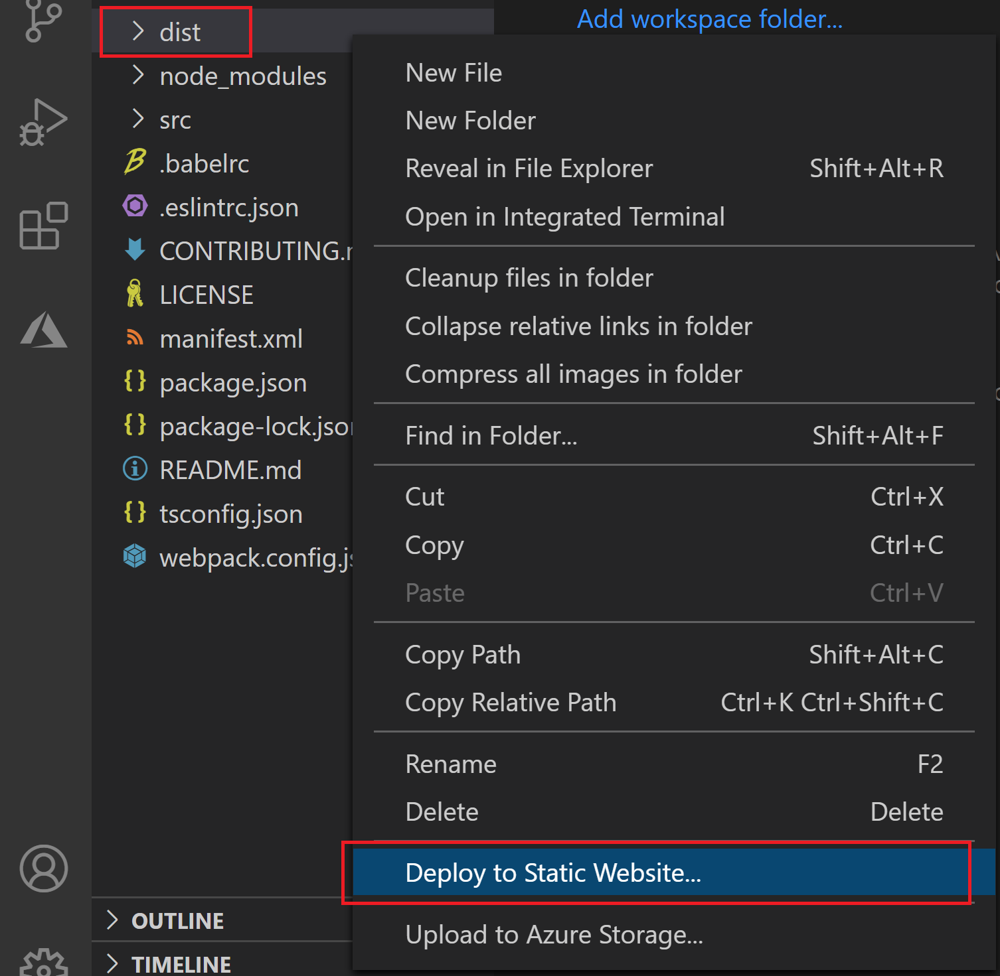

# <a name="publish-an-add-in-developed-with-visual-studio-code"></a>Публикация надстройки, разработанной с помощью Visual Studio Code

В этой статье описано, как опубликовать надстройку Office, созданную с помощью генератора Yeoman и разработанную в [Visual Studio Code (VS Code)](https://code.visualstudio.com) или любом другом редакторе.

> [!NOTE]
> Сведения о публикации надстройки Office, созданной с помощью Visual Studio, см. в статье [Публикация надстройки с помощью Visual Studio](package-your-add-in-using-visual-studio.md).

## <a name="publishing-an-add-in-for-other-users-to-access"></a>Публикация надстройки для доступа других пользователей

Надстройка Office состоит из веб-приложения и файла манифеста. Веб-приложение определяет пользовательский интерфейс и функции надстройки, а манифест указывает расположение веб-приложения и определяет параметры и возможности надстройки.

Пока вы разрабатываете, надстройку можно запустить на локальном веб-сервере ( `localhost` ). Когда вы будете готовы опубликовать его для доступа других пользователей, вам потребуется развернуть веб-приложение и обновить манифест, чтобы указать URL-адрес развернутого приложения.

Если надстройка работает по желанию, ее можно опубликовать непосредственно Visual Studio Code с помощью служба хранилища Azure расширения.

## <a name="using-visual-studio-code-to-publish"></a>Использование Visual Studio Code для публикации

>[!NOTE]
> Эти действия работают только для проектов, созданных с генератором Yeoman.

1. Откройте проект из корневой папки в Visual Studio Code (VS Code).
2. В представлении Extensions в VS Code поиск расширения служба хранилища Azure и установите его.
3. После установки значок Azure добавляется в планку действий. Выберите его для доступа к расширению. Если ваш план действий скрыт, вы не сможете получить доступ к расширению. Покажите планку действий, выбрав > **Appearance > Show Activity Bar**.
4. Во время расширения впишитесь в свою учетную запись Azure, выбрав **вход в Azure.** Вы также можете создать учетную запись Azure, если у вас еще нет ее, выбрав **создать бесплатную учетную** запись Azure. Выполните предусмотренные действия по настройкам учетной записи.
5. После того как вы зайду на учетную запись Azure, вы увидите, как в расширении отображаются учетные записи хранилища Azure. Если у вас еще нет учетной записи хранилища, необходимо создать ее с помощью параметра **Создать новую учетную запись** хранилища. Назови свою учетную запись хранилища уникальным глобально, используя только "a-z" и "0-9". Обратите внимание, что по умолчанию это создает учетную запись хранилища и группу ресурсов с тем же именем. Он автоматически помещает учетную запись хранилища в западной части США. Это может быть скорректировано в Интернете с [помощью учетной записи Azure.](https://portal.azure.com/)
6. Выберите и удерживайте (правой кнопкой мыши) учетную запись хранилища, выбрав **статичный веб-сайт Configure.** Вам будет предложено ввести имя документа индекса и имя документа 404. Измените имя документа индекса с по умолчанию `index.html` на **`taskpane.html`** . Вы также можете изменить имя документа 404, но этого не требуется.
7. Выберите и удерживайте (правой кнопкой мыши) хранилище снова, на этот раз выбрав **статический веб-сайт Просмотр**. В открываемом окне браузера скопируйте URL-адрес веб-сайта.
8. В VS Code откройте файл манифеста проекта () и измените ссылки на url-адрес localhost (например) на скопированные `manifest.xml` `https://localhost:3000` URL-адреса. Эта конечная точка — это статичный URL-адрес веб-сайта для вновь созданной учетной записи хранилища. Сохраните изменения в файле манифеста.
9. Откройте строку командной строки и перейдите в корневой каталог проекта надстройки. Затем запустите следующую команду, чтобы подготовить все файлы для развертывания производства.

    ```command&nbsp;line
    npm run build
    ```

    После завершения сборки папка **dist** в корневом каталоге проекта надстройки будет содержать файлы, разворачиваемые на следующих этапах.

10. Чтобы развернуть, выберите проводник файлов, выберите и удерживайте (правой кнопкой мыши) папку **dist** и выберите **Развертывание на статическом веб-сайте.** При запросе выберите созданную ранее учетную запись хранилища.



11. Когда развертывание завершено, появляется сообщение **"Просмотр** веб-сайта", которое можно выбрать для открытия основной конечной точки развернутого кода приложения.

## <a name="see-also"></a>См. также

- [Разработка надстроек Office с помощью Visual Studio Code](../develop/develop-add-ins-vscode.md)
- [Развертывание и публикация надстройки Office](../publish/publish.md)
