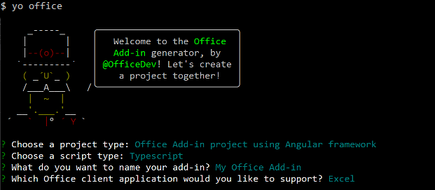

# <a name="build-an-excel-add-in-using-angular"></a>Создание надстройки Excel с помощью Angular

В этой статье описан процесс создания надстройки Excel с помощью Angular и API JavaScript для Excel.

## <a name="prerequisites"></a>Необходимые компоненты

- [Node.js](https://nodejs.org)

- Глобально установите последнюю версию [Yeoman](https://github.com/yeoman/yo) и [генератор Yeoman для надстроек Office](https://github.com/OfficeDev/generator-office).

    ```bash
    npm install -g yo generator-office
    ```

## <a name="create-the-web-app"></a>Создание веб-приложения

1. Создайте проект надстройки Excel помощью генератора Yeoman. Выполните приведенную ниже команду и ответьте на вопросы, как показано ниже.

    ```bash
    yo office
    ```

    - **Выберите тип проекта:** `Office Add-in project using Angular framework`
    - **Выберите тип сценария:** `Typescript`
    - **Как вы хотите назвать надстройку?** `My Office Add-in`
    - **Какое клиентское приложение Office должно поддерживаться?** `Excel`

    

    После завершения работы мастера генератор создаст проект и установит вспомогательные компоненты Node.

2. Перейдите к корневой папке проекта.

    ```bash
    cd "My Office Add-in"
    ```

## <a name="update-the-code"></a>Обновление кода

1. В редакторе кода откройте файл **app.css**, добавьте указанные ниже стили в конец файла и сохраните его.

    ```css
    #content-header {
        background: #2a8dd4;
        color: #fff;
        position: absolute;
        top: 0;
        left: 0;
        width: 100%;
        height: 80px;
        overflow: hidden;
        font-family: Arial;
        padding-top: 25px;
    }

    #content-main {
        background: #fff;
        position: fixed;
        top: 80px;
        left: 0;
        right: 0;
        bottom: 0;
        overflow: auto;
        font-family: Arial;
    }

    .padding {
        padding: 15px;
    }

    .padding-sm {
        padding: 4px;
    }

    .normal-button {
        width: 80px;
        padding: 2px;
    }
    ```

2. Откройте файл **src/app/app.component.html**, замените все его содержимое приведенным ниже кодом и сохраните файл.

    ```html
    <div id="content-header">
        <div class="padding">
            <h1>{{welcomeMessage}}</h1>
        </div>
    </div>
    <div id="content-main">
        <div class="padding">
            <p>Choose the button below to set the color of the selected range to green.</p>
            <br />
            <h3>Try it out</h3>
            <br />
            <div role="button" class="ms-Button" (click)="setColor()">
                <span class="ms-Button-label">Set color</span>
                <span class="ms-Button-icon"><i class="ms-Icon ms-Icon--ChevronRight"></i></span>
            </div>
        </div>
    </div>
    ```

3. Откройте файл **src/app/app.component.ts**, замените все его содержимое приведенным ниже кодом и сохраните файл.

    ```typescript
    import { Component } from '@angular/core';
    import * as OfficeHelpers from '@microsoft/office-js-helpers';

    const template = require('./app.component.html');

    @Component({
        selector: 'app-home',
        template
    })
    export default class AppComponent {
        welcomeMessage = 'Welcome';

        async setColor() {
            try {
                await Excel.run(async context => {
                    const range = context.workbook.getSelectedRange();
                    range.load('address');
                    range.format.fill.color = 'green';
                    await context.sync();
                    console.log(`The range address was ${range.address}.`);
                });
            } catch (error) {
                OfficeHelpers.UI.notify(error);
                OfficeHelpers.Utilities.log(error);
            }
        }

    }
    ```

## <a name="update-the-manifest"></a>Обновление манифеста

1. Откройте файл **manifest.xml**, чтобы определить параметры и возможности надстройки. 

2. Элемент `ProviderName` содержит заполнитель. Замените его на свое имя.

3. Атрибут `DefaultValue` элемента `Description` содержит заполнитель. Замените его строкой **Надстройка области задач для Excel**.

4. Сохраните файл.

    ```xml
    ...
    <ProviderName>John Doe</ProviderName>
    <DefaultLocale>en-US</DefaultLocale>
    <!-- The display name of your add-in. Used on the store and various places of the Office UI such as the add-ins dialog. -->
    <DisplayName DefaultValue="My Office Add-in" />
    <Description DefaultValue="A task pane add-in for Excel"/>
    ...
    ```

## <a name="start-the-dev-server"></a>Запуск сервера разработки

[!include[Start server section](../includes/quickstart-yo-start-server.md)] 

## <a name="try-it-out"></a>Проверка

1. Следуя указаниям для нужной платформы, загрузите неопубликованную надстройку в Excel.

    - [Windows](../testing/create-a-network-shared-folder-catalog-for-task-pane-and-content-add-ins.md)
    - [Office Online](../testing/sideload-office-add-ins-for-testing.md#sideload-an-office-add-in-in-office-online)
    - [iPad и Mac](../testing/sideload-an-office-add-in-on-ipad-and-mac.md)

2. В Excel выберите вкладку **Главная** и нажмите кнопку **Показать область задач** на ленте, чтобы открыть область задач надстройки.

    

3. Выберите любой диапазон ячеек на листе.

4. В области задач нажмите кнопку **Set color** (Задать цвет), чтобы сделать выбранный диапазон зеленым.

    

## <a name="next-steps"></a>Дальнейшие действия

Поздравляем, вы успешно создали надстройку Excel с помощью Angular! Чтобы узнать больше о возможностях надстроек Excel и создать более сложную надстройку, воспользуйтесь руководством по надстройкам Excel.

> [!div class="nextstepaction"]
> [Руководство по надстройкам Excel](../tutorials/excel-tutorial.md)

## <a name="see-also"></a>См. также

* [Руководство по надстройкам Excel](../tutorials/excel-tutorial-create-table.md)
* [Основные концепции программирования с помощью API JavaScript для Excel](../excel/excel-add-ins-core-concepts.md)
* [Примеры кода надстроек Excel](https://developer.microsoft.com/office/gallery/?filterBy=Samples,Excel)
* [Справочник по API JavaScript для Excel](/office/dev/add-ins/reference/overview/excel-add-ins-reference-overview)
