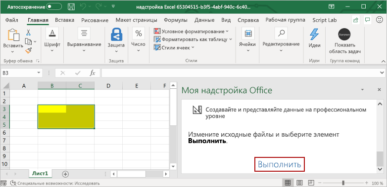

# <a name="build-an-excel-task-pane-add-in-using-angular"></a><span data-ttu-id="6d8c2-102">Создание области задач Excel с помощью Angular</span><span class="sxs-lookup"><span data-stu-id="6d8c2-102">Build an Excel task pane add-in using Angular</span></span>

<span data-ttu-id="6d8c2-103">Из этой статьи вы узнаете, как создать надстройку области Excel, используя Angular и API JavaScript для Excel.</span><span class="sxs-lookup"><span data-stu-id="6d8c2-103">In this article, you'll walk through the process of building an Excel task pane add-in using Angular and the Excel JavaScript API.</span></span>

## <a name="prerequisites"></a><span data-ttu-id="6d8c2-104">Необходимые условия</span><span class="sxs-lookup"><span data-stu-id="6d8c2-104">Prerequisites</span></span>

[!include[Yeoman generator prerequisites](../includes/quickstart-yo-prerequisites.md)]

## <a name="create-the-add-in-project"></a><span data-ttu-id="6d8c2-105">Создание проекта надстройки</span><span class="sxs-lookup"><span data-stu-id="6d8c2-105">Create the add-in project</span></span>

[!include[note about Yeoman generator bug](../includes/note-yeoman-generator-bug-201908.md)]

<span data-ttu-id="6d8c2-106">Создайте проект надстройки Excel помощью генератора Yeoman.</span><span class="sxs-lookup"><span data-stu-id="6d8c2-106">Use the Yeoman generator to create an Excel add-in project.</span></span> <span data-ttu-id="6d8c2-107">Выполните приведенную ниже команду и ответьте на вопросы, как показано ниже.</span><span class="sxs-lookup"><span data-stu-id="6d8c2-107">Run the following command and then answer the prompts as follows:</span></span>

```command&nbsp;line
yo office
```

- <span data-ttu-id="6d8c2-108">**Выберите тип проекта:** `Office Add-in Task Pane project using Angular framework`</span><span class="sxs-lookup"><span data-stu-id="6d8c2-108">**Choose a project type:** `Office Add-in Task Pane project using Angular framework`</span></span>
- <span data-ttu-id="6d8c2-109">**Выберите тип сценария:** `TypeScript`</span><span class="sxs-lookup"><span data-stu-id="6d8c2-109">**Choose a script type:** `TypeScript`</span></span>
- <span data-ttu-id="6d8c2-110">**Как вы хотите назвать надстройку?**</span><span class="sxs-lookup"><span data-stu-id="6d8c2-110">**What do you want to name your add-in?**</span></span> `my-office-add-in`
- <span data-ttu-id="6d8c2-111">**Какое клиентское приложение Office должно поддерживаться?**</span><span class="sxs-lookup"><span data-stu-id="6d8c2-111">**Which Office client application would you like to support?**</span></span> `Excel`

<span data-ttu-id="6d8c2-112">После завершения работы мастера генератор создаст проект и установит вспомогательные компоненты Node.</span><span class="sxs-lookup"><span data-stu-id="6d8c2-112">After you complete the wizard, the generator will create the project and install supporting Node components.</span></span>

## <a name="explore-the-project"></a><span data-ttu-id="6d8c2-113">Знакомство с проектом</span><span class="sxs-lookup"><span data-stu-id="6d8c2-113">Explore the project</span></span>

<span data-ttu-id="6d8c2-114">Проект надстройки, который вы создали с помощью генератора Yeoman, содержит образец кода для простейшей надстройки области задач.</span><span class="sxs-lookup"><span data-stu-id="6d8c2-114">The add-in project that you've created with the Yeoman generator contains sample code for a very basic task pane add-in.</span></span> <span data-ttu-id="6d8c2-115">Если вы хотите ознакомиться с ключевыми компонентами проекта надстройки, откройте проект в редакторе кода и просмотрите файлы, перечисленные ниже.</span><span class="sxs-lookup"><span data-stu-id="6d8c2-115">If you'd like to explore the key components of your add-in project, open the project in your code editor and review the files listed below.</span></span> <span data-ttu-id="6d8c2-116">Когда вы будете готовы попробовать собственную надстройку, перейдите к следующему разделу.</span><span class="sxs-lookup"><span data-stu-id="6d8c2-116">When you're ready to try out your add-in, proceed to the next section.</span></span>

- <span data-ttu-id="6d8c2-117">Файл **manifest.xml** в корневом каталоге проекта определяет настройки и возможности надстройки.</span><span class="sxs-lookup"><span data-stu-id="6d8c2-117">The **manifest.xml** file in the root directory of the project defines the settings and capabilities of the add-in.</span></span>
- <span data-ttu-id="6d8c2-118">Файл **./src/taskpane/app/app.component.html** содержит разметку HTML для области задач.</span><span class="sxs-lookup"><span data-stu-id="6d8c2-118">The **./src/taskpane/app/app.component.html** file contains the HTML markup for the task pane.</span></span>
- <span data-ttu-id="6d8c2-119">Файл **./src/taskpane/taskpane.css** содержит код CSS, который применяется к содержимому области задач.</span><span class="sxs-lookup"><span data-stu-id="6d8c2-119">The **./src/taskpane/taskpane.css** file contains the CSS that's applied to content in the task pane.</span></span>
- <span data-ttu-id="6d8c2-120">Файл **./src/taskpane/app/app.component.ts** содержит код API JavaScript для Office, который упрощает взаимодействие между областью задач и Excel.</span><span class="sxs-lookup"><span data-stu-id="6d8c2-120">The **./src/taskpane/app/app.component.ts** file contains the Office JavaScript API code that facilitates interaction between the task pane and Excel.</span></span>

## <a name="try-it-out"></a><span data-ttu-id="6d8c2-121">Проверка</span><span class="sxs-lookup"><span data-stu-id="6d8c2-121">Try it out</span></span>

1. <span data-ttu-id="6d8c2-122">Перейдите к корневой папке проекта.</span><span class="sxs-lookup"><span data-stu-id="6d8c2-122">Navigate to the root folder of the project.</span></span>

    ```command&nbsp;line
    cd "my-office-add-in"
    ```

2. [!include[Start server section](../includes/quickstart-yo-start-server-excel.md)] 

3. <span data-ttu-id="6d8c2-123">В Excel выберите вкладку **Главная** и нажмите кнопку **Показать область задач** на ленте, чтобы открыть область задач надстройки.</span><span class="sxs-lookup"><span data-stu-id="6d8c2-123">In Excel, choose the **Home** tab, and then choose the **Show Taskpane** button in the ribbon to open the add-in task pane.</span></span>

    

4. <span data-ttu-id="6d8c2-125">Выберите любой диапазон ячеек на листе.</span><span class="sxs-lookup"><span data-stu-id="6d8c2-125">Select any range of cells in the worksheet.</span></span>

5. <span data-ttu-id="6d8c2-126">Внизу области задач выберите ссылку **Выполнить**, чтобы задать выбранному диапазону желтый цвет.</span><span class="sxs-lookup"><span data-stu-id="6d8c2-126">At the bottom of the task pane, choose the **Run** link to set the color of the selected range to yellow.</span></span>

    

## <a name="next-steps"></a><span data-ttu-id="6d8c2-128">Дальнейшие действия</span><span class="sxs-lookup"><span data-stu-id="6d8c2-128">Next steps</span></span>

<span data-ttu-id="6d8c2-129">Поздравляем! Вы успешно создали надстройку области задач Excel с помощью Angular!</span><span class="sxs-lookup"><span data-stu-id="6d8c2-129">Congratulations, you've successfully created an Excel task pane add-in using Angular!</span></span> <span data-ttu-id="6d8c2-130">Чтобы узнать больше о возможностях надстроек Excel и создать более сложную надстройку, воспользуйтесь руководством по надстройкам Excel.</span><span class="sxs-lookup"><span data-stu-id="6d8c2-130">Next, learn more about the capabilities of an Excel add-in and build a more complex add-in by following along with the Excel add-in tutorial.</span></span>

> [!div class="nextstepaction"]
> [<span data-ttu-id="6d8c2-131">Руководство по надстройкам Excel</span><span class="sxs-lookup"><span data-stu-id="6d8c2-131">Excel add-in tutorial</span></span>](../tutorials/excel-tutorial.md)

## <a name="see-also"></a><span data-ttu-id="6d8c2-132">См. также</span><span class="sxs-lookup"><span data-stu-id="6d8c2-132">See also</span></span>

* [<span data-ttu-id="6d8c2-133">Руководство по надстройкам Excel</span><span class="sxs-lookup"><span data-stu-id="6d8c2-133">Excel add-in tutorial</span></span>](../tutorials/excel-tutorial-create-table.md)
* [<span data-ttu-id="6d8c2-134">Основные концепции программирования с помощью API JavaScript для Excel</span><span class="sxs-lookup"><span data-stu-id="6d8c2-134">Fundamental programming concepts with the Excel JavaScript API</span></span>](../excel/excel-add-ins-core-concepts.md)
* [<span data-ttu-id="6d8c2-135">Примеры кода надстроек Excel</span><span class="sxs-lookup"><span data-stu-id="6d8c2-135">Excel add-in code samples</span></span>](https://developer.microsoft.com/office/gallery/?filterBy=Samples,Excel)
* [<span data-ttu-id="6d8c2-136">Справочник по API JavaScript для Excel</span><span class="sxs-lookup"><span data-stu-id="6d8c2-136">Excel JavaScript API reference</span></span>](/office/dev/add-ins/reference/overview/excel-add-ins-reference-overview)
