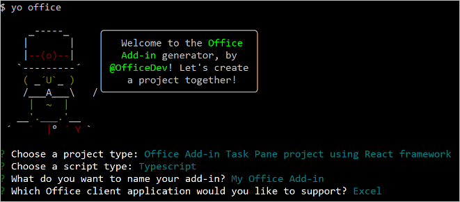
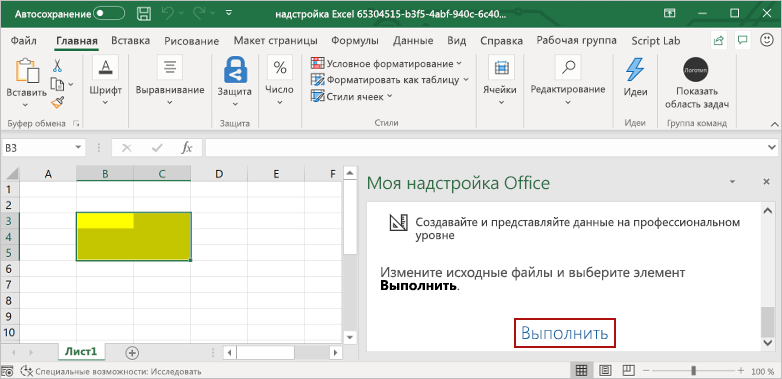

# <a name="use-react-to-build-an-excel-task-pane-add-in"></a>Создание надстройки области задач Excel с помощью React

В этой статье описывается процесс создания надстройки в области задач Excel с помощью React и API JavaScript для Excel.

## <a name="prerequisites"></a>Необходимые условия

[!include[Set up requirements](../includes/set-up-dev-environment-beforehand.md)]
[!include[Yeoman generator prerequisites](../includes/quickstart-yo-prerequisites.md)]

## <a name="create-the-add-in-project"></a>Создание проекта надстройки

[!include[Yeoman generator create project guidance](../includes/yo-office-command-guidance.md)]

- **Выберите тип проекта:** `Office Add-in Task Pane project using React framework`
- **Выберите тип сценария:** `TypeScript`
- **Как вы хотите назвать надстройку?** `My Office Add-in`
- **Какое клиентское приложение Office должно поддерживаться?** `Excel`



После завершения работы мастера генератор создаст проект и установит вспомогательные компоненты Node.

[!include[Yeoman generator next steps](../includes/yo-office-next-steps.md)]

## <a name="explore-the-project"></a>Знакомство с проектом

Проект надстройки, который вы создали с помощью генератора Yeoman, содержит образец кода для простой надстройки области задач. Если вы хотите ознакомиться с ключевыми компонентами проекта надстройки, откройте проект в редакторе кода и просмотрите файлы, перечисленные ниже. Когда вы будете готовы попробовать собственную надстройку, перейдите к следующему разделу.

- Файл **manifest.xml** в корневом каталоге проекта определяет настройки и возможности надстройки. Дополнительные сведения о файле **manifest.xml** см. в статье [XML-манифест надстроек Office](../develop/add-in-manifests.md).
- В файле **./src/taskpane/taskpane.html** определена HTML-инфраструктура области задач, а файлы в папке **./src/taskpane/components** определяют разные части пользовательского интерфейса области задач.
- Файл **./src/taskpane/taskpane.css** содержит код CSS, который применяется к содержимому области задач.
- Файл **./src/taskpane/components/App.tsx** содержит код API JavaScript для Office, который упрощает взаимодействие между областью задач и Excel.

## <a name="try-it-out"></a>Проверка

1. Перейдите к корневой папке проекта.

    ```command&nbsp;line
    cd "My Office Add-in"
    ```

1. [!include[Start server section](../includes/quickstart-yo-start-server-excel.md)] 

1. В Excel выберите вкладку **Главная** и нажмите кнопку **Показать область задач** на ленте, чтобы открыть область задач надстройки.

    

1. Выберите любой диапазон ячеек на листе.

1. Внизу области задач выберите ссылку **Выполнить**, чтобы задать выбранному диапазону желтый цвет.

    

## <a name="next-steps"></a>Дальнейшие действия

Поздравляем, вы успешно создали надстройку панели задач Excel с помощью React! Чтобы узнать больше о возможностях надстроек Excel и создать более сложную надстройку, воспользуйтесь руководством по надстройкам Excel.

> [!div class="nextstepaction"]
> [Руководство по надстройкам Excel](../tutorials/excel-tutorial.md)

## <a name="see-also"></a>См. также

- [Руководство по надстройкам Excel](../tutorials/excel-tutorial.md)
- [Объектная модель JavaScript для Excel в надстройках Office](../excel/excel-add-ins-core-concepts.md)
- [Примеры кода надстроек Excel](https://developer.microsoft.com/office/gallery/?filterBy=Samples,Excel)
- [Справочник по API JavaScript для Excel](../reference/overview/excel-add-ins-reference-overview.md)