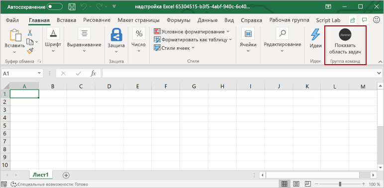

# <a name="build-an-excel-task-pane-add-in-using-react"></a><span data-ttu-id="b1272-103">Создание области задач Excel с помощью React</span><span class="sxs-lookup"><span data-stu-id="b1272-103">Build an Excel task pane add-in using React</span></span>

<span data-ttu-id="b1272-104">В этой статье описывается процесс создания надстройки в области задач Excel с помощью React и API JavaScript для Excel.</span><span class="sxs-lookup"><span data-stu-id="b1272-104">In this article, you'll walk through the process of building an Excel task pane add-in using React and the Excel JavaScript API.</span></span>

## <a name="prerequisites"></a><span data-ttu-id="b1272-105">Необходимые условия</span><span class="sxs-lookup"><span data-stu-id="b1272-105">Prerequisites</span></span>

[!include[Yeoman generator prerequisites](../includes/quickstart-yo-prerequisites.md)]

## <a name="create-the-add-in-project"></a><span data-ttu-id="b1272-106">Создание проекта надстройки</span><span class="sxs-lookup"><span data-stu-id="b1272-106">Create the add-in project</span></span>

[!include[Yeoman generator create project guidance](../includes/yo-office-command-guidance.md)]

- <span data-ttu-id="b1272-107">**Выберите тип проекта:** `Office Add-in Task Pane project using React framework`</span><span class="sxs-lookup"><span data-stu-id="b1272-107">**Choose a project type:** `Office Add-in Task Pane project using React framework`</span></span>
- <span data-ttu-id="b1272-108">**Выберите тип сценария:** `TypeScript`</span><span class="sxs-lookup"><span data-stu-id="b1272-108">**Choose a script type:** `TypeScript`</span></span>
- <span data-ttu-id="b1272-109">**Как вы хотите назвать надстройку?**</span><span class="sxs-lookup"><span data-stu-id="b1272-109">**What do you want to name your add-in?**</span></span> `My Office Add-in`
- <span data-ttu-id="b1272-110">**Какое клиентское приложение Office должно поддерживаться?**</span><span class="sxs-lookup"><span data-stu-id="b1272-110">**Which Office client application would you like to support?**</span></span> `Excel`


<span data-ttu-id="b1272-112">После завершения работы мастера генератор создаст проект и установит вспомогательные компоненты Node.</span><span class="sxs-lookup"><span data-stu-id="b1272-112">After you complete the wizard, the generator creates the project and installs supporting Node components.</span></span>

[!include[Yeoman generator next steps](../includes/yo-office-next-steps.md)]

## <a name="explore-the-project"></a><span data-ttu-id="b1272-113">Знакомство с проектом</span><span class="sxs-lookup"><span data-stu-id="b1272-113">Explore the project</span></span>

<span data-ttu-id="b1272-114">Проект надстройки, который вы создали с помощью генератора Yeoman, содержит образец кода для простейшей надстройки области задач.</span><span class="sxs-lookup"><span data-stu-id="b1272-114">The add-in project that you've created with the Yeoman generator contains sample code for a very basic task pane add-in.</span></span> <span data-ttu-id="b1272-115">Если вы хотите ознакомиться с ключевыми компонентами проекта надстройки, откройте проект в редакторе кода и просмотрите файлы, перечисленные ниже.</span><span class="sxs-lookup"><span data-stu-id="b1272-115">If you'd like to explore the key components of your add-in project, open the project in your code editor and review the files listed below.</span></span> <span data-ttu-id="b1272-116">Когда вы будете готовы попробовать собственную надстройку, перейдите к следующему разделу.</span><span class="sxs-lookup"><span data-stu-id="b1272-116">When you're ready to try out your add-in, proceed to the next section.</span></span>

- <span data-ttu-id="b1272-117">Файл **manifest.xml** в корневом каталоге проекта определяет настройки и возможности надстройки.</span><span class="sxs-lookup"><span data-stu-id="b1272-117">The **manifest.xml** file in the root directory of the project defines the settings and capabilities of the add-in.</span></span>
- <span data-ttu-id="b1272-118">В файле **./src/taskpane/taskpane.html** определена HTML-инфраструктура области задач, а файлы в папке **./src/taskpane/components** определяют разные части пользовательского интерфейса области задач.</span><span class="sxs-lookup"><span data-stu-id="b1272-118">The **./src/taskpane/taskpane.html** file defines the HTML framework of the task pane, and the files within the **./src/taskpane/components** folder define the various parts of the task pane UI.</span></span>
- <span data-ttu-id="b1272-119">Файл **./src/taskpane/taskpane.css** содержит код CSS, который применяется к содержимому области задач.</span><span class="sxs-lookup"><span data-stu-id="b1272-119">The **./src/taskpane/taskpane.css** file contains the CSS that's applied to content in the task pane.</span></span>
- <span data-ttu-id="b1272-120">Файл **./src/taskpane/components/App.tsx** содержит код API JavaScript для Office, который упрощает взаимодействие между областью задач и Excel.</span><span class="sxs-lookup"><span data-stu-id="b1272-120">The **./src/taskpane/components/App.tsx** file contains the Office JavaScript API code that facilitates interaction between the task pane and Excel.</span></span>

## <a name="try-it-out"></a><span data-ttu-id="b1272-121">Проверка</span><span class="sxs-lookup"><span data-stu-id="b1272-121">Try it out</span></span>

1. <span data-ttu-id="b1272-122">Перейдите к корневой папке проекта.</span><span class="sxs-lookup"><span data-stu-id="b1272-122">Navigate to the root folder of the project.</span></span>

    ```command&nbsp;line
    cd "My Office Add-in"
    ```

2. [!include[Start server section](../includes/quickstart-yo-start-server-excel.md)] 

3. <span data-ttu-id="b1272-123">В Excel выберите вкладку **Главная** и нажмите кнопку **Показать область задач** на ленте, чтобы открыть область задач надстройки.</span><span class="sxs-lookup"><span data-stu-id="b1272-123">In Excel, choose the **Home** tab, and then choose the **Show Taskpane** button in the ribbon to open the add-in task pane.</span></span>

    

4. <span data-ttu-id="b1272-125">Выберите любой диапазон ячеек на листе.</span><span class="sxs-lookup"><span data-stu-id="b1272-125">Select any range of cells in the worksheet.</span></span>

5. <span data-ttu-id="b1272-126">Внизу области задач выберите ссылку **Выполнить**, чтобы задать выбранному диапазону желтый цвет.</span><span class="sxs-lookup"><span data-stu-id="b1272-126">At the bottom of the task pane, choose the **Run** link to set the color of the selected range to yellow.</span></span>

    

## <a name="next-steps"></a><span data-ttu-id="b1272-128">Дальнейшие действия</span><span class="sxs-lookup"><span data-stu-id="b1272-128">Next steps</span></span>

<span data-ttu-id="b1272-129">Поздравляем! Вы успешно создали надстройку области задач Excel с помощью React!</span><span class="sxs-lookup"><span data-stu-id="b1272-129">Congratulations, you've successfully created an Excel task pane add-in using React!</span></span> <span data-ttu-id="b1272-130">Чтобы узнать больше о возможностях надстроек Excel и создать более сложную надстройку, воспользуйтесь руководством по надстройкам Excel.</span><span class="sxs-lookup"><span data-stu-id="b1272-130">Next, learn more about the capabilities of an Excel add-in and build a more complex add-in by following along with the Excel add-in tutorial.</span></span>

> [!div class="nextstepaction"]
> [<span data-ttu-id="b1272-131">Руководство по надстройкам Excel</span><span class="sxs-lookup"><span data-stu-id="b1272-131">Excel add-in tutorial</span></span>](../tutorials/excel-tutorial.md)

## <a name="see-also"></a><span data-ttu-id="b1272-132">См. также</span><span class="sxs-lookup"><span data-stu-id="b1272-132">See also</span></span>

* [<span data-ttu-id="b1272-133">Руководство по надстройкам Excel</span><span class="sxs-lookup"><span data-stu-id="b1272-133">Excel add-in tutorial</span></span>](../tutorials/excel-tutorial-create-table.md)
* [<span data-ttu-id="b1272-134">Основные концепции программирования с помощью API JavaScript для Excel</span><span class="sxs-lookup"><span data-stu-id="b1272-134">Fundamental programming concepts with the Excel JavaScript API</span></span>](../excel/excel-add-ins-core-concepts.md)
* [<span data-ttu-id="b1272-135">Примеры кода надстроек Excel</span><span class="sxs-lookup"><span data-stu-id="b1272-135">Excel add-in code samples</span></span>](https://developer.microsoft.com/office/gallery/?filterBy=Samples,Excel)
* [<span data-ttu-id="b1272-136">Справочник по API JavaScript для Excel</span><span class="sxs-lookup"><span data-stu-id="b1272-136">Excel JavaScript API reference</span></span>](../reference/overview/excel-add-ins-reference-overview.md)
