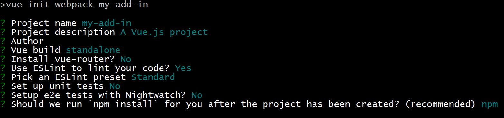
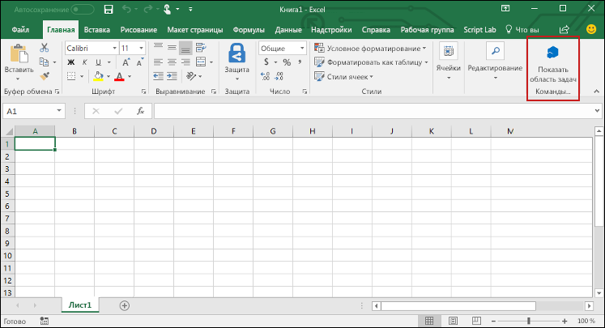
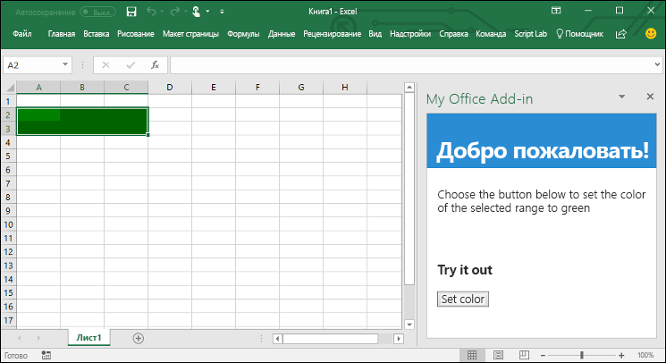

# <a name="build-an-excel-add-in-using-vue"></a><span data-ttu-id="fc731-102">Создание надстройки Excel с помощью Vue</span><span class="sxs-lookup"><span data-stu-id="fc731-102">Build an Excel add-in using Vue</span></span>

<span data-ttu-id="fc731-103">Из этой статье вы узнаете, как создать надстройку Excel, используя Vue и API JavaScript для Excel.</span><span class="sxs-lookup"><span data-stu-id="fc731-103">In this article, you'll walk through the process of building an Excel add-in using Vue and the Excel JavaScript API.</span></span>

## <a name="prerequisites"></a><span data-ttu-id="fc731-104">Необходимые компоненты</span><span class="sxs-lookup"><span data-stu-id="fc731-104">Prerequisites</span></span>

- [<span data-ttu-id="fc731-105">Node.js</span><span class="sxs-lookup"><span data-stu-id="fc731-105">Node.js</span></span>](https://nodejs.org)

- <span data-ttu-id="fc731-106">Установите [Vue CLI](https://github.com/vuejs/vue-cli) глобально.</span><span class="sxs-lookup"><span data-stu-id="fc731-106">Install the [Vue CLI](https://github.com/vuejs/vue-cli) globally.</span></span>

    ```bash
    npm install -g vue-cli
    ```

- <span data-ttu-id="fc731-107">Глобально установите последнюю версию [Yeoman](https://github.com/yeoman/yo) и [генератор Yeoman для надстроек Office](https://github.com/OfficeDev/generator-office).</span><span class="sxs-lookup"><span data-stu-id="fc731-107">Install the latest version of [Yeoman](https://github.com/yeoman/yo) and the [Yeoman generator for Office Add-ins](https://github.com/OfficeDev/generator-office) globally.</span></span>

    ```bash
    npm install -g yo generator-office
    ```

## <a name="generate-a-new-vue-app"></a><span data-ttu-id="fc731-108">Создание нового приложения Vue</span><span class="sxs-lookup"><span data-stu-id="fc731-108">Generate a new Vue app</span></span>

<span data-ttu-id="fc731-p101">Используйте Vue CLI, чтобы создать новое приложение Vue. Используя терминал, выполните приведенную ниже команду и ответьте на вопросы, как описано ниже.</span><span class="sxs-lookup"><span data-stu-id="fc731-p101">Use the Vue CLI to generate a new Vue app. From the terminal, run the following command and then answer the prompts as described below.</span></span>

```bash
vue init webpack my-add-in
```

<span data-ttu-id="fc731-p102">Отвечая на вопросы, появляющиеся при выполнении предыдущей команды, переопределите стандартные ответы на 3 указанных ниже вопроса. Вы можете оставить стандартные ответы на все остальные вопросы.</span><span class="sxs-lookup"><span data-stu-id="fc731-p102">When responding to the prompts that are generated by the previous command, override the default answers for the following 3 prompts. You can accept the default answers for all other prompts.</span></span>

- <span data-ttu-id="fc731-113">**Install vue-router?** (Установить vue-router?)</span><span class="sxs-lookup"><span data-stu-id="fc731-113">**Install vue-router?**</span></span> `No`
- <span data-ttu-id="fc731-114">**Set up unit tests?** `No` (Настроить модульные тесты?)</span><span class="sxs-lookup"><span data-stu-id="fc731-114">**Set up unit tests:** `No`</span></span>
- <span data-ttu-id="fc731-115">**Setup e2e tests with Nightwatch?** (Настроить тесты e2e с помощью Nightwatch?)</span><span class="sxs-lookup"><span data-stu-id="fc731-115">**Setup e2e tests with Nightwatch?**</span></span> `No`



## <a name="generate-the-manifest-file"></a><span data-ttu-id="fc731-117">Создание файла манифеста</span><span class="sxs-lookup"><span data-stu-id="fc731-117">Generate the manifest file</span></span>

<span data-ttu-id="fc731-118">У каждой надстройки должен быть файл манифеста, в нем определяются ее параметры и возможности.</span><span class="sxs-lookup"><span data-stu-id="fc731-118">Each add-in requires a manifest file to define its settings and capabilities.</span></span>

1. <span data-ttu-id="fc731-119">Перейдите к папке приложения.</span><span class="sxs-lookup"><span data-stu-id="fc731-119">Navigate to your app folder.</span></span>

    ```bash
    cd my-add-in
    ```

2. <span data-ttu-id="fc731-p103">Используя генератор Yeoman, создайте файл манифеста для надстройки. Выполните приведенную ниже команду и ответьте на вопросы, как показано ниже.</span><span class="sxs-lookup"><span data-stu-id="fc731-p103">Use the Yeoman generator to generate the manifest file for your add-in. Run the following command and then answer the prompts as shown below.</span></span>

    ```bash
    yo office
    ```

    - <span data-ttu-id="fc731-122">**Выберите тип проекта:** `Office Add-in containing the manifest only`</span><span class="sxs-lookup"><span data-stu-id="fc731-122">**Choose a project type:** `Office Add-in containing the manifest only`</span></span>
    - <span data-ttu-id="fc731-123">**Как вы хотите назвать надстройку?** `My Office Add-in`</span><span class="sxs-lookup"><span data-stu-id="fc731-123">**What do you want to name your add-in?:** `My Office Add-in`</span></span>
    - <span data-ttu-id="fc731-124">**Какое клиентское приложение Office должно поддерживаться?** `Excel`</span><span class="sxs-lookup"><span data-stu-id="fc731-124">**Which Office client application would you like to support?:** `Excel`</span></span>

    

    <span data-ttu-id="fc731-126">После выполнения указаний мастера генератор создаст файл манифеста.</span><span class="sxs-lookup"><span data-stu-id="fc731-126">After you complete the wizard, the generator creates the manifest file.</span></span>

## <a name="secure-the-app"></a><span data-ttu-id="fc731-127">Защита приложения</span><span class="sxs-lookup"><span data-stu-id="fc731-127">Secure the app</span></span>

[!include[HTTPS guidance](../includes/https-guidance.md)]

<span data-ttu-id="fc731-128">Чтобы включить HTTPS для своего приложения, откройте файл **package.json** в корневой папке проекта Vue, добавьте флаг `--https` в скрипт `dev` и сохраните файл.</span><span class="sxs-lookup"><span data-stu-id="fc731-128">To enable HTTPS for your app, open the file **package.json** in the root folder of the Vue project, modify the `dev` script to add the `--https` flag, and save the file.</span></span>

```json
"dev": "webpack-dev-server --https --inline --progress --config build/webpack.dev.conf.js"
```

## <a name="update-the-app"></a><span data-ttu-id="fc731-129">Обновление приложения</span><span class="sxs-lookup"><span data-stu-id="fc731-129">Update the app</span></span>

1. <span data-ttu-id="fc731-130">В редакторе кода откройте папку **My Office Add-in**, созданную Yo Office в корневой папке проекта Vue.</span><span class="sxs-lookup"><span data-stu-id="fc731-130">In your code editor, open the folder **My Office Add-in** that Yo Office created at the root of your Vue project.</span></span> <span data-ttu-id="fc731-131">В этой папке вы увидите файл манифеста, который определяет параметры надстройки (**manifest.xml**).</span><span class="sxs-lookup"><span data-stu-id="fc731-131">In that folder, you'll see the manifest file that defines the settings for your add-in: **manifest.xml**.</span></span>

2. <span data-ttu-id="fc731-132">Откройте файл манифеста и замените все вхождения `https://localhost:3000`, указав вместо них `https://localhost:8080`, затем сохраните файл.</span><span class="sxs-lookup"><span data-stu-id="fc731-132">Open the manifest file, replace all occurrences of `https://localhost:3000` with `https://localhost:8080`, and save the file.</span></span>

3. <span data-ttu-id="fc731-133">Откройте файл **index.html**, который находится в корневой папке проекта Vue, добавьте тег `<script>` сразу перед тегом `</head>` и сохраните файл.</span><span class="sxs-lookup"><span data-stu-id="fc731-133">Open the file **index.html** (located at the root of your Vue project), add the following `<script>` tag immediately before the `</head>` tag, and save the file.</span></span>

    ```html
    <script src="https://appsforoffice.microsoft.com/lib/1/hosted/office.js"></script>
    ```

3. <span data-ttu-id="fc731-134">Откройте файл **src/main.js** и *удалите* следующий блок кода:</span><span class="sxs-lookup"><span data-stu-id="fc731-134">Open **src/main.js** and *remove* the following block of code:</span></span>

    ```js
    new Vue({
        el: '#app',
        components: {App},
        template: '<App/>'
    })
    ```
    
    <span data-ttu-id="fc731-135">Затем добавьте приведенный ниже код в этом же месте и сохраните файл.</span><span class="sxs-lookup"><span data-stu-id="fc731-135">Then add the following code in that same location, and save the file.</span></span> 
                                                         
    ```js
    const Office = window.Office
    Office.initialize = () => {
      new Vue({
        el: '#app',
        components: {App},
        template: '<App/>'
      })
    }
    ```

4. <span data-ttu-id="fc731-136">Откройте файл **src/App.vue**, замените его содержимое приведенным ниже кодом, добавьте разрыв строки в конце (т. е. после тега `</style>`) и сохраните файл.</span><span class="sxs-lookup"><span data-stu-id="fc731-136">Open **src/App.vue**, replace file contents with the following code, add a line break at the end of the file (i.e., after the `</style>` tag), and save the file.</span></span> 

    ```html
    <template>
    <div id="app">
        <div id="content">
        <div id="content-header">
            <div class="padding">
            <h1>Welcome</h1>
            </div>
        </div>
        <div id="content-main">
            <div class="padding">
            <p>Choose the button below to set the color of the selected range to green.</p>
            <br/>
            <h3>Try it out</h3>
            <button @click="onSetColor">Set color</button>
            </div>
        </div>
        </div>
    </div>
    </template>

    <script>
    export default {
      name: 'App',
      methods: {
        onSetColor () {
          window.Excel.run(async (context) => {
            const range = context.workbook.getSelectedRange()
            range.format.fill.color = 'green'
            await context.sync()
          })
        }
      }
    }
    </script>

    <style>
    #content-header {
        background: #2a8dd4;
        color: #fff;
        position: absolute;
        top: 0;
        left: 0;
        width: 100%;
        height: 80px;
        overflow: hidden;
    }

    #content-main {
        background: #fff;
        position: fixed;
        top: 80px;
        left: 0;
        right: 0;
        bottom: 0;
        overflow: auto;
    }

    .padding {
        padding: 15px;
    }
    </style>
    ```

## <a name="start-the-dev-server"></a><span data-ttu-id="fc731-137">Запуск сервера разработки</span><span class="sxs-lookup"><span data-stu-id="fc731-137">Start the dev server</span></span>

1. <span data-ttu-id="fc731-138">Используя терминал, выполните приведенную ниже команду, чтобы запустить сервер разработки.</span><span class="sxs-lookup"><span data-stu-id="fc731-138">From the terminal, run the following command to start the dev server.</span></span>

    ```bash
    npm start
    ```

2. <span data-ttu-id="fc731-p105">В веб-браузере перейдите по адресу `https://localhost:8080`. Если появится сообщение, что сертификат сайта не является доверенным, сделайте так, чтобы компьютер ему доверял.</span><span class="sxs-lookup"><span data-stu-id="fc731-p105">In a web browser, navigate to `https://localhost:8080`. If your browser indicates that the site's certificate is not trusted, you will need to configure your computer to trust the certificate.</span></span> 

3. <span data-ttu-id="fc731-141">После того как браузер загрузит страницу надстройки без ошибок сертификата, вы можете протестировать надстройку.</span><span class="sxs-lookup"><span data-stu-id="fc731-141">After your browser loads the add-in page without any certificate errors, you're ready test your add-in.</span></span> 

## <a name="try-it-out"></a><span data-ttu-id="fc731-142">Проверка</span><span class="sxs-lookup"><span data-stu-id="fc731-142">Try it out</span></span>

1. <span data-ttu-id="fc731-143">Следуя указаниям для нужной платформы, загрузите неопубликованную надстройку в Excel.</span><span class="sxs-lookup"><span data-stu-id="fc731-143">Follow the instructions for the platform you'll be using to run your add-in and sideload the add-in within Excel.</span></span>

    - <span data-ttu-id="fc731-144">[Windows](../testing/create-a-network-shared-folder-catalog-for-task-pane-and-content-add-ins.md)</span><span class="sxs-lookup"><span data-stu-id="fc731-144">Windows: [Sideload Office Add-ins on Windows](../testing/create-a-network-shared-folder-catalog-for-task-pane-and-content-add-ins.md)</span></span>
    - <span data-ttu-id="fc731-145">[Office Online](../testing/sideload-office-add-ins-for-testing.md#sideload-an-office-add-in-in-office-online)</span><span class="sxs-lookup"><span data-stu-id="fc731-145">Excel Online: [Sideload Office Add-ins in Office Online](../testing/sideload-office-add-ins-for-testing.md#sideload-an-office-add-in-in-office-online)</span></span>
    - <span data-ttu-id="fc731-146">[iPad и Mac](../testing/sideload-an-office-add-in-on-ipad-and-mac.md)</span><span class="sxs-lookup"><span data-stu-id="fc731-146">iPad and Mac: [Sideload Office Add-ins on iPad and Mac](../testing/sideload-an-office-add-in-on-ipad-and-mac.md)</span></span>

2. <span data-ttu-id="fc731-147">В Excel выберите вкладку **Главная** и нажмите кнопку **Показать область задач** на ленте, чтобы открыть область задач надстройки.</span><span class="sxs-lookup"><span data-stu-id="fc731-147">In Excel, choose the **Home** tab, and then choose the **Show Taskpane** button in the ribbon to open the add-in task pane.</span></span>

    

3. <span data-ttu-id="fc731-149">Выберите любой диапазон ячеек на листе.</span><span class="sxs-lookup"><span data-stu-id="fc731-149">Select any range of cells in the worksheet.</span></span>

4. <span data-ttu-id="fc731-150">В области задач нажмите кнопку **Set color** (Задать цвет), чтобы сделать выбранный диапазон зеленым.</span><span class="sxs-lookup"><span data-stu-id="fc731-150">In the task pane, choose the **Set color** button to set the color of the selected range to green.</span></span>

    

## <a name="next-steps"></a><span data-ttu-id="fc731-152">Дальнейшие действия</span><span class="sxs-lookup"><span data-stu-id="fc731-152">Next steps</span></span>

<span data-ttu-id="fc731-p106">Поздравляем, вы успешно создали надстройку Excel с помощью Vue! Чтобы узнать больше о возможностях надстроек Excel и создать более сложную надстройку, воспользуйтесь руководством по надстройкам Excel.</span><span class="sxs-lookup"><span data-stu-id="fc731-p106">Congratulations, you've successfully created an Excel add-in using Vue! Next, learn more about the capabilities of an Excel add-in and build a more complex add-in by following along with the Excel add-in tutorial.</span></span>

> [!div class="nextstepaction"]
> [<span data-ttu-id="fc731-155">Руководство по надстройкам Excel</span><span class="sxs-lookup"><span data-stu-id="fc731-155">Excel add-in tutorial</span></span>](../tutorials/excel-tutorial.md)

## <a name="see-also"></a><span data-ttu-id="fc731-156">См. также</span><span class="sxs-lookup"><span data-stu-id="fc731-156">See also</span></span>

* [<span data-ttu-id="fc731-157">Руководство по надстройкам Excel</span><span class="sxs-lookup"><span data-stu-id="fc731-157">Excel add-in tutorial</span></span>](../tutorials/excel-tutorial-create-table.md)
* [<span data-ttu-id="fc731-158">Основные концепции программирования с помощью API JavaScript для Excel</span><span class="sxs-lookup"><span data-stu-id="fc731-158">Fundamental programming concepts with the Excel JavaScript API</span></span>](../excel/excel-add-ins-core-concepts.md)
* [<span data-ttu-id="fc731-159">Примеры кода надстроек Excel</span><span class="sxs-lookup"><span data-stu-id="fc731-159">Excel add-in code samples</span></span>](https://developer.microsoft.com/office/gallery/?filterBy=Samples,Excel)
* [<span data-ttu-id="fc731-160">Справочник по API JavaScript для Excel</span><span class="sxs-lookup"><span data-stu-id="fc731-160">Excel JavaScript API reference</span></span>](/office/dev/add-ins/reference/overview/excel-add-ins-reference-overview)

