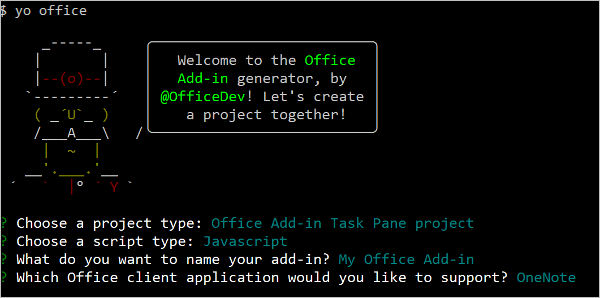

# <a name="build-your-first-onenote-task-pane-add-in"></a>Создание первой надстройки области задач OneNote

В этой статье вы ознакомитесь с процессом создания надстройки для области задач OneNote.

## <a name="prerequisites"></a>Необходимые компоненты

[!include[Yeoman generator prerequisites](../includes/quickstart-yo-prerequisites.md)]

## <a name="create-the-add-in-project"></a>Создание проекта надстройки

[!include[Yeoman generator create project guidance](../includes/yo-office-command-guidance.md)]

- **Выберите тип проекта:** `Office Add-in Task Pane project`
- **Выберите тип сценария:** `Javascript`
- **Как вы хотите назвать надстройку?** `My Office Add-in`
- **Какое клиентское приложение Office должно поддерживаться?** `OneNote`



После завершения работы мастера генератор создаст проект и установит вспомогательные компоненты Node.

[!include[Yeoman generator next steps](../includes/yo-office-next-steps.md)]

## <a name="explore-the-project"></a>Знакомство с проектом

Проект надстройки, который вы создали с помощью генератора Yeoman, содержит образец кода для простейшей надстройки области задач. 

- Файл **./manifest.xml** в корневом каталоге проекта определяет настройки и возможности надстройки.
- Файл **./src/taskpane/taskpane.html** содержит разметку HTML для области задач.
- Файл **./src/taskpane/taskpane.css** содержит код CSS, который применяется к содержимому области задач.
- Файл **./src/taskpane/taskpane.js** содержит код API JavaScript для Office, который упрощает взаимодействие между областью задач и ведущим приложением Office.

## <a name="update-the-code"></a>Обновление кода

Откройте файл **./src/taskpane/taskpane.js** в редакторе кода и добавьте следующий код в функцию `run`. В этом коде используется API JavaScript для OneNote, чтобы настроить заголовок страницы и добавить контур к тексту страницы.

```js
try {
    await OneNote.run(async context => {

        // Get the current page.
        var page = context.application.getActivePage();

        // Queue a command to set the page title.
        page.title = "Hello World";

        // Queue a command to add an outline to the page.
        var html = "<p><ol><li>Item #1</li><li>Item #2</li></ol></p>";
        page.addOutline(40, 90, html);

        // Run the queued commands, and return a promise to indicate task completion.
        return context.sync();
    });
} catch (error) {
    console.log("Error: " + error);
}
```

## <a name="try-it-out"></a>Проверка

1. Перейдите к корневой папке проекта.

    ```command&nbsp;line
    cd "My Office Add-in"
    ```

2. Запустите локальный веб-сервер и загрузите неопубликованную надстройку.

    > [!NOTE]
    > Надстройки Office должны использовать HTTPS, а не HTTP, даже в случае разработки. Если вам будет предложено установить сертификат после того, как вы запустите одну из указанных ниже команд, примите предложение установить сертификат, предоставленный генератором Yeoman.

    > [!TIP]
    > Если вы тестируете надстройку на компьютере Mac, перед продолжением выполните указанную ниже команду. После выполнения этой команды запустится локальный веб-сервер.
    >
    > ```command&nbsp;line
    > npm run dev-server
    > ```

    Выполните указанную ниже команду в корневом каталоге своего проекта. После выполнения этой команды запустится локальный веб-сервер (если он еще не запущен).

    ```command&nbsp;line
    npm run start:web
    ```

3. Откройте записную книжку в [OneNote в Интернете](https://www.onenote.com/notebooks) и создайте страницу.

4. Выберите **Вставка > Надстройки Office**. Откроется диалоговое окно "Надстройки Office".

    - Если вы вошли с помощью обычной учетной записи, выберите **Отправить надстройку** на вкладке **МОИ НАДСТРОЙКИ**.

    - Если вы вошли с помощью рабочей или учебной учетной записи, выберите **Отправить надстройку** на вкладке **МОЯ ОРГАНИЗАЦИЯ**. 

    На следующем изображении показана вкладка **МОИ НАДСТРОЙКИ** для обычных записных книжек.

    

5. В диалоговом окне "Отправить надстройку" выберите **manifest.xml** в папке проекта и нажмите кнопку **Отправить**. 

6. На вкладке **Главная** ленты нажмите кнопку **Показать область задач**. Область задач надстройки откроется в iFrame рядом со страницей OneNote.

7. В нижней части области задач щелкните ссылку **Выполнить**, чтобы настроить заголовок страницы и добавить контур к тексту страницы.

    

## <a name="next-steps"></a>Дальнейшие действия

Поздравляем! Вы успешно создали надстройку области задач OneNote! Следующим шагом узнайте больше об основных понятиях, связанных с созданием надстроек OneNote.

> [!div class="nextstepaction"]
> [Обзор API JavaScript для OneNote](../onenote/onenote-add-ins-programming-overview.md)

## <a name="see-also"></a>См. также

* [Обзор платформы надстроек Office](../overview/office-add-ins.md)
* [Создание надстроек Office](../overview/office-add-ins-fundamentals.md)
* [Разработка надстроек Office](../develop/develop-overview.md)
- [Обзор API JavaScript для OneNote](../onenote/onenote-add-ins-programming-overview.md)
- [Справочник по API JavaScript для OneNote](/office/dev/add-ins/reference/overview/onenote-add-ins-javascript-reference)
- [Пример надстройки Rubric Grader](https://github.com/OfficeDev/OneNote-Add-in-Rubric-Grader)

