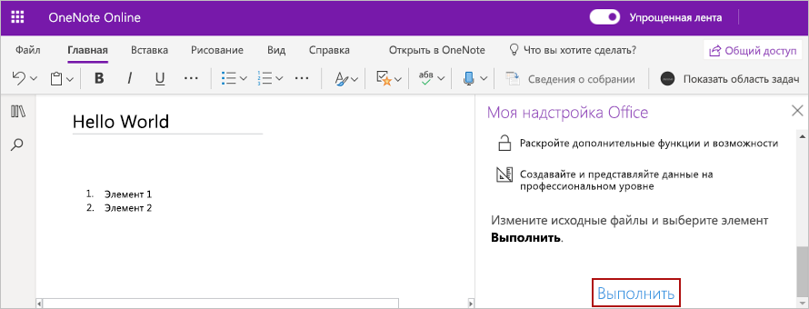

# <a name="build-your-first-onenote-task-pane-add-in"></a><span data-ttu-id="16399-102">Создание первой надстройки области задач OneNote</span><span class="sxs-lookup"><span data-stu-id="16399-102">Build your first Word task pane add-in</span></span>

<span data-ttu-id="16399-103">В этой статье вы ознакомитесь с процессом создания надстройки для области задач OneNote.</span><span class="sxs-lookup"><span data-stu-id="16399-103">In this article, you'll walk through the process of building a Project task pane add-in.</span></span>

## <a name="prerequisites"></a><span data-ttu-id="16399-104">Необходимые компоненты</span><span class="sxs-lookup"><span data-stu-id="16399-104">Prerequisites</span></span>

[!include[Yeoman generator prerequisites](../includes/quickstart-yo-prerequisites.md)]

## <a name="create-the-add-in-project"></a><span data-ttu-id="16399-105">Создание проекта надстройки</span><span class="sxs-lookup"><span data-stu-id="16399-105">Create the add-in project</span></span>

<span data-ttu-id="16399-106">С помощью генератора Yeoman создайте проект надстройки OneNote.</span><span class="sxs-lookup"><span data-stu-id="16399-106">Use the Yeoman generator to create a OneNote add-in project.</span></span> <span data-ttu-id="16399-107">Выполните приведенную ниже команду и ответьте на вопросы, как показано ниже.</span><span class="sxs-lookup"><span data-stu-id="16399-107">Run the following command and then answer the prompts as follows:</span></span>

```command&nbsp;line
yo office
```

- <span data-ttu-id="16399-108">**Выберите тип проекта:** `Office Add-in Task Pane project`</span><span class="sxs-lookup"><span data-stu-id="16399-108">**Choose a project type:** `Office Add-in Task Pane project`</span></span>
- <span data-ttu-id="16399-109">**Выберите тип сценария:** `Javascript`</span><span class="sxs-lookup"><span data-stu-id="16399-109">**Choose a script type:** `Javascript`</span></span>
- <span data-ttu-id="16399-110">**Как вы хотите назвать надстройку?**</span><span class="sxs-lookup"><span data-stu-id="16399-110">**What do you want to name your add-in?**</span></span> `My Office Add-in`
- <span data-ttu-id="16399-111">**Какое клиентское приложение Office должно поддерживаться?**</span><span class="sxs-lookup"><span data-stu-id="16399-111">**Which Office client application would you like to support?**</span></span> `OneNote`


<span data-ttu-id="16399-113">После завершения работы мастера генератор создаст проект и установит вспомогательные компоненты Node.</span><span class="sxs-lookup"><span data-stu-id="16399-113">After you complete the wizard, the generator will create the project and install supporting Node components.</span></span>
    
## <a name="explore-the-project"></a><span data-ttu-id="16399-114">Знакомство с проектом</span><span class="sxs-lookup"><span data-stu-id="16399-114">Explore the project</span></span>

<span data-ttu-id="16399-115">Проект надстройки, который вы создали с помощью генератора Yeoman, содержит образец кода для простейшей надстройки области задач.</span><span class="sxs-lookup"><span data-stu-id="16399-115">The add-in project that you've created with the Yeoman generator contains sample code for a very basic task pane add-in.</span></span> 

- <span data-ttu-id="16399-116">Файл **./manifest.xml** в корневом каталоге проекта определяет настройки и возможности надстройки.</span><span class="sxs-lookup"><span data-stu-id="16399-116">The **./manifest.xml** file in the root directory of the project defines the settings and capabilities of the add-in.</span></span>
- <span data-ttu-id="16399-117">Файл **./src/taskpane/taskpane.html** содержит разметку HTML для области задач.</span><span class="sxs-lookup"><span data-stu-id="16399-117">The **./src/taskpane/taskpane.html** file contains the HTML markup for the task pane.</span></span>
- <span data-ttu-id="16399-118">Файл **./src/taskpane/taskpane.css** содержит код CSS, который применяется к содержимому области задач.</span><span class="sxs-lookup"><span data-stu-id="16399-118">The **./src/taskpane/taskpane.css** file contains the CSS that's applied to content in the task pane.</span></span>
- <span data-ttu-id="16399-119">Файл **./src/taskpane/taskpane.js** содержит код API JavaScript для Office, который упрощает взаимодействие между областью задач и ведущим приложением Office.</span><span class="sxs-lookup"><span data-stu-id="16399-119">The **./src/taskpane/taskpane.js** file contains the Office JavaScript API code that facilitates interaction between the task pane and the Office host application.</span></span>

## <a name="update-the-code"></a><span data-ttu-id="16399-120">Обновление кода</span><span class="sxs-lookup"><span data-stu-id="16399-120">Update the code</span></span>

<span data-ttu-id="16399-121">Откройте файл **./src/taskpane/taskpane.js** в редакторе кода и добавьте приведенный ниже код в пределах функции **run**.</span><span class="sxs-lookup"><span data-stu-id="16399-121">In your code editor, open the file **./src/taskpane/taskpane.js** and add the following code within the **run** function.</span></span> <span data-ttu-id="16399-122">В этом коде используется API JavaScript для OneNote, чтобы настроить заголовок страницы и добавить контур к тексту страницы.</span><span class="sxs-lookup"><span data-stu-id="16399-122">This code uses the OneNote JavaScript API to set the page title and add an outline to the body of the page.</span></span>

```js
try {
    await OneNote.run(async context => {

        // Get the current page.
        var page = context.application.getActivePage();

        // Queue a command to set the page title.
        page.title = "Hello World";

        // Queue a command to add an outline to the page.
        var html = "<p><ol><li>Item #1</li><li>Item #2</li></ol></p>";
        page.addOutline(40, 90, html);

        // Run the queued commands, and return a promise to indicate task completion.
        return context.sync();
    });
} catch (error) {
    console.log("Error: " + error);
}
```

## <a name="try-it-out"></a><span data-ttu-id="16399-123">Проверка</span><span class="sxs-lookup"><span data-stu-id="16399-123">Try it out</span></span>

1. <span data-ttu-id="16399-124">Перейдите к корневой папке проекта.</span><span class="sxs-lookup"><span data-stu-id="16399-124">Navigate to the root folder of the project.</span></span>

    ```command&nbsp;line
    cd "My Office Add-in"
    ```

2. <span data-ttu-id="16399-125">Запустите локальный веб-сервер и загрузите неопубликованную надстройку.</span><span class="sxs-lookup"><span data-stu-id="16399-125">Start the local web server and sideload your add-in.</span></span>

    > [!NOTE]
    > <span data-ttu-id="16399-126">Надстройки Office должны использовать HTTPS, а не HTTP, даже в случае разработки.</span><span class="sxs-lookup"><span data-stu-id="16399-126">Office Add-ins should use HTTPS, not HTTP, even when you are developing.</span></span> <span data-ttu-id="16399-127">Если вам будет предложено установить сертификат после того, как вы запустите одну из указанных ниже команд, примите предложение установить сертификат, предоставленный генератором Yeoman.</span><span class="sxs-lookup"><span data-stu-id="16399-127">If you are prompted to install a certificate after you run one of the following commands, accept the prompt to install the certificate that the Yeoman generator provides.</span></span>

    > [!TIP]
    > <span data-ttu-id="16399-128">Если вы тестируете надстройку на компьютере Mac, перед продолжением выполните указанную ниже команду.</span><span class="sxs-lookup"><span data-stu-id="16399-128">If you're testing your add-in on Mac, run the following command before proceeding.</span></span> <span data-ttu-id="16399-129">После выполнения этой команды запустится локальный веб-сервер.</span><span class="sxs-lookup"><span data-stu-id="16399-129">When you run this command, the local web server will start.</span></span>
    >
    > ```command&nbsp;line
    > npm run dev-server
    > ```

    <span data-ttu-id="16399-130">Выполните указанную ниже команду в корневом каталоге своего проекта.</span><span class="sxs-lookup"><span data-stu-id="16399-130">Run the following command in the root directory of your project.</span></span> <span data-ttu-id="16399-131">После выполнения этой команды запустится локальный веб-сервер (если он еще не запущен).</span><span class="sxs-lookup"><span data-stu-id="16399-131">When you run this command, the local web server will start.</span></span>

    ```command&nbsp;line
    npm run start:web
    ```

3. <span data-ttu-id="16399-132">Откройте записную книжку в [OneNote в Интернете](https://www.onenote.com/notebooks) и создайте страницу.</span><span class="sxs-lookup"><span data-stu-id="16399-132">In [OneNote on the web](https://www.onenote.com/notebooks), open a notebook and create a new page.</span></span>

4. <span data-ttu-id="16399-133">Выберите **Вставка > Надстройки Office**. Откроется диалоговое окно "Надстройки Office".</span><span class="sxs-lookup"><span data-stu-id="16399-133">Choose **Insert > Office Add-ins** to open the Office Add-ins dialog.</span></span>

    - <span data-ttu-id="16399-134">Если вы вошли с помощью обычной учетной записи, выберите **Отправить надстройку** на вкладке **МОИ НАДСТРОЙКИ**.</span><span class="sxs-lookup"><span data-stu-id="16399-134">If you're signed in with your consumer account, select the **MY ADD-INS** tab, and then choose **Upload My Add-in**.</span></span>

    - <span data-ttu-id="16399-135">Если вы вошли с помощью рабочей или учебной учетной записи, выберите **Отправить надстройку** на вкладке **МОЯ ОРГАНИЗАЦИЯ**.</span><span class="sxs-lookup"><span data-stu-id="16399-135">If you're signed in with your work or school account, select the **MY ORGANIZATION** tab, and then select **Upload My Add-in**.</span></span> 

    <span data-ttu-id="16399-136">На следующем изображении показана вкладка **МОИ НАДСТРОЙКИ** для обычных записных книжек.</span><span class="sxs-lookup"><span data-stu-id="16399-136">The following image shows the **MY ADD-INS** tab for consumer notebooks.</span></span>

    

5. <span data-ttu-id="16399-137">В диалоговом окне "Отправить надстройку" выберите **manifest.xml** в папке проекта и нажмите кнопку **Отправить**.</span><span class="sxs-lookup"><span data-stu-id="16399-137">In the Upload Add-in dialog, browse to **manifest.xml** in your project folder, and then choose **Upload**.</span></span> 

6. <span data-ttu-id="16399-138">На вкладке **Главная** ленты нажмите кнопку **Показать область задач**.</span><span class="sxs-lookup"><span data-stu-id="16399-138">From the **Home** tab, choose the **Show Taskpane** button in the ribbon.</span></span> <span data-ttu-id="16399-139">Область задач надстройки откроется в iFrame рядом со страницей OneNote.</span><span class="sxs-lookup"><span data-stu-id="16399-139">The add-in task pane opens in an iFrame next to the OneNote page.</span></span>

7. <span data-ttu-id="16399-140">В нижней части области задач щелкните ссылку **Выполнить**, чтобы настроить заголовок страницы и добавить контур к тексту страницы.</span><span class="sxs-lookup"><span data-stu-id="16399-140">At the bottom of the task pane, choose the **Run** link to set the page title and add an outline to the body of the page.</span></span>

    

## <a name="next-steps"></a><span data-ttu-id="16399-142">Дальнейшие действия</span><span class="sxs-lookup"><span data-stu-id="16399-142">Next steps</span></span>

<span data-ttu-id="16399-143">Поздравляем! Вы успешно создали надстройку области задач OneNote!</span><span class="sxs-lookup"><span data-stu-id="16399-143">Congratulations, you've successfully created a Word task pane add-in!</span></span> <span data-ttu-id="16399-144">Следующим шагом узнайте больше об основных понятиях, связанных с созданием надстроек OneNote.</span><span class="sxs-lookup"><span data-stu-id="16399-144">Next, learn more about the core concepts of building OneNote add-ins.</span></span>

> [!div class="nextstepaction"]
> [<span data-ttu-id="16399-145">Обзор API JavaScript для OneNote</span><span class="sxs-lookup"><span data-stu-id="16399-145">OneNote JavaScript API programming overview</span></span>](../onenote/onenote-add-ins-programming-overview.md)

## <a name="see-also"></a><span data-ttu-id="16399-146">См. также</span><span class="sxs-lookup"><span data-stu-id="16399-146">See also</span></span>

- [<span data-ttu-id="16399-147">Обзор API JavaScript для OneNote</span><span class="sxs-lookup"><span data-stu-id="16399-147">OneNote JavaScript API programming overview</span></span>](../onenote/onenote-add-ins-programming-overview.md)
- [<span data-ttu-id="16399-148">Справочник по API JavaScript для OneNote</span><span class="sxs-lookup"><span data-stu-id="16399-148">OneNote JavaScript API reference</span></span>](/office/dev/add-ins/reference/overview/onenote-add-ins-javascript-reference)
- [<span data-ttu-id="16399-149">Пример надстройки Rubric Grader</span><span class="sxs-lookup"><span data-stu-id="16399-149">Rubric Grader sample</span></span>](https://github.com/OfficeDev/OneNote-Add-in-Rubric-Grader)
- [<span data-ttu-id="16399-150">Обзор платформы надстроек Office</span><span class="sxs-lookup"><span data-stu-id="16399-150">Office Add-ins platform overview</span></span>](../overview/office-add-ins.md)

