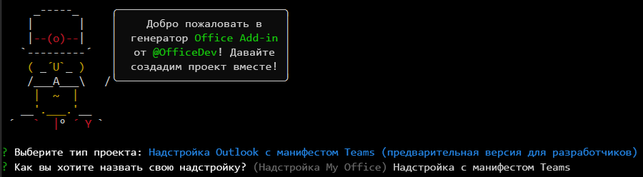

# <a name="build-an-outlook-add-in-with-a-teams-manifest-preview"></a>Создание надстройки Outlook с помощью манифеста Teams (предварительная версия)

В этой статье описан процесс создания надстройки области задач Outlook, которая отображает свойство выбранного сообщения, активирует уведомление в области чтения и вставляет текст в сообщение на панели создания. Эта надстройка будет использовать предварительную версию манифеста в формате JSON, который используют расширения Teams, например пользовательские вкладки и расширения для сообщений. Дополнительные сведения об этом манифесте см. в статье [Манифест Teams для надстроек Office (предварительная версия)](../develop/json-manifest-overview.md).

> [!NOTE]
> Новый манифест доступен в предварительной версии и может быть изменен на основе отзывов. Мы рекомендуем опытным разработчикам надстроек поэкспериментировать с ним. Манифест предварительной версии не следует использовать в рабочих надстройках. 

Предварительная версия поддерживается только в подписке Office на Windows. 

> [!TIP]
> Если вы хотите создать надстройку Outlook с помощью XML-манифеста, см. статью [Создание первой надстройки Outlook](outlook-quickstart.md).

## <a name="create-the-add-in"></a>Создание надстройки

Вы можете создать надстройку Office с манифестом JSON с помощью [генератора Yeoman для надстроек Office](../develop/yeoman-generator-overview.md). Генератор Yeoman создает проект Node.js, которым можно управлять с помощью Visual Studio Code или любого другого редактора.

### <a name="prerequisites"></a>Предварительные требования

[!include[Set up requirements](../includes/set-up-dev-environment-beforehand.md)]

- [Среда выполнения .NET](https://dotnet.microsoft.com/download/dotnet/6.0/runtime) для Windows. Одно из средств, используемых в предварительной версии, выполняется в .NET.

[!INCLUDE [Yeoman generator prerequisites](../includes/quickstart-yo-prerequisites.md)]

- [Visual Studio Code (VS Code)](https://code.visualstudio.com/) или используемый вами редактор кода

- Outlook для Windows (подключенный к учетной записи Microsoft 365)

### <a name="create-the-add-in-project"></a>Создание проекта надстройки

1. [!include[Yeoman generator create project guidance](../includes/yo-office-command-guidance.md)]

    - **Выберите тип проекта** - `Outlook Add-in with Teams Manifest (Developer preview)`

    - **Как вы хотите назвать надстройку?** - `Add-in with Teams Manifest`

     

    > [!NOTE]
    > В этой предварительной версии имя надстройки не может содержать более 30 символов. 
    
    После завершения работы мастера генератор создаст проект и установит вспомогательные компоненты Node.

    [!include[Yeoman generator next steps](../includes/yo-office-next-steps.md)]

1. Перейдите в корневую папку проекта веб-приложения.

    ```command&nbsp;line
    cd "Add-in with Teams Manifest"
    ```

### <a name="explore-the-project"></a>Знакомство с проектом

Проект надстройки, который вы создали с помощью генератора Yeoman, содержит образец кода для простейшей надстройки области задач.

- Файл **./manifest/manifest.json** в корневом каталоге проекта определяет параметры и возможности надстройки.
- Файл **./src/taskpane/taskpane.html** содержит разметку HTML для области задач.
- Файл **./src/taskpane/taskpane.css** содержит код CSS, который применяется к содержимому области задач.
- Файл **./src/taskpane/taskpane.ts** содержит код, который вызывает библиотеку JavaScript Office для упрощения взаимодействия между областью задач и Outlook.
- Файл **./src/command/command.html** будет изменен посредством WebPack во время сборки, чтобы вставить HTML-тег `<script>`, который загружает файл JavaScript, скомпилированный из файла command.ts.
- Файл **./src/command/command.ts** сначала содержит немного кода. Далее в этой статье вы добавите в него код, который вызывает библиотеку JavaScript для Office и выполняется при нажатии пользовательской кнопки ленты.

### <a name="update-the-code"></a>Обновление кода

1. Откройте проект в VS Code или используемом вами редакторе кода.

    > [!TIP]
    > В Windows вы можете перейти в корневой каталог проекта с помощью командной строки и ввести `code .`, чтобы открыть эту папку в VS Code. 

1. Откройте файл **./src/taskpane/taskpane.html** и замените весь элемент **\<main\>** (внутри элемента **\<body\>**) приведенной ниже разметкой. Эта новая разметка добавляет метку в том месте, где скрипт **./src/taskpane/taskpane.ts** запишет данные.

    ```html
    <main id="app-body" class="ms-welcome__main" style="display: none;">
        <h2 class="ms-font-xl"> Discover what Office Add-ins can do for you today! </h2>
        <p><label id="item-subject"></label></p>
        <div role="button" id="run" class="ms-welcome__action ms-Button ms-Button--hero ms-font-xl">
            <span class="ms-Button-label">Run</span>
        </div>
    </main>
    ```

1. Откройте файл **./src/taskpane/taskpane.ts** в редакторе кода и добавьте приведенный ниже код в пределах функции **run**. В этом коде используется API JavaScript для Office для получения ссылки на текущее сообщение и записи значения его свойства **subject** в область задач.

    ```typescript
    // Get a reference to the current message.
    let item = Office.context.mailbox.item;

    // Write a message property value to the task pane.
    document.getElementById("item-subject").innerHTML = "<b>Subject:</b> <br/>" + item.subject;
    ```

### <a name="try-it-out"></a>Проверка

[!INCLUDE [alert use https](../includes/alert-use-https.md)]

1. Выполните указанную ниже команду в корневом каталоге своего проекта. После выполнения этой команды запустится локальный веб-сервер и будет [загружена неопубликованная](../outlook/sideload-outlook-add-ins-for-testing.md) надстройка. 

    ```command&nbsp;line
    npm start
    ```

1. Используйте классическую ленту в Outlook. Это предполагается в оставшейся части этих инструкций.  

1. Просмотрите сообщение в [области чтения](https://support.microsoft.com/office/2fd687ed-7fc4-4ae3-8eab-9f9b8c6d53f0) или откройте сообщение в отдельном окне. На вкладке **Главная** Outlook (или на вкладке **Сообщение**, если сообщение открыто в новом окне) появится новая группа элементов управления с именем **Надстройка Contoso**. В группе есть кнопка с именем **Показать область задач** и с именем **Выполнить действие**.

    > [!NOTE]
    > Если новая группа отсутствует, надстройка не была автоматически загружена без публикации. Следуйте инструкциям в из раздела [Загрузка без публикации вручную — Outlook 2016 или более поздней версии для Windows или Mac](../outlook/sideload-outlook-add-ins-for-testing.md#outlook-2016-or-later-on-windows-or-mac), чтобы вручную загрузить неопубликованную надстройку в Outlook. При появлении запроса на отправку файла манифеста используйте файл `C:\Users\{your_user_name}\AppData\Local\Temp\manifest.xml`. Файл имеет расширение `.xml`, так как в предварительной версии манифест в формате JSON преобразуется в XML-манифест, который затем загружается без публикации.

1. Нажмите кнопку **Выполнить действие**. Она [выполняет команду](../develop/create-addin-commands.md?branch=outlook-json-manifest#step-5-add-the-functionfile-element) для создания небольшого информационного уведомления в нижней части заголовка сообщения, прямо над текстом сообщения.

1. При появлении запроса с диалоговым окном **Остановка при загрузке веб-представления** выберите **ОК**.

    [!INCLUDE [Cancelling the WebView Stop On Load dialog box](../includes/webview-stop-on-load-cancel-dialog.md)]

1. Чтобы открыть область задач надстройки, выберите **Показать область задач**.

    > [!NOTE]
    > Если сообщение об ошибке "Не удается открыть эту надстройку с localhost" появляется в области задач, выполните действия, описанные в [статье по устранению неполадок](/office/troubleshoot/office-suite-issues/cannot-open-add-in-from-localhost).

1. При появлении запроса с диалоговым окном **Остановка при загрузке веб-представления** выберите **ОК**.

    [!INCLUDE [Cancelling the WebView Stop On Load dialog box](../includes/webview-stop-on-load-cancel-dialog.md)]

1. Прокрутите область задачи в самый низ и перейдите по ссылке **Выполнить**, чтобы скопировать тему сообщения в области задач.

1. Завершите сеанс отладки с помощью следующей команды.

    ```command&nbsp;line
    npm stop
    ```

    > [!IMPORTANT]
    > Закрытие окна веб-сервера не приводит к надежному завершению работы веб-сервера. Если его работа не завершена должным образом, при изменении и повторном запуске проекта возникнут проблемы.

1. Закройте все экземпляры Outlook.

## <a name="add-a-custom-button-to-the-ribbon"></a>Добавление пользовательской кнопки на ленту

Добавьте пользовательскую кнопку на ленту, которая вставляет текст в сообщение.

1. Откройте проект в VS Code или используемом вами редакторе кода.

    > [!TIP]
    > В Windows вы можете перейти в корневой каталог проекта с помощью командной строки и ввести `code .`, чтобы открыть эту папку в VS Code. 

1. В редакторе кода откройте файл **./src/command/command.ts** и добавьте указанный ниже код в конец файла. Эта функция вставит `Hello World` в позицию курсора в тексте сообщения.

    ```typescript
    function insertHelloWorld(event: Office.AddinCommands.Event) {
        Office.context.mailbox.item.body.setSelectedDataAsync("Hello World", {coercionType: Office.CoercionType.Text});

        // Be sure to indicate when the add-in command function is complete
        event.completed();
    }

    // Put the function on the global namespace
    g.insertHelloWorld = insertHelloWorld;
    ```

1. Откройте файл **./manifest/manifest.json**.

    > [!NOTE]
    > При ссылке на вложенные свойства JSON в этой статье используется точечная нотация. При ссылке на элемент в массиве используется отсчитываемый от нуля номер элемента в квадратных скобках. 

1. Для записи в сообщение необходимо повысить разрешения надстройки. Прокрутите страницу до свойства `authorization.permissions.resourceSpecific[0].name` и измените значение на `MailboxItem.ReadWrite.User`.

1. Когда команда надстройки выполняет код вместо открытия области задач, она должна выполнять код в среде выполнения JavaScript, которая отделена от внедренного веб-представления, где выполняется код области задач. Поэтому манифест должен указывать дополнительную среду выполнения. Прокрутите страницу до свойства `extension.runtimes` и добавьте следующий объект в массив `runtimes`. Обязательно добавьте запятую после объекта, который уже находится в массиве. Обратите внимание на указанные ниже особенности этой разметки.

    - Значение свойства `actions[0].id` должно совпадать с именем функции, добавленной в файл **commands.ts**. В данном случае: `insertHelloWorld`. На дальнейшем шаге вы будете ссылаться на элемент по этому идентификатору.

    ```json
    {
        "id": "ComposeCommandsRuntime",
        "type": "general",
        "code": {
            "page": "https://localhost:3000/commands.html",
            "script": "https://localhost:3000/commands.js"
        },
        "lifetime": "short",
        "actions": [
            {
                "id": "insertHelloWorld",
                "type": "executeFunction",
                "displayName": "insertHelloWorld"
            }
        ]
    }
    ```

1. Кнопка **Показать область задач** появляется, когда пользователь читает сообщение электронной почты, но кнопка добавления текста должна отображаться только в том случае, если пользователь создает новое сообщение электронной почты (или отвечает на него). Поэтому манифест должен указывать новый объект ленты. Прокрутите страницу до свойства `extension.ribbons` и добавьте следующий объект в массив `ribbons`. Обязательно добавьте запятую после объекта, который уже находится в массиве. Обратите внимание на указанные ниже особенности этой разметки.

    - Единственным значением в массиве `contexts` является mailCompose, поэтому кнопка будет отображаться в окне создания (или ответа), но не в окне чтения сообщения, где отображаются кнопки **Показать область задач** и **Выполнить действие**. Сравните это значение с массивом `contexts` в существующем объекте ленты, значением которого является `["mailRead"]`.
    - Значение `tabs[0].groups[0].controls[0].actionId` должно совпадать со значением свойства `actions[0].id` в объекте среды выполнения, созданном на предыдущем шаге.

    ```json
    {
        "contexts": ["mailCompose"],
        "tabs": [
            {
                "builtInTabId": "TabDefault",
                "groups": [
                    {
                        "id": "msgWriteGroup",
                        "label": "Contoso Add-in",
                        "icons": [
                            { "size": 16, "file": "https://localhost:3000/assets/icon-16.png" },
                            { "size": 32, "file": "https://localhost:3000/assets/icon-32.png" },
                            { "size": 80, "file": "https://localhost:3000/assets/icon-80.png" }
                        ],
                        "controls": [
                            {
                                "id": "HelloWorldButton",
                                "type": "button",
                                "label": "Insert text",
                                "icons": [
                                    { "size": 16, "file": "https://localhost:3000/assets/icon-16.png" },
                                    { "size": 32, "file": "https://localhost:3000/assets/icon-32.png" },
                                    { "size": 80, "file": "https://localhost:3000/assets/icon-80.png" }
                                ],
                                "supertip": {
                                    "title": "Insert text",
                                    "description": "Inserts some text."
                                },
                                "actionId": "insertHelloWorld"
                            }                  
                        ]
                    }
                ]
            }
        ]
    }
    ```

### <a name="try-out-the-updated-add-in"></a>Пробный запуск обновленной надстройки

1. Выполните указанную ниже команду в корневом каталоге своего проекта.

    ```command&nbsp;line
    npm start
    ```

1. В Outlook откройте окно нового сообщения (или ответьте на существующее сообщение). На вкладке **Сообщение** в Outlook появится новая группа элементов управления с именем **Надстройка Contoso**. В группе есть кнопка **Вставить текст**.

    > [!NOTE]
    > Если новая группа отсутствует, надстройка не была автоматически загружена без публикации. Следуйте инструкциям в из раздела [Загрузка без публикации вручную — Outlook 2016 или более поздней версии для Windows или Mac](../outlook/sideload-outlook-add-ins-for-testing.md#outlook-2016-or-later-on-windows-or-mac), чтобы вручную загрузить неопубликованную надстройку в Outlook. При появлении запроса на отправку файла манифеста используйте файл `C:\Users\{your_user_name}\AppData\Local\Temp\manifest.xml`. Файл имеет расширение `.xml`, так как в предварительной версии манифест в формате JSON преобразуется в XML-манифест, который затем загружается без публикации.

1. Поместите курсор в любое место в тексте сообщения и нажмите кнопку **Вставить текст**.

1. При появлении запроса с диалоговым окном **Остановка при загрузке веб-представления** выберите **ОК**.

    [!INCLUDE [Cancelling the WebView Stop On Load dialog box](../includes/webview-stop-on-load-cancel-dialog.md)]

    Фраза "Hello World" будет вставлена в позицию курсора.

1. Завершите сеанс отладки с помощью следующей команды.

    ```command&nbsp;line
    npm stop
    ```

## <a name="see-also"></a>См. также

- [Манифест Teams для надстроек Office (предварительная версия)](../develop/json-manifest-overview.md)