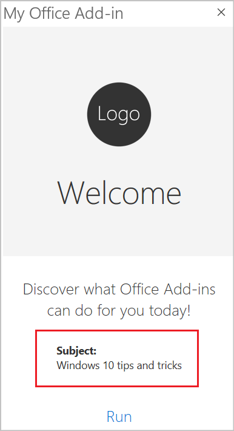

# <a name="build-your-first-outlook-add-in"></a>Создание первой надстройки Outlook

В этой статье вы ознакомитесь с процессом создания надстройки для области задач Outlook, отображающей минимум одно свойство выбранного сообщения.

## <a name="create-the-add-in"></a>Создание надстройки

Можно создать надстройку Office с помощью [генератора Yeoman для надстроек Office](../develop/yeoman-generator-overview.md) или Visual Studio. Генератор Yeoman создает проект Node.js, которым можно управлять с помощью Visual Studio Code или любого другого редактора, а Visual Studio создает решение Visual Studio. Выберите вкладку с нужным вариантом и следуйте инструкциям, чтобы создать надстройку и протестировать ее локально.

# <a name="yeoman-generator"></a>[Генератор Yeoman](#tab/yeomangenerator)

### <a name="prerequisites"></a>Необходимые условия

[!include[Set up requirements](../includes/set-up-dev-environment-beforehand.md)]

[!INCLUDE [Yeoman generator prerequisites](../includes/quickstart-yo-prerequisites.md)]

- [Visual Studio Code (VS Code)](https://code.visualstudio.com/) или используемый вами редактор кода

- Outlook 2016 или более поздней версии для Windows (подключенный к учетной записи Microsoft 365) или Outlook в Интернете

### <a name="create-the-add-in-project"></a>Создание проекта надстройки

1. [!include[Yeoman generator create project guidance](../includes/yo-office-command-guidance.md)]

    - **Выберите тип проекта** - `Office Add-in Task Pane project`

    - **Выберите тип сценария** - `JavaScript`

    - **Как вы хотите назвать надстройку?** - `My Office Add-in`

    - **Какое клиентское приложение Office должно поддерживаться?** - `Outlook`

    

    После завершения работы мастера генератор создаст проект и установит вспомогательные компоненты Node.

    [!include[Yeoman generator next steps](../includes/yo-office-next-steps.md)]

1. Перейдите в корневую папку проекта веб-приложения.

    ```command&nbsp;line
    cd "My Office Add-in"
    ```

### <a name="explore-the-project"></a>Знакомство с проектом

Проект надстройки, который вы создали с помощью генератора Yeoman, содержит образец кода для простейшей надстройки области задач.

- Файл **./manifest.xml** в корневом каталоге проекта определяет настройки и возможности надстройки.
- Файл **./src/taskpane/taskpane.html** содержит разметку HTML для области задач.
- Файл **./src/taskpane/taskpane.css** содержит код CSS, который применяется к содержимому области задач.
- Файл **./src/taskpane/taskpane.js** содержит код API JavaScript для Office, который упрощает взаимодействие между областью задачи и Outlook.

### <a name="update-the-code"></a>Обновление кода

1. Откройте проект в VS Code или используемом вами редакторе кода.
   [!INCLUDE [Instructions for opening add-in project in VS Code via command line](../includes/vs-code-open-project-via-command-line.md)]

1. Откройте файл **./src/taskpane/taskpane.html** и замените весь элемент **\<main\>** (внутри элемента **\<body\>**) приведенной ниже разметкой. Эта новая разметка добавляет метку в том месте, где скрипт **./src/taskpane/taskpane.js** запишет данные.

    ```html
    <main id="app-body" class="ms-welcome__main" style="display: none;">
        <h2 class="ms-font-xl"> Discover what Office Add-ins can do for you today! </h2>
        <p><label id="item-subject"></label></p>
        <div role="button" id="run" class="ms-welcome__action ms-Button ms-Button--hero ms-font-xl">
            <span class="ms-Button-label">Run</span>
        </div>
    </main>
    ```

1. Откройте файл **./src/taskpane/taskpane.js** в редакторе кода и добавьте приведенный ниже код в пределах функции **run**. В этом коде используется API JavaScript для Office для получения ссылки на текущее сообщение и записи значения его свойства **subject** в область задач.

    ```js
    // Get a reference to the current message
    var item = Office.context.mailbox.item;

    // Write message property value to the task pane
    document.getElementById("item-subject").innerHTML = "<b>Subject:</b> <br/>" + item.subject;
    ```

### <a name="try-it-out"></a>Проверка

[!INCLUDE [alert use https](../includes/alert-use-https.md)]

1. Выполните указанную ниже команду в корневом каталоге своего проекта. После выполнения этой команды запустится локальный веб-сервер и будет [загружена неопубликованная](../outlook/sideload-outlook-add-ins-for-testing.md) надстройка.

    ```command&nbsp;line
    npm start
    ```

1. В Outlook просмотрите сообщение в [области чтения](https://support.microsoft.com/office/2fd687ed-7fc4-4ae3-8eab-9f9b8c6d53f0) или откройте сообщение в отдельном окне.

1. Выберите вкладку **Главная** (или вкладку **Сообщения**, если вы открыли сообщение в новом окне), а затем нажмите кнопку **Показать область задач** на ленте, чтобы открыть область задач надстройки.

    

    > [!NOTE]
    > Если сообщение об ошибке "Не удается открыть эту надстройку с localhost" появляется в области задач, выполните действия, описанные в [статье по устранению неполадок](/office/troubleshoot/office-suite-issues/cannot-open-add-in-from-localhost).

1. При появлении запроса с диалоговым окном **Остановка при загрузке веб-представления** выберите **ОК**.

    [!INCLUDE [Cancelling the WebView Stop On Load dialog box](../includes/webview-stop-on-load-cancel-dialog.md)]

1. Прокрутите область задачи в самый низ и перейдите по ссылке **Выполнить**, чтобы написать тему сообщения в области задач.

    

    

### <a name="next-steps"></a>Дальнейшие действия

Поздравляем! Вы успешно создали свою первую надстройку для области задач Outlook! Теперь воспользуйтесь [руководством по надстройкам Outlook](../tutorials/outlook-tutorial.md), чтобы узнать больше о возможностях надстроек Outlook и создать более сложную надстройку.

# <a name="visual-studio"></a>[Visual Studio](#tab/visualstudio)

### <a name="prerequisites"></a>Необходимые компоненты

- [Visual Studio 2019](https://www.visualstudio.com/vs/) с установленной рабочей нагрузкой **Разработка надстроек для Office и SharePoint**

    > [!NOTE]
    > Если вы уже установили Visual Studio 2019, [используйте установщик Visual Studio](/visualstudio/install/modify-visual-studio), чтобы убедиться, что также установлена рабочая нагрузка **Разработка надстроек для Office и SharePoint**.

- Microsoft 365

    > [!NOTE]
    > Если у вас нет подписки на Microsoft 365, вы можете получить бесплатную подписку, зарегистрировавшись в [программе для разработчиков Microsoft 365](https://developer.microsoft.com/office/dev-program).

### <a name="create-the-add-in-project"></a>Создание проекта надстройки

1. В строке меню Visual Studio выберите **Файл** > **Создать** > **Проект**.

1. В списке типов проекта разверните узел **Visual C#** или **Visual Basic**, разверните **Office/SharePoint**, затем выберите **Надстройки** > **Веб-надстройка Outlook**.

1. Укажите имя проекта и нажмите кнопку **ОК**.

1. Visual Studio создаст решение, и в **обозревателе решений** появятся два соответствующих проекта. В Visual Studio откроется файл **MessageRead.html**.

### <a name="explore-the-visual-studio-solution"></a>Обзор решения Visual Studio

После завершения работы мастера Visual Studio создает решение, которое содержит два проекта.

|**Проект**|**Описание**|
|:-----|:-----|
|Проект надстройки|Содержит только XML-файл манифеста со всеми параметрами надстройки. Эти параметры помогают приложению Office определить условия активации и место отображения надстройки. Visual Studio создает этот файл автоматически, чтобы вы могли сразу запускать проект и использовать надстройку. Вы можете изменить эти параметры в любой момент, отредактировав XML-файл.|
|Проект веб-приложения|Содержит страницы контента надстройки, включающие все файлы и ссылки на файлы, необходимые для разработки страниц HTML и JavaScript с поддержкой Office. При разработке надстройки Visual Studio размещает веб-приложение на локальном сервере IIS. Для публикации надстройки этот проект веб-приложения нужно развернуть на веб-сервере.|

### <a name="update-the-code"></a>Обновление кода

1. Файл **MessageRead.html** содержит HTML-контент, который будет отображаться в области задач надстройки. Замените элемент **\<body\>** в **MessageRead.html** приведенной ниже частью кода и сохраните файл.
 
    ```HTML
    <body class="ms-font-m ms-welcome">
        <div class="ms-Fabric content-main">
            <h1 class="ms-font-xxl">Message properties</h1>
            <table class="ms-Table ms-Table--selectable">
                <thead>
                    <tr>
                        <th>Property</th>
                        <th>Value</th>
                    </tr>
                </thead>
                <tbody>
                    <tr>
                        <td><strong>Id</strong></td>
                        <td class="prop-val"><code><label id="item-id"></label></code></td>
                    </tr>
                    <tr>
                        <td><strong>Subject</strong></td>
                        <td class="prop-val"><code><label id="item-subject"></label></code></td>
                    </tr>
                    <tr>
                        <td><strong>Message Id</strong></td>
                        <td class="prop-val"><code><label id="item-internetMessageId"></label></code></td>
                    </tr>
                    <tr>
                        <td><strong>From</strong></td>
                        <td class="prop-val"><code><label id="item-from"></label></code></td>
                    </tr>
                </tbody>
            </table>
        </div>
    </body>
    ```

1. Откройте файл **MessageRead.js** в корневой папке проекта веб-приложения. Этот файл содержит скрипт надстройки. Замените все его содержимое указанным ниже кодом и сохраните файл.

    ```js
    'use strict';

    (function () {

        Office.onReady(function () {
            // Office is ready
            $(document).ready(function () {
                // The document is ready
                loadItemProps(Office.context.mailbox.item);
            });
        });

        function loadItemProps(item) {
            // Write message property values to the task pane
            $('#item-id').text(item.itemId);
            $('#item-subject').text(item.subject);
            $('#item-internetMessageId').text(item.internetMessageId);
            $('#item-from').html(item.from.displayName + " &lt;" + item.from.emailAddress + "&gt;");
        }
    })();
    ```

1. Откройте файл **MessageRead.css** в корневой папке проекта веб-приложения. Этот файл определяет специальные стили надстройки. Замените все его содержимое указанным ниже кодом и сохраните файл.

    ```CSS
    html,
    body {
        width: 100%;
        height: 100%;
        margin: 0;
        padding: 0;
    }

    td.prop-val {
        word-break: break-all;
    }

    .content-main {
        margin: 10px;
    }
    ```

### <a name="update-the-manifest"></a>Обновление манифеста

1. Откройте XML-файл манифеста в проекте надстройки. Этот файл определяет параметры и возможности надстройки.

1. Элемент **\<ProviderName\>** содержит заполнитель. Замените его на свое имя.

1. Атрибут **DefaultValue** элемента **\<DisplayName\>** содержит заполнитель. Замените его на текст `My Office Add-in`.

1. Атрибут **DefaultValue** элемента **\<Description\>** содержит заполнитель. Замените его на текст `My First Outlook add-in`.

1. Сохраните файл.

    ```xml
    ...
    <ProviderName>John Doe</ProviderName>
    <DefaultLocale>en-US</DefaultLocale>
    <!-- The display name of your add-in. Used on the store and various places of the Office UI such as the add-ins dialog. -->
    <DisplayName DefaultValue="My Office Add-in" />
    <Description DefaultValue="My First Outlook add-in"/>
    ...
    ```

### <a name="try-it-out"></a>Проверка

1. Протестируйте созданную в Visual Studio надстройку Outlook, нажав F5 или кнопку **Запуск**. Надстройка будет размещена на локальном сервере IIS.

1. В диалоговом окне **Подключение к учетной записи электронной почты Exchange** введите адрес электронной почты и пароль для вашей [учетной записи Майкрософт](https://account.microsoft.com/account) и нажмите кнопку **Подключить**. Когда в браузере откроется страница входа в Outlook.com, войдите в свою учетную запись электронной почты с теми же учетными данными, которые были введены ранее.

    > [!NOTE]
    > Если диалоговое окно **Подключение к учетной записи электронной почты Exchange** повторно предлагает выполнить вход или вы получили сообщение с ошибкой авторизации, для учетных записей в вашем клиенте Microsoft 365, возможно, отключена обычная проверка подлинности. Чтобы проверить надстройку, попробуйте войти снова, задав для свойства **Использование многофакторной проверки подлинности** значение True в диалогом окне "Свойства проекта веб-надстройки", или войдите с помощью [учетной записи Майкрософт](https://account.microsoft.com/account).

1. В Outlook в Интернете выберите или откройте сообщение.

1. В сообщении найдите многоточие, чтобы перейти в меню переполнения, содержащее кнопку надстройки.

    

1. Найдите кнопку надстройки в меню переполнения.

    

1. Нажмите кнопку, чтобы открыть область задач надстройки.

    

    > [!NOTE]
    > Если область задач не загружается, проверьте ее, открыв в браузере на том же компьютере.

### <a name="next-steps"></a>Дальнейшие действия

Поздравляем! Вы успешно создали свою первую надстройку для области задач Outlook! Теперь изучите дополнительные сведения о [разработке надстроек Office с помощью Visual Studio](../develop/develop-add-ins-visual-studio.md).

---

## <a name="see-also"></a>См. также

- [Использование Visual Studio Code для публикации](../publish/publish-add-in-vs-code.md#using-visual-studio-code-to-publish)
