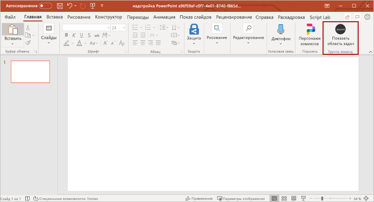
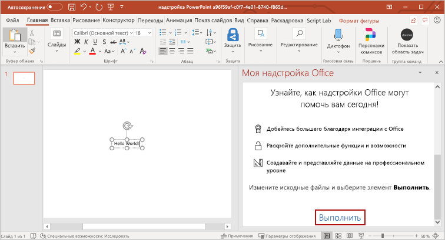
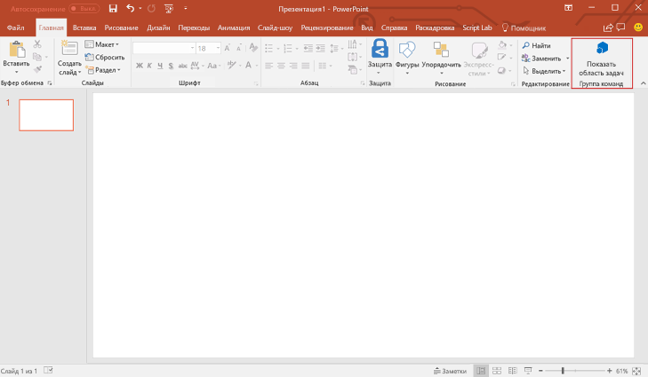
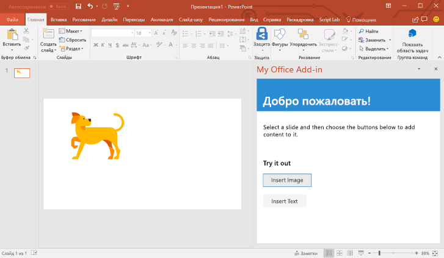
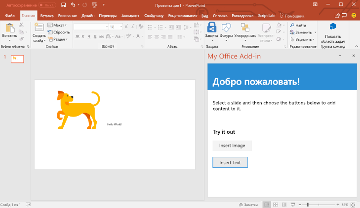

# <a name="build-your-first-powerpoint-task-pane-add-in"></a><span data-ttu-id="641b4-103">Создание первой надстройки области задач PowerPoint</span><span class="sxs-lookup"><span data-stu-id="641b4-103">Build your first PowerPoint task pane add-in</span></span>

<span data-ttu-id="641b4-104">В этой статье вы ознакомитесь с процессом создания надстройки для области задач PowerPoint.</span><span class="sxs-lookup"><span data-stu-id="641b4-104">In this article, you'll walk through the process of building a PowerPoint task pane add-in.</span></span>

## <a name="create-the-add-in"></a><span data-ttu-id="641b4-105">Создание надстройки</span><span class="sxs-lookup"><span data-stu-id="641b4-105">Create the add-in</span></span>

[!include[Choose your editor](../includes/quickstart-choose-editor.md)]

# <a name="yeoman-generator"></a>[<span data-ttu-id="641b4-106">Генератор Yeoman</span><span class="sxs-lookup"><span data-stu-id="641b4-106">Yeoman generator</span></span>](#tab/yeomangenerator)

[!include[Redirect to the single sign-on (SSO) quick start](../includes/sso-quickstart-reference.md)]

### <a name="prerequisites"></a><span data-ttu-id="641b4-107">Необходимые условия</span><span class="sxs-lookup"><span data-stu-id="641b4-107">Prerequisites</span></span>

[!include[Set up requirements](../includes/set-up-dev-environment-beforehand.md)]
[!include[Yeoman generator prerequisites](../includes/quickstart-yo-prerequisites.md)]

### <a name="create-the-add-in-project"></a><span data-ttu-id="641b4-108">Создание проекта надстройки</span><span class="sxs-lookup"><span data-stu-id="641b4-108">Create the add-in project</span></span>

[!include[Yeoman generator create project guidance](../includes/yo-office-command-guidance.md)]

- <span data-ttu-id="641b4-109">**Выберите тип проекта:** `Office Add-in Task Pane project`</span><span class="sxs-lookup"><span data-stu-id="641b4-109">**Choose a project type:** `Office Add-in Task Pane project`</span></span>
- <span data-ttu-id="641b4-110">**Выберите тип сценария:** `Javascript`</span><span class="sxs-lookup"><span data-stu-id="641b4-110">**Choose a script type:** `Javascript`</span></span>
- <span data-ttu-id="641b4-111">**Как вы хотите назвать надстройку?**</span><span class="sxs-lookup"><span data-stu-id="641b4-111">**What do you want to name your add-in?**</span></span> `My Office Add-in`
- <span data-ttu-id="641b4-112">**Какое клиентское приложение Office должно поддерживаться?**</span><span class="sxs-lookup"><span data-stu-id="641b4-112">**Which Office client application would you like to support?**</span></span> `PowerPoint`


<span data-ttu-id="641b4-114">После завершения работы мастера генератор создаст проект и установит вспомогательные компоненты Node.</span><span class="sxs-lookup"><span data-stu-id="641b4-114">After you complete the wizard, the generator creates the project and installs supporting Node components.</span></span>

[!include[Yeoman generator next steps](../includes/yo-office-next-steps.md)]

### <a name="explore-the-project"></a><span data-ttu-id="641b4-115">Знакомство с проектом</span><span class="sxs-lookup"><span data-stu-id="641b4-115">Explore the project</span></span>

[!include[Yeoman generator add-in project components](../includes/yo-task-pane-project-components-js.md)]

### <a name="try-it-out"></a><span data-ttu-id="641b4-116">Проверка</span><span class="sxs-lookup"><span data-stu-id="641b4-116">Try it out</span></span>

1. <span data-ttu-id="641b4-117">Перейдите к корневой папке проекта.</span><span class="sxs-lookup"><span data-stu-id="641b4-117">Navigate to the root folder of the project.</span></span>

    ```command&nbsp;line
    cd "My Office Add-in"
    ```

2. <span data-ttu-id="641b4-118">Выполните указанные ниже действия, чтобы запустить локальный веб-сервер и загрузить неопубликованную надстройку.</span><span class="sxs-lookup"><span data-stu-id="641b4-118">Complete the following steps to start the local web server and sideload your add-in.</span></span>

    > [!NOTE]
    > <span data-ttu-id="641b4-119">Надстройки Office должны использовать HTTPS, а не HTTP, даже в случае разработки.</span><span class="sxs-lookup"><span data-stu-id="641b4-119">Office Add-ins should use HTTPS, not HTTP, even when you are developing.</span></span> <span data-ttu-id="641b4-120">Если вам будет предложено установить сертификат после того, как вы запустите одну из указанных ниже команд, примите предложение установить сертификат, предоставленный генератором Yeoman.</span><span class="sxs-lookup"><span data-stu-id="641b4-120">If you are prompted to install a certificate after you run one of the following commands, accept the prompt to install the certificate that the Yeoman generator provides.</span></span>

    > [!TIP]
    > <span data-ttu-id="641b4-121">Если вы тестируете надстройку на компьютере Mac, перед продолжением выполните указанную ниже команду.</span><span class="sxs-lookup"><span data-stu-id="641b4-121">If you're testing your add-in on Mac, run the following command before proceeding.</span></span> <span data-ttu-id="641b4-122">После выполнения этой команды запустится локальный веб-сервер.</span><span class="sxs-lookup"><span data-stu-id="641b4-122">When you run this command, the local web server starts.</span></span>
    >
    > ```command&nbsp;line
    > npm run dev-server
    > ```

    - <span data-ttu-id="641b4-123">Чтобы проверить надстройку в PowerPoint, выполните следующую команду в корневом каталоге своего проекта.</span><span class="sxs-lookup"><span data-stu-id="641b4-123">To test your add-in in PowerPoint, run the following command in the root directory of your project.</span></span> <span data-ttu-id="641b4-124">При этом запускается локальный веб-сервер (если он еще не запущен) и открывается приложение PowerPoint с загруженной надстройкой.</span><span class="sxs-lookup"><span data-stu-id="641b4-124">This starts the local web server (if it's not already running) and opens PowerPoint with your add-in loaded.</span></span>

        ```command&nbsp;line
        npm start
        ```

    - <span data-ttu-id="641b4-125">Чтобы проверить надстройку в PowerPoint в браузере, выполните следующую команду в корневом каталоге своего проекта.</span><span class="sxs-lookup"><span data-stu-id="641b4-125">To test your add-in in PowerPoint on a browser, run the following command in the root directory of your project.</span></span> <span data-ttu-id="641b4-126">После выполнения этой команды запустится локальный веб-сервер (если он еще не запущен).</span><span class="sxs-lookup"><span data-stu-id="641b4-126">When you run this command, the local web server will start (if it's not already running).</span></span>

        ```command&nbsp;line
        npm run start:web
        ```

        <span data-ttu-id="641b4-127">Чтобы использовать надстройку, откройте новый документ в PowerPoint в Интернете и затем загрузите неопубликованную надстройку, следуя инструкциям в статье [Загрузка неопубликованных надстроек Office в Office в Интернете](../testing/sideload-office-add-ins-for-testing.md#sideload-an-office-add-in-in-office-on-the-web).</span><span class="sxs-lookup"><span data-stu-id="641b4-127">To use your add-in, open a new document in PowerPoint on the web and then sideload your add-in by following the instructions in [Sideload Office Add-ins in Office on the web](../testing/sideload-office-add-ins-for-testing.md#sideload-an-office-add-in-in-office-on-the-web).</span></span>

3. <span data-ttu-id="641b4-128">В PowerPoint вставьте новый пустой слайд, выберите вкладку **Главная** и нажмите кнопку **Показать область задач** на ленте, чтобы открыть область задач надстройки.</span><span class="sxs-lookup"><span data-stu-id="641b4-128">In PowerPoint, insert a new blank slide, choose the **Home** tab, and then choose the **Show Taskpane** button in the ribbon to open the add-in task pane.</span></span>

    

4. <span data-ttu-id="641b4-130">В нижней части области задач выберите ссылку **Выполнить**, чтобы вставить текст "Hello World" в текущий слайд.</span><span class="sxs-lookup"><span data-stu-id="641b4-130">At the bottom of the task pane, choose the **Run** link to insert the text "Hello World" into the current slide.</span></span>

    

### <a name="next-steps"></a><span data-ttu-id="641b4-132">Дальнейшие действия</span><span class="sxs-lookup"><span data-stu-id="641b4-132">Next steps</span></span>

<span data-ttu-id="641b4-133">Поздравляем! Вы успешно создали надстройку области задач PowerPoint!</span><span class="sxs-lookup"><span data-stu-id="641b4-133">Congratulations, you've successfully created a PowerPoint task pane add-in!</span></span> <span data-ttu-id="641b4-134">Теперь воспользуйтесь [руководством по надстройкам PowerPoint](../tutorials/powerpoint-tutorial.md), чтобы узнать больше о возможностях надстроек PowerPoint и создать более сложную надстройку.</span><span class="sxs-lookup"><span data-stu-id="641b4-134">Next, learn more about the capabilities of a PowerPoint add-in and build a more complex add-in by following along with the [PowerPoint add-in tutorial](../tutorials/powerpoint-tutorial.md).</span></span>

# <a name="visual-studio"></a>[<span data-ttu-id="641b4-135">Visual Studio</span><span class="sxs-lookup"><span data-stu-id="641b4-135">Visual Studio</span></span>](#tab/visualstudio)

### <a name="prerequisites"></a><span data-ttu-id="641b4-136">Необходимые компоненты</span><span class="sxs-lookup"><span data-stu-id="641b4-136">Prerequisites</span></span>

[!include[Quick Start prerequisites](../includes/quickstart-vs-prerequisites.md)]

### <a name="create-the-add-in-project"></a><span data-ttu-id="641b4-137">Создание проекта надстройки</span><span class="sxs-lookup"><span data-stu-id="641b4-137">Create the add-in project</span></span>

1. <span data-ttu-id="641b4-138">В Visual Studio выберите пункт **Создать проект**.</span><span class="sxs-lookup"><span data-stu-id="641b4-138">In Visual Studio, choose **Create a new project**.</span></span>

2. <span data-ttu-id="641b4-139">Используя поле поиска, введите **надстройка**.</span><span class="sxs-lookup"><span data-stu-id="641b4-139">Using the search box, enter **add-in**.</span></span> <span data-ttu-id="641b4-140">Выберите вариант **Веб-надстройка PowerPoint** и нажмите кнопку **Далее**.</span><span class="sxs-lookup"><span data-stu-id="641b4-140">Choose **PowerPoint Web Add-in**, then select **Next**.</span></span>

3. <span data-ttu-id="641b4-141">Присвойте проекту имя и нажмите кнопку **Создать**.</span><span class="sxs-lookup"><span data-stu-id="641b4-141">Name your project and select **Create**.</span></span>

4. <span data-ttu-id="641b4-142">В диалоговом окне **Создание надстройки Office** выберите **Добавить новые функции в PowerPoint**, а затем нажмите кнопку **Готово**, чтобы создать проект.</span><span class="sxs-lookup"><span data-stu-id="641b4-142">In the **Create Office Add-in** dialog window, choose **Add new functionalities to PowerPoint**, and then choose **Finish** to create the project.</span></span>

5. <span data-ttu-id="641b4-p107">Visual Studio создаст решение, и в **обозревателе решений** появятся два соответствующих проекта. В Visual Studio откроется файл **Home.html**.</span><span class="sxs-lookup"><span data-stu-id="641b4-p107">Visual Studio creates a solution and its two projects appear in **Solution Explorer**. The **Home.html** file opens in Visual Studio.</span></span>

### <a name="explore-the-visual-studio-solution"></a><span data-ttu-id="641b4-145">Обзор решения Visual Studio</span><span class="sxs-lookup"><span data-stu-id="641b4-145">Explore the Visual Studio solution</span></span>

[!include[Description of Visual Studio projects](../includes/quickstart-vs-solution.md)]

### <a name="update-the-code"></a><span data-ttu-id="641b4-146">Обновление кода</span><span class="sxs-lookup"><span data-stu-id="641b4-146">Update the code</span></span>

1. <span data-ttu-id="641b4-p108">Файл **Home.html** содержит HTML-контент, который будет отображаться в области задач надстройки. В файле **Home.html** замените элемент `<body>` на приведенную ниже часть кода и сохраните файл.</span><span class="sxs-lookup"><span data-stu-id="641b4-p108">**Home.html** specifies the HTML that will be rendered in the add-in's task pane. In **Home.html**, replace the `<body>` element with the following markup and save the file.</span></span>

    ```html
    <body class="ms-font-m ms-welcome">
        <div id="content-header">
            <div class="padding">
                <h1>Welcome</h1>
            </div>
        </div>
        <div id="content-main">
            <div class="padding">
                <p>Select a slide and then choose the buttons to below to add content to it.</p>
                <br />
                <h3>Try it out</h3>
                <button class="ms-Button" id="insert-image">Insert Image</button>
                <br/><br/>
                <button class="ms-Button" id="insert-text">Insert Text</button>
            </div>
        </div>
    </body>
    ```

2. <span data-ttu-id="641b4-p109">Откройте файл **Home.js** в корневой папке проекта веб-приложения. Этот файл содержит скрипт надстройки. Замените все его содержимое указанным ниже кодом и сохраните файл.</span><span class="sxs-lookup"><span data-stu-id="641b4-p109">Open the file **Home.js** in the root of the web application project. This file specifies the script for the add-in. Replace the entire contents with the following code and save the file.</span></span>

    ```js
    'use strict';

    (function () {

        Office.onReady(function() {
            // Office is ready
            $(document).ready(function () {
                // The document is ready
                $('#insert-image').click(insertImage);
                $('#insert-text').click(insertText);
            });
        });

        function insertImage() {
            Office.context.document.setSelectedDataAsync(getImageAsBase64String(), {
                coercionType: Office.CoercionType.Image,
                imageLeft: 50,
                imageTop: 50,
                imageWidth: 400
            },
                function (asyncResult) {
                    if (asyncResult.status === Office.AsyncResultStatus.Failed) {
                        console.log(asyncResult.error.message);
                    }
                });
        }  

        function insertText() {
            Office.context.document.setSelectedDataAsync("Hello World!",
                function (asyncResult) {
                    if (asyncResult.status === Office.AsyncResultStatus.Failed) {
                        console.log(asyncResult.error.message);
                    }
                });
        }

        function getImageAsBase64String() {
            return 'iVBORw0KGgoAAAANSUhEUgAAAZAAAAEFCAIAAABCdiZrAAAACXBIWXMAAAsSAAALEgHS3X78AAAbX0lEQVR42u2da2xb53nH/xIpmpRMkZQs2mZkkb7UV3lifFnmNYnorO3SLYUVpFjQYoloYA3SoZjVZRi2AVtptF+GNTUzbGiwDQu9deg2pCg9FE3aYQ3lDssw2zGNKc5lUUr6ItuULZKiJUoyJe2DFFsXXs6VOpf/D/kS6/Ac6T2Hv/M8z3nf5zTMz8+DEEL0QCOHgBBCYRFCCIVFCKGwCCGEwiKEEAqLEEJhEUIIhUUIIRQWIYTCIoQQCosQQigsQgiFRQghFBYhhFBYhBAKixBC1hArh2CBwtlYaTRV6ac2f7Cx2Q3AsTfEsSKEwlprYQ3Gpt4bFLixfU+vpdltCwTte0JNHQFrR4ADSEgdaGCL5AVGvhkSLqyV1t/gd+wN2feGHHtClBchFJbq3Hq5b+LCGfn7sfl7nI+HWw710VyEUFhqkf1BJPuDkwrusOXgsfW94ZZDfRxb8oBCEpn4yn90BmF1ozUIq5sjVCOb4RCoxMSFMxMXzlg3+D1fjDgfD3NAzE4ph6EwMlWjeKsLziDaQvCE0BbimDHCquyX8/Fb33lapZ3b9/RueD5q8wc5zuYl2VfDVqvx9MLbB28fHCwvUFjLmUknr/3xw6oewvPMNzzPRDjUZmQsgfNHpX/cewzePvgYp1NYS/j4yw1qH8K+p3fTS/GFKV3ERLw/gCuvyN2Jww9fGP4BM5e6ONP9ATZ/j9qHmHpvcOSbobnJHEfbXBSSCuykmMbwSZwNYDiCkkkvIQpryQ1sT6guueclOotIp5Rf1NZIjMIyNfZ6LbuZSV8a/W6YA05kaWvoOM6FlIndKCxdRlh1XCc4ceFM/o0ox9wsqDRHITuItx9G2kQXEoW1ZCya3S0Hj9XtcNkfRJgYmgVfGFaXWjv/4Os4FzJJVYvCWkbz4fpNTJ+bzDPIMk30HsDuqIrOyg7i7aAZ0kNOa1ghkVzqdzx1jOlcgb9jkGUaiimkow+0UkiilFdy/1YXdkeNPV2LwlrJ6KvhwtnT5f1iQYsbdifWNcPmkH2k/SK3X5j37B/gOTIaYwlMpTCeRDaBwiW5e+t+zcDOorBWUnbKu9UGjw/OdkWPtF/SpzY9C18YG57kmTImpRwycWTiotfxmMNZFFYZlvbGarTA44PLq8Jh9sv4rMOPfTGujzW4ua7HcCWKYprOorCqlhouJ2586ygAWzO8ASWyP8WFtUDXCexm2d7w988YhiNStGVEZ1FYFYOsufSgbycaLeocwA58Son9eHrxcJx9lIzPcATpqOgi/ZGLcBqqRwiFVZ7ZD37ccOY31bIVgBZgm0K7cvbgSJKnzASRfwpDYWTFNPK2uvB4ykj3M87DKsd0znL2d1W0FQAF08zCJQyFedKMjyOAwwnsOiXiI6U8zoWMNAYUVjnifRhPq3uIJmUz2NNlGu8SQ+IfwJGLIuagFi5hOEJhGZcLUVwbVP0oihfyh8KmbTliOpxBHEnCKbgb0vBJjCUoLGMmg3i7LrejFqV3WMqbahEs00McTohw1rsGKRpQWKvCq+m86kdpUWe3FJapsLpFOKuYNkZiSGGtCK9O1uNArerstpRnJcuMzhJYz0pHUUxRWMYKr+qDDGEVpiwXPnZe+NhZ/scUFp1V5X6m/yCL87CW8FfueuSDMqaMJi67I68H7k5ZAGx2z7z83PDOzZPLtuCcLHMyEsPQcUFbPvYLXb80jBHWJ7wbq4etAMjoXnPfVgBu5Gwv/eP2VQHYJZ5JM+ILwyus96TOgywK6xM+qlcyJVVYH95ovm+r+87ieSOLdMcEJYYjp3U9/YWvqgcATOfw0Zl6HMgDSJ1AvzL7A9bbZ8ts9/OAkIWyh/7kYJWfbt68+eWXX965cycvDf18ld3YHRWUGKaj2K7XOIsRFgDgaqJOB5LXpuapA3eW/u+XP50ps5GwZf3lZXc/drtx44UXXvjwww95aegsMfT0CgiyYkwJmQ8KC6/k5XAvPXX1qQN3DmwtHNha+MYXUy/82ojkXa2O11Zw9+7db3/727w0dIaQ0KmY1u/TZKaEdYywZHcBdNpnI19MKfK7HNp2951fOKtv88477/DS0BltIXh6a3d0yMTh7dPj38cICxhPqb7UGcAGueGVshzcWuCZNyZCuv7rNsKisICM+hOXLAqEVwoLa1uhehmL6BVvHxz+GtuU8jp9JxiFVRdhdUp/OKiqs3jyjYmQzsj6DLIoLPULWK2qLR6UR2gv29GYWFj6bDhDYQHjKRV33gR0avTv/sKBO8wKjYkjUDsrZEqoW2GpVnG3AAEtJoP3KT+TixiAjloPAUt5PTZvML2wVC1gbQbsmv7rv/TpWwyyjImQd1bqMMgyvbCmVavjdMpa51wfnPZZBlnGRMjbvSgsRlgPYiuPPgaAQZYxEdJD5p7+nrqYfqa7GhFWp25stRBkJf6MLbSMSM0p74ywiL5sRQiFpSsUnIRlAfy0FdEMQuruTAlNih3YovVngoToPSWksJRgA+DV9HwrQspQyuvuV6aw5NEEbFHtPYOEEApLGda54MpjIweC6BbhL47WDHxKKIl9/fhKirYimqbmNCurmxGW0aOqAwM4OIB1bg4G0ToFA06vo7CEseMY9oWxo48jQQiFpUk6erAlhC0heorokpqd3XU4Ucv0wvIuWSNqd6MjiHVueIPYEuIFX7unEtEsQlrHsIalP45GeW1XxENr6ze8StTeRkhHB43Bp4SkMkI67RJtIqQDciuFRYwTXvUacjEaI6wH+b4OU0IKi1RAyDuEiTYpJFGs1fhbh/kghUUq0HWC4ZWOuR4TEEHr8vxSWGQVvn7s5rMIPTMq4J2DfFU9MYitumMcBh2TiQvIB3sE9VDWHpw4Sj7B4ceuqE5vvOQBaQHRsW4nrFBYpsfqQlsI3j5OYjACY4naE9wB+AcoLCKD/1ViJ/uBz81zLE3NcKT2NrrNB8EallZgb2Uin5GYscMrCksz2DgERB6lHN4XYCKrS9e5P4WlDdhkmchkKCyoR7uewysKSzOs5xAQeclg5oyg8IrCIgpgB5o4CkQShSSGjgva0j+gx/WDFJYmcXEIiHiKKZwLCdrS4TfA+lBOa9AMHuC27J38tIEDWSccftgDcAbhCMAZXJull6Uckn1CXy+4ywjLrSgsLWWFdmCKA6GX0CaNYnrZNALvMXhC8PbVaZZTKYdzIRQuCdrYe8wYaxga5uc51VAz4UwWuCbj4/t5SjQSLPfiobC6swcKSZwLCY2trC48ntJ79WoB1rA0lhWy9G4AsoMYOo6fuTEcQSmn/P4zcRG2AtAdM4atKCzt4eMQGIVSHsMncTagsLbeH0DyaRG26jphpAXtTAm1lBIu8DEwwZTQWCjSCWMsgQ8GhBatFnD24IihXqfKCEt7dAIWjoKxKKaRfBrJPomhVjGFoTDOHxVtq8MJgw0kIyztRVgAxoG0+E8xwtI+VheCcRFzIIopjMSQjorIAe8f6HBCp43bKSy9CQvALSBDYRmUXadqL5HJxJGJY+S0RC0a0VbgPCztshG4B2Q5EEbkg6+jkCzTirqUw1gCmTiyidptjs1nKwpL23QCduAGB8KIjJzG9E1s/SOUcigkUUyhkBRXojKfrZgSajglvM84cA2YZUpIarFQZTfKlKuy8Cmh5mkFdgEeDgSpiq/f8LaisGSH3/XBAnRSW6Qyu04ZaTo7haVSBF7fSoEN6AT2Ap1AK+dqkU/SwCMX9d6WT0SQwDOuMyyA55NQaxaYAmaBIsfFlAG+f8AALa4orDpGWEJeUqKqvBaawbfyZJgMXz+2R/T7ti4Kay1ocnMMSL3x9GJ7ZG36BVJYuo+wCGFURWHpA3NfOqRe98Ue+MJ4KGyGh4AUFiMsok/q3HCZwjLL3U/+cgpCltL+6zj4JoehLJyHxSCLaIw7P1GlsTKFRSgsogrXYxwDCovCIjrhSpRjQGGpgFmnwxB1KaZRSHIYKCwV8PRyDIjyZOIcAwpLBQz0DiVCYVFYzAoJEU/hEp8VUlgq4AzC4ecwEOUZZxmLwlIDD4MsogLZBMeAwlIBlrGIKlkhIywKSyVh1a1dMjEP91jDorBUwhfmGBClU8JBjgGFpQ4PUViEUFh6wRmEs4fDQAiFpRNM8+YSQigs/cPSOyEUlm6wull6J4TCYlZICKGwFMcRgK+fw0AIhaUTTPYmXkIoLAZZhBAKi0EWIRQWWRlkdZ3gMBBCYemEHRHOySJEcfgiVcFM5/BRHFcTyCQxKuDlqRuAzRw1QiisOnM1gXei+OiMuE/dBjyAncNHCIVVHzJJvDWAa1K7fIwA2ziIhFBYdeC/Inj7pKw9TAC3gQ0cSkIoLPWYzuFfQoIKVbVjNMAFNHFMCVEAPiUslwYqZSsAs0CKY0oIIyw1GE/hX0OYziu5zykgA3g5uIQwwlI2E4z3KWyrBW4BExxfQigsBXkzrFgmuJo0MMshJoTCUoQL4mdaiWIW+JijTAiFpUgy+HZE9aNMAdc41oRQWDJ5a0CV0tVqssBtDjchFJZkxlN493T9DncDyHLQCaGwpDEUq/cRr/GhISFS4Dws4N3YGhw0DWzj0mgVmZvBzBhmZzAzVuFebcO6NljXw7qeo0Vh6YVMEuPpNTjuwkNDOktRpm6ieBMzYyjexNyMiA86NsHWBvsmODah0caBpLA0y0fxNTs0naUQE1cweQUTV8RJainFmyjeRP7yoryau9DSxchLi5i+hnU1sZZHX3AW61nSaN6J7tfwRLbpsxfh65dsq9XyuvM/uPI6bv0ME1c4ytqiYX5+3tQD8LeBtUkJV9AJeHg1CsayHr/0fXQ8tfTf5iZz+Tei+Teic5NKzlCxrocnCOeONfpLPzfPs01hLeHlBq38JpvZOUsYzh4cTsDqLvtDo2mLwmJKKCMO6lVx5zeAIoe4Fr5+HElWshWAxma355lI11+mnI8r+XbI0l2M/ieu/RumbvIcMMLSS4T10jwAZJIYTSKTRCYpvXtymTQH2MsLsirdr8EXFr558XJi9NVw6bbCKb9rLzzBej1MZIRFYckV1gqU8pcH6OQFWQGHH8E4nEGxn5ubzGVfj+TffEXZX8e6Ht5HYd9EYVFYuhOWUv7yA628IMvhPYbuWJU0sCYT5+Ojr4aVrWoB8AThCar8t1NYFJa6wpLsr72AhRfkikjGhd1RUWlgJUqjqZvf6ZtJK9zvrKULHY+qmR5SWBRWXYUl0F+tgJ9X44oAphfdMTgCSu1vbjI3+t3wxAWFu57Z2rDpCdVmmVJYFNZaCquSvyb+GbZbvBwfBFbdMXj71Nj36KvhwlmFm3M02uB7ErY2Ckt1OK1hTfEGsS+Mo1E0T3EwFuk6gcdTKtkKQMeLMWVnPACYm8HIm4Czh2ePwjIBhSRKeQ4DPL147BfYHZVTX19DZ+Fwgs6isEzA9RhVhUNv4XBCwYpV/Z0Fq5vOorBMwGjcvH/7fVW1hep8ZBWd5eADFArLwPlgMW3GP9zXjyMX10RV92l/PmrzKx0QWd0IxmF18dKmsIzIWEKZ/ez8C30kIw4/dp3CE1l0xyTMXFf46m92+/400distFycQQTjvLQpLCMyElNgJ95jCPwBjiRx5CK6TmgxJbG64OvHobfwWAr+AbXL6mKdpciuZtLJB//TFsL2bygTgBMKSysUUygoMfe6a+DBvX13FI+ltGIuhx++fgR/iCdy6I6tYfZXBZs/2P7cKfn7mZ3ILfv/7RF4j8nd6b0cvyXLbnwcgrUkE1dGCqtFsGCu3VEUU8jEkU1gLFGnyRNWF9pC8ITQFlrzpE8grs8PTF1OKD4JHt0xnA1wzgqFRWEtv5NX01kA/gH4BxYDumwC40kUkgpP/vL0whlEaxDOoF4ktYKOr8aKvxdQeIH0QgH+/FFe6RSW/inlkJXdTsvqEjEp3BGAIwzfkl9gPIlSbrFQcr/8X8qVSVQdftgDD8K3JjccAdgDaA1qpyAlqzjS7O54MXbrO08rvN+2ELpO4MorvN4pLIZXkFXAtroXc8kF5W03+wlpOdTXcvCY5MSwdDtV/gc7IhiNS5y8MpXiF2XZfYVDoG9hKdF6hSxNDCXPciiNpireGHZFJf5CRQqLwtKKsGSXeH39dVvLYpbvQ7Pb80xEYWEtxLAeSS8EoLAoLIZXpAquzw9YN0iZDnJvtKpcumMUFoVlYmF5erU5rckIieGLUuSybOLoahwBdJ0QvVNOHF2RXnMIRCDhJYb7+rFveRzkDWKdWwFhPcTwSi0ce0P2Pb1T74l7hjs3mZ+bzDU2V34GsiOCkZi42SSlPIopJv6MsOp2sw5iS2jZfwu2kjkHyuFnPqgq0ipZxcuJquGBe3FCHIMsCksi61ReVe8tN4tS/oJn2qouQZbCWSEWpqGIvOSUWh5PYRmBr6Rw4ISK+y8rLJkNsKwuKTdqon6QVSPCkhZkZSksCutBhOXG0Sieu4gOFXqzdPRgnbtMhC+zAZa3zxiTy40XZE29Nzg3WWu5stggq3CJzwoprFVx0LMJ7FO6/+TBcvfS6zG5u90e4RmrD5u2lnw74fHB2Q5bs3JBltiMPsPuWhTW6lDryRhCpxTbYat/5fNBRSJ8Ty+fGdXv67HtM3YnPJvREUDnHgSC2LgdznZYK785dfK8ALmIzQoVaZpGYRmQgwN48jVldnW03GoM+Q2wGF7V+XpY+m2xoMWNjgC69qNzL1xeNK56WffE+XjtrNARENcqi1khhVWRfWEF4qx9/djRp3xsX7b1FVEz7p7f9aWyP7E50L5lMeZqWVJRnJvMTwgJssRmhQyyKKxq91U59ayOnvLhlfzLjuFV3Wn45T+svkGLGxu3o2s/nO2LAVdhUMBZ9vaJ6webjvJcUFhVEzppzw07evBsoszDQfn5oKjWV0QpvMF5187aJ8e2mCp6fJj5cLD2hCyxQVYpzyCLwqqWC+BJ8dfHgRN4PlneVpBdbtfSuxvMFWQ9/FWhXycLPJuxaTvybwgIiMRmhcOMrymsqrdWEXNKO3vxW29VzAQXkFnA4uz2taJb3MjbnShdPF2q3rwBgCMgrudMMc3EkMKqyq9Gaqzd6ezFgRN47iKeTWBLqGpIn5PVAIutr9Y03J7f8llRn2jfgsyrAjQndgX7cAQlU79Hh90aaiWGX1Po+mB4peuscN+XcfXfhW9vc6ApNVi8nHDsrXob8/YBx0X8HqU8Popgt3njLEZY9ULOEla2vlpzdoh+3NG+BXf+5vkac7KsbtHvLrzyipmXQ1NY9UJOhMXWVzrMChst8DivZl+P1NhOwpPfd8OmTQwprHrZSnIDLLa+0k5WKJIWN+bOvVJjdaFHfOxcTGPIpJcEhaX58Iq20m1WuJAYZv/6C9WeGDoCcIqf8Zc5Y85ZDhSWtoXF1ldaygrnOg6K/oJZsMl/93b0N6oVs6TNBx4+acKppBSW+sh5KTxbX2nq27Lvt6V8yoI2x3s3v/VYRWdJXsAwdNxszqKw1Oe6jEuKiwc1RfWpdpWxObCheejOqc+Ud5YzKLpvslmdRWGpj+SGyGx9pTW8wXmLXbKz2psuZP/84fLOkjNtZei4eWrwFJb6+aDkhsgMr7TH/MZfkf5ls8A+lypfgJfwrHApI6cpLKIEkuf4sfWVNr8wO4/J+fhMETZ/UOEIa+FqobCIAkiuLzC80iZSy1gLzLZVmMEgp4y18HEKi8hFcgMstr7SLDLKWAAaHzqiinQoLKIAkqdfsfWVhpl37ZL2wdIMmrY+UvHHcrJCmSUwCovIEhZnt2v5O7NLYvBbmsY6f1CVKKmVERaRSSmH7KAkW7H1ldazQokVgrsVKu4yIyyH3zzxOIXF8IrUSVhzLVXvQ1a3xId9pilgUVjaE5azh7MZtE5rQGLdfWOtpYh2SZE1hUWUEJakhshc6qwHJNTd52Zh3fpojY2k3atMU3GnsDQWXrH1lU5o2Pak2I/MTFYtYMmJlVoZYZE1ERZtpRdhbdgt9iPFu6jR3x2Q8rDFTBV3CktjwmI+qBdaRZulRsVdcoRlpgIWhaUOYwkpDbB8/ZwsqhvEL9Bp3LhfaMREYVFYOgivuHhQV8w3rBP3gY0HBG0m9kGhmSruFJY6SGiAxdZXuhOWR0QZa6oA+x5hZhEbMbUywiJykNYAi9Ur3eHsEr7tdBHrAsLM0iSmLGCyijuFpQLXY6I/4vCzN4P+vjm+A8I3LlnaG5uFmUVUiidtoimFRR6QTYj+CKtXekTUAp32/ar8DuZbFEFhKYqEBlhsfaVT1onIxRoDvao4yGSPCCkspZHwfNAX5mwGXeISmo6JqLiLhcIispDQEJnldp0ieO7ovRnBFfdFDQl7EbTVZcInyxSWcpRyovNBtr4yAffu2YVW3BdNJGxj84VXFJYG8kGiW+Zc+wRt5hHZ2kHgzAZTtiGisNZOWGx9pXcsVkFbiW2pLDB0YoRFZOWDYhtgsXqld5rW19yk4osI5UNhkfqFV2x9pX/mW2svVJ6erPriiTK3vThy/117S1NW3AFYedkpg9g3PNNWumXuys9LP33JmnvH0jBbc+N79+zOjoCg6+dKVESQbsrwisJauwiL+aAeQ6r/+9HsT79mnUrbADQIs1vNinshifcHRL9gyazVTwpLIVuJaoDF1le6Yzp374fPNV3/kdgvjPVTVZspD0cwfFLK78MIi1QL1zNxZBMS3zu/Gi4e1BfjqdLfH26avS32c6UZWDZW6EJTyuFin8Q3V1JYpKKqPhhQzFMLsPWVzsLn5Pz3HrHOz0gJyypV3Es5nAtJv67MWnGnsKrcHHMYCkt8VVd1WL3SVWw1/71HGiTZCsBMES1lhTUUlnUXNGt4RWFVtpWcG2AV2PpKR0znZv/h0xaptgIw21ZuVeBwRO6N0MTzjTkPq462AqtXemLuP37fMj0i69v10JGV/1RISqyyL7vtmbekQGGtQj1bsfWVrpLBxvdek3Xjm0HT1kdW/uv7ShQETJwSUlirwnWVbAW2vtITsz9+UW6kPr2q4j6WkP5YkMKisMokg+moivtnuV0/4ZXl+k9k7qN4d9UqQgnt0lbj6TXzmaGwlpCOSnkBqtDwiq2vdMP85e/L30mZVz1Le2ElwysKqzyK3ACr5INEL8Ia+icF9rLx4Mp8UJHbYSuFRSD1fYJC74psfaWrb0X+Xbnh1SysWx9d9k8SXqfECIvCqshYQsWds3qlI8ZT8vcxM7mqgFVIUlgUlnKUcmrtma2v9EVeAWEV78Kxd3lMfU+JC8zcFXcKqy7QVuajTMWd4ZUSNMzPz/PyIoQwwiKEEAqLEEJhEUIIhUUIIRQWIYTCIoQQCosQQigsQgiFRQghFBYhhFBYhBAKixBCKCxCCKGwCCGG4/8BAjn5LoppTCkAAAAASUVORK5CYII=';
        }

    })();
    ```

3. <span data-ttu-id="641b4-p110">Откройте файл **Home.css** в корневой папке проекта веб-приложения. Этот файл определяет специальные стили надстройки. Замените все его содержимое указанным ниже кодом и сохраните файл.</span><span class="sxs-lookup"><span data-stu-id="641b4-p110">Open the file **Home.css** in the root of the web application project. This file specifies the custom styles for the add-in. Replace the entire contents with the following code and save the file.</span></span>

    ```css
    #content-header {
        background: #2a8dd4;
        color: #fff;
        position: absolute;
        top: 0;
        left: 0;
        width: 100%;
        height: 80px; 
        overflow: hidden;
    }

    #content-main {
        background: #fff;
        position: fixed;
        top: 80px;
        left: 0;
        right: 0;
        bottom: 0;
        overflow: auto; 
    }

    .padding {
        padding: 15px;
    }
    ```

### <a name="update-the-manifest"></a><span data-ttu-id="641b4-155">Обновление манифеста</span><span class="sxs-lookup"><span data-stu-id="641b4-155">Update the manifest</span></span>

1. <span data-ttu-id="641b4-156">Откройте XML-файл манифеста в проекте надстройки.</span><span class="sxs-lookup"><span data-stu-id="641b4-156">Open the XML manifest file in the add-in project.</span></span> <span data-ttu-id="641b4-157">Этот файл определяет параметры и возможности надстройки.</span><span class="sxs-lookup"><span data-stu-id="641b4-157">This file defines the add-in's settings and capabilities.</span></span>

2. <span data-ttu-id="641b4-p112">Элемент `ProviderName` содержит заполнитель. Замените его на свое имя.</span><span class="sxs-lookup"><span data-stu-id="641b4-p112">The `ProviderName` element has a placeholder value. Replace it with your name.</span></span>

3. <span data-ttu-id="641b4-p113">Атрибут `DefaultValue` элемента `DisplayName` содержит заполнитель. Замените его на строку **Моя надстройка Office**.</span><span class="sxs-lookup"><span data-stu-id="641b4-p113">The `DefaultValue` attribute of the `DisplayName` element has a placeholder. Replace it with **My Office Add-in**.</span></span>

4. <span data-ttu-id="641b4-p114">Атрибут `DefaultValue` элемента `Description` содержит заполнитель. Замените его на строку **Надстройка области задач для PowerPoint**.</span><span class="sxs-lookup"><span data-stu-id="641b4-p114">The `DefaultValue` attribute of the `Description` element has a placeholder. Replace it with **A task pane add-in for PowerPoint**.</span></span>

5. <span data-ttu-id="641b4-164">Сохраните файл.</span><span class="sxs-lookup"><span data-stu-id="641b4-164">Save the file.</span></span>

    ```xml
    ...
    <ProviderName>John Doe</ProviderName>
    <DefaultLocale>en-US</DefaultLocale>
    <!-- The display name of your add-in. Used on the store and various places of the Office UI such as the add-ins dialog. -->
    <DisplayName DefaultValue="My Office Add-in" />
    <Description DefaultValue="A task pane add-in for PowerPoint"/>
    ...
    ```

### <a name="try-it-out"></a><span data-ttu-id="641b4-165">Проверка</span><span class="sxs-lookup"><span data-stu-id="641b4-165">Try it out</span></span>

1. <span data-ttu-id="641b4-p115">Протестируйте новую надстройку PowerPoint с помощью Visual Studio, нажав клавишу **F5** или кнопку **Запустить**, чтобы запустить PowerPoint с кнопкой надстройки **Показать область задач** на ленте. Надстройка будет размещена на локальном сервере IIS.</span><span class="sxs-lookup"><span data-stu-id="641b4-p115">Using Visual Studio, test the newly created PowerPoint add-in by pressing **F5** or choosing the **Start** button to launch PowerPoint with the **Show Taskpane** add-in button displayed in the ribbon. The add-in will be hosted locally on IIS.</span></span>

2. <span data-ttu-id="641b4-168">В PowerPoint вставьте новый пустой слайд, выберите вкладку **Главная** и нажмите кнопку **Показать область задач** на ленте, чтобы открыть область задач надстройки.</span><span class="sxs-lookup"><span data-stu-id="641b4-168">In PowerPoint, insert a new blank slide, choose the **Home** tab, and then choose the **Show Taskpane** button in the ribbon to open the add-in task pane.</span></span>

    

3. <span data-ttu-id="641b4-170">В области задач нажмите кнопку **Вставить изображение**, чтобы добавить изображение на выбранный слайд.</span><span class="sxs-lookup"><span data-stu-id="641b4-170">In the task pane, choose the **Insert Image** button to add an image to the selected slide.</span></span>

    

4. <span data-ttu-id="641b4-172">В области задач нажмите кнопку **Вставить текст**, чтобы добавить текст к выбранному слайду.</span><span class="sxs-lookup"><span data-stu-id="641b4-172">In the task pane, choose the **Insert Text** button to add text to the selected slide.</span></span>

    

[!include[Console tool note](../includes/console-tool-note.md)]

### <a name="next-steps"></a><span data-ttu-id="641b4-174">Дальнейшие действия</span><span class="sxs-lookup"><span data-stu-id="641b4-174">Next steps</span></span>

<span data-ttu-id="641b4-175">Поздравляем! Вы успешно создали надстройку области задач PowerPoint!</span><span class="sxs-lookup"><span data-stu-id="641b4-175">Congratulations, you've successfully created a PowerPoint task pane add-in!</span></span> <span data-ttu-id="641b4-176">Теперь изучите дополнительные сведения о [разработке надстроек Office с помощью Visual Studio](../develop/develop-add-ins-visual-studio.md).</span><span class="sxs-lookup"><span data-stu-id="641b4-176">Next, learn more about [developing Office Add-ins with Visual Studio](../develop/develop-add-ins-visual-studio.md).</span></span>

---

## <a name="see-also"></a><span data-ttu-id="641b4-177">См. также</span><span class="sxs-lookup"><span data-stu-id="641b4-177">See also</span></span>

- [<span data-ttu-id="641b4-178">Обзор платформы надстроек Office</span><span class="sxs-lookup"><span data-stu-id="641b4-178">Office Add-ins platform overview</span></span>](../overview/office-add-ins.md)
- [<span data-ttu-id="641b4-179">Разработка надстроек Office</span><span class="sxs-lookup"><span data-stu-id="641b4-179">Develop Office Add-ins</span></span>](../develop/develop-overview.md)