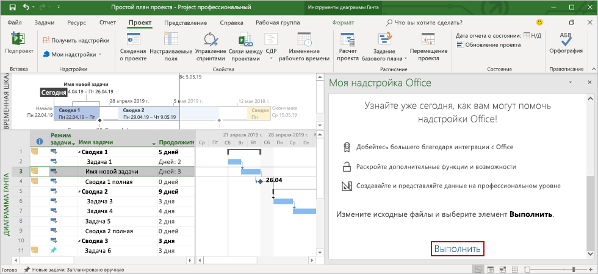

# <a name="build-your-first-project-task-pane-add-in"></a><span data-ttu-id="4390c-103">Создание первой надстройки области задач Project</span><span class="sxs-lookup"><span data-stu-id="4390c-103">Build your first Project task pane add-in</span></span>

<span data-ttu-id="4390c-104">В этой статье вы ознакомитесь с процессом создания надстройки для области задач Project.</span><span class="sxs-lookup"><span data-stu-id="4390c-104">In this article, you'll walk through the process of building a Project task pane add-in.</span></span>

## <a name="prerequisites"></a><span data-ttu-id="4390c-105">Необходимые компоненты</span><span class="sxs-lookup"><span data-stu-id="4390c-105">Prerequisites</span></span>

[!include[Set up requirements](../includes/set-up-dev-environment-beforehand.md)]
[!include[Yeoman generator prerequisites](../includes/quickstart-yo-prerequisites.md)]

- <span data-ttu-id="4390c-106">Project 2016 или более поздней версии для Windows</span><span class="sxs-lookup"><span data-stu-id="4390c-106">Project 2016 or later on Windows</span></span>

## <a name="create-the-add-in"></a><span data-ttu-id="4390c-107">Создание надстройки</span><span class="sxs-lookup"><span data-stu-id="4390c-107">Create the add-in</span></span>

[!include[Yeoman generator create project guidance](../includes/yo-office-command-guidance.md)]

- <span data-ttu-id="4390c-108">**Выберите тип проекта:** `Office Add-in Task Pane project`</span><span class="sxs-lookup"><span data-stu-id="4390c-108">**Choose a project type:** `Office Add-in Task Pane project`</span></span>
- <span data-ttu-id="4390c-109">**Выберите тип сценария:** `Javascript`</span><span class="sxs-lookup"><span data-stu-id="4390c-109">**Choose a script type:** `Javascript`</span></span>
- <span data-ttu-id="4390c-110">**Как вы хотите назвать надстройку?**</span><span class="sxs-lookup"><span data-stu-id="4390c-110">**What do you want to name your add-in?**</span></span> `My Office Add-in`
- <span data-ttu-id="4390c-111">**Какое клиентское приложение Office должно поддерживаться?**</span><span class="sxs-lookup"><span data-stu-id="4390c-111">**Which Office client application would you like to support?**</span></span> `Project`


<span data-ttu-id="4390c-113">После завершения работы мастера генератор создаст проект и установит вспомогательные компоненты Node.</span><span class="sxs-lookup"><span data-stu-id="4390c-113">After you complete the wizard, the generator creates the project and installs supporting Node components.</span></span>

[!include[Yeoman generator next steps](../includes/yo-office-next-steps.md)]

## <a name="explore-the-project"></a><span data-ttu-id="4390c-114">Знакомство с проектом</span><span class="sxs-lookup"><span data-stu-id="4390c-114">Explore the project</span></span>

<span data-ttu-id="4390c-115">Проект надстройки, который вы создали с помощью генератора Yeoman, содержит образец кода для простейшей надстройки области задач.</span><span class="sxs-lookup"><span data-stu-id="4390c-115">The add-in project that you've created with the Yeoman generator contains sample code for a very basic task pane add-in.</span></span>

- <span data-ttu-id="4390c-116">Файл **./manifest.xml** в корневом каталоге проекта определяет настройки и возможности надстройки.</span><span class="sxs-lookup"><span data-stu-id="4390c-116">The **./manifest.xml** file in the root directory of the project defines the settings and capabilities of the add-in.</span></span>
- <span data-ttu-id="4390c-117">Файл **./src/taskpane/taskpane.html** содержит разметку HTML для области задач.</span><span class="sxs-lookup"><span data-stu-id="4390c-117">The **./src/taskpane/taskpane.html** file contains the HTML markup for the task pane.</span></span>
- <span data-ttu-id="4390c-118">Файл **./src/taskpane/taskpane.css** содержит код CSS, который применяется к содержимому области задач.</span><span class="sxs-lookup"><span data-stu-id="4390c-118">The **./src/taskpane/taskpane.css** file contains the CSS that's applied to content in the task pane.</span></span>
- <span data-ttu-id="4390c-119">Файл **./src/taskpane/taskpane.js** содержит код API JavaScript для Office, который упрощает взаимодействие между областью задач и клиентским приложением Office.</span><span class="sxs-lookup"><span data-stu-id="4390c-119">The **./src/taskpane/taskpane.js** file contains the Office JavaScript API code that facilitates interaction between the task pane and the Office client application.</span></span>

## <a name="update-the-code"></a><span data-ttu-id="4390c-120">Обновление кода</span><span class="sxs-lookup"><span data-stu-id="4390c-120">Update the code</span></span>

<span data-ttu-id="4390c-121">Откройте файл **./src/taskpane/taskpane.js** в редакторе кода и добавьте следующий код в функцию `run`.</span><span class="sxs-lookup"><span data-stu-id="4390c-121">In your code editor, open the file **./src/taskpane/taskpane.js** and add the following code within the `run` function.</span></span> <span data-ttu-id="4390c-122">В этом коде используется API JavaScript для Office, чтобы настроить поле `Name` и поле `Notes` выбранной задачи.</span><span class="sxs-lookup"><span data-stu-id="4390c-122">This code uses the Office JavaScript API to set the `Name` field and `Notes` field of the selected task.</span></span>

```js
var taskGuid;

// Get the GUID of the selected task
Office.context.document.getSelectedTaskAsync(
    function (result) {
        if (result.status === Office.AsyncResultStatus.Succeeded) {
            taskGuid = result.value;

            // Set the specified fields for the selected task.
            var targetFields = [Office.ProjectTaskFields.Name, Office.ProjectTaskFields.Notes];
            var fieldValues = ['New task name', 'Notes for the task.'];

            // Set the field value. If the call is successful, set the next field.
            for (var i = 0; i < targetFields.length; i++) {
                Office.context.document.setTaskFieldAsync(
                    taskGuid,
                    targetFields[i],
                    fieldValues[i],
                    function (result) {
                        if (result.status === Office.AsyncResultStatus.Succeeded) {
                            i++;
                        }
                        else {
                            var err = result.error;
                            console.log(err.name + ' ' + err.code + ' ' + err.message);
                        }
                    }
                );
            }
        } else {
            var err = result.error;
            console.log(err.name + ' ' + err.code + ' ' + err.message);
        }
    }
);
```

## <a name="try-it-out"></a><span data-ttu-id="4390c-123">Проверка</span><span class="sxs-lookup"><span data-stu-id="4390c-123">Try it out</span></span>

1. <span data-ttu-id="4390c-124">Перейдите к корневой папке проекта.</span><span class="sxs-lookup"><span data-stu-id="4390c-124">Navigate to the root folder of the project.</span></span>

    ```command&nbsp;line
    cd "My Office Add-in"
    ```

2. <span data-ttu-id="4390c-125">Запустите локальный веб-сервер.</span><span class="sxs-lookup"><span data-stu-id="4390c-125">Start the local web server.</span></span>

    > [!NOTE]
    > <span data-ttu-id="4390c-126">Надстройки Office должны использовать HTTPS, а не HTTP, даже в случае разработки.</span><span class="sxs-lookup"><span data-stu-id="4390c-126">Office Add-ins should use HTTPS, not HTTP, even when you are developing.</span></span> <span data-ttu-id="4390c-127">Если вам будет предложено установить сертификат после того, как вы запустите указанную ниже команду, примите предложение установить сертификат, предоставленный генератором Yeoman.</span><span class="sxs-lookup"><span data-stu-id="4390c-127">If you are prompted to install a certificate after you run the following command, accept the prompt to install the certificate that the Yeoman generator provides.</span></span>

    <span data-ttu-id="4390c-128">Выполните следующую команду в корневом каталоге своего проекта.</span><span class="sxs-lookup"><span data-stu-id="4390c-128">Run the following command in the root directory of your project.</span></span> <span data-ttu-id="4390c-129">После выполнения этой команды запустится локальный веб-сервер.</span><span class="sxs-lookup"><span data-stu-id="4390c-129">When you run this command, the local web server will start.</span></span>

    ```command&nbsp;line
    npm run dev server
    ```

3. <span data-ttu-id="4390c-130">В Project создайте простой план проекта.</span><span class="sxs-lookup"><span data-stu-id="4390c-130">In Project, create a simple project plan.</span></span>

4. <span data-ttu-id="4390c-131">Загрузите свою надстройку в Project, следуя инструкциям в статье [Загрузка неопубликованных надстроек Office в Windows](../testing/create-a-network-shared-folder-catalog-for-task-pane-and-content-add-ins.md).</span><span class="sxs-lookup"><span data-stu-id="4390c-131">Load your add-in in Project by following the instructions in [Sideload Office Add-ins on Windows](../testing/create-a-network-shared-folder-catalog-for-task-pane-and-content-add-ins.md).</span></span>

5. <span data-ttu-id="4390c-132">Выберите отдельную задачу в проекте.</span><span class="sxs-lookup"><span data-stu-id="4390c-132">Select a single task within the project.</span></span>

6. <span data-ttu-id="4390c-133">В нижней части области задач щелкните ссылку **Выполнить**, чтобы переименовать выбранную задачу и добавить к ней примечания.</span><span class="sxs-lookup"><span data-stu-id="4390c-133">At the bottom of the task pane, choose the **Run** link to rename the selected task and add notes to the selected task.</span></span>

    

## <a name="next-steps"></a><span data-ttu-id="4390c-135">Дальнейшие действия</span><span class="sxs-lookup"><span data-stu-id="4390c-135">Next steps</span></span>

<span data-ttu-id="4390c-136">Поздравляем! Вы успешно создали надстройку области задач Project!</span><span class="sxs-lookup"><span data-stu-id="4390c-136">Congratulations, you've successfully created a Project task pane add-in!</span></span> <span data-ttu-id="4390c-137">Следующим шагом узнайте больше о возможностях надстроек Project и изучите распространенные сценарии.</span><span class="sxs-lookup"><span data-stu-id="4390c-137">Next, learn more about the capabilities of a Project add-in and explore common scenarios.</span></span>

> [!div class="nextstepaction"]
> [<span data-ttu-id="4390c-138">Надстройки Project</span><span class="sxs-lookup"><span data-stu-id="4390c-138">Project add-ins</span></span>](../project/project-add-ins.md)

## <a name="see-also"></a><span data-ttu-id="4390c-139">См. также</span><span class="sxs-lookup"><span data-stu-id="4390c-139">See also</span></span>

- [<span data-ttu-id="4390c-140">Разработка надстроек Office</span><span class="sxs-lookup"><span data-stu-id="4390c-140">Develop Office Add-ins</span></span>](../develop/develop-overview.md)
- [<span data-ttu-id="4390c-141">Основные принципы надстроек Office</span><span class="sxs-lookup"><span data-stu-id="4390c-141">Core concepts for Office Add-ins</span></span>](../overview/core-concepts-office-add-ins.md)
