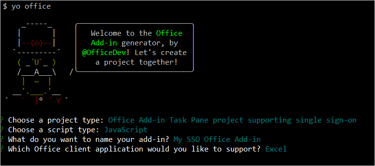
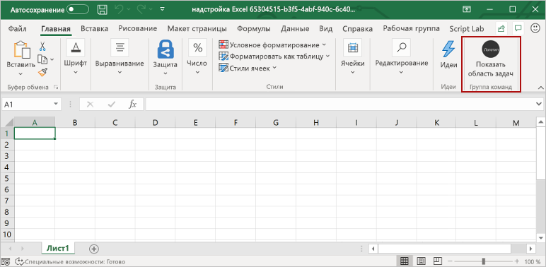
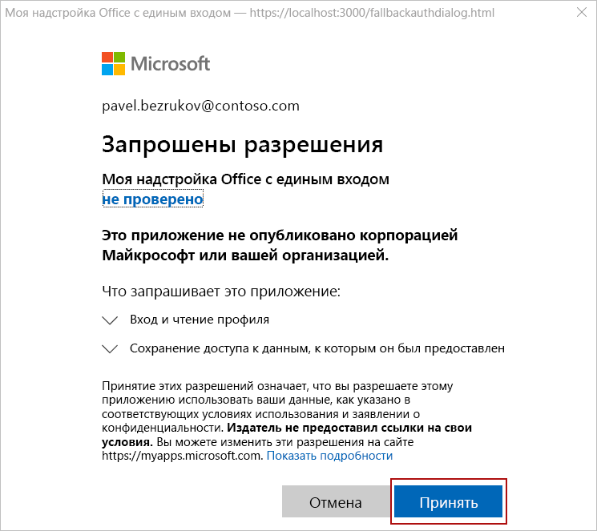
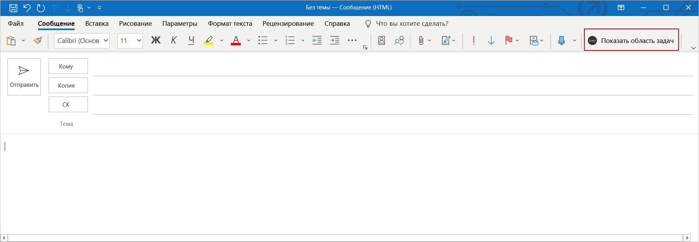
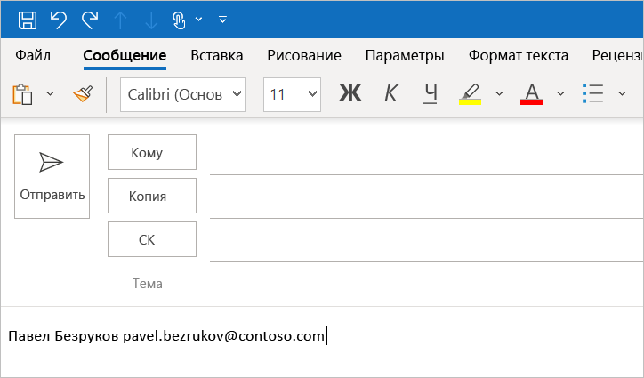

# <a name="use-the-yeoman-generator-to-create-an-office-add-in-that-uses-single-sign-on-preview"></a><span data-ttu-id="073e3-103">Создание надстройки Office, в которой используется единый вход (предварительная версия), с помощью генератора Yeoman</span><span class="sxs-lookup"><span data-stu-id="073e3-103">Use the Yeoman generator to create an Office Add-in that uses single sign-on (preview)</span></span>

<span data-ttu-id="073e3-104">В этой статье описывается процесс использования генератора Yeoman для создания надстройки Office для Excel, Outlook, Word или PowerPoint, в которой используется единый вход (SSO), когда это возможно, и альтернативный метод проверки подлинности пользователей, если единый вход не поддерживается.</span><span class="sxs-lookup"><span data-stu-id="073e3-104">In this article, you'll walk through the process of using the Yeoman generator to create an Office Add-in for Excel, Outlook, Word, or PowerPoint that uses single sign-on (SSO) when possible, and uses an alternate method of user authentication when SSO is not supported.</span></span>

> [!TIP]
> <span data-ttu-id="073e3-105">Прежде чем приступить к работе, познакомьтесь с основными понятиями, связанными с использованием единого входа в надстройках Office, с помощью статьи [Включение единого входа для надстроек Office](../develop/sso-in-office-add-ins.md).</span><span class="sxs-lookup"><span data-stu-id="073e3-105">Before you attempt to complete this quick start, review [Enable single sign-on for Office Add-ins](../develop/sso-in-office-add-ins.md) to learn basic concepts about SSO in Office Add-ins.</span></span> 
 
<span data-ttu-id="073e3-106">Генератор Yeoman упрощает процесс создания надстройки с использованием единого входа, автоматизируя действия, необходимые для настройки единого входа в Azure, и создавая код, необходимый для его использования в надстройке.</span><span class="sxs-lookup"><span data-stu-id="073e3-106">The Yeoman generator simplifies the process of creating an SSO add-in, by automating the steps required to configure SSO within Azure and generating the code that's necessary for an add-in to use SSO.</span></span> <span data-ttu-id="073e3-107">Подробное пошаговое руководство, в котором объясняется, как вручную выполнить действия, автоматизируемые генератором Yeoman, см. в статье [Создание надстройки Office на платформе Node.js с использованием единого входа](../develop/create-sso-office-add-ins-nodejs.md).</span><span class="sxs-lookup"><span data-stu-id="073e3-107">For a detailed walkthrough that describes how to manually complete the steps that the Yeoman generator automates, see the [Create a Node.js Office Add-in that uses single sign-on](../develop/create-sso-office-add-ins-nodejs.md) tutorial.</span></span>

## <a name="prerequisites"></a><span data-ttu-id="073e3-108">Необходимые компоненты</span><span class="sxs-lookup"><span data-stu-id="073e3-108">Prerequisites</span></span>

* <span data-ttu-id="073e3-109">[Node.js](https://nodejs.org) (последняя версия [LTS](https://nodejs.org/about/releases)).</span><span class="sxs-lookup"><span data-stu-id="073e3-109">[Node.js](https://nodejs.org) (the latest [LTS](https://nodejs.org/about/releases) version).</span></span>

* <span data-ttu-id="073e3-110">Последняя версия [Yeoman](https://github.com/yeoman/yo) и [генератора Yeoman для надстроек Office](https://github.com/OfficeDev/generator-office). Выполните в командной строке указанную ниже команду, чтобы установить эти инструменты глобально.</span><span class="sxs-lookup"><span data-stu-id="073e3-110">The latest version of [Yeoman](https://github.com/yeoman/yo) and the [Yeoman generator for Office Add-ins](https://github.com/OfficeDev/generator-office). To install these tools globally, run the following command via the command prompt:</span></span>

    ```command&nbsp;line
    npm install -g yo generator-office
    ```

    [!include[note to update Yeoman generator](../includes/note-yeoman-generator-update.md)]

[!include[additional prerequisites](../includes/sso-tutorial-prereqs.md)]

* <span data-ttu-id="073e3-111">Если вы используете компьютер Mac, на котором не установлено приложение Azure CLI, необходимо установить [Homebrew](https://brew.sh/).</span><span class="sxs-lookup"><span data-stu-id="073e3-111">If you're using a Mac and don't have the Azure CLI installed on your machine, you must install [Homebrew](https://brew.sh/).</span></span> <span data-ttu-id="073e3-112">Сценарий конфигурации единого входа, который вы запустите во время этого быстрого запуска, будет использовать Homebrew для установки Azure CLI, а затем будет использовать Azure CLI для настройки единого входа в Azure.</span><span class="sxs-lookup"><span data-stu-id="073e3-112">The SSO configuration script that you'll run during this quick start will use Homebrew to install the Azure CLI, and will then use the Azure CLI to configure SSO within Azure.</span></span>

## <a name="create-the-add-in-project"></a><span data-ttu-id="073e3-113">Создание проекта надстройки</span><span class="sxs-lookup"><span data-stu-id="073e3-113">Create the add-in project</span></span>

> [!TIP]
> <span data-ttu-id="073e3-114">С помощью генератора Yeoman можно создать надстройку Office с использованием единого входа для Excel, Outlook, Word или PowerPoint, работа которой основана на сценарии JavaScript или TypeScript.</span><span class="sxs-lookup"><span data-stu-id="073e3-114">The Yeoman generator can create an SSO-enabled Office Add-in for Excel, Outlook, Word, or PowerPoint, and can be created with script type of JavaScript or TypeScript.</span></span> <span data-ttu-id="073e3-115">В приведенных ниже инструкциях указаны `JavaScript` и `Excel`, однако следует выбрать тип сценария и клиентское приложение Office, которое лучше всего подходит для вашего сценария.</span><span class="sxs-lookup"><span data-stu-id="073e3-115">The following instructions specify `JavaScript` and `Excel`, but you should choose the script type and Office client application that best suits your scenario.</span></span>

[!include[Yeoman generator create project guidance](../includes/yo-office-command-guidance.md)]

- <span data-ttu-id="073e3-116">**Выберите тип проекта:** `Office Add-in Task Pane project supporting single sign-on`</span><span class="sxs-lookup"><span data-stu-id="073e3-116">**Choose a project type:** `Office Add-in Task Pane project supporting single sign-on`</span></span>
- <span data-ttu-id="073e3-117">**Выберите тип сценария:** `Javascript`</span><span class="sxs-lookup"><span data-stu-id="073e3-117">**Choose a script type:** `Javascript`</span></span>
- <span data-ttu-id="073e3-118">**Как вы хотите назвать надстройку?**</span><span class="sxs-lookup"><span data-stu-id="073e3-118">**What do you want to name your add-in?**</span></span> `My SSO Office Add-in`
- <span data-ttu-id="073e3-119">**Какое клиентское приложение Office должно поддерживаться?**</span><span class="sxs-lookup"><span data-stu-id="073e3-119">**Which Office client application would you like to support?**</span></span> `Excel`



<span data-ttu-id="073e3-121">После завершения работы мастера генератор создаст проект и установит вспомогательные компоненты Node.</span><span class="sxs-lookup"><span data-stu-id="073e3-121">After you complete the wizard, the generator creates the project and installs supporting Node components.</span></span>

[!include[Yeoman generator next steps](../includes/yo-office-next-steps.md)]

## <a name="explore-the-project"></a><span data-ttu-id="073e3-122">Знакомство с проектом</span><span class="sxs-lookup"><span data-stu-id="073e3-122">Explore the project</span></span>

<span data-ttu-id="073e3-123">Проект надстройки, который вы создали с помощью генератора Yeoman, содержит код для надстройки области задач с использованием единого входа.</span><span class="sxs-lookup"><span data-stu-id="073e3-123">The add-in project that you've created with the Yeoman generator contains code for an SSO-enabled task pane add-in.</span></span>

[!include[project structure for an SSO-enabled add-in created with the Yeoman generator](../includes/sso-yeoman-project-structure.md)]

## <a name="configure-sso"></a><span data-ttu-id="073e3-124">Настройка единого входа</span><span class="sxs-lookup"><span data-stu-id="073e3-124">Configure SSO</span></span>

<span data-ttu-id="073e3-125">На этом этапе проект надстройки уже создан и содержит код, необходимый для упрощения процесса единого входа.</span><span class="sxs-lookup"><span data-stu-id="073e3-125">At this point, your add-in project has been created and contains the code that's necessary to facilitate the SSO process.</span></span> <span data-ttu-id="073e3-126">Выполните указанные ниже действия, чтобы настроить единый вход для вашей надстройки.</span><span class="sxs-lookup"><span data-stu-id="073e3-126">Next, complete the following steps to configure SSO for your add-in.</span></span>

1. <span data-ttu-id="073e3-127">Перейдите к корневой папке проекта.</span><span class="sxs-lookup"><span data-stu-id="073e3-127">Navigate to the root folder of the project.</span></span>

    ```command&nbsp;line
    cd "My SSO Office Add-in"
    ```

2. <span data-ttu-id="073e3-128">Чтобы настроить единый вход для надстройки, выполните приведенную ниже команду.</span><span class="sxs-lookup"><span data-stu-id="073e3-128">Run the following command to configure SSO for the add-in.</span></span>

    ```command&nbsp;line
    npm run configure-sso
    ```

    > [!WARNING]
    > <span data-ttu-id="073e3-129">Эта команда приведет к ошибке, если для клиента настроена двухфакторная проверка подлинности.</span><span class="sxs-lookup"><span data-stu-id="073e3-129">This command will fail if your tenant is configured to require two-factor authentication.</span></span> <span data-ttu-id="073e3-130">В этом случае вам потребуется выполнить регистрацию приложения в Azure и настройку единого входа вручную, как описано в статье [Создание надстройки Office на платформе Node.js с использованием единого входа](../develop/create-sso-office-add-ins-nodejs.md).</span><span class="sxs-lookup"><span data-stu-id="073e3-130">In this scenario, you'll need to manually complete the Azure app registration and SSO configuration steps, as described in the [Create a Node.js Office Add-in that uses single sign-on](../develop/create-sso-office-add-ins-nodejs.md) tutorial.</span></span>

3. <span data-ttu-id="073e3-131">Откроется окно веб-браузера, в котором вам будет предложено войти в Azure.</span><span class="sxs-lookup"><span data-stu-id="073e3-131">A web browser window will open and prompt you to sign in to Azure.</span></span> <span data-ttu-id="073e3-132">Войдите в Azure, используя учетные данные администратора Office 365.</span><span class="sxs-lookup"><span data-stu-id="073e3-132">Sign in to Azure using your Office 365 administrator credentials.</span></span> <span data-ttu-id="073e3-133">Эти учетные данные будут использоваться для регистрации нового приложения в Azure и настройки параметров, необходимых для единого входа.</span><span class="sxs-lookup"><span data-stu-id="073e3-133">These credentials will be used to register a new application in Azure and configure the settings required by SSO.</span></span>

    > [!NOTE]
    > <span data-ttu-id="073e3-134">Если на этом этапе для входа в Azure вы используете учетные данные без прав администратора, сценарий `configure-sso` не сможет предоставить согласие администратора для надстройки пользователям в организации.</span><span class="sxs-lookup"><span data-stu-id="073e3-134">If you sign in to Azure using non-administrator credentials during this step, the `configure-sso` script won't be able to provide administrator consent for the add-in to users within your organization.</span></span> <span data-ttu-id="073e3-135">В этом случае единый вход будет недоступен для пользователей надстройки, и им будет предложено выполнить вход.</span><span class="sxs-lookup"><span data-stu-id="073e3-135">SSO will therefore not be available to users of the add-in and they'll be prompted to sign-in.</span></span>

4. <span data-ttu-id="073e3-136">После ввода учетных данных закройте окно браузера и вернитесь к командной строке.</span><span class="sxs-lookup"><span data-stu-id="073e3-136">After you enter your credentials, close the browser window and return to the command prompt.</span></span> <span data-ttu-id="073e3-137">В процессе настройки единого входа на консоль будут выводиться сообщения о состоянии.</span><span class="sxs-lookup"><span data-stu-id="073e3-137">As the SSO configuration process continues, you'll see status messages being written to the console.</span></span> <span data-ttu-id="073e3-138">В соответствии с ними, файлы проекта надстройки, созданные генератором Yeoman, автоматически обновляются с учетом данных, необходимых для процесса единого входа.</span><span class="sxs-lookup"><span data-stu-id="073e3-138">As described in the console messages, files within the add-in project that the Yeoman generator created are automatically updated with data that's required by the SSO process.</span></span>

## <a name="try-it-out"></a><span data-ttu-id="073e3-139">Проверка</span><span class="sxs-lookup"><span data-stu-id="073e3-139">Try it out</span></span>

<span data-ttu-id="073e3-140">Если вы создали надстройку Excel, Word или PowerPoint, выполните действия из следующего раздела, чтобы попробовать ее в действии. Если вы создали надстройку Outlook, выполните действия из раздела [Outlook](#outlook).</span><span class="sxs-lookup"><span data-stu-id="073e3-140">If you've created an Excel, Word, or PowerPoint add-in, complete the steps in the following section to try it out. If you've created an Outlook add-in, complete the steps in the [Outlook](#outlook) section instead.</span></span>

### <a name="excel-word-and-powerpoint"></a><span data-ttu-id="073e3-141">Excel, Word и PowerPoint</span><span class="sxs-lookup"><span data-stu-id="073e3-141">Excel, Word, and PowerPoint</span></span>

<span data-ttu-id="073e3-142">Выполните следующие действия, чтобы испытать надстройку Excel, Word или PowerPoint.</span><span class="sxs-lookup"><span data-stu-id="073e3-142">Complete the following steps to try out an Excel, Word, or PowerPoint add-in.</span></span>

1. <span data-ttu-id="073e3-143">Когда процесс настройки единого входа будет завершен, для построения проекта, запуска локального веб-сервера и загрузки своей надстройки в ранее выбранное клиентское приложение Office запустите указанную ниже команду.</span><span class="sxs-lookup"><span data-stu-id="073e3-143">When the SSO configuration process completes, run the following command to build the project, start the local web server, and sideload your add-in in the previously selected Office client application.</span></span>

    > [!NOTE]
    > <span data-ttu-id="073e3-144">Надстройки Office должны использовать HTTPS, а не HTTP, даже в случае разработки.</span><span class="sxs-lookup"><span data-stu-id="073e3-144">Office Add-ins should use HTTPS, not HTTP, even when you are developing.</span></span> <span data-ttu-id="073e3-145">Если вам будет предложено установить сертификат после того, как вы запустите указанную ниже команду, примите предложение установить сертификат, предоставленный генератором Yeoman.</span><span class="sxs-lookup"><span data-stu-id="073e3-145">If you are prompted to install a certificate after you run the following command, accept the prompt to install the certificate that the Yeoman generator provides.</span></span>

    ```command&nbsp;line
    npm start
    ```

2. <span data-ttu-id="073e3-146">Убедитесь, что в клиентском приложении Office (например, Excel, Word или PowerPoint), которое открывается при запуске указанной выше команды, вы выполнили вход как участник той же организации Office 365, что и администратор, учетную запись которого вы использовали для подключения к Azure в процессе настройки единого входа на этапе 3, описанном в [предыдущем разделе](#configure-sso).</span><span class="sxs-lookup"><span data-stu-id="073e3-146">In the Office client application that opens when you run the previous command (i.e., Excel, Word or PowerPoint), make sure that you're signed in with a user that's a member of the same Office 365 organization as the Office 365 administrator account that you used to connect to Azure while configuring SSO in step 3 of the [previous section](#configure-sso).</span></span> <span data-ttu-id="073e3-147">Благодаря этому будут созданы соответствующие условия для успешного единого входа.</span><span class="sxs-lookup"><span data-stu-id="073e3-147">Doing so establishes the appropriate conditions for SSO to succeed.</span></span> 

3. <span data-ttu-id="073e3-148">В клиентском приложении Office выберите вкладку **Главная** и нажмите кнопку **Показать область задач** на ленте, чтобы открыть область задач надстройки.</span><span class="sxs-lookup"><span data-stu-id="073e3-148">In the Office client application, choose the **Home** tab, and then choose the **Show Taskpane** button in the ribbon to open the add-in task pane.</span></span> <span data-ttu-id="073e3-149">На рисунке ниже показана эта кнопка в Excel. </span><span class="sxs-lookup"><span data-stu-id="073e3-149">The following image shows this button in Excel.</span></span>

    

4. <span data-ttu-id="073e3-151">В нижней части области задач нажмите кнопку **Получить сведения о моем профиле пользователя**, чтобы начать процесс единого входа.</span><span class="sxs-lookup"><span data-stu-id="073e3-151">At the bottom of the task pane, choose the **Get My User Profile Information** button to initiate the SSO process.</span></span> 

5. <span data-ttu-id="073e3-152">Если открывается диалоговое окно, в котором запрашиваются разрешения от имени надстройки, это означает, что единый вход не поддерживается для вашего сценария и надстройка использует альтернативный метод проверки подлинности пользователя.</span><span class="sxs-lookup"><span data-stu-id="073e3-152">If a dialog window appears to request permissions on behalf of the add-in, this means that SSO is not supported for your scenario and the add-in has instead fallen back to an alternate method of user authentication.</span></span> <span data-ttu-id="073e3-153">Это может произойти, если администратор клиента не дал согласие на доступ надстройки к Microsoft Graph или если пользователь не вошел в Office с помощью действительной учетной записи Майкрософт или Office 365 (рабочей или учебной учетной записи).</span><span class="sxs-lookup"><span data-stu-id="073e3-153">This may occur when the tenant administrator hasn't granted consent for the add-in to access Microsoft Graph, or when the user isn't signed into Office with a valid Microsoft Account or Office 365 ("Work or School") account.</span></span> <span data-ttu-id="073e3-154">Чтобы продолжить, нажмите кнопку **Принять** в диалоговом окне.</span><span class="sxs-lookup"><span data-stu-id="073e3-154">Choose the **Accept** button in the dialog window to continue.</span></span>

    

    > [!NOTE]
    > <span data-ttu-id="073e3-156">После принятия пользователем запрос разрешений больше не выводится на экран.</span><span class="sxs-lookup"><span data-stu-id="073e3-156">After a user accepts this permissions request, they won't be prompted again in the future.</span></span>

6. <span data-ttu-id="073e3-157">Надстройка получает сведения о профиле пользователя, выполнившего вход, и вносит их в документ.</span><span class="sxs-lookup"><span data-stu-id="073e3-157">The add-in retrieves profile information for the signed-in user and writes it to the document.</span></span> <span data-ttu-id="073e3-158">На приведенном ниже рисунке показан пример сведений о профиле, внесенных на лист Excel.</span><span class="sxs-lookup"><span data-stu-id="073e3-158">The following image shows an example of profile information written to an Excel worksheet.</span></span>

    

### <a name="outlook"></a><span data-ttu-id="073e3-160">Outlook</span><span class="sxs-lookup"><span data-stu-id="073e3-160">Outlook</span></span>

<span data-ttu-id="073e3-161">Выполните следующие действия, чтобы испытать надстройку Outlook.</span><span class="sxs-lookup"><span data-stu-id="073e3-161">Complete the following steps to try out an Outlook add-in.</span></span>

1. <span data-ttu-id="073e3-162">По завершении процесса настройки единого входа выполните следующую команду, чтобы создать проект и запустить локальный веб-сервер.</span><span class="sxs-lookup"><span data-stu-id="073e3-162">When the SSO configuration process completes, run the following command to build the project and start the local web server.</span></span>

    > [!NOTE]
    > <span data-ttu-id="073e3-163">Надстройки Office должны использовать HTTPS, а не HTTP, даже в случае разработки.</span><span class="sxs-lookup"><span data-stu-id="073e3-163">Office Add-ins should use HTTPS, not HTTP, even when you are developing.</span></span> <span data-ttu-id="073e3-164">Если вам будет предложено установить сертификат после того, как вы запустите указанную ниже команду, примите предложение установить сертификат, предоставленный генератором Yeoman.</span><span class="sxs-lookup"><span data-stu-id="073e3-164">If you are prompted to install a certificate after you run the following command, accept the prompt to install the certificate that the Yeoman generator provides.</span></span>

    ```command&nbsp;line
    npm start
    ```

2. <span data-ttu-id="073e3-165">Чтобы загрузить неопубликованную надстройку в Outlook, следуйте инструкциями из статьи [Загрузка неопубликованных надстроек Outlook для тестирования](../outlook/sideload-outlook-add-ins-for-testing.md).</span><span class="sxs-lookup"><span data-stu-id="073e3-165">Follow the instructions in [Sideload Outlook add-ins for testing](../outlook/sideload-outlook-add-ins-for-testing.md) to sideload the add-in in Outlook.</span></span> <span data-ttu-id="073e3-166">Убедитесь, что вход в Outlook выполнен в качестве участника той же организации Office 365, что и администратор, учетную запись которого вы использовали для подключения к Azure в процессе настройки единого входа на этапе 3, описанном в [предыдущем разделе](#configure-sso).</span><span class="sxs-lookup"><span data-stu-id="073e3-166">Make sure that you're signed in to Outlook with a user that's a member of the same Office 365 organization as the Office 365 administrator account that you used to connect to Azure while configuring SSO in step 3 of the [previous section](#configure-sso).</span></span> <span data-ttu-id="073e3-167">Благодаря этому будут созданы соответствующие условия для успешного единого входа.</span><span class="sxs-lookup"><span data-stu-id="073e3-167">Doing so establishes the appropriate conditions for SSO to succeed.</span></span> 

3. <span data-ttu-id="073e3-168">В Outlook создайте новое сообщение.</span><span class="sxs-lookup"><span data-stu-id="073e3-168">In Outlook, compose a new message.</span></span>

4. <span data-ttu-id="073e3-169">В окне создания сообщения нажмите кнопку **Показать область задач** на ленте, чтобы открыть область задач надстройки.</span><span class="sxs-lookup"><span data-stu-id="073e3-169">In the message compose window, choose the **Show Taskpane** button in the ribbon to open the add-in task pane.</span></span>

    

5. <span data-ttu-id="073e3-171">В нижней части области задач нажмите кнопку **Получить сведения о моем профиле пользователя**, чтобы начать процесс единого входа.</span><span class="sxs-lookup"><span data-stu-id="073e3-171">At the bottom of the task pane, choose the **Get My User Profile Information** button to initiate the SSO process.</span></span> 

6. <span data-ttu-id="073e3-172">Если открывается диалоговое окно, в котором запрашиваются разрешения от имени надстройки, это означает, что единый вход не поддерживается для вашего сценария и надстройка использует альтернативный метод проверки подлинности пользователя.</span><span class="sxs-lookup"><span data-stu-id="073e3-172">If a dialog window appears to request permissions on behalf of the add-in, this means that SSO is not supported for your scenario and the add-in has instead fallen back to an alternate method of user authentication.</span></span> <span data-ttu-id="073e3-173">Это может произойти, если администратор клиента не дал согласие на доступ надстройки к Microsoft Graph или если пользователь не вошел в Office с помощью действительной учетной записи Майкрософт или Office 365 (рабочей или учебной учетной записи).</span><span class="sxs-lookup"><span data-stu-id="073e3-173">This may occur when the tenant administrator hasn't granted consent for the add-in to access Microsoft Graph, or when the user isn't signed into Office with a valid Microsoft Account or Office 365 ("Work or School") account.</span></span> <span data-ttu-id="073e3-174">Чтобы продолжить, нажмите кнопку **Принять** в диалоговом окне.</span><span class="sxs-lookup"><span data-stu-id="073e3-174">Choose the **Accept** button in the dialog window to continue.</span></span>

    

    > [!NOTE]
    > <span data-ttu-id="073e3-176">После принятия пользователем запрос разрешений больше не выводится на экран.</span><span class="sxs-lookup"><span data-stu-id="073e3-176">After a user accepts this permissions request, they won't be prompted again in the future.</span></span>

7. <span data-ttu-id="073e3-177">Надстройка получает сведения о профиле пользователя, выполнившего вход, и вносит их в текст сообщения электронной почты.</span><span class="sxs-lookup"><span data-stu-id="073e3-177">The add-in retrieves profile information for the signed-in user and writes it to the body of the email message.</span></span> 

    

## <a name="next-steps"></a><span data-ttu-id="073e3-179">Дальнейшие действия</span><span class="sxs-lookup"><span data-stu-id="073e3-179">Next steps</span></span>

<span data-ttu-id="073e3-180">Поздравляем! Вы успешно создали надстройку области задач, в которой используется единый вход, когда это возможно, и альтернативный метод проверки подлинности пользователей, если единый вход не поддерживается.</span><span class="sxs-lookup"><span data-stu-id="073e3-180">Congratulations, you've successfully created a task pane add-in that uses SSO when possible, and uses an alternate method of user authentication when SSO is not supported.</span></span> <span data-ttu-id="073e3-181">Сведения о настройке надстройки для добавления новых функций, требующих другие разрешения, см. в статье [Настройка надстройки Node.js с поддержкой единого входа](sso-quickstart-customize.md).</span><span class="sxs-lookup"><span data-stu-id="073e3-181">To learn about customizing your add-in to add new functionality that requires different permissions, see [Customize your Node.js SSO-enabled add-in](sso-quickstart-customize.md).</span></span>

## <a name="see-also"></a><span data-ttu-id="073e3-182">См. также</span><span class="sxs-lookup"><span data-stu-id="073e3-182">See also</span></span>

- [<span data-ttu-id="073e3-183">Включение единого входа для надстроек Office</span><span class="sxs-lookup"><span data-stu-id="073e3-183">Enable single sign-on for Office Add-ins</span></span>](../develop/sso-in-office-add-ins.md)
- [<span data-ttu-id="073e3-184">Настройка надстройки Node.js с поддержкой единого входа</span><span class="sxs-lookup"><span data-stu-id="073e3-184">Customize your Node.js SSO-enabled add-in</span></span>](sso-quickstart-customize.md)
- [<span data-ttu-id="073e3-185">Создание надстройки Office на платформе Node.js с использованием единого входа</span><span class="sxs-lookup"><span data-stu-id="073e3-185">Create a Node.js Office Add-in that uses single sign-on</span></span>](../develop/create-sso-office-add-ins-nodejs.md)
- [<span data-ttu-id="073e3-186">Устранение ошибок единого входа</span><span class="sxs-lookup"><span data-stu-id="073e3-186">Troubleshoot error messages for single sign-on (SSO)</span></span>](../develop/troubleshoot-sso-in-office-add-ins.md)