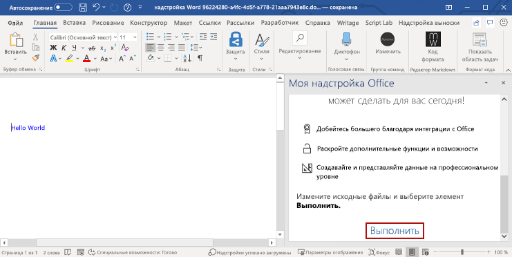

# <a name="build-your-first-word-task-pane-add-in"></a>Создание первой надстройки области задач Word

_Область применения: Word 2016 и более поздних версий для Windows, а также Word для iPad и Word для Mac_

В этой статье вы ознакомитесь с процессом создания надстройки для области задач Word.

## <a name="create-the-add-in"></a>Создание надстройки

[!include[Choose your editor](../includes/quickstart-choose-editor.md)]

# <a name="yeoman-generator"></a>[Генератор Yeoman](#tab/yeomangenerator)

[!include[Redirect to the single sign-on (SSO) quick start](../includes/sso-quickstart-reference.md)]

### <a name="prerequisites"></a>Необходимые условия

[!include[Set up requirements](../includes/set-up-dev-environment-beforehand.md)]
[!include[Yeoman generator prerequisites](../includes/quickstart-yo-prerequisites.md)]

### <a name="create-the-add-in-project"></a>Создание проекта надстройки

[!include[Yeoman generator create project guidance](../includes/yo-office-command-guidance.md)]

- **Выберите тип проекта:** `Office Add-in Task Pane project`
- **Выберите тип сценария:** `Javascript`
- **Как вы хотите назвать надстройку?** `My Office Add-in`
- **Какое клиентское приложение Office должно поддерживаться?** `Word`


После завершения работы мастера генератор создаст проект и установит вспомогательные компоненты Node.

[!include[Yeoman generator next steps](../includes/yo-office-next-steps.md)]

### <a name="explore-the-project"></a>Знакомство с проектом

[!include[Yeoman generator add-in project components](../includes/yo-task-pane-project-components-js.md)]

### <a name="try-it-out"></a>Проверка

1. Перейдите к корневой папке проекта.

    ```command&nbsp;line
    cd "My Office Add-in"
    ```

2. Выполните указанные ниже действия, чтобы запустить локальный веб-сервер и загрузить неопубликованную надстройку.

    > [!NOTE]
    > Надстройки Office должны использовать HTTPS, а не HTTP, даже в случае разработки. Если вам будет предложено установить сертификат после того, как вы запустите одну из указанных ниже команд, примите предложение установить сертификат, предоставленный генератором Yeoman.

    > [!TIP]
    > Если вы тестируете надстройку на компьютере Mac, перед продолжением выполните указанную ниже команду. После выполнения этой команды запустится локальный веб-сервер.
    >
    > ```command&nbsp;line
    > npm run dev-server
    > ```

    - Чтобы проверить надстройку в Word, выполните приведенную ниже команду в корневом каталоге своего проекта. При этом запускается локальный веб-сервер (если он еще не запущен) и открывается приложение Word с загруженной надстройкой.

        ```command&nbsp;line
        npm start
        ```

    - Чтобы проверить надстройку в Word в браузере, выполните приведенную ниже команду в корневом каталоге проекта. После выполнения этой команды запустится локальный веб-сервер (если он еще не запущен).

        ```command&nbsp;line
        npm run start:web
        ```

        Чтобы использовать надстройку, откройте новый документ в Word в Интернете, а затем загрузите неопубликованную надстройку, следуя инструкциям из статьи [Загрузка неопубликованных надстроек Office в Office в Интернете](../testing/sideload-office-add-ins-for-testing.md#sideload-an-office-add-in-in-office-on-the-web).

3. В Word откройте новый документ, выберите вкладку **Главная** и нажмите кнопку **Показать область задач** на ленте, чтобы открыть область задач надстройки.

    

4. В нижней части области задач выберите ссылку **Выполнить**, чтобы добавить текст "Hello World" синего цвета в документ.

    

### <a name="next-steps"></a>Дальнейшие действия

Поздравляем! Вы успешно создали надстройку области задач Word! Теперь воспользуйтесь [руководством по надстройкам Word](../tutorials/word-tutorial.md), чтобы узнать больше о возможностях надстроек Word и создать более сложную надстройку.

# <a name="visual-studio"></a>[Visual Studio](#tab/visualstudio)

### <a name="prerequisites"></a>Необходимые компоненты

[!include[Quick Start prerequisites](../includes/quickstart-vs-prerequisites.md)]

### <a name="create-the-add-in-project"></a>Создание проекта надстройки

1. В Visual Studio выберите пункт **Создать проект**.

2. Используя поле поиска, введите **надстройка**. Выберите вариант **Веб-надстройка Word** и нажмите кнопку **Далее**.

3. Присвойте проекту имя и нажмите кнопку **Создать**.

4. Visual Studio создаст решение, и в **обозревателе решений** появятся два соответствующих проекта. В Visual Studio откроется файл **Home.html**.

### <a name="explore-the-visual-studio-solution"></a>Обзор решения Visual Studio

[!include[Description of Visual Studio projects](../includes/quickstart-vs-solution.md)]

### <a name="update-the-code"></a>Обновление кода

1. Файл **Home.html** содержит HTML-контент, который будет отображаться в области задач надстройки. В файле **Home.html** замените элемент `<body>` на приведенную ниже часть кода и сохраните файл.

    ```html
    <body>
        <div id="content-header">
            <div class="padding">
                <h1>Welcome</h1>
            </div>
        </div>
        <div id="content-main">
            <div class="padding">
                <p>Choose the buttons below to add boilerplate text to the document by using the Word JavaScript API.</p>
                <br />
                <h3>Try it out</h3>
                <button id="emerson">Add quote from Ralph Waldo Emerson</button>
                <br /><br />
                <button id="checkhov">Add quote from Anton Chekhov</button>
                <br /><br />
                <button id="proverb">Add Chinese proverb</button>
            </div>
        </div>
        <br />
        <div id="supportedVersion"/>
    </body>
    ```

2. Откройте файл **Home.js** в корневой папке проекта веб-приложения. Этот файл содержит скрипт надстройки. Замените все его содержимое указанным ниже кодом и сохраните файл.

    ```js
    'use strict';

    (function () {

        Office.onReady(function() {
            // Office is ready
            $(document).ready(function () {
                // The document is ready
                // Use this to check whether the API is supported in the Word client.
                if (Office.context.requirements.isSetSupported('WordApi', '1.1')) {
                    // Do something that is only available via the new APIs
                    $('#emerson').click(insertEmersonQuoteAtSelection);
                    $('#checkhov').click(insertChekhovQuoteAtTheBeginning);
                    $('#proverb').click(insertChineseProverbAtTheEnd);
                    $('#supportedVersion').html('This code is using Word 2016 or later.');
                }
                else {
                    // Just letting you know that this code will not work with your version of Word.
                    $('#supportedVersion').html('This code requires Word 2016 or later.');
                }
            });
        });

        function insertEmersonQuoteAtSelection() {
            Word.run(function (context) {

                // Create a proxy object for the document.
                var thisDocument = context.document;

                // Queue a command to get the current selection.
                // Create a proxy range object for the selection.
                var range = thisDocument.getSelection();

                // Queue a command to replace the selected text.
                range.insertText('"Hitch your wagon to a star."\n', Word.InsertLocation.replace);

                // Synchronize the document state by executing the queued commands,
                // and return a promise to indicate task completion.
                return context.sync().then(function () {
                    console.log('Added a quote from Ralph Waldo Emerson.');
                });
            })
            .catch(function (error) {
                console.log('Error: ' + JSON.stringify(error));
                if (error instanceof OfficeExtension.Error) {
                    console.log('Debug info: ' + JSON.stringify(error.debugInfo));
                }
            });
        }

        function insertChekhovQuoteAtTheBeginning() {
            Word.run(function (context) {

                // Create a proxy object for the document body.
                var body = context.document.body;

                // Queue a command to insert text at the start of the document body.
                body.insertText('"Knowledge is of no value unless you put it into practice."\n', Word.InsertLocation.start);

                // Synchronize the document state by executing the queued commands,
                // and return a promise to indicate task completion.
                return context.sync().then(function () {
                    console.log('Added a quote from Anton Chekhov.');
                });
            })
            .catch(function (error) {
                console.log('Error: ' + JSON.stringify(error));
                if (error instanceof OfficeExtension.Error) {
                    console.log('Debug info: ' + JSON.stringify(error.debugInfo));
                }
            });
        }

        function insertChineseProverbAtTheEnd() {
            Word.run(function (context) {

                // Create a proxy object for the document body.
                var body = context.document.body;

                // Queue a command to insert text at the end of the document body.
                body.insertText('"To know the road ahead, ask those coming back."\n', Word.InsertLocation.end);

                // Synchronize the document state by executing the queued commands,
                // and return a promise to indicate task completion.
                return context.sync().then(function () {
                    console.log('Added a quote from a Chinese proverb.');
                });
            })
            .catch(function (error) {
                console.log('Error: ' + JSON.stringify(error));
                if (error instanceof OfficeExtension.Error) {
                    console.log('Debug info: ' + JSON.stringify(error.debugInfo));
                }
            });
        }
    })();
    ```

3. Откройте файл **Home.css** в корневой папке проекта веб-приложения. Этот файл определяет специальные стили надстройки. Замените все его содержимое указанным ниже кодом и сохраните файл.

    ```css
    #content-header {
        background: #2a8dd4;
        color: #fff;
        position: absolute;
        top: 0;
        left: 0;
        width: 100%;
        height: 80px;
        overflow: hidden;
    }

    #content-main {
        background: #fff;
        position: fixed;
        top: 80px;
        left: 0;
        right: 0;
        bottom: 0;
        overflow: auto;
    }

    .padding {
        padding: 15px;
    }
    ```

### <a name="update-the-manifest"></a>Обновление манифеста

1. Откройте XML-файл манифеста в проекте надстройки. Этот файл определяет параметры и возможности надстройки.

2. Элемент `ProviderName` содержит заполнитель. Замените его на свое имя.

3. Атрибут `DefaultValue` элемента `DisplayName` содержит заполнитель. Замените его на строку **Моя надстройка Office**.

4. Атрибут `DefaultValue` элемента `Description` содержит заполнитель. Замените его строкой **Надстройка области задач для Word**.

5. Сохраните файл.

    ```xml
    ...
    <ProviderName>John Doe</ProviderName>
    <DefaultLocale>en-US</DefaultLocale>
    <!-- The display name of your add-in. Used on the store and various places of the Office UI such as the add-ins dialog. -->
    <DisplayName DefaultValue="My Office Add-in" />
    <Description DefaultValue="A task pane add-in for Word"/>
    ...
    ```

### <a name="try-it-out"></a>Проверка

1. Протестируйте новую надстройку Word в Visual Studio, нажав клавишу **F5** или кнопку **Запустить**, чтобы запустить Word с кнопкой надстройки **Show Taskpane** (Показать область задач) на ленте. Надстройка будет размещена на локальном сервере IIS.

2. В Word выберите вкладку **Главная** и нажмите кнопку **Показать область задач** на ленте, чтобы открыть область задач надстройки. (Если вы используете единовременно приобретенную версию Office, а не версию Microsoft 365, пользовательские кнопки не поддерживаются. Сразу откроется область задач.)

    

3. В области задач нажмите любую кнопку, чтобы добавить стандартный текст в документ.

    

[!include[Console tool note](../includes/console-tool-note.md)]

### <a name="next-steps"></a>Дальнейшие действия

Поздравляем! Вы успешно создали надстройку области задач Word! Теперь изучите дополнительные сведения о [разработке надстроек Office с помощью Visual Studio](../develop/develop-add-ins-visual-studio.md).

---

## <a name="see-also"></a>См. также

- [Обзор платформы надстроек Office](../overview/office-add-ins.md)
- [Разработка надстроек Office](../develop/develop-overview.md)
- [Обзор надстроек Word](../word/word-add-ins-programming-overview.md)
- 
  [Примеры кода надстроек Word](https://developer.microsoft.com/en-us/office/gallery/?filterBy=Samples,Word)
- [Справочник по API JavaScript для Word](../reference/overview/word-add-ins-reference-overview.md)
