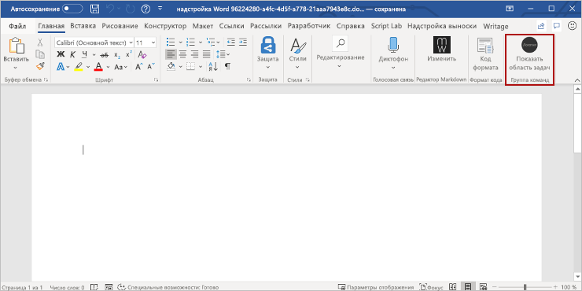

# <a name="build-your-first-word-task-pane-add-in"></a><span data-ttu-id="39e0e-102">Создание первой надстройки области задач Word</span><span class="sxs-lookup"><span data-stu-id="39e0e-102">Build your first PowerPoint task pane add-in</span></span>

<span data-ttu-id="39e0e-103">_Применяется к: Word 2016 или более поздней версии для Windows, Word для iPad, Word для Mac_</span><span class="sxs-lookup"><span data-stu-id="39e0e-103">_Applies to: Word 2016 or later for Windows, Word for iPad, Word for Mac_</span></span>

<span data-ttu-id="39e0e-104">В этой статье вы ознакомитесь с процессом создания надстройки для области задач Word.</span><span class="sxs-lookup"><span data-stu-id="39e0e-104">In this article, you'll walk through the process of building a PowerPoint task pane add-in.</span></span>

## <a name="create-the-add-in"></a><span data-ttu-id="39e0e-105">Создание надстройки</span><span class="sxs-lookup"><span data-stu-id="39e0e-105">Create the add-in</span></span>

[!include[Choose your editor](../includes/quickstart-choose-editor.md)]

# <a name="visual-studiotabvisual-studio"></a>[<span data-ttu-id="39e0e-106">Visual Studio</span><span class="sxs-lookup"><span data-stu-id="39e0e-106">Visual Studio</span></span>](#tab/visual-studio)

### <a name="prerequisites"></a><span data-ttu-id="39e0e-107">Необходимые компоненты</span><span class="sxs-lookup"><span data-stu-id="39e0e-107">Prerequisites</span></span>

[!include[Quick Start prerequisites](../includes/quickstart-vs-prerequisites.md)]

### <a name="create-the-add-in-project"></a><span data-ttu-id="39e0e-108">Создание проекта надстройки</span><span class="sxs-lookup"><span data-stu-id="39e0e-108">Create the add-in project</span></span>

1. <span data-ttu-id="39e0e-109">В строке меню Visual Studio выберите **Файл** > **Создать** > **Проект**.</span><span class="sxs-lookup"><span data-stu-id="39e0e-109">On the Visual Studio menu bar, choose  **File** > **New** > **Project**.</span></span>

2. <span data-ttu-id="39e0e-110">В списке типов проекта разверните узел **Visual C#** или **Visual Basic**, разверните **Office/SharePoint**, а затем выберите **Надстройки** > **Веб-надстройка Word**.</span><span class="sxs-lookup"><span data-stu-id="39e0e-110">In the list of project types under **Visual C#** or **Visual Basic**, expand  **Office/SharePoint**, choose **Add-ins**, and then choose **Word Web Add-in** as the project type.</span></span> 

3. <span data-ttu-id="39e0e-111">Укажите имя проекта и нажмите кнопку **ОК**.</span><span class="sxs-lookup"><span data-stu-id="39e0e-111">Name the project, and then choose **OK**.</span></span>

4. <span data-ttu-id="39e0e-p101">Visual Studio создаст решение, и в **обозревателе решений** появятся два соответствующих проекта. В Visual Studio откроется файл **Home.html**.</span><span class="sxs-lookup"><span data-stu-id="39e0e-p101">Visual Studio creates a solution and its two projects appear in **Solution Explorer**. The **Home.html** file opens in Visual Studio.</span></span>

### <a name="explore-the-visual-studio-solution"></a><span data-ttu-id="39e0e-114">Обзор решения Visual Studio</span><span class="sxs-lookup"><span data-stu-id="39e0e-114">Explore the Visual Studio solution</span></span>

[!include[Description of Visual Studio projects](../includes/quickstart-vs-solution.md)]

### <a name="update-the-code"></a><span data-ttu-id="39e0e-115">Обновление кода</span><span class="sxs-lookup"><span data-stu-id="39e0e-115">Update the code</span></span>

1. <span data-ttu-id="39e0e-p102">Файл **Home.html** содержит HTML-контент, который будет отображаться в области задач надстройки. В файле **Home.html** замените элемент `<body>` на приведенную ниже часть кода и сохраните файл.</span><span class="sxs-lookup"><span data-stu-id="39e0e-p102">**Home.html** specifies the HTML that will be rendered in the add-in's task pane. In **Home.html**, replace the `<body>` element with the following markup and save the file.</span></span>

    ```html
    <body>
        <div id="content-header">
            <div class="padding">
                <h1>Welcome</h1>
            </div>
        </div>
        <div id="content-main">
            <div class="padding">
                <p>Choose the buttons below to add boilerplate text to the document by using the Word JavaScript API.</p>
                <br />
                <h3>Try it out</h3>
                <button id="emerson">Add quote from Ralph Waldo Emerson</button>
                <br /><br />
                <button id="checkhov">Add quote from Anton Chekhov</button>
                <br /><br />
                <button id="proverb">Add Chinese proverb</button>
            </div>
        </div>
        <br />
        <div id="supportedVersion"/>
    </body>
    ```

2. <span data-ttu-id="39e0e-p103">Откройте файл **Home.js** в корневой папке проекта веб-приложения. Этот файл содержит скрипт надстройки. Замените все его содержимое указанным ниже кодом и сохраните файл.</span><span class="sxs-lookup"><span data-stu-id="39e0e-p103">Open the file **Home.js** in the root of the web application project. This file specifies the script for the add-in. Replace the entire contents with the following code and save the file.</span></span>

    ```js
    'use strict';

    (function () {

        Office.onReady(function() {
            // Office is ready
            $(document).ready(function () {
                // The document is ready
                // Use this to check whether the API is supported in the Word client.
                if (Office.context.requirements.isSetSupported('WordApi', 1.1)) {
                    // Do something that is only available via the new APIs
                    $('#emerson').click(insertEmersonQuoteAtSelection);
                    $('#checkhov').click(insertChekhovQuoteAtTheBeginning);
                    $('#proverb').click(insertChineseProverbAtTheEnd);
                    $('#supportedVersion').html('This code is using Word 2016 or later.');
                }
                else {
                    // Just letting you know that this code will not work with your version of Word.
                    $('#supportedVersion').html('This code requires Word 2016 or later.');
                }
            });
        });

        function insertEmersonQuoteAtSelection() {
            Word.run(function (context) {

                // Create a proxy object for the document.
                var thisDocument = context.document;

                // Queue a command to get the current selection.
                // Create a proxy range object for the selection.
                var range = thisDocument.getSelection();

                // Queue a command to replace the selected text.
                range.insertText('"Hitch your wagon to a star."\n', Word.InsertLocation.replace);

                // Synchronize the document state by executing the queued commands,
                // and return a promise to indicate task completion.
                return context.sync().then(function () {
                    console.log('Added a quote from Ralph Waldo Emerson.');
                });
            })
            .catch(function (error) {
                console.log('Error: ' + JSON.stringify(error));
                if (error instanceof OfficeExtension.Error) {
                    console.log('Debug info: ' + JSON.stringify(error.debugInfo));
                }
            });
        }

        function insertChekhovQuoteAtTheBeginning() {
            Word.run(function (context) {

                // Create a proxy object for the document body.
                var body = context.document.body;

                // Queue a command to insert text at the start of the document body.
                body.insertText('"Knowledge is of no value unless you put it into practice."\n', Word.InsertLocation.start);

                // Synchronize the document state by executing the queued commands,
                // and return a promise to indicate task completion.
                return context.sync().then(function () {
                    console.log('Added a quote from Anton Chekhov.');
                });
            })
            .catch(function (error) {
                console.log('Error: ' + JSON.stringify(error));
                if (error instanceof OfficeExtension.Error) {
                    console.log('Debug info: ' + JSON.stringify(error.debugInfo));
                }
            });
        }

        function insertChineseProverbAtTheEnd() {
            Word.run(function (context) {

                // Create a proxy object for the document body.
                var body = context.document.body;

                // Queue a command to insert text at the end of the document body.
                body.insertText('"To know the road ahead, ask those coming back."\n', Word.InsertLocation.end);

                // Synchronize the document state by executing the queued commands,
                // and return a promise to indicate task completion.
                return context.sync().then(function () {
                    console.log('Added a quote from a Chinese proverb.');
                });
            })
            .catch(function (error) {
                console.log('Error: ' + JSON.stringify(error));
                if (error instanceof OfficeExtension.Error) {
                    console.log('Debug info: ' + JSON.stringify(error.debugInfo));
                }
            });
        }
    })();
    ```

3. <span data-ttu-id="39e0e-p104">Откройте файл **Home.css** в корневой папке проекта веб-приложения. Этот файл определяет специальные стили надстройки. Замените все его содержимое указанным ниже кодом и сохраните файл.</span><span class="sxs-lookup"><span data-stu-id="39e0e-p104">Open the file **Home.css** in the root of the web application project. This file specifies the custom styles for the add-in. Replace the entire contents with the following code and save the file.</span></span>

    ```css
    #content-header {
        background: #2a8dd4;
        color: #fff;
        position: absolute;
        top: 0;
        left: 0;
        width: 100%;
        height: 80px; 
        overflow: hidden;
    }

    #content-main {
        background: #fff;
        position: fixed;
        top: 80px;
        left: 0;
        right: 0;
        bottom: 0;
        overflow: auto;
    }

    .padding {
        padding: 15px;
    }
    ```

### <a name="update-the-manifest"></a><span data-ttu-id="39e0e-124">Обновление манифеста</span><span class="sxs-lookup"><span data-stu-id="39e0e-124">Update the manifest</span></span>

1. <span data-ttu-id="39e0e-125">Откройте XML-файл манифеста в проекте надстройки.</span><span class="sxs-lookup"><span data-stu-id="39e0e-125">Open the XML manifest file in the add-in project.</span></span> <span data-ttu-id="39e0e-126">Этот файл определяет параметры и возможности надстройки.</span><span class="sxs-lookup"><span data-stu-id="39e0e-126">This file defines the add-in's settings and capabilities.</span></span>

2. <span data-ttu-id="39e0e-p106">Элемент `ProviderName` содержит заполнитель. Замените его на свое имя.</span><span class="sxs-lookup"><span data-stu-id="39e0e-p106">The `ProviderName` element has a placeholder value. Replace it with your name.</span></span>

3. <span data-ttu-id="39e0e-p107">Атрибут `DefaultValue` элемента `DisplayName` содержит заполнитель. Замените его на строку **Моя надстройка Office**.</span><span class="sxs-lookup"><span data-stu-id="39e0e-p107">The `DefaultValue` attribute of the `DisplayName` element has a placeholder. Replace it with **My Office Add-in**.</span></span>

4. <span data-ttu-id="39e0e-p108">Атрибут `DefaultValue` элемента `Description` содержит заполнитель. Замените его строкой **Надстройка области задач для Word**.</span><span class="sxs-lookup"><span data-stu-id="39e0e-p108">The `DefaultValue` attribute of the `Description` element has a placeholder. Replace it with **A task pane add-in for Word**.</span></span>

5. <span data-ttu-id="39e0e-133">Сохраните файл.</span><span class="sxs-lookup"><span data-stu-id="39e0e-133">Save the file.</span></span>

    ```xml
    ...
    <ProviderName>John Doe</ProviderName>
    <DefaultLocale>en-US</DefaultLocale>
    <!-- The display name of your add-in. Used on the store and various places of the Office UI such as the add-ins dialog. -->
    <DisplayName DefaultValue="My Office Add-in" />
    <Description DefaultValue="A task pane add-in for Word"/>
    ...
    ```

### <a name="try-it-out"></a><span data-ttu-id="39e0e-134">Проверка</span><span class="sxs-lookup"><span data-stu-id="39e0e-134">Try it out</span></span>

1. <span data-ttu-id="39e0e-p109">Протестируйте новую надстройку Word в Visual Studio, нажав клавишу **F5** или кнопку **Запустить**, чтобы запустить Word с кнопкой надстройки **Show Taskpane** (Показать область задач) на ленте. Надстройка будет размещена на локальном сервере IIS.</span><span class="sxs-lookup"><span data-stu-id="39e0e-p109">Using Visual Studio, test the newly created Word add-in by pressing **F5** or choosing the **Start** button to launch Word with the **Show Taskpane** add-in button displayed in the ribbon. The add-in will be hosted locally on IIS.</span></span>

2. <span data-ttu-id="39e0e-137">В Word выберите вкладку **Главная** и нажмите кнопку **Показать область задач** на ленте, чтобы открыть область задач надстройки.</span><span class="sxs-lookup"><span data-stu-id="39e0e-137">In Word, choose the **Home** tab, and then choose the **Show Taskpane** button in the ribbon to open the add-in task pane.</span></span> <span data-ttu-id="39e0e-138">(Если вы используете единовременно приобретенную версию Office, а не версию Office 365, пользовательские кнопки не поддерживаются.</span><span class="sxs-lookup"><span data-stu-id="39e0e-138">(If you are using the one-time purchase version of Office, instead of the Office 365 version, then custom buttons are not supported.</span></span> <span data-ttu-id="39e0e-139">Сразу откроется область задач.)</span><span class="sxs-lookup"><span data-stu-id="39e0e-139">Instead, the task pane will open immediately.)</span></span>

    

3. <span data-ttu-id="39e0e-141">В области задач нажмите любую кнопку, чтобы добавить стандартный текст в документ.</span><span class="sxs-lookup"><span data-stu-id="39e0e-141">In the task pane, choose any of the buttons to add boilerplate text to the document.</span></span>

    

# <a name="any-editortabvisual-studio-code"></a>[<span data-ttu-id="39e0e-143">Любой редактор</span><span class="sxs-lookup"><span data-stu-id="39e0e-143">Any editor</span></span>](#tab/visual-studio-code)

### <a name="prerequisites"></a><span data-ttu-id="39e0e-144">Необходимые условия</span><span class="sxs-lookup"><span data-stu-id="39e0e-144">Prerequisites</span></span>

[!include[Yeoman generator prerequisites](../includes/quickstart-yo-prerequisites.md)]

### <a name="create-the-add-in-project"></a><span data-ttu-id="39e0e-145">Создание проекта надстройки</span><span class="sxs-lookup"><span data-stu-id="39e0e-145">Create the add-in project</span></span>

1. <span data-ttu-id="39e0e-146">С помощью генератора Yeoman создайте проект надстройки Word.</span><span class="sxs-lookup"><span data-stu-id="39e0e-146">Use the Yeoman generator to create a Word add-in project.</span></span> <span data-ttu-id="39e0e-147">Выполните приведенную ниже команду и ответьте на вопросы, как показано ниже.</span><span class="sxs-lookup"><span data-stu-id="39e0e-147">Run the following command and then answer the prompts as follows:</span></span>

    ```command&nbsp;line
    yo office
    ```

    - <span data-ttu-id="39e0e-148">**Выберите тип проекта:** `Office Add-in Task Pane project`</span><span class="sxs-lookup"><span data-stu-id="39e0e-148">**Choose a project type:** `Office Add-in Task Pane project`</span></span>
    - <span data-ttu-id="39e0e-149">**Выберите тип сценария:** `Javascript`</span><span class="sxs-lookup"><span data-stu-id="39e0e-149">**Choose a script type:** `Javascript`</span></span>
    - <span data-ttu-id="39e0e-150">**Как вы хотите назвать надстройку?**</span><span class="sxs-lookup"><span data-stu-id="39e0e-150">**What do you want to name your add-in?**</span></span> `My Office Add-in`
    - <span data-ttu-id="39e0e-151">**Какое клиентское приложение Office должно поддерживаться?**</span><span class="sxs-lookup"><span data-stu-id="39e0e-151">**Which Office client application would you like to support?**</span></span> `Word`

    

    <span data-ttu-id="39e0e-153">После завершения работы мастера генератор создаст проект и установит вспомогательные компоненты Node.</span><span class="sxs-lookup"><span data-stu-id="39e0e-153">After you complete the wizard, the generator will create the project and install supporting Node components.</span></span>

2. <span data-ttu-id="39e0e-154">Перейдите к корневой папке проекта.</span><span class="sxs-lookup"><span data-stu-id="39e0e-154">Navigate to the root folder of the project.</span></span>

    ```command&nbsp;line
    cd "My Office Add-in"
    ```

### <a name="explore-the-project"></a><span data-ttu-id="39e0e-155">Знакомство с проектом</span><span class="sxs-lookup"><span data-stu-id="39e0e-155">Explore the project</span></span>

[!include[Yeoman generator add-in project components](../includes/yo-task-pane-project-components-js.md)]

### <a name="try-it-out"></a><span data-ttu-id="39e0e-156">Проверка</span><span class="sxs-lookup"><span data-stu-id="39e0e-156">Try it out</span></span>

1. <span data-ttu-id="39e0e-157">Запустите локальный веб-сервер и загрузите неопубликованную надстройку.</span><span class="sxs-lookup"><span data-stu-id="39e0e-157">Start the local web server and sideload your add-in.</span></span>

    > [!NOTE]
    > <span data-ttu-id="39e0e-158">Надстройки Office должны использовать HTTPS, а не HTTP, даже в случае разработки.</span><span class="sxs-lookup"><span data-stu-id="39e0e-158">Office Add-ins should use HTTPS, not HTTP, even when you are developing.</span></span> <span data-ttu-id="39e0e-159">Если вам будет предложено установить сертификат после того, как вы запустите одну из указанных ниже команд, примите предложение установить сертификат, предоставленный генератором Yeoman.</span><span class="sxs-lookup"><span data-stu-id="39e0e-159">If you are prompted to install a certificate after you run one of the following commands, accept the prompt to install the certificate that the Yeoman generator provides.</span></span> 

    - <span data-ttu-id="39e0e-160">Чтобы проверить надстройку в Word, выполните следующую команду.</span><span class="sxs-lookup"><span data-stu-id="39e0e-160">To test your add-in in PowerPoint, run the following command.</span></span> <span data-ttu-id="39e0e-161">Когда вы выполните эту команду, запустится локальный веб-сервер и откроется приложение Word, в котором будет загружена ваша надстройка.</span><span class="sxs-lookup"><span data-stu-id="39e0e-161">When you run this command, the local web server will start and PowerPoint will open with your add-in loaded.</span></span>

        ```command&nbsp;line
        npm start
        ```

    - <span data-ttu-id="39e0e-162">Чтобы проверить надстройку в Word Online, выполните следующую команду.</span><span class="sxs-lookup"><span data-stu-id="39e0e-162">To test your add-in in PowerPoint Online, run the following command.</span></span> <span data-ttu-id="39e0e-163">После выполнения этой команды запустится локальный веб-сервер.</span><span class="sxs-lookup"><span data-stu-id="39e0e-163">When you run this command, the local web server will start.</span></span>

        ```command&nbsp;line
        npm run start:web
        ```

        <span data-ttu-id="39e0e-164">Чтобы использовать надстройку, откройте новый документ в Word Online и затем загрузите неопубликованную надстройку, следуя инструкциям в статье [Загрузка неопубликованных надстроек Office в Office Online](../testing/sideload-office-add-ins-for-testing.md#sideload-an-office-add-in-in-office-online).</span><span class="sxs-lookup"><span data-stu-id="39e0e-164">To use your add-in, open a new document in PowerPoint Online and then sideload your add-in by following the instructions in [Sideload Office Add-ins in Office Online](../testing/sideload-office-add-ins-for-testing.md#sideload-an-office-add-in-in-office-online).</span></span>

2. <span data-ttu-id="39e0e-165">В Word откройте новый документ, выберите вкладку **Главная** и нажмите кнопку **Показать область задач** на ленте, чтобы открыть область задач надстройки.</span><span class="sxs-lookup"><span data-stu-id="39e0e-165">In Word, choose the **Home** tab, and then choose the **Show Taskpane** button in the ribbon to open the add-in task pane.</span></span>

    

3. <span data-ttu-id="39e0e-167">В нижней части области задач выберите ссылку **Выполнить**, чтобы добавить текст "Hello World" синего цвета в документ.</span><span class="sxs-lookup"><span data-stu-id="39e0e-167">At the bottom of the task pane, choose the **Run** link to insert the text "Hello World" into the current slide.</span></span>

    

---

## <a name="next-steps"></a><span data-ttu-id="39e0e-169">Дальнейшие действия</span><span class="sxs-lookup"><span data-stu-id="39e0e-169">Next steps</span></span>

<span data-ttu-id="39e0e-170">Поздравляем! Вы успешно создали надстройку области задач Word!</span><span class="sxs-lookup"><span data-stu-id="39e0e-170">Congratulations, you've successfully created a PowerPoint task pane add-in!</span></span> <span data-ttu-id="39e0e-171">Чтобы узнать больше о возможностях надстроек Word и создать более сложную надстройку, воспользуйтесь руководством по надстройкам Word.</span><span class="sxs-lookup"><span data-stu-id="39e0e-171">Next, learn more about the capabilities of a Word add-in and build a more complex add-in by following along with the Word add-in tutorial.</span></span>

> [!div class="nextstepaction"]
> [<span data-ttu-id="39e0e-172">Руководство по надстройкам Word</span><span class="sxs-lookup"><span data-stu-id="39e0e-172">Word add-in tutorial</span></span>](../tutorials/word-tutorial.md)

## <a name="see-also"></a><span data-ttu-id="39e0e-173">См. также</span><span class="sxs-lookup"><span data-stu-id="39e0e-173">See also</span></span>

* [<span data-ttu-id="39e0e-174">Обзор надстроек Word</span><span class="sxs-lookup"><span data-stu-id="39e0e-174">Word add-ins overview</span></span>](../word/word-add-ins-programming-overview.md)
* <span data-ttu-id="39e0e-175">
  [Примеры кода надстроек Word](https://developer.microsoft.com/en-us/office/gallery/?filterBy=Samples,Word)</span><span class="sxs-lookup"><span data-stu-id="39e0e-175">[Word add-in code samples](https://developer.microsoft.com/en-us/office/gallery/?filterBy=Samples,Word)</span></span>
* [<span data-ttu-id="39e0e-176">Справочник по API JavaScript для Word</span><span class="sxs-lookup"><span data-stu-id="39e0e-176">Word JavaScript API reference</span></span>](/office/dev/add-ins/reference/overview/word-add-ins-reference-overview)
