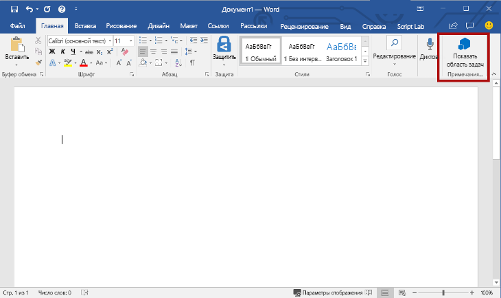
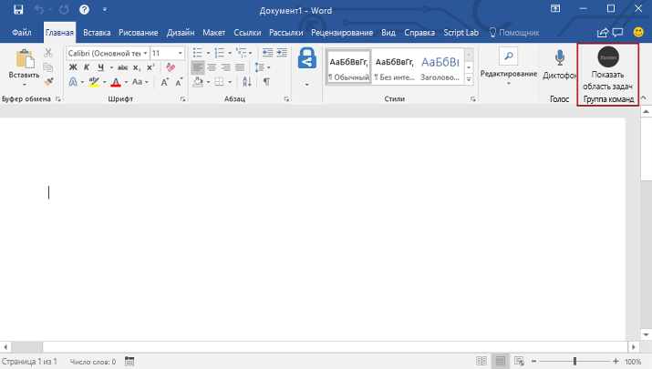

# <a name="build-your-first-word-add-in"></a><span data-ttu-id="c8942-102">Создание первой надстройки Word</span><span class="sxs-lookup"><span data-stu-id="c8942-102">Build your first Word add-in</span></span>

<span data-ttu-id="c8942-103">_Применяется к: Word 2016 или более поздней версии для Windows, Word для iPad, Word для Mac_</span><span class="sxs-lookup"><span data-stu-id="c8942-103">_Applies to: Word 2016 or later for Windows, Word for iPad, Word for Mac_</span></span>

<span data-ttu-id="c8942-104">В этой статье мы разберем, как создать надстройку Word, используя jQuery и API JavaScript для Word.</span><span class="sxs-lookup"><span data-stu-id="c8942-104">In this article, you'll walk through the process of building a Word add-in by using jQuery and the Word JavaScript API.</span></span>

## <a name="create-the-add-in"></a><span data-ttu-id="c8942-105">Создание надстройки</span><span class="sxs-lookup"><span data-stu-id="c8942-105">Create the add-in</span></span>

[!include[Choose your editor](../includes/quickstart-choose-editor.md)]

# <a name="visual-studiotabvisual-studio"></a>[<span data-ttu-id="c8942-106">Visual Studio</span><span class="sxs-lookup"><span data-stu-id="c8942-106">Visual Studio</span></span>](#tab/visual-studio)

### <a name="prerequisites"></a><span data-ttu-id="c8942-107">Необходимые компоненты</span><span class="sxs-lookup"><span data-stu-id="c8942-107">Prerequisites</span></span>

[!include[Quick Start prerequisites](../includes/quickstart-vs-prerequisites.md)]

### <a name="create-the-add-in-project"></a><span data-ttu-id="c8942-108">Создание проекта надстройки</span><span class="sxs-lookup"><span data-stu-id="c8942-108">Create the add-in project</span></span>

1. <span data-ttu-id="c8942-109">В строке меню Visual Studio выберите **Файл** > **Создать** > **Проект**.</span><span class="sxs-lookup"><span data-stu-id="c8942-109">On the Visual Studio menu bar, choose  **File** > **New** > **Project**.</span></span>

2. <span data-ttu-id="c8942-110">В списке типов проекта разверните узел **Visual C#** или **Visual Basic**, разверните **Office/SharePoint**, а затем выберите **Надстройки** > **Веб-надстройка Word**.</span><span class="sxs-lookup"><span data-stu-id="c8942-110">In the list of project types under **Visual C#** or **Visual Basic**, expand  **Office/SharePoint**, choose **Add-ins**, and then choose **Word Web Add-in** as the project type.</span></span> 

3. <span data-ttu-id="c8942-111">Укажите имя проекта и нажмите кнопку **ОК**.</span><span class="sxs-lookup"><span data-stu-id="c8942-111">Name the project, and then choose **OK**.</span></span>

4. <span data-ttu-id="c8942-p101">Visual Studio создаст решение, и в **обозревателе решений** появятся два соответствующих проекта. В Visual Studio откроется файл **Home.html**.</span><span class="sxs-lookup"><span data-stu-id="c8942-p101">Visual Studio creates a solution and its two projects appear in **Solution Explorer**. The **Home.html** file opens in Visual Studio.</span></span>

### <a name="explore-the-visual-studio-solution"></a><span data-ttu-id="c8942-114">Обзор решения Visual Studio</span><span class="sxs-lookup"><span data-stu-id="c8942-114">Explore the Visual Studio solution</span></span>

[!include[Description of Visual Studio projects](../includes/quickstart-vs-solution.md)]

### <a name="update-the-code"></a><span data-ttu-id="c8942-115">Обновление кода</span><span class="sxs-lookup"><span data-stu-id="c8942-115">Update the code</span></span>

1. <span data-ttu-id="c8942-p102">Файл **Home.html** содержит HTML-контент, который будет отображаться в области задач надстройки. В файле **Home.html** замените элемент `<body>` на приведенную ниже часть кода и сохраните файл.</span><span class="sxs-lookup"><span data-stu-id="c8942-p102">**Home.html** specifies the HTML that will be rendered in the add-in's task pane. In **Home.html**, replace the `<body>` element with the following markup and save the file.</span></span>

    ```html
    <body>
        <div id="content-header">
            <div class="padding">
                <h1>Welcome</h1>
            </div>
        </div>
        <div id="content-main">
            <div class="padding">
                <p>Choose the buttons below to add boilerplate text to the document by using the Word JavaScript API.</p>
                <br />
                <h3>Try it out</h3>
                <button id="emerson">Add quote from Ralph Waldo Emerson</button>
                <br /><br />
                <button id="checkhov">Add quote from Anton Chekhov</button>
                <br /><br />
                <button id="proverb">Add Chinese proverb</button>
            </div>
        </div>
        <br />
        <div id="supportedVersion"/>
    </body>
    ```

2. <span data-ttu-id="c8942-p103">Откройте файл **Home.js** в корневой папке проекта веб-приложения. Этот файл содержит скрипт надстройки. Замените все его содержимое указанным ниже кодом и сохраните файл.</span><span class="sxs-lookup"><span data-stu-id="c8942-p103">Open the file **Home.js** in the root of the web application project. This file specifies the script for the add-in. Replace the entire contents with the following code and save the file.</span></span>

    ```js
    'use strict';

    (function () {

        Office.onReady(function() {
            // Office is ready
            $(document).ready(function () {
                // The document is ready
                // Use this to check whether the API is supported in the Word client.
                if (Office.context.requirements.isSetSupported('WordApi', 1.1)) {
                    // Do something that is only available via the new APIs
                    $('#emerson').click(insertEmersonQuoteAtSelection);
                    $('#checkhov').click(insertChekhovQuoteAtTheBeginning);
                    $('#proverb').click(insertChineseProverbAtTheEnd);
                    $('#supportedVersion').html('This code is using Word 2016 or later.');
                }
                else {
                    // Just letting you know that this code will not work with your version of Word.
                    $('#supportedVersion').html('This code requires Word 2016 or later.');
                }
            });
        });

        function insertEmersonQuoteAtSelection() {
            Word.run(function (context) {

                // Create a proxy object for the document.
                var thisDocument = context.document;

                // Queue a command to get the current selection.
                // Create a proxy range object for the selection.
                var range = thisDocument.getSelection();

                // Queue a command to replace the selected text.
                range.insertText('"Hitch your wagon to a star."\n', Word.InsertLocation.replace);

                // Synchronize the document state by executing the queued commands,
                // and return a promise to indicate task completion.
                return context.sync().then(function () {
                    console.log('Added a quote from Ralph Waldo Emerson.');
                });
            })
            .catch(function (error) {
                console.log('Error: ' + JSON.stringify(error));
                if (error instanceof OfficeExtension.Error) {
                    console.log('Debug info: ' + JSON.stringify(error.debugInfo));
                }
            });
        }

        function insertChekhovQuoteAtTheBeginning() {
            Word.run(function (context) {

                // Create a proxy object for the document body.
                var body = context.document.body;

                // Queue a command to insert text at the start of the document body.
                body.insertText('"Knowledge is of no value unless you put it into practice."\n', Word.InsertLocation.start);

                // Synchronize the document state by executing the queued commands,
                // and return a promise to indicate task completion.
                return context.sync().then(function () {
                    console.log('Added a quote from Anton Chekhov.');
                });
            })
            .catch(function (error) {
                console.log('Error: ' + JSON.stringify(error));
                if (error instanceof OfficeExtension.Error) {
                    console.log('Debug info: ' + JSON.stringify(error.debugInfo));
                }
            });
        }

        function insertChineseProverbAtTheEnd() {
            Word.run(function (context) {

                // Create a proxy object for the document body.
                var body = context.document.body;

                // Queue a command to insert text at the end of the document body.
                body.insertText('"To know the road ahead, ask those coming back."\n', Word.InsertLocation.end);

                // Synchronize the document state by executing the queued commands,
                // and return a promise to indicate task completion.
                return context.sync().then(function () {
                    console.log('Added a quote from a Chinese proverb.');
                });
            })
            .catch(function (error) {
                console.log('Error: ' + JSON.stringify(error));
                if (error instanceof OfficeExtension.Error) {
                    console.log('Debug info: ' + JSON.stringify(error.debugInfo));
                }
            });
        }
    })();
    ```

3. <span data-ttu-id="c8942-p104">Откройте файл **Home.css** в корневой папке проекта веб-приложения. Этот файл определяет специальные стили надстройки. Замените все его содержимое указанным ниже кодом и сохраните файл.</span><span class="sxs-lookup"><span data-stu-id="c8942-p104">Open the file **Home.css** in the root of the web application project. This file specifies the custom styles for the add-in. Replace the entire contents with the following code and save the file.</span></span>

    ```css
    #content-header {
        background: #2a8dd4;
        color: #fff;
        position: absolute;
        top: 0;
        left: 0;
        width: 100%;
        height: 80px; 
        overflow: hidden;
    }

    #content-main {
        background: #fff;
        position: fixed;
        top: 80px;
        left: 0;
        right: 0;
        bottom: 0;
        overflow: auto;
    }

    .padding {
        padding: 15px;
    }
    ```

### <a name="update-the-manifest"></a><span data-ttu-id="c8942-124">Обновление манифеста</span><span class="sxs-lookup"><span data-stu-id="c8942-124">Update the manifest</span></span>

1. <span data-ttu-id="c8942-125">Откройте XML-файл манифеста в проекте надстройки.</span><span class="sxs-lookup"><span data-stu-id="c8942-125">Open the XML manifest file in the add-in project.</span></span> <span data-ttu-id="c8942-126">Этот файл определяет параметры и возможности надстройки.</span><span class="sxs-lookup"><span data-stu-id="c8942-126">This file defines the add-in's settings and capabilities.</span></span>

2. <span data-ttu-id="c8942-p106">Элемент `ProviderName` содержит заполнитель. Замените его на свое имя.</span><span class="sxs-lookup"><span data-stu-id="c8942-p106">The `ProviderName` element has a placeholder value. Replace it with your name.</span></span>

3. <span data-ttu-id="c8942-p107">Атрибут `DefaultValue` элемента `DisplayName` содержит заполнитель. Замените его на строку **Моя надстройка Office**.</span><span class="sxs-lookup"><span data-stu-id="c8942-p107">The `DefaultValue` attribute of the `DisplayName` element has a placeholder. Replace it with **My Office Add-in**.</span></span>

4. <span data-ttu-id="c8942-p108">Атрибут `DefaultValue` элемента `Description` содержит заполнитель. Замените его строкой **Надстройка области задач для Word**.</span><span class="sxs-lookup"><span data-stu-id="c8942-p108">The `DefaultValue` attribute of the `Description` element has a placeholder. Replace it with **A task pane add-in for Word**.</span></span>

5. <span data-ttu-id="c8942-133">Сохраните файл.</span><span class="sxs-lookup"><span data-stu-id="c8942-133">Save the file.</span></span>

    ```xml
    ...
    <ProviderName>John Doe</ProviderName>
    <DefaultLocale>en-US</DefaultLocale>
    <!-- The display name of your add-in. Used on the store and various places of the Office UI such as the add-ins dialog. -->
    <DisplayName DefaultValue="My Office Add-in" />
    <Description DefaultValue="A task pane add-in for Word"/>
    ...
    ```

### <a name="try-it-out"></a><span data-ttu-id="c8942-134">Проверка</span><span class="sxs-lookup"><span data-stu-id="c8942-134">Try it out</span></span>

1. <span data-ttu-id="c8942-p109">Протестируйте новую надстройку Word в Visual Studio, нажав клавишу **F5** или кнопку **Запустить**, чтобы запустить Word с кнопкой надстройки **Show Taskpane** (Показать область задач) на ленте. Надстройка будет размещена на локальном сервере IIS.</span><span class="sxs-lookup"><span data-stu-id="c8942-p109">Using Visual Studio, test the newly created Word add-in by pressing **F5** or choosing the **Start** button to launch Word with the **Show Taskpane** add-in button displayed in the ribbon. The add-in will be hosted locally on IIS.</span></span>

2. <span data-ttu-id="c8942-137">В Word выберите вкладку **Главная** и нажмите кнопку **Показать область задач** на ленте, чтобы открыть область задач надстройки.</span><span class="sxs-lookup"><span data-stu-id="c8942-137">In Word, choose the **Home** tab, and then choose the **Show Taskpane** button in the ribbon to open the add-in task pane.</span></span> <span data-ttu-id="c8942-138">(Если вы используете единовременно приобретенную версию Office, а не версию Office 365, пользовательские кнопки не поддерживаются.</span><span class="sxs-lookup"><span data-stu-id="c8942-138">(If you are using the one-time purchase version of Office, instead of the Office 365 version, then custom buttons are not supported.</span></span> <span data-ttu-id="c8942-139">Сразу откроется область задач.)</span><span class="sxs-lookup"><span data-stu-id="c8942-139">Instead, the task pane will open immediately.)</span></span>

    

3. <span data-ttu-id="c8942-141">В области задач нажмите любую кнопку, чтобы добавить стандартный текст в документ.</span><span class="sxs-lookup"><span data-stu-id="c8942-141">In the task pane, choose any of the buttons to add boilerplate text to the document.</span></span>

    

# <a name="any-editortabvisual-studio-code"></a>[<span data-ttu-id="c8942-143">Любой редактор</span><span class="sxs-lookup"><span data-stu-id="c8942-143">Any editor</span></span>](#tab/visual-studio-code)

### <a name="prerequisites"></a><span data-ttu-id="c8942-144">Необходимые компоненты</span><span class="sxs-lookup"><span data-stu-id="c8942-144">Prerequisites</span></span>

- [<span data-ttu-id="c8942-145">Node.js</span><span class="sxs-lookup"><span data-stu-id="c8942-145">Node.js</span></span>](https://nodejs.org)

- <span data-ttu-id="c8942-146">Глобально установите последнюю версию [Yeoman](https://github.com/yeoman/yo) и [генератор Yeoman для надстроек Office](https://github.com/OfficeDev/generator-office).</span><span class="sxs-lookup"><span data-stu-id="c8942-146">Install the latest version of [Yeoman](https://github.com/yeoman/yo) and the [Yeoman generator for Office Add-ins](https://github.com/OfficeDev/generator-office) globally.</span></span>

    ```bash
    npm install -g yo generator-office
    ```

### <a name="create-the-add-in-project"></a><span data-ttu-id="c8942-147">Создание проекта надстройки</span><span class="sxs-lookup"><span data-stu-id="c8942-147">Create the add-in project</span></span>

1. <span data-ttu-id="c8942-148">С помощью генератора Yeoman создайте проект надстройки Word.</span><span class="sxs-lookup"><span data-stu-id="c8942-148">Use the Yeoman generator to create a Word add-in project.</span></span> <span data-ttu-id="c8942-149">Выполните приведенную ниже команду и ответьте на вопросы, как показано ниже.</span><span class="sxs-lookup"><span data-stu-id="c8942-149">Run the following command and then answer the prompts as follows:</span></span>

    ```bash
    yo office
    ```

    - <span data-ttu-id="c8942-150">**Выберите тип проекта:** `Office Add-in project using Jquery framework`</span><span class="sxs-lookup"><span data-stu-id="c8942-150">**Choose a project type:** `Office Add-in project using Jquery framework`</span></span>
    - <span data-ttu-id="c8942-151">**Выберите тип сценария:** `Javascript`</span><span class="sxs-lookup"><span data-stu-id="c8942-151">**Choose a script type:** `Javascript`</span></span>
    - <span data-ttu-id="c8942-152">**Как вы хотите назвать надстройку?** `My Office Add-in`</span><span class="sxs-lookup"><span data-stu-id="c8942-152">**What do you want to name your add-in?:** `My Office Add-in`</span></span>
    - <span data-ttu-id="c8942-153">**Какое клиентское приложение Office должно поддерживаться?** `Word`</span><span class="sxs-lookup"><span data-stu-id="c8942-153">**Which Office client application would you like to support?:** `Word`</span></span>

    

    <span data-ttu-id="c8942-155">После завершения работы мастера генератор создаст проект и установит вспомогательные компоненты Node.</span><span class="sxs-lookup"><span data-stu-id="c8942-155">After you complete the wizard, the generator will create the project and install supporting Node components.</span></span>

2. <span data-ttu-id="c8942-156">Перейдите к корневой папке проекта.</span><span class="sxs-lookup"><span data-stu-id="c8942-156">Navigate to the root folder of the project.</span></span>

    ```bash
    cd "My Office Add-in"
    ```

### <a name="update-the-code"></a><span data-ttu-id="c8942-157">Обновление кода</span><span class="sxs-lookup"><span data-stu-id="c8942-157">Update the code</span></span>

1. <span data-ttu-id="c8942-p112">В редакторе кода откройте файл **index.html** из корневой папки проекта. Этот файл содержит HTML-контент, который будет отображаться в области задач надстройки.</span><span class="sxs-lookup"><span data-stu-id="c8942-p112">In your code editor, open **index.html** in the root of the project. This file contains the HTML that will be rendered in the add-in's task pane.</span></span>

2. <span data-ttu-id="c8942-160">Замените элемент `<body>` приведенной ниже разметкой и сохраните файл.</span><span class="sxs-lookup"><span data-stu-id="c8942-160">Replace the `<body>` element with the following markup and save the file.</span></span>

    ```html
    <body>
        <div id="content-header">
            <div class="padding">
                <h1>Welcome</h1>
            </div>
        </div>
        <div id="content-main">
            <div class="padding">
                <p>Choose the buttons below to add boilerplate text to the document by using the Word JavaScript API.</p>
                <br />
                <h3>Try it out</h3>
                <button id="emerson">Add quote from Ralph Waldo Emerson</button>
                <br /><br />
                <button id="checkhov">Add quote from Anton Chekhov</button>
                <br /><br />
                <button id="proverb">Add Chinese proverb</button>
            </div>
        </div>
        <br />
        <div id="supportedVersion" />
        <script type="text/javascript" src="node_modules/jquery/dist/jquery.js"></script>
        <script type="text/javascript" src="node_modules/office-ui-fabric-js/dist/js/fabric.js"></script>
    </body>
    ```

3. <span data-ttu-id="c8942-161">Откройте файл **src/index.js**, чтобы указать скрипт для надстройки.</span><span class="sxs-lookup"><span data-stu-id="c8942-161">Open the file **src/index.js** to specify the script for the add-in.</span></span> <span data-ttu-id="c8942-162">Замените все его содержимое следующим кодом и сохраните файл.</span><span class="sxs-lookup"><span data-stu-id="c8942-162">Replace the entire contents with the following code and save the file.</span></span> <span data-ttu-id="c8942-163">Этот скрипт содержит код инициализации, а также код, вносящий изменения в документ Word, вставляя текст при нажатии кнопки.</span><span class="sxs-lookup"><span data-stu-id="c8942-163">This script contains initialization code as well as the code that makes changes to the Word document, by inserting text into the document when a button is chosen.</span></span>

    ```js
    'use strict';

    (function () {

        Office.onReady(function() {
            // Office is ready
            $(document).ready(function () {
                // The document is ready
                // Use this to check whether the API is supported in the Word client.
                if (Office.context.requirements.isSetSupported('WordApi', 1.1)) {
                    // Do something that is only available via the new APIs
                    $('#emerson').click(insertEmersonQuoteAtSelection);
                    $('#checkhov').click(insertChekhovQuoteAtTheBeginning);
                    $('#proverb').click(insertChineseProverbAtTheEnd);
                    $('#supportedVersion').html('This code is using Word 2016 or later.');
                }
                else {
                    // Just letting you know that this code will not work with your version of Word.
                    $('#supportedVersion').html('This code requires Word 2016 or later.');
                }
            });
        });

        function insertEmersonQuoteAtSelection() {
            Word.run(function (context) {

                // Create a proxy object for the document.
                var thisDocument = context.document;

                // Queue a command to get the current selection.
                // Create a proxy range object for the selection.
                var range = thisDocument.getSelection();

                // Queue a command to replace the selected text.
                range.insertText('"Hitch your wagon to a star."\n', Word.InsertLocation.replace);

                // Synchronize the document state by executing the queued commands,
                // and return a promise to indicate task completion.
                return context.sync().then(function () {
                    console.log('Added a quote from Ralph Waldo Emerson.');
                });
            })
            .catch(function (error) {
                console.log('Error: ' + JSON.stringify(error));
                if (error instanceof OfficeExtension.Error) {
                    console.log('Debug info: ' + JSON.stringify(error.debugInfo));
                }
            });
        }

        function insertChekhovQuoteAtTheBeginning() {
            Word.run(function (context) {

                // Create a proxy object for the document body.
                var body = context.document.body;

                // Queue a command to insert text at the start of the document body.
                body.insertText('"Knowledge is of no value unless you put it into practice."\n', Word.InsertLocation.start);

                // Synchronize the document state by executing the queued commands,
                // and return a promise to indicate task completion.
                return context.sync().then(function () {
                    console.log('Added a quote from Anton Chekhov.');
                });
            })
            .catch(function (error) {
                console.log('Error: ' + JSON.stringify(error));
                if (error instanceof OfficeExtension.Error) {
                    console.log('Debug info: ' + JSON.stringify(error.debugInfo));
                }
            });
        }

        function insertChineseProverbAtTheEnd() {
            Word.run(function (context) {

                // Create a proxy object for the document body.
                var body = context.document.body;

                // Queue a command to insert text at the end of the document body.
                body.insertText('"To know the road ahead, ask those coming back."\n', Word.InsertLocation.end);

                // Synchronize the document state by executing the queued commands,
                // and return a promise to indicate task completion.
                return context.sync().then(function () {
                    console.log('Added a quote from a Chinese proverb.');
                });
            })
            .catch(function (error) {
                console.log('Error: ' + JSON.stringify(error));
                if (error instanceof OfficeExtension.Error) {
                    console.log('Debug info: ' + JSON.stringify(error.debugInfo));
                }
            });
        }
    })();
    ```

4. <span data-ttu-id="c8942-p114">Откройте файл **app.css** в корневой папке проекта, чтобы указать специальные стили для надстройки. Замените все его содержимое на приведенный ниже код и сохраните файл.</span><span class="sxs-lookup"><span data-stu-id="c8942-p114">Open the file **app.css** in the root of the project to specify the custom styles for the add-in. Replace the entire contents with the following and save the file.</span></span>

    ```css
    #content-header {
        background: #2a8dd4;
        color: #fff;
        position: absolute;
        top: 0;
        left: 0;
        width: 100%;
        height: 80px; 
        overflow: hidden;
    }

    #content-main {
        background: #fff;
        position: fixed;
        top: 80px;
        left: 0;
        right: 0;
        bottom: 0;
        overflow: auto;
    }

    .padding {
        padding: 15px;
    }
    ```

### <a name="update-the-manifest"></a><span data-ttu-id="c8942-166">Обновление манифеста</span><span class="sxs-lookup"><span data-stu-id="c8942-166">Update the manifest</span></span>

1. <span data-ttu-id="c8942-167">Откройте файл **manifest.xml**, чтобы определить параметры и возможности надстройки.</span><span class="sxs-lookup"><span data-stu-id="c8942-167">Open the file **manifest.xml** to define the add-in's settings and capabilities.</span></span>

2. <span data-ttu-id="c8942-p115">Элемент `ProviderName` содержит заполнитель. Замените его на свое имя.</span><span class="sxs-lookup"><span data-stu-id="c8942-p115">The `ProviderName` element has a placeholder value. Replace it with your name.</span></span>

3. <span data-ttu-id="c8942-p116">Атрибут `DefaultValue` элемента `Description` содержит заполнитель. Замените его строкой **Надстройка области задач для Word**.</span><span class="sxs-lookup"><span data-stu-id="c8942-p116">The `DefaultValue` attribute of the `Description` element has a placeholder. Replace it with **A task pane add-in for Word**.</span></span>

4. <span data-ttu-id="c8942-172">Сохраните файл.</span><span class="sxs-lookup"><span data-stu-id="c8942-172">Save the file.</span></span>

    ```xml
    ...
    <ProviderName>John Doe</ProviderName>
    <DefaultLocale>en-US</DefaultLocale>
    <!-- The display name of your add-in. Used on the store and various places of the Office UI such as the add-ins dialog. -->
    <DisplayName DefaultValue="My Office Add-in" />
    <Description DefaultValue="A task pane add-in for Word"/>
    ...
    ```

### <a name="start-the-dev-server"></a><span data-ttu-id="c8942-173">Запуск сервера разработки</span><span class="sxs-lookup"><span data-stu-id="c8942-173">Start the dev server</span></span>

[!include[Start server section](../includes/quickstart-yo-start-server.md)] 

### <a name="try-it-out"></a><span data-ttu-id="c8942-174">Проверка</span><span class="sxs-lookup"><span data-stu-id="c8942-174">Try it out</span></span>

1. <span data-ttu-id="c8942-175">Следуйте инструкциям для нужной платформы, чтобы загрузить неопубликованную надстройку в Word.</span><span class="sxs-lookup"><span data-stu-id="c8942-175">To sideload the add-in within Word, follow the instructions for the platform you'll use to run your add-in.</span></span>

    - <span data-ttu-id="c8942-176">[Windows](../testing/create-a-network-shared-folder-catalog-for-task-pane-and-content-add-ins.md)</span><span class="sxs-lookup"><span data-stu-id="c8942-176">Windows: [Sideload Office Add-ins on Windows](../testing/create-a-network-shared-folder-catalog-for-task-pane-and-content-add-ins.md)</span></span>
    - <span data-ttu-id="c8942-177">[Office Online](../testing/sideload-office-add-ins-for-testing.md#sideload-an-office-add-in-in-office-online)</span><span class="sxs-lookup"><span data-stu-id="c8942-177">Word Online: [Sideload Office Add-ins in Office Online](../testing/sideload-office-add-ins-for-testing.md#sideload-an-office-add-in-in-office-online)</span></span>
    - <span data-ttu-id="c8942-178">[iPad и Mac](../testing/sideload-an-office-add-in-on-ipad-and-mac.md)</span><span class="sxs-lookup"><span data-stu-id="c8942-178">iPad and Mac: [Sideload Office Add-ins on iPad and Mac](../testing/sideload-an-office-add-in-on-ipad-and-mac.md)</span></span>

2. <span data-ttu-id="c8942-179">В Word выберите вкладку **Главная** и нажмите кнопку **Показать область задач** на ленте, чтобы открыть область задач надстройки.</span><span class="sxs-lookup"><span data-stu-id="c8942-179">In Word, choose the **Home** tab, and then choose the **Show Taskpane** button in the ribbon to open the add-in task pane.</span></span>

    

3. <span data-ttu-id="c8942-181">В области задач нажмите любую кнопку, чтобы добавить стандартный текст в документ.</span><span class="sxs-lookup"><span data-stu-id="c8942-181">In the task pane, choose any of the buttons to add boilerplate text to the document.</span></span>

    

---

## <a name="next-steps"></a><span data-ttu-id="c8942-183">Дальнейшие действия</span><span class="sxs-lookup"><span data-stu-id="c8942-183">Next steps</span></span>

<span data-ttu-id="c8942-184">Поздравляем, вы успешно создали надстройку Word с помощью jQuery!</span><span class="sxs-lookup"><span data-stu-id="c8942-184">Congratulations, you've successfully created a Word add-in using jQuery!</span></span> <span data-ttu-id="c8942-185">Чтобы узнать больше о возможностях надстроек Word и создать более сложную надстройку, воспользуйтесь руководством по надстройкам Word.</span><span class="sxs-lookup"><span data-stu-id="c8942-185">Next, learn more about the capabilities of a Word add-in and build a more complex add-in by following along with the Word add-in tutorial.</span></span>

> [!div class="nextstepaction"]
> [<span data-ttu-id="c8942-186">Руководство по надстройкам Word</span><span class="sxs-lookup"><span data-stu-id="c8942-186">Word add-in tutorial</span></span>](../tutorials/word-tutorial.md)

## <a name="see-also"></a><span data-ttu-id="c8942-187">См. также</span><span class="sxs-lookup"><span data-stu-id="c8942-187">See also</span></span>

* [<span data-ttu-id="c8942-188">Обзор надстроек Word</span><span class="sxs-lookup"><span data-stu-id="c8942-188">Word add-ins overview</span></span>](../word/word-add-ins-programming-overview.md)
* <span data-ttu-id="c8942-189">
  [Примеры кода надстроек Word](https://developer.microsoft.com/en-us/office/gallery/?filterBy=Samples,Word)</span><span class="sxs-lookup"><span data-stu-id="c8942-189">[Word add-in code samples](https://developer.microsoft.com/en-us/office/gallery/?filterBy=Samples,Word)</span></span>
* [<span data-ttu-id="c8942-190">Справочник по API JavaScript для Word</span><span class="sxs-lookup"><span data-stu-id="c8942-190">Word JavaScript API reference</span></span>](/office/dev/add-ins/reference/overview/word-add-ins-reference-overview)
