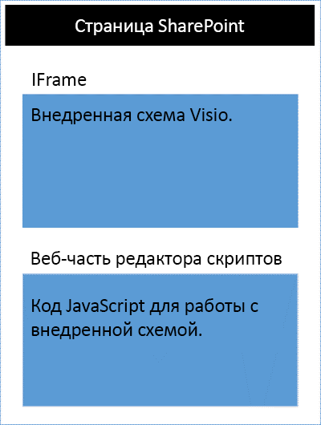
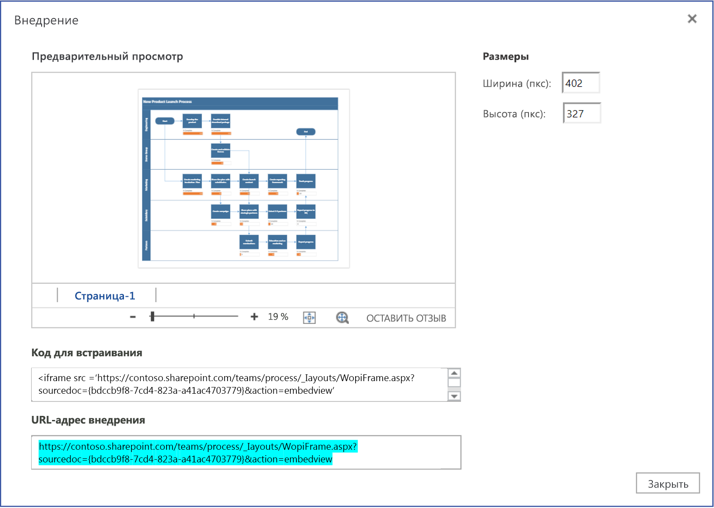

# <a name="visio-javascript-api-overview"></a>Обзор API JavaScript для Visio

С помощью API JavaScript для Visio вы можете внедрять схемы Visio в SharePoint Online. Внедренный документ Visio — схема, которая хранится в библиотеке документов SharePoint и отображается на странице SharePoint. Чтобы внедрить документ Visio, отобразите его в элементе `<iframe>` HTML. После этого вы сможете программным способом работать с внедренным документом при помощи API JavaScript для Visio.




API JavaScript для Visio позволяет следующее:

* работать с элементами документа Visio как со страницами и фигурами;
* создавать визуальную разметку на холсте документа Visio;
* создавать специальные обработчики событий мыши для документа;
* предоставлять своему решению данные документа, такие как текст фигуры, данные фигуры и гиперссылки.

В этой статье описано, как использовать API JavaScript для Visio с приложением Visio в Интернете, чтобы создавать решения для SharePoint Online. В ней рассматриваются ключевые понятия, понимание роли которых крайне важно при использовании API, такие как прокси-объекты JavaScript, **EmbeddedSession**, **RequestContext**, а также методы **sync()**, **Visio.run()** и **load()**. В приведенных ниже примерах кода показано применение этих элементов.

## <a name="embeddedsession"></a>EmbeddedSession

Объект EmbeddedSession инициализирует взаимодействие между фреймом разработчика и фреймом Visio в браузере.

```js
var session = new OfficeExtension.EmbeddedSession(url, { id: "embed-iframe",container: document.getElementById("iframeHost") });
session.init().then(function () {
    window.console.log("Session successfully initialized");
});
```

## <a name="visiorunsession-functioncontext--batch-"></a>Visio.run(session, function(context) { batch })

Метод **Visio.run()** выполняет пакетный сценарий, совершающий действия с объектной моделью Visio. Пакетные команды включают определения локальных прокси-объектов JavaScript и методов **sync()**, синхронизирующих состояние объектов Visio и локальных объектов, а также разрешение обещания. Преимущество пакетной обработки запросов в методе **Visio.run()** состоит в том, что при разрешении обещания все отслеживаемые объекты страницы, выделенные во время выполнения, автоматически освобождаются.

Метод run использует объект session и RequestContext и возвращает обещание (как правило, просто результат выполнения метода **context.sync()**). Пакетную операцию можно выполнить, не указывая ее в методе **Visio.run()**. Однако в этом случае все ссылки на объекты страницы требуют отслеживания и управления вручную.

## <a name="requestcontext"></a>RequestContext

Объект RequestContext обеспечивает отправку запросов приложению Visio. Так как фрейм разработчика и веб-клиент Visio отображаются в двух разных элементах iframe, для получения доступа через фрейм разработчика к Visio и связанным объектам, таким как страницы и фигуры, требуется объект RequestContext (контекст показан в следующем примере).

```js
function hideToolbars() {
    Visio.run(session, function(context){
        var app = context.document.application;
        app.showToolbars = false;
        return context.sync().then(function () {
            window.console.log("Toolbars Hidden");
        });
    }).catch(function(error)
    {
        window.console.log("Error: " + error);
    });
};
```

## <a name="proxy-objects"></a>Прокси-объекты

Объекты JavaScript для Visio, объявленные и использованные в надстройке, — это прокси-объекты для реальных объектов в документе Visio. Все действия над прокси-объектами не реализуются в Visio, а состояние документа Visio — в прокси-объектах, пока оно не будет синхронизировано. Состояние документа синхронизируется при выполнении `context.sync()`.

Например, локальный объект JavaScript getActivePage объявлен в качестве ссылки на выбранную страницу. Это можно использовать для добавления в очередь настройки его свойств и вызова методов. Действия над такими объектами не реализуются до выполнения метода **sync()**.

```js
var activePage = context.document.getActivePage();
```

## <a name="sync"></a>sync()

Метод **sync()** синхронизирует состояние прокси-объектов JavaScript и реальных объектов в Visio путем выполнения поставленных в очередь инструкций над контекстом и получения свойств загруженных объектов Office для их использования в коде. Этот метод возвращает обещание, которое выполняется после завершения синхронизации. 

## <a name="load"></a>load()

Метод **load()** используется для заполнения прокси-объектов, созданных на уровне JavaScript надстройки. При попытке получения объекта, такого как документ, сначала на уровне JavaScript создается локальный прокси-объект. Такой объект можно использовать для добавления в очередь настройки его свойств и вызова методов. Но для чтения свойств или связей объекта сначала необходимо вызвать методы **load()** и **sync()**. Метод load() использует свойства и связи, которые требуется загрузить при вызове метода **sync()**.

Ниже представлен синтаксис метода **load()**.

```js
object.load(string: properties); //or object.load(array: properties); //or object.load({loadOption});
```

1. **properties** — это список имен свойств, которые требуется загрузить, разделенных запятыми, или массив имен. Дополнительные сведения см. в описаниях методов **.load()** под каждым объектом.

2. **loadOption** указывает объект, описывающий свойства select, expand, top и skip. Дополнительные сведения см. в статье, посвященной [параметрам загрузки объектов](/javascript/api/office/officeextension.loadoption).

## <a name="example-printing-all-shapes-text-in-active-page"></a>Пример. Печать текста всех фигур на активной странице

Приведенный ниже пример показывает, как распечатать значение текста фигуры из объекта фигур массива.
Метод **Visio.run()** содержит пакет инструкций. В рамках этого пакета создается прокси-объект, который ссылается на фигуры в активном документе.

Все эти команды ставятся в очередь и выполняются при вызове метода **context.sync()**. Метод **sync()** возвращает обещание, с помощью которого его можно связать с другими операциями.

```js
Visio.run(session, function (context) {
    var page = context.document.getActivePage();
    var shapes = page.shapes;
    shapes.load();
    return context.sync().then(function () {
        for(var i=0; i<shapes.items.length;i++) {
            var shape = shapes.items[i];
            window.console.log("Shape Text: " + shape.text );
        }
    });
}).catch(function(error) {
    window.console.log("Error: " + error);
    if (error instanceof OfficeExtension.Error) {
        window.console.log ("Debug info: " + JSON.stringify(error.debugInfo));
    }
});
```

## <a name="error-messages"></a>Сообщения об ошибках

Ошибки возвращаются с помощью объекта ошибки, состоящего из кода и сообщения. В таблице ниже перечислены возможные ошибки.

| error.code            | error.message |
|-----------------------|----------------------------------------------------------------|
| InvalidArgument       | Аргумент недопустим, отсутствует или имеет неправильный формат. |
| GeneralException      | При обработке запроса возникла внутренняя ошибка. |
| NotImplemented        | Запрашиваемая функция не реализована.  |
| UnsupportedOperation  | Выполняемая операция не поддерживается. |
| AccessDenied          | Вы не можете выполнить запрашиваемую операцию. |
| ItemNotFound          | Запрашиваемый ресурс не существует. |

## <a name="get-started"></a>Начало работы

Для начала просмотрите пример в этом разделе. В этом примере показано, как программно отобразить текст выбранной фигуры в документе Visio. Сперва создайте классическую страницу в SharePoint Online или отредактируйте существующую страницу. Добавьте веб-часть редактора сценариев на эту страницу, а затем скопируйте и вставьте приведенный ниже код.

```js
<script src='https://appsforoffice.microsoft.com/embedded/1.0/visio-web-embedded.js' type='text/javascript'></script>

Enter Visio File Url:<br/>
<script language="javascript">
document.write("<input type='text' id='fileUrl' size='120'/>");
document.write("<input type='button' value='InitEmbeddedFrame' onclick='initEmbeddedFrame()' />");
document.write("<br />");
document.write("<input type='button' value='SelectedShapeText' onclick='getSelectedShapeText()' />");
document.write("<textarea id='ResultOutput' style='width:350px;height:60px'> </textarea>");
document.write("<div id='iframeHost' />");

let session; // Global variable to store the session and pass it afterwards in Visio.run()
var textArea;
// Loads the Visio application and Initializes communication between developer frame and Visio online frame
function initEmbeddedFrame() {
    textArea = document.getElementById('ResultOutput');
    var url = document.getElementById('fileUrl').value;
    if (!url) {
        window.alert("File URL should not be empty");
    }
    // APIs are enabled for EmbedView action only.
    url = url.replace("action=view","action=embedview");
    url = url.replace("action=interactivepreview","action=embedview");
    url = url.replace("action=default","action=embedview");
    url = url.replace("action=edit","action=embedview");
  
    session = new OfficeExtension.EmbeddedSession(url, { id: "embed-iframe",container: document.getElementById("iframeHost") });
    return session.init().then(function () {
        // Initialization is successful
        textArea.value  = "Initialization is successful";
    });
}

// Code for getting selected Shape Text using the shapes collection object
function getSelectedShapeText() {
    Visio.run(session, function (context) {
        var page = context.document.getActivePage();
        var shapes = page.shapes;
        shapes.load();
        return context.sync().then(function () {
            textArea.value = "Please select a Shape in the Diagram";
            for(var i=0; i<shapes.items.length;i++) {
                var shape = shapes.items[i];
                if ( shape.select == true) {
                    textArea.value = shape.text;
                    return;
                }
            }
        });
    }).catch(function(error) {
        textArea.value = "Error: ";
        if (error instanceof OfficeExtension.Error) {
            textArea.value += "Debug info: " + JSON.stringify(error.debugInfo);
        }
    });
}
</script>
```

После этого вам нужен только URL-адрес документа Visio, с которым вы хотите работать. Просто отправьте документ Visio в SharePoint Online и откройте его в Visio в Интернете. Оттуда откройте диалоговое окно внедрения и используйте URL-адрес внедрения в приведенном выше примере.



Если вы используете Visio в Интернете в режиме правки, откройте диалоговое окно внедрения, выбрав **Файл** > **Общий доступ** > **Внедрить**. Если вы используете Visio в Интернете в режиме просмотра, откройте диалоговое окно внедрения, выбрав элемент "..." а затем — команду **Внедрить**.

## <a name="visio-javascript-api-reference"></a>Справочник по API JavaScript для Visio

Дополнительные сведения об API JavaScript для Visio см. в [справочной документации по API JavaScript для Visio](/javascript/api/visio).
