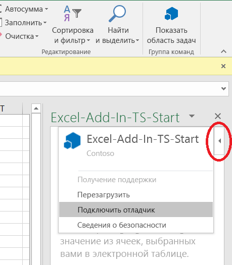
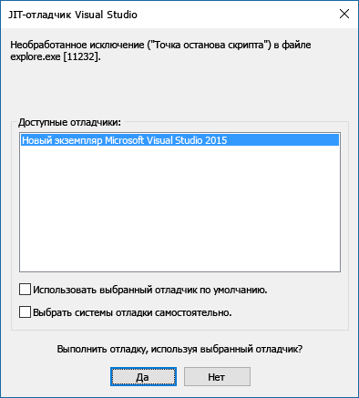

# Подключение отладчика из области задач

В Office 2016 для Windows (сборка 77xx.xxxx или более поздней версии) можно подключать отладчик из области задач. Функция "Подключить отладчик" подключит отладчик непосредственно к нужному процессу Internet Explorer. Вы можете подключить отладчик независимо от того, какой инструмент используете: генератор Yeoman, Visual Studio Code, Node.js, Angular или другой.

Для запуска средства **подключения отладчика** откройте меню **Личные данные** в правом верхнем углу области задач (выделено красным на рисунке ниже).

> [!NOTE]
> - В настоящее время единственным поддерживаемым средством отладки является [Visual Studio 2015](https://www.visualstudio.com/downloads/) с [обновлением 3 или](/previous-versions/mt752379(v=vs.140)) более поздней версией. Если у вас нет Visual Studio, выбор параметра **Attach Debugger** не приводит к действию.
> - Для отладки клиентского кода JavaScript можно использовать только средство **Подключить отладчик**. Для отладки серверного кода, например на сервере Node.js, существует множество вариантов. Сведения о том, как выполнять отладку в Visual Studio Code, см. в статье [Отладка Node.js в VS Code](https://code.visualstudio.com/docs/nodejs/nodejs-debugging). Если вы не используете Visual Studio Code, выполните поиск по запросу "отладка Node.js" или "отладка {имя_сервера}".

Выберите элемент **Подключить отладчик**. Откроется диалоговое окно **JIT-отладчик Visual Studio** (см. рисунок ниже).

В **обозревателе решений** Visual Studio вы увидите файлы кода.   Вы можете задать точки останова для отлаживаемой строки кода в Visual Studio.

> [!NOTE]
> Если меню "Личные данные" не отображается, отладить надстройку можно с помощью Visual Studio. Убедитесь, что надстройка области задач открыта в Office, а затем выполните указанные действия.
>
> 1. В Visual Studio выберите **ОТЛАДКА** > **Присоединиться к процессу**.
> 2. В разделе **Доступные процессы** выберите *либо* все доступные процессы `Iexplore.exe`, *либо* все доступные процессы `MicrosoftEdge*.exe`, в зависимости от того, [использует ли ваша надстройка Internet Explorer или Microsoft Edge](../concepts/browsers-used-by-office-web-add-ins.md), а затем нажмите кнопку **Присоединиться**.

Дополнительные сведения об отладке в Visual Studio см. в следующих статьях:

- Дополнительные сведения о запуске и использовании Проводника DOM в Visual Studio приведены в совете № 4 в разделе [Советы и рекомендации](/archive/blogs/officeapps/building-great-looking-apps-for-office-using-the-new-project-templates#tips_tricks) записи в блоге [Создание отличных приложений для Office с помощью новых шаблонов проекта](/archive/blogs/officeapps/building-great-looking-apps-for-office-using-the-new-project-templates).
- Как задать точки останова, можно узнать в статье [Использование точек останова](/visualstudio/debugger/using-breakpoints?view=vs-2015&preserve-view=true).
- Сведения об использовании F12 см. в статье [Использование средств разработчика F12](/previous-versions/windows/internet-explorer/ie-developer/samples/bg182326(v=vs.85)).
- Сведения об использовании средств разработчика в Microsoft Edge см. на странице [Microsoft Edge DevTools](https://www.microsoft.com/p/microsoft-edge-devtools-preview/9mzbfrmz0mnj?activetab=pivot%3Aoverviewtab).

## См. также

- [Отладка надстроек Office в Visual Studio](../develop/debug-office-add-ins-in-visual-studio.md)
- [Публикация надстройки Office](../publish/publish.md)
- [Надстройка Microsoft Office "Расширение отладчика для Visual Studio Code"](debug-with-vs-extension.md)