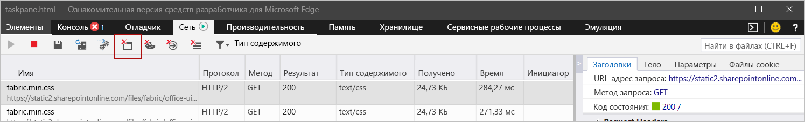

# Очистка кэша OfficeClear the Office cache

Можно удалить надстройку, ранее установленную в Windows, на компьютерах Mac или в iOS, очистив кэш Office на компьютере.You can remove an add-in that you've previously sideloaded on Windows, Mac, or iOS by clearing the Office cache on your computer. 

Кроме того, если вы изменяете манифест надстройки (например, обновляете имена файлов значков или текст команд надстройки), следует очистить кэш Office, а потом заново установить надстройку с помощью обновленного манифеста.Additionally, if you make changes to your add-in's manifest (for example, update file names of icons or text of add-in commands), you should clear the Office cache and then re-sideload the add-in using updated manifest. В этом случае надстройка будет отображаться в Office в соответствии с обновленным манифестом.Doing so will allow Office to render the add-in as it's described by the updated manifest.

## Очистка кэша Office в WindowsClear the Office cache on Windows

Чтобы удалить все сторонние надстройки из Excel, Word и PowerPoint, удалите содержимое папки `%LOCALAPPDATA%\Microsoft\Office\16.0\Wef\`.To remove all sideloaded add-ins from Excel, Word, and PowerPoint, delete the contents of the folder `%LOCALAPPDATA%\Microsoft\Office\16.0\Wef\`. 

Чтобы удалить сторонние надстройки из Outlook, выполните действия, описанные в статье [Сторонние надстройки Outlook для тестирования](/outlook/add-ins/sideload-outlook-add-ins-for-testing), чтобы найти надстройку в разделе **Настраиваемые надстройки** диалогового окна, в котором перечислены ваши установленные надстройки. Щелкните многоточие (`...`) для надстройки, а затем выберите **Удалить**, чтобы удалить определенную надстройку.To remove a sideloaded add-in from Outlook, use the steps outlined in [Sideload Outlook add-ins for testing](/outlook/add-ins/sideload-outlook-add-ins-for-testing) to find the add-in in the **Custom add-ins** section of the dialog box that lists your installed add-ins. Choose the ellipsis (`...`) for the the add-in and then choose **Remove** to remove that specific add-in.

Чтобы очистить кэш в Office на Windows 10, когда надстройка работает в Microsoft Edge, вы можете использовать Microsoft Edge DevTools.Additionally, to clear the Office cache on Windows 10 when the add-in is running in Microsoft Edge, you can use the Microsoft Edge DevTools.

> [!TIP]
> Если вы хотите только загрузить неопубликованную надстройку, чтобы отразить последние изменения в ее исходных файлах HTML или JavaScript, не нужно использовать описанные ниже действия, чтобы очистить кэш.If you're just wanting the sideloaded add-in to reflect recent changes to its HTML or JavaScript source files, you shouldn't need to use the following steps to clear the cache. Вместо этого просто переместите фокус в область задач надстройки (щелкнув в любом месте области задач) и нажмите клавишу **F5**, чтобы перезагрузить надстройку.Instead, just put focus in the add-in's task pane (by clicking anywhere within the task pane) and then press **F5** to reload the add-in. 

> [!NOTE]
> Чтобы очистить кэш Outlook с помощью следующих действий, в вашей надстройке должна быть панель задач.To clear the Office cache using the following steps, your add-in must have a task pane. Если в вашей надстройке нет пользовательского интерфейса (например, она использует функцию [проверки при отправке](/outlook/add-ins/outlook-on-send-addins)), потребуется добавить в надстройку область задач, использующую такой же домен для [SourceLocation](../reference/manifest/sourcelocation.md), прежде чем вы сможете использовать указанные ниже действия для очистки кэша.If your add-in is a UI-less add-in -- for example, one that uses the [on-send](/outlook/add-ins/outlook-on-send-addins) feature -- you'll need to add a task pane to your add-in that uses the same domain for [SourceLocation](../reference/manifest/sourcelocation.md), before you can use the following steps to clear the cache.

1. Установите [Microsoft Edge DevTools](https://www.microsoft.com/p/microsoft-edge-devtools-preview/9mzbfrmz0mnj).Install the [Microsoft Edge DevTools](https://www.microsoft.com/p/microsoft-edge-devtools-preview/9mzbfrmz0mnj).

2. Откройте надстройку в клиенте Office.Open your add-in in the Office client.

3. Запустите Microsoft Edge DevTools.Run the Microsoft Edge DevTools.

4. В Microsoft Edge DevTools перейдите на вкладку **Локальные**. Имя вашей надстройки будет указано в списке.In the Microsoft Edge DevTools, open the **Local** tab. Your add-in will be listed by its name.

5. Выберите имя надстройки, чтобы присоединить отладчик к надстройке.Select the add-in name to attach the debugger to your add-in. Откроется новое окно Microsoft Edge DevTools, когда отладчик присоединяется к надстройке.A new Microsoft Edge DevTools window will open when the debugger attaches to your add-in.

6. На вкладке **Сеть** в новом окне нажмите кнопку **Очистить кэш**.On the **Network** tab of the new window, select the **Clear cache** button.

    

7. Если эти действия не привели к нужному результату, вы также можете нажать кнопку **Всегда обновлять с сервера**.If completing these steps doesn't produce the desired result, you can also select the **Always refresh from server** button.

    

## Очистка кэша Office на компьютерах MacClear the Office cache on Mac

[!include[additional cache folders on Mac](../includes/mac-cache-folders.md)]

##  Очистка кэша Office в iOSClear the Office cache on iOS

Чтобы очистить кэш Office в iOS, вызовите `window.location.reload(true)` в JavaScript в надстройке, чтобы запустить принудительную перезагрузку.To clear the Office cache on iOS, call `window.location.reload(true)` from JavaScript in the add-in to force a reload. Также можно переустановить Office.Alternatively, you can reinstall Office.

## См. такжеSee also

- [Отладка надстроек OfficeDebug Office Add-ins](debug-add-ins-using-f12-developer-tools-on-windows-10.md)
- [Отладка надстройки с помощью журнала среды выполненияDebug your add-in with runtime logging](runtime-logging.md)
- [Загрузка неопубликованных надстроек Office для тестированияSideload Office Add-ins for testing](sideload-office-add-ins-for-testing.md)
- [XML-манифест надстроек OfficeOffice Add-ins XML manifest](../develop/add-in-manifests.md)
- [Проверка манифеста надстройки OfficeValidate an Office Add-in's manifest](troubleshoot-manifest.md)

