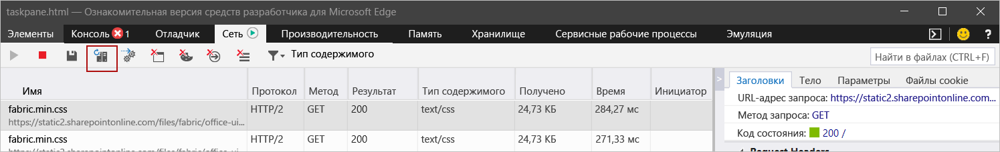

# Очистка кэша Office

Можно удалить надстройку, ранее установленную в Windows, на компьютерах Mac или в iOS, очистив кэш Office на компьютере.

Кроме того, если вы изменяете манифест надстройки (например, обновляете имена файлов значков или текст команд надстройки), следует очистить кэш Office, а потом заново установить надстройку с помощью обновленного манифеста. В этом случае надстройка будет отображаться в Office в соответствии с обновленным манифестом.

## Очистка кэша Office в Windows

Чтобы удалить все сторонние надстройки из Excel, Word и PowerPoint, удалите содержимое папки `%LOCALAPPDATA%\Microsoft\Office\16.0\Wef\`.

Чтобы удалить сторонние надстройки из Outlook, выполните действия, описанные в статье [Сторонние надстройки Outlook для тестирования](../outlook/sideload-outlook-add-ins-for-testing.md), чтобы найти надстройку в разделе **Настраиваемые надстройки** диалогового окна, в котором перечислены ваши установленные надстройки. Щелкните многоточие (`...`) для надстройки, а затем выберите **Удалить**, чтобы удалить определенную надстройку.

Чтобы очистить кэш в Office на Windows 10, когда надстройка работает в Microsoft Edge, вы можете использовать Microsoft Edge DevTools.

> [!TIP]
> Если вы хотите только загрузить неопубликованную надстройку, чтобы отразить последние изменения в ее исходных файлах HTML или JavaScript, не нужно использовать описанные ниже действия, чтобы очистить кэш. Вместо этого просто переместите фокус в область задач надстройки (щелкнув в любом месте области задач) и нажмите клавишу **F5**, чтобы перезагрузить надстройку.

> [!NOTE]
> Чтобы очистить кэш Outlook с помощью следующих действий, в вашей надстройке должна быть панель задач. Если в вашей надстройке нет пользовательского интерфейса (например, она использует функцию [проверки при отправке](../outlook/outlook-on-send-addins.md)), потребуется добавить в надстройку область задач, использующую такой же домен для [SourceLocation](../reference/manifest/sourcelocation.md), прежде чем вы сможете использовать указанные ниже действия для очистки кэша.

1. Установите [Microsoft Edge DevTools](https://www.microsoft.com/p/microsoft-edge-devtools-preview/9mzbfrmz0mnj).

2. Откройте надстройку в клиенте Office.

3. Запустите Microsoft Edge DevTools.

4. В Microsoft Edge DevTools перейдите на вкладку **Локальные**. Имя вашей надстройки будет указано в списке.

5. Выберите имя надстройки, чтобы присоединить отладчик к надстройке. Откроется новое окно Microsoft Edge DevTools, когда отладчик присоединяется к надстройке.

6. На вкладке **Сеть** в новом окне нажмите кнопку **Очистить кэш**.

    

7. Если эти действия не привели к нужному результату, вы также можете нажать кнопку **Всегда обновлять с сервера**.

    

## Очистка кэша Office на компьютерах Mac

[!include[additional cache folders on Mac](../includes/mac-cache-folders.md)]

## Очистка кэша Office в iOS

Чтобы очистить кэш Office в iOS, вызовите `window.location.reload(true)` в JavaScript в надстройке, чтобы запустить принудительную перезагрузку. Также можно переустановить Office.

## См. также

- [Отладка надстроек Office](debug-add-ins-using-f12-developer-tools-on-windows-10.md)
- [Отладка надстройки с помощью журнала среды выполнения](runtime-logging.md)
- [Загрузка неопубликованных надстроек Office для тестирования](sideload-office-add-ins-for-testing.md)
- [XML-манифест надстроек Office](../develop/add-in-manifests.md)
- [Проверка манифеста надстройки Office](troubleshoot-manifest.md)
