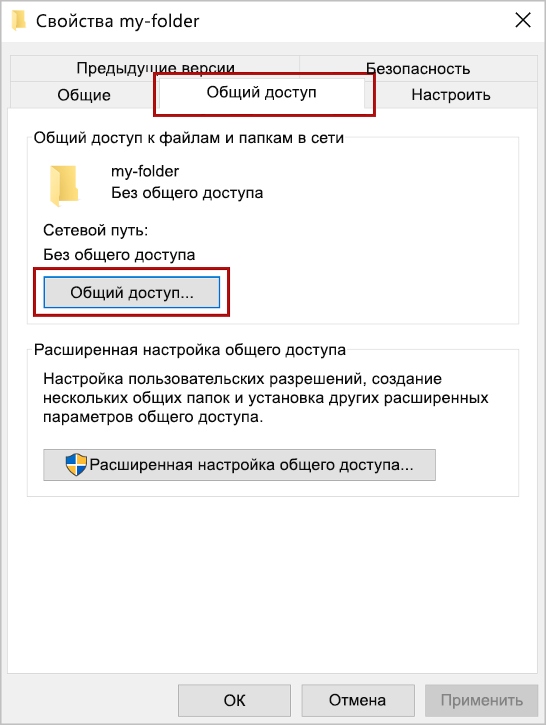
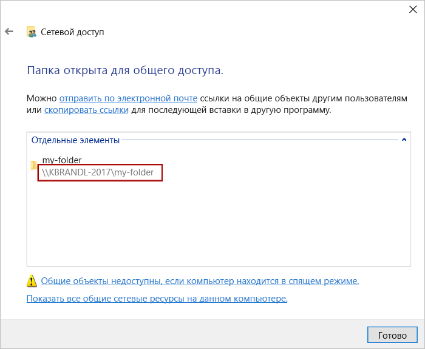
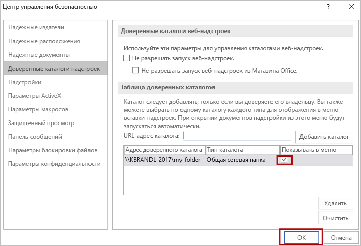

# <a name="sideload-office-add-ins-for-testing-from-a-network-share"></a>Sideload Office надстройки для тестирования из сетевой доли

Вы можете протестировать Office в клиенте Office, который находится на Windows, опубликовав манифест в сетевой файл (инструкции ниже). Этот параметр развертывания предназначен для использования, когда вы завершили разработку и тестирование на локальном сайте и хотите проверить надстройки с неместного сервера или облачной учетной записи.

> [!IMPORTANT]
> Развертывание совместной сети не поддерживается для надстройок производства. Этот метод имеет следующие ограничения.
>
> - Надстройка может быть установлена только на Windows компьютерах.
> - Если новая версия надстройки изменяет ленту, каждому пользователю придется переустановить надстройки.

> [!NOTE]
> Если проект надстройки создан с помощью достаточно новой версии [генератора Yeoman для надстроек Office](../develop/yeoman-generator-overview.md), неопубликованная надстройка автоматически загружается в классический клиент Office, когда вы запускаете команду `npm start`.

Эта статья применяется только к тестированию надстройок Word, Excel, PowerPoint, Project и только Windows. Если вы хотите протестировать на другой платформе или Outlook надстройку, см. один из следующих разделов для загрузки надстройки.

- [Загрузка неопубликованных надстроек Office в Office в Интернете для тестирования](sideload-office-add-ins-for-testing.md)
- [Загрузка неопубликованных надстроек Office на iPad и Mac для тестирования](sideload-an-office-add-in-on-ipad-and-mac.md)
- [Загрузка неопубликованных надстроек Outlook для тестирования](../outlook/sideload-outlook-add-ins-for-testing.md)

В приведенном ниже видео показано, как загрузить неопубликованную надстройку в классическое приложение Office или Office в Интернете с помощью каталога общих папок.  

> [!VIDEO https://www.youtube.com/embed/XXsAw2UUiQo]

## <a name="share-a-folder"></a>Общий доступ к папке

1. На том компьютере с Windows, где должна размещаться надстройка, перейдите к родительской папке или диску с папкой, которую требуется использовать в качестве каталога общих папок.

1. Откройте контекстное меню для папки, которую нужно использовать в качестве каталога общих папок (щелкните папку правой кнопкой мыши), и выберите пункт **Свойства**.

1. В диалоговом окне **Свойства** откройте вкладку **Доступ** и нажмите кнопку **Общий доступ**.

    

1. В диалоговом окне **Доступ к сети** добавьте себя и любых других пользователей и/или группы пользователей, которым следует предоставить доступ к вашей надстройке. Вам потребуются разрешения на **чтение и запись** папки. Завершив выбор пользователей, которым предоставляется совместный доступ, нажмите кнопку **Поделиться**.

1. Когда появится подтверждение, что **папка открыта для общего доступа**, запишите полный сетевой путь, отображаемый сразу после имени папки. (Это значение нужно вводить как **URL-адрес каталога** при [указании общей папки в качестве доверенного каталога](#specify-the-shared-folder-as-a-trusted-catalog), как описано в следующем разделе этой статьи). Нажмите кнопку **Готово**, чтобы закрыть диалоговое окно **Доступ к сети**.

   

1. Нажмите кнопку **Закрыть**, чтобы закрыть диалоговое окно **Свойства**.

## <a name="specify-the-shared-folder-as-a-trusted-catalog"></a>Указание общей папки в качестве доверенного каталога

### <a name="configure-the-trust-manually"></a>Настройка доверия вручную

1. Откройте новый документ в Excel, Word, PowerPoint или Project.

1. Перейдите на вкладку **Файл**, а затем выберите **Параметры**.

1. Выберите **Центр управления безопасностью**, а затем нажмите кнопку **Параметры центра управления безопасностью**.

1. Выберите пункт **Доверенные каталоги надстроек**.

1. В поле **URL-адрес каталога** введите полный сетевой путь к папке, к которой вы ранее предоставили [общий доступ](#share-a-folder). Если вы не записали полный сетевой путь к папке при предоставлении к ней общего доступа, его можно получить в диалоговом окне **Свойства** папки, как показано на снимке экрана ниже.

    

1. После ввода полного сетевого пути доступа к папке в поле **URL-адрес каталога**, нажмите кнопку **Добавить каталог**.

1. Установите флажок **Показывать в меню** для только что добавленного элемента и нажмите кнопку **ОК**, чтобы закрыть диалоговое окно **Центр управления безопасностью**. 

    

1. Выберите **кнопку ОК** , чтобы закрыть **диалоговое окно Options** .

1. Закройте и снова откройте приложение Office, чтобы изменения вступили в силу.

### <a name="configure-the-trust-with-a-registry-script"></a>Настройка доверия с помощью сценария реестра

1. В текстовом редакторе создайте файл с именем TrustNetworkShareCatalog.reg.

1. Добавьте следующий контент в файл.

    ```text
    Windows Registry Editor Version 5.00

    [HKEY_CURRENT_USER\Software\Microsoft\Office\16.0\WEF\TrustedCatalogs\{-random-GUID-here-}]
    "Id"="{-random-GUID-here-}"
    "Url"="\\\\-share-\\-folder-"
    "Flags"=dword:00000001
    ```

1. Используйте одно из многочисленных средств создания GUID в Интернете, например [Генератор GUID](https://guidgenerator.com/), для создания случайного GUID и в файле TrustNetworkShareCatalog.reg замените строку "-random-GUID-here-" *в обоих местах* идентификатором GUID. (Символы `{}` должны сохраняться.)

1. Замените значение `Url` полным сетевым путем к папке, к которой вы ранее предоставили [общий доступ](#share-a-folder). (Обратите внимание, что все знаки `\` в URL-адресе должны дублироваться.) Если вы не записали полный сетевой путь к папке при предоставлении к ней общего доступа, его можно получить в диалоговом окне **Свойства** папки, как показано на снимке экрана ниже.

    

1. Файл теперь должен выглядеть так, как показано ниже. Сохраните его.

    ```text
    Windows Registry Editor Version 5.00

    [HKEY_CURRENT_USER\Software\Microsoft\Office\16.0\WEF\TrustedCatalogs\{01234567-89ab-cedf-0123-456789abcedf}]
    "Id"="{01234567-89ab-cedf-0123-456789abcedf}"
    "Url"="\\\\TestServer\\OfficeAddinManifests"
    "Flags"=dword:00000001
    ```

1. Закройте *все* приложения Office.

1. Запустите файл TrustNetworkShareCatalog.reg как любой исполняемый файл, например, дважды щелкнув его.

## <a name="sideload-your-add-in"></a>Загрузка неопубликованной надстройки

1. XML-файл манифеста тестируемой надстройки необходимо поместить в каталог общих папок. Обратите внимание, что вы развертываете веб-приложение непосредственно на веб-сервере. Не забудьте указать URL-адрес в элементе **SourceLocation** файла манифеста.

    > [!IMPORTANT]
    > [!include[HTTPS guidance](../includes/https-guidance.md)]

    > [!NOTE]
    > Для Visual Studio проектов используйте манифест, построенный проектом в папке`{projectfolder}\bin\Debug\OfficeAppManifests`.

1. В Excel, Word или PowerPoint откройте на ленте вкладку **Вставка** и выберите **Мои надстройки**. В Project выберите **Мои надстройки** на вкладке **Project** ленты.

1. Нажмите **ОБЩАЯ ПАПКА** в верхней части диалогового окна **Надстройки Office**.

1. Выберите имя надстройки и нажмите кнопку **Добавить**, чтобы вставить надстройку.

## <a name="remove-a-sideloaded-add-in"></a>Удаление боковой надстройки

Вы можете удалить ранее загруженную надстройку путем очистки кэша Office на компьютере. Сведения о том, как очистить кэш на Windows, можно найти в статье [Clear the Office кэш](clear-cache.md#clear-the-office-cache-on-windows).

## <a name="see-also"></a>См. также

- [Проверка манифеста надстройки Office](troubleshoot-manifest.md)
- [Очистка кэша Office](clear-cache.md)
- [Публикация надстройки Office](../publish/publish.md)
