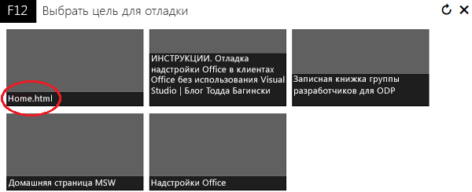
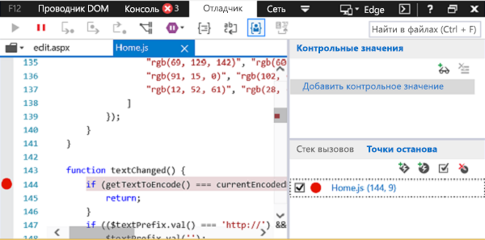
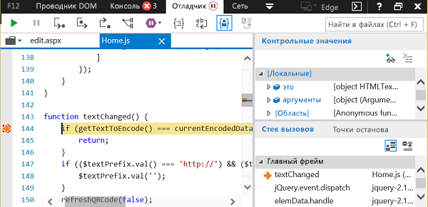

# Отладка надстроек с помощью средств разработчика в Windows 10Debug add-ins using developer tools on Windows 10

Для помощи в отладке надстроек в Windows 10 доступны инструменты для разработчиков, не входящие в интегрированные среды разработки.There are developer tools outside of IDEs available to help you debug your add-ins on Windows 10. Эти инструменты полезны, если нужно изучить проблемы при запуске надстройки вне интегрированной среды разработки.These are useful when you need to investigate a problem while running your add-in outside the IDE.

Используемый инструмент зависит от того, где работает надстройка: в Microsoft Edge или в Internet Explorer.The tool that you use depends on whether the add-in is running in Microsoft Edge or Internet Explorer. Это, в свою очередь, зависит от версий Windows 10 и Office, установленных на компьютере.This is determined by the version of Windows 10 and the version of Office that are installed on the computer. Сведения об определении браузера, используемого на компьютере разработки, см. в статье [Браузеры, используемые надстройками Office](../concepts/browsers-used-by-office-web-add-ins.md).To determine which browser is being used on your development computer, see [Browsers used by Office Add-ins](../concepts/browsers-used-by-office-web-add-ins.md).

> [!NOTE]
> Инструкции, представленные в этой статье, нельзя применять для отладки надстройки Outlook, использующей функции Execute.The instructions in this article cannot be used to debug an Outlook add-in that uses Execute Functions. Для отладки надстройки Outlook, использующей функции Execute, рекомендуется прикрепить ее к Visual Studio в режиме сценария или к другому отладчику сценариев.To debug an Outlook add-in that uses Execute Functions, we recommend that you attach to Visual Studio in script mode or to some other script debugger.

## Если надстройка работает в Microsoft EdgeWhen the add-in is running in Microsoft Edge

[!include[Enable debugging on Microsoft Edge DevTools](../includes/enable-debugging-on-edge-devtools.md)]

### Отладка с помощью Microsoft Edge DevToolsDebug using Microsoft Edge DevTools

Если надстройка работает в Microsoft Edge, можно использовать [Microsoft Edge DevTools](https://www.microsoft.com/p/microsoft-edge-devtools-preview/9mzbfrmz0mnj?activetab=pivot%3Aoverviewtab).When the add-in is running in Microsoft Edge, you can use the [Microsoft Edge DevTools](https://www.microsoft.com/p/microsoft-edge-devtools-preview/9mzbfrmz0mnj?activetab=pivot%3Aoverviewtab).

1. Запустите надстройку.Run the add-in.

2. Запустите Microsoft Edge DevTools.Run the Microsoft Edge DevTools.

3. Перейдите на вкладку **Локальные**. Имя вашей надстройки будет указано в списке.In the tools, open the **Local** tab. Your add-in will be listed by its name.

4. Щелкните имя надстройки, чтобы открыть ее.Click the add-in name to open it in the tools.

5. Перейдите на вкладку **Отладчик**.Open the **Debugger** tab. 

6. Выберите значок папки над областью **сценариев** (слева).Choose the folder icon above the **script** (left) pane. В раскрывающемся списке доступных файлов выберите файл JavaScript, который нужно отладить.From the list of available files shown in the dropdown list, select the JavaScript file that you want to debug.

7. Чтобы задать точку останова, выберите строку.To set a breakpoint, select the line. Появится красная точка слева от строки и соответствующая строка в области **стека вызовов** (в правом нижнем углу).You will see a red dot to the left of the line and a corresponding line in the **Call stack** (bottom right) pane.

8. Выполните функции в надстройке, необходимые для срабатывания точки останова.Execute functions in the add-in as needed to trigger the breakpoint.

## Если надстройка работает в Internet ExplorerWhen the add-in is running in Internet Explorer

Если надстройка работает в браузере Internet Explorer, для ее тестирования можно использовать отладчик в составе средств разработчика F12 в Windows 10.When the add-in is running in Internet Explorer, you can use the debugger from the F12 developer tools in Windows 10 to test your add-in. Средства разработчика F12 можно запустить после запуска надстройки.You can start the F12 developer tools after the add-in is running. Средства F12 отображаются в отдельном окне и не используют Visual Studio.The F12 tools are displayed in a separate window and do not use Visual Studio.

> [!NOTE]
> Отладчик входит в состав средств разработчика F12 в Internet Explorer и Windows 10, но не включен в предыдущие версии Windows.The Debugger is part of the F12 developer tools in Windows 10 and Internet Explorer. Earlier versions of Windows do not include the Debugger. 

В этом примере используются Word и бесплатная надстройка из AppSource.This example uses Word and a free add-in from AppSource.

1. Откройте Word и выберите пустой документ. Open Word and choose a blank document. 
    
2. На вкладке **Вставка**, в группе "Надстройки" нажмите **Магазин** и выберите надстройку **QR4Office**.On the **Insert** tab, in the Add-ins group, choose **Store** and select the **QR4Office** Add-in. (Вы можете загрузить любую надстройку из Магазина Microsoft Store или каталога надстроек).(You can load any add-in from the Store or your add-in catalog.)
    
3. Запустите средства разработчика F12, которые соответствуют вашей версии Office.Launch the F12 development tools that corresponds to your version of Office:
    
   - Путь к файлу для 32-разрядной версии Office — C:\Windows\System32\F12\IEChooser.exeFor the 32-bit version of Office, use C:\Windows\System32\F12\IEChooser.exe
    
   - Путь к файлу для 64-разрядной версии Office — C:\Windows\SysWOW64\F12\IEChooser.exeFor the 64-bit version of Office, use C:\Windows\SysWOW64\F12\IEChooser.exe
    
   Когда вы запустите IEChooser, в отдельном окне "Выбрать цель для отладки" отобразятся приложения, которые, возможно, нужно отладить.When you launch IEChooser, a separate window named "Choose target to debug" displays the possible applications to debug. Выберите необходимое приложение.Select the application that you are interested in. Если вы создаете собственную надстройку, выберите веб-сайт, на котором она развернута. Это может быть URL-адрес localhost.If you are writing your own add-in, select the website where you have the add-in deployed, which might be a localhost URL. 
    
   Например, выберите **home.html**.For example, select **home.html**. 
    
   

4. В окне F12 выберите файл, который требуется отладить.In the F12 window, select the file you want to debug.
    
   Чтобы выбрать файл в окне F12, нажмите значок папки над областью **сценариев** (слева).To select the file in the F12 window, choose the folder icon above the **script** (left) pane. В списке доступных файлов, представленных в раскрывающемся списке, выберите **Home.js**.From the list of available files shown in the dropdown list, select **Home.js**.
    
5. Задайте точку останова.Set the breakpoint.
    
   Чтобы задать точку останова в файле **Home.js**, выберите строку 144 (код функции `textChanged`).To set the breakpoint in **Home.js**, choose line 144, which is in the  `textChanged` function. Появятся красная точка слева от строки и соответствующая строка в области стека вызовов и точек останова (справа внизу).You will see a red dot to the left of the line and a corresponding line in the **Call stack and Breakpoints** (bottom right) pane. Другие способы задания точки останова см. в статье [Проверка выполнения кода JavaScript при помощи отладчика](/previous-versions/windows/internet-explorer/ie-developer/samples/dn255007(v=vs.85)).For other ways to set a breakpoint, see [Inspect running JavaScript with the Debugger](/previous-versions/windows/internet-explorer/ie-developer/samples/dn255007(v=vs.85)). 
    
   

6. Запустите надстройку, чтобы активировать точку останова.Run your add-in to trigger the breakpoint.
    
   В Word выберите текстовое поле URL-адреса в верхней части области **QR4Office** и попробуйте ввести какой-либо текст.In Word, choose the URL textbox in the upper part of the **QR4Office** pane and attempt to enter some text. В области **стека вызовов и точек останова** в отладчике вы увидите, что точка останова активирована и показывает различные сведения.In the Debugger, in the **Call stack and Breakpoints** pane, you'll see that the breakpoint has triggered and shows various information. Чтобы увидеть результаты, может потребоваться обновить отладчик.You might need to refresh the Debugger to see the results.
    
   

## См. такжеSee also

- [Проверка выполнения кода JavaScript с помощью отладчика](/previous-versions/windows/internet-explorer/ie-developer/samples/dn255007(v=vs.85))[Inspect running JavaScript with the Debugger](/previous-versions/windows/internet-explorer/ie-developer/samples/dn255007(v=vs.85))
- [Использование средств разработчика F12](/previous-versions/windows/internet-explorer/ie-developer/samples/bg182326(v=vs.85))[Using the F12 developer tools](/previous-versions/windows/internet-explorer/ie-developer/samples/bg182326(v=vs.85))
