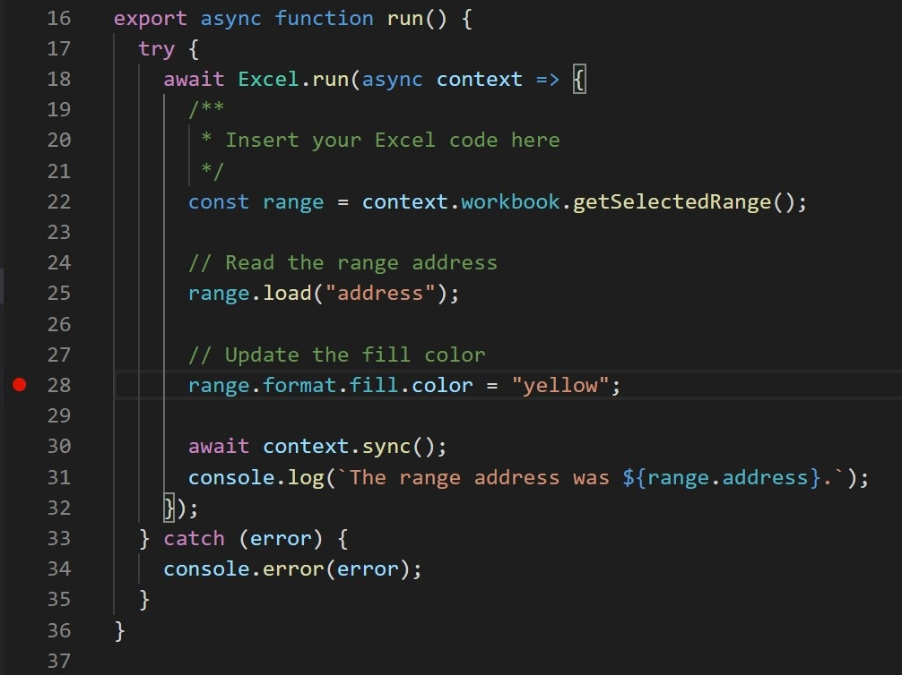

# <a name="debug-add-ins-on-windows-using-visual-studio-code-and-microsoft-edge-webview2-chromium-based"></a>Отладка настроек в Windows с использованием Visual Studio Code и Microsoft Edge WebView2 (на основе Chromium)

Надстройки Office, работающие в Windows, могут использовать отладку для среды выполнения Edge Chromium WebView2 непосредственно в Visual Studio Code.

> [!IMPORTANT]
> Эта статья относится только к надстройкам Office, которые запускаются в среде выполнения Microsoft Edge Chromium WebView2, что поясняется в статье [Браузеры, используемые надстройками Office](../concepts/browsers-used-by-office-web-add-ins.md). Инструкции по отладке в Visual Studio Code для устаревшей версии Microsoft Edge с первоначальной средой выполнения WebView (EdgeHTML) см. в статье [Расширение отладчика надстроек Office для Visual Studio Code](debug-with-vs-extension.md).

> [!TIP]
> Если вы не можете или не хотите выполнять отладку с помощью инструментов, встроенных в Visual Studio Code; или вы столкнулись с проблемой, которая возникает только тогда, когда надстройка запускается вне Visual Studio Code, вы можете отлаживать среду выполнения Microsoft Edge Chromium WebView2 с помощью средств разработчика Microsoft Edge (на основе Chromium), как описано в разделе [Отладка надстроек с помощью средств разработчика для Microsoft Edge WebView2](debug-add-ins-using-devtools-edge-chromium.md).

Это динамический режим отладки, в нем можно устанавливать точки останова во время выполнения кода. Пока присоединен отладчик, изменения кода отображаются немедленно, при этом сохраняется сеанс отладки. Кроме того, сохраняются изменения кода, поэтому можно видеть результаты нескольких изменений кода. Работа этого расширения показана на следующем рисунке.


## <a name="prerequisites"></a>Предварительные требования

- [Visual Studio Code](https://code.visualstudio.com/)
- [Node.js (версия 10. или более поздняя)](https://nodejs.org/)
- Windows 10, 11
- Сочетание платформы и приложения Office, которое поддерживает Microsoft Edge с WebView2 (на основе Chromium), как описано в статье [Браузеры, используемые надстройками Office](../concepts/browsers-used-by-office-web-add-ins.md). Если вы используете Microsoft 365 с версией до 2101, установите WebView2. Воспользуйтесь инструкциями по установке на странице [Microsoft Edge WebView2 / Внедрение веб-контента ... с помощью Microsoft Edge WebView2](https://developer.microsoft.com/microsoft-edge/webview2/).

## <a name="use-the-visual-studio-code-debugger"></a>Использование отладчика Visual Studio Code

В этой инструкции предполагается, что вы умеете использовать командную строку, понимаете основы JavaScript и создали проект надстройки Office перед использованием генератора Yo Office. Если вы не сделали этого раньше, рекомендуем ознакомиться с одним из наших учебников, например [Учебник по надстройкам Office для Excel](../tutorials/excel-tutorial.md).

1. Первый шаг зависит от проекта и от порядка его создания.

   - Если вы хотите создать проект, чтобы поэкспериментировать с отладкой в Visual Studio Code, используйте [генератор Yeoman для надстроек Office](https://github.com/OfficeDev/generator-office). Для этого используйте любое руководство по началу работы, например [Начало работы с надстройками Outlook](../quickstarts/outlook-quickstart.md). 
   - Если нужно отладить существующий проект, созданный с помощью Yo Office, перейдите к следующем шагу.
   - Если нужно отладить существующий проект, созданный без использования Yo Office, выполните действия, указанные в [приложении A](#appendix-a), затем вернитесь к следующему шагу этой процедуры.

1. Откройте VS Code, откройте проект в этом решении. 

1. Выберите **Просмотр > Выполнить** или нажмите клавиши **CTRL+SHIFT+D**, чтобы переключить представление отладки.

1. В разделе параметров **ВЫПОЛНЕНИЕ И ОТЛАДКА** выберите Edge Chromium для ведущего приложения, например **классическое приложение Outlook (Edge Chromium)**. Чтобы начать отладку, нажмите **F5** или выберите **Выполнить > Начать отладку** в меню. Это действие автоматически запускает локальный сервер в окне Node для размещения вашей надстройки, а затем автоматически открывает ведущее приложение, например Excel или Word. Это может занять несколько секунд.

   > [!TIP]
   > Если вы не используете проект, созданный в Yo Office, вам может быть предложено настроить раздел реестра. В корневой папке проекта выполните указанные ниже действия в командной строке.
   >
   > ``` command&nbsp;line
   > npx office-addin-debugging start <your manifest path>
   > ```

   > [!IMPORTANT]
   > Если проект был создан с помощью более старых версий Yo Office, то через 10–30 секунд после начала отладки может появиться следующее сообщение об ошибке (обратите внимание, что к этому моменту вы уже могли перейти к другому шагу этой процедуры). Это сообщение об ошибке может быть скрыто за диалоговым окном, описанным на следующем шаге.
   >
   > 
   >
   > Выполните задачи, перечисленные в [приложении B](#appendix-b), и перезапустите эту процедуру.
   
1. Теперь надстройка готова к использованию в ведущем приложении. Нажмите кнопку **Показать область задач** или выполнить другие дополнительные команды надстройки. Появится диалоговое окно приблизительно со следующим текстом:

   > WebView Stop On Load.
   > Чтобы выполнить отладку WebView, вложите код VS в экземпляр WebView с помощью отладчика Microsoft для Edge и нажмите кнопку ОК. Чтобы предотвратить появление диалогового окна в дальнейшем, нажмите кнопку "Отмена".

   Нажмите **ОК**.

   > [!NOTE]
   > После нажатия кнопки **Отмена** диалоговое окно не будет отображаться в процессе работы с этим экземпляром надстройки. Однако при перезапуске надстройки диалоговое окно снова появится.

1. Теперь можно задать точки останова в коде проекта и выполнить отладку. Чтобы установить точки останова в Visual Studio Code, наведите указатель мыши на строку кода выберите появившийся красный кружок.

    

1. Запустите в надстройке функциональность, которая вызывает строки с точками останова. Вы увидите, что достигнуты точки останова, и можно изучить локальные переменные.

   > [!NOTE]
   > Точки останова в вызовах `Office.initialize` или `Office.onReady` игнорируются. Дополнительные сведения об этих методах см. в статье [Инициализация надстройки Office](../develop/initialize-add-in.md).

> [!IMPORTANT]
> Лучший способ остановить сеанс отладки — нажать клавиши **SHIFT+F5** или выбрать **Выполнить > Остановить отладку** в меню. Это действие должно закрыть окно сервера Node и попытаться закрыть ведущее приложение, но в ведущем приложении появится запрос о необходимости сохранения документа. Сделайте соответствующий выбор и позвольте закрыть ведущее приложение. Избегайте закрытия окна Node или ведущего приложения вручную. Это может привести к ошибкам, особенно при многократной остановке и запуске сеансов отладки.
>
> Если отладка перестает работать (например, если игнорируются точки останова), остановите отладку. Затем при необходимости закройте все окна ведущего приложения и окно Node. Наконец, закройте Visual Studio Code и снова откройте его.

### <a name="appendix-a"></a>Приложение A

Если проект не был создан с помощью Yo Office, нужно создать конфигурацию отладки для Visual Studio Code. 

1. Создайте файл с именем `launch.json` в папке проекта `\.vscode`, если такого файла там нет. 
1. Убедитесь, что в файле есть массив `configurations`. Ниже приведен простой пример `launch.json`.

   ```json
   {
     // other properities may be here.
   
     "configurations": [
   
       // configuration objects may be here.
   
     ]
   
     //other properies may be here.
   }
   ```

1. Добавьте следующий объект в массив `configurations`.

   ```json
   {
      "name": "$HOST$ Desktop (Edge Chromium)",
      "type": "pwa-msedge",
      "request": "attach",
      "useWebView": true,
      "port": 9229,
      "timeout": 600000,
      "webRoot": "${workspaceRoot}",
      "preLaunchTask": "Debug: Excel Desktop",
      "postDebugTask": "Stop Debug"
   },
   ```

1. Замените заполнитель `$HOST$` именем приложения Office, в котором выполняется надстройка, например, `Outlook` или `Word`.
1. Сохраните и закройте файл.

### <a name="appendix-b"></a>Приложение B

1. В диалоговом окне ошибки нажмите кнопку **Отмена**.
1. Если отладка не остановится автоматически, нажмите клавиши **SHIFT+F5** или выберите **Выполнить > Остановить отладку** в меню. 
1. Закройте окно узла, в котором работает локальный сервер, если это окно не закроется автоматически.
1. Закройте приложение Office, если оно не закроется автоматически.
1. Откройте файл `\.vscode\launch.json` в проекте. 
1. В массиве `configurations` существует несколько объектов конфигурации. Найдите объект, имя которого устроено по шаблону `$HOST$ Desktop (Edge Chromium)`, где $HOST$ — приложение Office, в котором выполняется надстройка, например, `Outlook Desktop (Edge Chromium)` или `Word Desktop (Edge Chromium)`. 
1. Измените значение свойства `"type"` с `"edge"` на `"pwa-msedge"`.
1. Измените значение свойства `"useWebView"` из строки `"advanced"` на логическое значение `true` (обратите внимание, что вокруг `true` нет кавычек).
1. Сохраните файл.
1. Закройте VS Code.

## <a name="see-also"></a>См. также

- [Тестирование и отладка надстроек Office](test-debug-office-add-ins.md)
- [Отладка настроек в Windows с использованием Visual Studio Code и WebView в устаревшей версии Microsoft Edge (EdgeHTML)](debug-with-vs-extension.md)
- [Отладка надстроек с помощью средств разработчика для Internet Explorer](debug-add-ins-using-f12-tools-ie.md)
- [Отладка надстроек с помощью средств разработчика для устаревшей версии Microsoft Edge](debug-add-ins-using-devtools-edge-legacy.md)
- [Отладка надстроек с помощью средств разработчика в Microsoft Edge (на основе Chromium)](debug-add-ins-using-devtools-edge-chromium.md)
- [Подключение отладчика из области задач](attach-debugger-from-task-pane.md)
