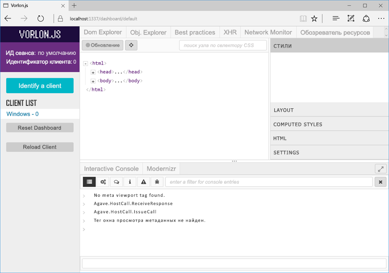

# <a name="debug-office-add-ins-on-ipad-and-mac"></a>Отладка надстроек Office на iPad и Mac

Visual Studio подходит для разработки и отладки надстроек в Windows, но с его помощью невозможно выполнять отладку надстроек на платформах iPad и Mac. Так как надстройки создаются с помощью кода HTML и Javascript, они рассчитаны на работу на многих платформах, но отрисовка HTML в разных браузерах может слегка отличаться. В этой статье описывается отладка надстроек на платформах iPad и Mac. 

## <a name="debugging-with-safari-web-inspector-on-a-mac"></a>Отладка с помощью Safari Web Inspector на компьютере Mac

Если у вас есть надстройка, которая отображает пользовательский интерфейс в области задач или контентной надстройке, вы можете отлаживать надстройку Office с помощью Safari Web Inspector.

Отладку надстроек Office на компьютере Mac можно выполнить, только если на нем установлена система Mac OS High Sierra И Office для Mac версии 16.9.1 (сборка 18012504) или более поздней. Если у вас нет сборки Office для Mac, вы можете получить ее, присоединившись к [программе для разработчиков Office 365](https://aka.ms/o365devprogram).

Для этого откройте терминал и установите свойство `OfficeWebAddinDeveloperExtras` для соответствующего приложения Office следующим образом:

- `defaults write com.microsoft.Word OfficeWebAddinDeveloperExtras -bool true`

- `defaults write com.microsoft.Excel OfficeWebAddinDeveloperExtras -bool true`

- `defaults write com.microsoft.Powerpoint OfficeWebAddinDeveloperExtras -bool true`

- `defaults write com.microsoft.Outlook OfficeWebAddinDeveloperExtras -bool true`

Затем откройте приложение Office и вставьте надстройку. Щелкните надстройку правой кнопкой мыши. В контекстном меню отобразится пункт **Проверить элемент**.  Выберите его. Он появится в инспекторе, где можно устанавливать точки останова и отлаживать надстройку.

> [!NOTE]
> Обратите внимание, что это экспериментальная функция, которая может отсутствовать в последующих версиях приложений Office.
>
> Если при попытке использовать инспектор диалоговое окно мерцает, попробуйте сделать вот что:
> 1. Уменьшите размер диалогового окна.
> 2. Выберите пункт **Проверить элемент**, который откроется в новом окне.
> 3. Измените размер диалогового окна на исходный.
> 4. Используйте инспектор должным образом.

## <a name="debugging-with-vorlonjs-on-a-ipad-or-mac"></a>Отладка с помощью Vorlon.JS на iPad или Mac

Чтобы отладить надстройку на iPad или Mac, можно использовать отладчик для веб-страниц Vorlon.JS, который схож с инструментами F12. Он предназначен для удаленной работы и позволяет отлаживать веб-страницы на различных устройствах. Дополнительные сведения см. на [веб-сайте Vorlon](http://www.vorlonjs.com).  


### <a name="install-and-set-up-vorlonjs"></a>Установка и настройка Vorlon.JS  

1.  Войдите на устройстве от имени администратора.

2.  Установите библиотеку [Node.js](https://nodejs.org), если она еще не установлена.

3.  Откройте окно **Терминал** и введите команду `npm i -g vorlon`. Средство будет установлено в папке `/usr/local/lib/node_modules/vorlon`.


### <a name="configure-vorlonjs-to-use-https"></a>Настройка Vorlon.JS на использование HTTPS

Для отладки приложения с помощью Vorlon.JS необходимо добавить на начальную страницу приложения тег `<script>`, который загружает скрипт Vorlon.JS из известного расположения (подробные сведения см. в следующей процедуре). Если для надстройки используется протокол SSL (HTTPS), все используемые ею скрипты, включая скрипт Vorlon.JS, должны размещаться на HTTPS-сервере. Таким образом, чтобы использовать Vorlon.JS с надстройками, необходимо настроить Vorlon.JS на применение SSL.

> [!IMPORTANT]
> [!include[HTTPS guidance](../includes/https-guidance.md)]

1.  В средстве **Finder** перейдите к папке `/usr/local/lib/node_modules/vorlon`, откройте контекстное меню (правая кнопка мыши) папки `/Server` и выберите пункт **Получить сведения**.

2.  Выберите значок висячего замка в правом нижнем углу окна **Сведения о сервере**, чтобы разблокировать папку.

3. В разделе **Общий доступ и разрешения** этого окна выберите **Чтение и запись** в разделе **Разрешение** для группы **Персонал**.

4. Снова выберите значок висячего замка, чтобы ***повторно заблокировать*** папку.

5. В средстве **Finder** разверните вложенную папку `/Server`, щелкните правой кнопкой мыши файл `config.json` и выберите пункт **Получить сведения**.

6. В окне **Сведения о config.json** измените разрешения для файла точно так же, как и для его родительской папки `/Server`. Не забудьте повторно заблокировать папку, а затем закройте окно.

7. В средстве **Finder** щелкните правой кнопкой мыши файл `config.json`, выберите пункт **Открыть с помощью** и выберите **TextEdit**. Файл откроется в текстовом редакторе.

8. Измените значение свойства **useSSL** на `true`.

9. В разделе **Подключаемые модули** найдите подключаемый модуль, свойство **id** которого равно `OFFICE`, а свойство **name** — `Office Addin`. Если для свойства **enabled** этого подключаемого модуля еще не задано значение `true`, задайте для него значение `true`.

10. Сохраните файл и закройте редактор.

11. В средстве **Finder** перейдите к папке `/usr/local/lib/node_modules/vorlon`, щелкните правой кнопкой мыши вложенную папку `Server` и выберите пункт **Новый терминал в этой папке**.

12. В окне **Терминал** введите команду `sudo vorlon`. Вам будет предложено ввести пароль администратора. Запустится сервер Vorlon. Оставьте окно **Терминал** открытым.

13. Откройте окно браузера и перейдите по адресу `https://localhost:1337`, где находится интерфейс Vorlon.JS. Когда появится соответствующий запрос, выберите элемент **Всегда**, чтобы сделать сертификат безопасности доверенным.

    > [!NOTE]
    > Если запрос не появится, может потребоваться сделать сертификат доверенным вручную. Файл сертификата — `/usr/local/lib/node_modules/vorlon/Server/cert/server.crt`. Выполните указанные ниже действия. При возникновении проблем обратитесь к справке по Macintosh или iPad.
    >
    > 1. Закройте окно браузера, а затем в окне **Терминал**, где выполняется сервер Vorlon, нажмите клавиши CTRL+C, чтобы остановить сервер.
    > 2. В средстве **Finder**, щелкните правой кнопкой мыши файл `server.crt` и выберите **Доступ к цепочкам ключей**. Откроется окно **Доступ к цепочкам ключей**.
    > 3. В списке **Цепочки ключей** слева выберите **Имя пользователя** (если оно еще не выбрано), а затем выберите **Сертификаты** в разделе **Категория**. В списке отображается сертификат **localhost**.
    > 4. Щелкните сертификат **localhost** правой кнопкой мыши и выберите пункт **Получить сведения**. Откроется окно **localhost**.
    > 5. В разделе **Доверие** откройте селектор **При использовании этого сертификата** и выберите **Всегда доверять**. 
    > 6. Закройте окно **localhost**. Если действие выполнено успешно, на значке сертификата **localhost** в окне **Доступ к цепочкам ключей** будет отображаться белый крест в синем круге.


### <a name="configure-the-add-in-for-vorlonjs-debugging"></a>Конфигурация надстройки для отладки с помощью Vorlon.JS

1. Добавьте следующий тег сценария в раздел `<head>` файла home.html (или основного HTML-файла) своей надстройки:

    ```html
    <script src="https://localhost:1337/vorlon.js"></script>
    ```  

2. Разверните веб-приложение надстройки на веб-сервере, доступном с Mac или iPad, например на веб-сайте Azure.

3. Обновите URL-адрес надстройки во всех разделах манифеста, где он отображается.

4. Скопируйте манифест надстройки в следующую папку на Mac или iPad: `/Users/{your_name_on_the_device}/Library/Containers/com.microsoft.{host_name}/Data/Documents/wef`, где *{host_name}* — это Word, Excel, PowerPoint или Outlook.


### <a name="inspect-an-add-in-in-vorlonjs"></a>Просмотр надстройки в Vorlon.JS

1. Если сервер Vorlon не запущен, в средстве **Finder** перейдите к папке `/usr/local/lib/node_modules/vorlon`, щелкните правой кнопкой мыши вложенную папку `Server` и выберите пункт **Новый терминал в этой папке**. 

2.  В окне **Терминал** введите команду `sudo vorlon`. Вам будет предложено ввести пароль администратора. Запустится сервер Vorlon. Оставьте окно **Терминал** открытым.

3.  Откройте окно браузера и перейдите по адресу `https://localhost:1337`, где находится интерфейс Vorlon.JS.

4. Загрузите неопубликованную надстройку. Если надстройка предназначена для Excel, PowerPoint или Word, загружайте ее согласно указаниям из статьи [Загрузка неопубликованных надстроек Office на iPad и компьютер Mac](sideload-an-office-add-in-on-ipad-and-mac.md). Если же это надстройка Outlook, загружайте ее согласно указаниям из статьи [Загрузка неопубликованных надстроек Outlook для тестирования](https://docs.microsoft.com/outlook/add-ins/sideload-outlook-add-ins-for-testing). Если надстройка не использует команды, она откроется сразу. В противном случае нажмите кнопку, чтобы открыть надстройку. В зависимости от сборки ведущего приложения Office, кнопка будет отображаться на вкладке **Главная** или **Надстройка**.

Надстройка будет отображаться в списке клиентов в Vorlon.JS (в левой части интерфейса Vorlon.JS) как **{ОС} - n**, где *n* — число, а *{ОС}* — тип устройства, например Macintosh.



Для средства Vorlon доступен ряд подключаемых модулей. Те, что уже включены, отображаются в виде вкладок в верхней части окна. (Вы можете включить дополнительные подключаемые модули, выбрав значок шестеренки слева.) Эти подключаемые модули подобны функциям, вызываемым с помощью клавиши F12. Например, вы можете выделять элементы модели DOM, выполнять команды и другие действия. Дополнительные сведения см. в разделе с описанием [основных подключаемых модулей](http://vorlonjs.com/documentation/#console) документации по Vorlon.

Подключаемый модуль **Надстройка Office** добавляет в Office.js такие возможности, как изучение объектной модели, совершение вызовов Office.js и считывание значений свойств объекта. Сведения см. в статье [Подключаемый модуль VorlonJS для отладки надстроек Office](https://blogs.msdn.microsoft.com/mim/2016/02/18/vorlonjs-plugin-for-debugging-office-addin/).

> [!NOTE]
> В Vorlon.JS невозможно задавать точки останова.


## <a name="clearing-the-office-applications-cache-on-a-mac-or-ipad"></a>Очистка кэша приложения Office на компьютере Mac или iPad

Для повышения производительности надстройки часто кэшируются в Office для Mac. Как правило, для очистки кэша необходимо перезагрузить надстройку. Если в одном документе несколько надстроек, автоматическая очистка кэша может не сработать при перезагрузке.

На компьютере Mac можно очистить кэш вручную, удалив все содержимое папки `/Users/{your_name_on_the_device}/Library/Containers/com.Microsoft.OsfWebHost/Data/`.

На iPad можно вызвать в надстройке метод JavaScript `window.location.reload(true)` для принудительной перезагрузки. Вы также можете переустановить Office.
