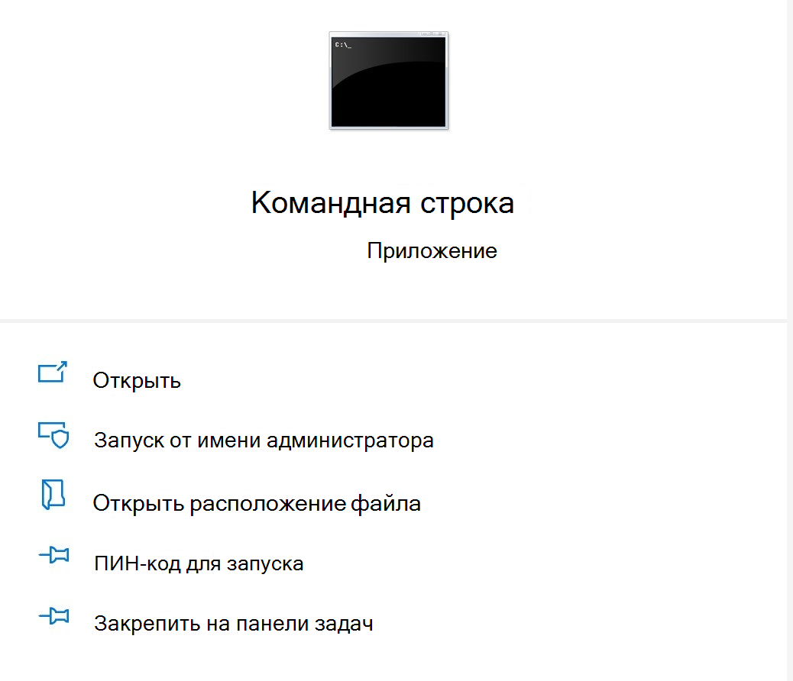

# <a name="microsoft-office-add-in-debugger-extension-for-visual-studio-code"></a>Надстройка Microsoft Office "Расширение отладчика для Visual Studio Code"

Расширение отладчика надстроек Microsoft Office для Visual Studio Code позволяет отлаживать надстройку Office в пограничной среде выполнения.

Этот режим отладки динамический, позволяющий задавать точки останова во время выполнения кода. Вы можете видеть изменения в коде сразу же после присоединения отладчика, все без потери сеанса отладки. Изменения в коде также остаются неизменными, поэтому вы можете увидеть результаты нескольких изменений в коде. На следующем изображении показано это расширение в действии.


## <a name="prerequisites"></a>Предварительные требования

- [Visual Studio Code](https://code.visualstudio.com/) (необходимо запускать от имени администратора)
- [Node.js (версия 10 +)](https://nodejs.org/)
- Windows 10;
- [Microsoft Edge](https://www.microsoft.com/edge)

В этих инструкциях предполагается, что у вас есть опыт работы с помощью командной строки, общие сведения об основном коде JavaScript и создание проекта надстройки Office перед использованием генератора Yo Office. Если вы еще этого не сделали, ознакомьтесь с одним из наших руководств, как в этом [руководстве по надстройкам Office для Excel](../tutorials/excel-tutorial.md).

## <a name="install-and-use-the-debugger"></a>Установка и использование отладчика

1. Если вам нужно создать проект надстройки, [создайте его с помощью генератора Yo Office](https://docs.microsoft.com/office/dev/add-ins/quickstarts/excel-quickstart-jquery?tabs=yeomangenerator). Чтобы настроить проект, следуйте инструкциям в командной строке. Вы можете выбрать любой язык или тип проекта в соответствии со своими потребностями.

> [!NOTE]
> Если у вас уже есть проект, пропустите шаг 1 и перейдите к шагу 2.

2. Откройте командную строку от имени администратора.
   

3. Перейдите к каталогу проекта.

4. Выполните следующую команду, чтобы открыть проект в Visual Studio Code от имени администратора.

```command&nbsp;line
code .
```

После открытия кода Visual Studio перейдите в папку проекта вручную.

> [!TIP]
> Чтобы открыть Visual Studio Code от имени администратора, установите флажок **Запуск от имени администратора** при открытии кода Visual Studio после его поиска в Windows.

5. В рамках кода VS нажмите **клавиши CTRL + SHIFT + X** , чтобы открыть панель расширений. Выполните поиск расширения "надстройка Microsoft Office Debugger Debugger" и установите его.

6. В папке. вскоде проекта откройте **launch.jsв** файле. Добавьте в раздел следующий код `configurations` :

```JSON
{
  "type": "office-addin",
  "request": "attach",
  "name": "Attach to Office Add-ins",
  "port": 9222,
  "trace": "verbose",
  "url": "https://localhost:3000/taskpane.html?_host_Info=HOST$Win32$16.01$en-US$$$$0",
  "webRoot": "${workspaceFolder}",
  "timeout": 45000
}
```

7. В разделе только что скопированный JSON найдите раздел "URL". В этом URL-адресе необходимо заменить текст узла в верхнем регистре на ведущее приложение для надстройки Office. Например, если надстройка Office предназначена для Excel, URL-адрес будет иметь значение " https://localhost:3000/taskpane.html?_host_Info= <strong>Excel</strong>$Win 32 $16.01 $ en-US $ \$ \$ \$ 0".

8. Откройте командную строку и убедитесь в наличии корневой папки проекта. Выполните команду, `npm start` чтобы запустить сервер разработки. Когда надстройка загружается в клиенте Office, откройте область задач.

9. Вернитесь к Visual Studio Code и выберите **просмотр > Отладка** или ввод **CTRL + SHIFT + D** , чтобы перейти в представление отладки.

10. В разделе Параметры отладки выберите команду **присоединиться к**надстройкам Office. Нажмите **клавишу F5** или выберите **Debug — > начать отладку** в меню, чтобы начать отладку.

11. Задайте точку останова в файле области задач проекта. Вы можете задать точки останова в коде VS, наведя курсор рядом с строкой кода и выбрав красный круг.


12. Запустите надстройку. Вы увидите, что достигнуты точки останова, и можете проверить локальные переменные.

## <a name="see-also"></a>См. также

* [Тестирование и отладка надстроек Office](test-debug-office-add-ins.md)

* [Отладка надстроек с помощью средств разработчика в Windows 10](debug-add-ins-using-f12-developer-tools-on-windows-10.md)

* [Подключение отладчика из области задач](attach-debugger-from-task-pane.md)
