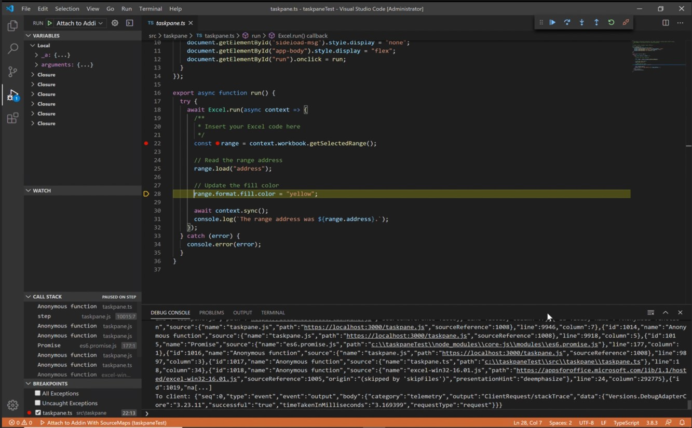

# <a name="microsoft-office-add-in-debugger-extension-for-visual-studio-code"></a><span data-ttu-id="bf858-103">Надстройка Microsoft Office "Расширение отладчика для Visual Studio Code"</span><span class="sxs-lookup"><span data-stu-id="bf858-103">Microsoft Office Add-in Debugger Extension for Visual Studio Code</span></span>

<span data-ttu-id="bf858-104">Расширение Microsoft Office надстройки для Visual Studio Code позволяет отладить Office надстройку Microsoft Edge с исходным временем работы webView (EdgeHTML).</span><span class="sxs-lookup"><span data-stu-id="bf858-104">The Microsoft Office Add-in Debugger Extension for Visual Studio Code allows you to debug your Office Add-in against the Microsoft Edge with the original webView (EdgeHTML) runtime.</span></span> <span data-ttu-id="bf858-105">Инструкции по отладки Microsoft Edge WebView2 (Chromium основе) см. [в этой статье](./debug-desktop-using-edge-chromium.md)</span><span class="sxs-lookup"><span data-stu-id="bf858-105">For instructions about debugging against Microsoft Edge WebView2 (Chromium-based), [see this article](./debug-desktop-using-edge-chromium.md)</span></span>

<span data-ttu-id="bf858-106">Этот режим отладки динамический, что позволяет устанавливать точки разрыва во время работы кода.</span><span class="sxs-lookup"><span data-stu-id="bf858-106">This debugging mode is dynamic, allowing you to set breakpoints while code is running.</span></span> <span data-ttu-id="bf858-107">Вы можете видеть изменения в коде сразу же, когда отладка присоединена, все без потери сеанса отладки.</span><span class="sxs-lookup"><span data-stu-id="bf858-107">You can see changes in your code immediately while the debugger is attached, all without losing your debugging session.</span></span> <span data-ttu-id="bf858-108">Изменения кода также сохраняются, поэтому вы можете видеть результаты нескольких изменений в коде.</span><span class="sxs-lookup"><span data-stu-id="bf858-108">Your code changes also persist, so you can see the results of multiple changes to your code.</span></span> <span data-ttu-id="bf858-109">На следующем изображении показано это расширение в действии.</span><span class="sxs-lookup"><span data-stu-id="bf858-109">The following image shows this extension in action.</span></span>



## <a name="prerequisites"></a><span data-ttu-id="bf858-111">Необходимые компоненты</span><span class="sxs-lookup"><span data-stu-id="bf858-111">Prerequisites</span></span>

- <span data-ttu-id="bf858-112">[Код Visual Studio](https://code.visualstudio.com/) (необходимо запускать от имени администратора)</span><span class="sxs-lookup"><span data-stu-id="bf858-112">[Visual Studio Code](https://code.visualstudio.com/) (must be run as an administrator)</span></span>
- [<span data-ttu-id="bf858-113">Node.js (версия 10. или более поздняя)</span><span class="sxs-lookup"><span data-stu-id="bf858-113">Node.js (version 10+)</span></span>](https://nodejs.org/)
- <span data-ttu-id="bf858-114">Windows 10</span><span class="sxs-lookup"><span data-stu-id="bf858-114">Windows 10</span></span>
- [<span data-ttu-id="bf858-115">Microsoft Edge</span><span class="sxs-lookup"><span data-stu-id="bf858-115">Microsoft Edge</span></span>](https://www.microsoft.com/edge)

<span data-ttu-id="bf858-116">Эти инструкции предполагают, что вы имеете опыт использования командной строки, понимаете базовый JavaScript и создали проект Office надстройки перед использованием генератора Yo Office.</span><span class="sxs-lookup"><span data-stu-id="bf858-116">These instructions assume you have experience using the command line, understand basic JavaScript, and have created an Office Add-in project before using the Yo Office generator.</span></span> <span data-ttu-id="bf858-117">Если вы еще не сделали этого раньше, рассмотрите возможность посещения одного из наших учебников, например Excel Office [надстройки](../tutorials/excel-tutorial.md).</span><span class="sxs-lookup"><span data-stu-id="bf858-117">If you haven't done this before, consider visiting one of our tutorials, like this [Excel Office Add-in tutorial](../tutorials/excel-tutorial.md).</span></span>

## <a name="install-and-use-the-debugger"></a><span data-ttu-id="bf858-118">Установка и использование отладчика</span><span class="sxs-lookup"><span data-stu-id="bf858-118">Install and use the debugger</span></span>

1. <span data-ttu-id="bf858-119">Если вам нужно создать проект надстройки, используйте генератор Yo Office для [создания этого проекта.](../quickstarts/excel-quickstart-jquery.md?tabs=yeomangenerator)</span><span class="sxs-lookup"><span data-stu-id="bf858-119">If you need to create an add-in project, [use the Yo Office generator to create one](../quickstarts/excel-quickstart-jquery.md?tabs=yeomangenerator).</span></span> <span data-ttu-id="bf858-120">Следуйте подсказкам в командной строке, чтобы настроить проект.</span><span class="sxs-lookup"><span data-stu-id="bf858-120">Follow the prompts within the command line to set up your project.</span></span> <span data-ttu-id="bf858-121">Вы можете выбрать любой язык или тип проекта в соответствии с вашими потребностями.</span><span class="sxs-lookup"><span data-stu-id="bf858-121">You can choose any language or type of project to suit your needs.</span></span>

    > [!NOTE]
    > <span data-ttu-id="bf858-122">Если у вас уже есть проект, пропустить шаг 1 и перейти на шаг 2.</span><span class="sxs-lookup"><span data-stu-id="bf858-122">If you already have a project, skip step 1 and move to step 2.</span></span>

1. <span data-ttu-id="bf858-123">Откройте командную подсказку в качестве администратора.</span><span class="sxs-lookup"><span data-stu-id="bf858-123">Open a command prompt as administrator.</span></span>
   <span data-ttu-id="bf858-124"></span><span class="sxs-lookup"><span data-stu-id="bf858-124"></span></span>

1. <span data-ttu-id="bf858-125">Перейдите к каталогу проектов.</span><span class="sxs-lookup"><span data-stu-id="bf858-125">Navigate to your project directory.</span></span>

1. <span data-ttu-id="bf858-126">Запустите следующую команду, чтобы открыть проект в Visual Studio Code в качестве администратора.</span><span class="sxs-lookup"><span data-stu-id="bf858-126">Run the following command to open your project in Visual Studio Code as an administrator.</span></span>

    ```command&nbsp;line
    code .
    ```

  <span data-ttu-id="bf858-127">После открытия Visual Studio Code перейдите вручную в папку проекта.</span><span class="sxs-lookup"><span data-stu-id="bf858-127">Once Visual Studio Code is open, navigate manually to the project folder.</span></span>

  > [!TIP]
  > <span data-ttu-id="bf858-128">Чтобы открыть Visual Studio Code администратора, выберите  запуск в качестве параметра администратора при открытии Visual Studio Code после поиска Windows.</span><span class="sxs-lookup"><span data-stu-id="bf858-128">To open Visual Studio Code as an administrator, select the **run as administrator** option when opening Visual Studio Code after searching for it in Windows.</span></span>

1. <span data-ttu-id="bf858-129">Находясь в коде VS, нажмите **CTRL + SHIFT + X**, чтобы открыть меню расширений.</span><span class="sxs-lookup"><span data-stu-id="bf858-129">Within VS Code, select **CTRL + SHIFT + X** to open the Extensions bar.</span></span> <span data-ttu-id="bf858-130">Поиск расширения "Microsoft Office надстройки Debugger" и установка его.</span><span class="sxs-lookup"><span data-stu-id="bf858-130">Search for the "Microsoft Office Add-in Debugger" extension and install it.</span></span>

1. <span data-ttu-id="bf858-131">В папке проекта . vscode проекта откройте файл **launch.json**.</span><span class="sxs-lookup"><span data-stu-id="bf858-131">In the .vscode folder of your project, open the **launch.json** file.</span></span> <span data-ttu-id="bf858-132">Добавьте в раздел следующий `configurations` код.</span><span class="sxs-lookup"><span data-stu-id="bf858-132">Add the following code to the `configurations` section.</span></span>

    ```JSON
    {
      "type": "office-addin",
      "request": "attach",
      "name": "Attach to Office Add-ins",
      "port": 9222,
      "trace": "verbose",
      "url": "https://localhost:3000/taskpane.html?_host_Info=HOST$Win32$16.01$en-US$$$$0",
      "webRoot": "${workspaceFolder}",
      "timeout": 45000
    }
    ```

1. <span data-ttu-id="bf858-133">В разделе JSON, который вы только что скопировали, найдите раздел "URL".</span><span class="sxs-lookup"><span data-stu-id="bf858-133">In the section of JSON you just copied, find the "url" section.</span></span> <span data-ttu-id="bf858-134">В этом URL-адресе необходимо заменить текст host верхнего шкафа приложением, Office надстройки.</span><span class="sxs-lookup"><span data-stu-id="bf858-134">In this URL, you will need to replace the uppercase HOST text with the application that is hosting your Office Add-in.</span></span> <span data-ttu-id="bf858-135">Например, если Office надстройка для Excel, значение URL-адреса будет "Excel https://localhost:3000/taskpane.html?_host_Info= <strong></strong>$Win 32$16,01$en-US$ \$ \$ \$ 0".</span><span class="sxs-lookup"><span data-stu-id="bf858-135">For example, if your Office Add-in is for Excel, your URL value would be "https://localhost:3000/taskpane.html?_host_Info=<strong>Excel</strong>$Win32$16.01$en-US$\$\$\$0".</span></span>

1. <span data-ttu-id="bf858-136">Откройте командную подсказку и убедитесь, что вы находитесь в корневой папке проекта.</span><span class="sxs-lookup"><span data-stu-id="bf858-136">Open the command prompt and ensure you are at the root folder of your project.</span></span> <span data-ttu-id="bf858-137">Запустите `npm start` команду, чтобы запустить сервер разработчиков.</span><span class="sxs-lookup"><span data-stu-id="bf858-137">Run the command `npm start` to start the dev server.</span></span> <span data-ttu-id="bf858-138">Когда надстройка загружается в клиенте Office, откройте области задач.</span><span class="sxs-lookup"><span data-stu-id="bf858-138">When your add-in loads in the Office client, open the task pane.</span></span>

1. <span data-ttu-id="bf858-139">Вернись к Visual Studio Code и выберите просмотр > отламывка или введите  **CTRL + SHIFT + D,** чтобы перейти на отлагивание представления.</span><span class="sxs-lookup"><span data-stu-id="bf858-139">Return to Visual Studio Code and choose **View > Debug** or enter **CTRL + SHIFT + D** to switch to debug view.</span></span>

1. <span data-ttu-id="bf858-140">Из параметров отлаговки выберите **Attach to Office надстроек.** Выберите **F5** или выберите **отладку -> начать** отладку из меню, чтобы начать отладку.</span><span class="sxs-lookup"><span data-stu-id="bf858-140">From the Debug options, choose **Attach to Office Add-ins**. Select **F5** or choose **Debug -> Start Debugging** from the menu to begin debugging.</span></span>

1. <span data-ttu-id="bf858-141">Установите точку разлома в файле области задач проекта.</span><span class="sxs-lookup"><span data-stu-id="bf858-141">Set a breakpoint in your project's task pane file.</span></span> <span data-ttu-id="bf858-142">Вы можете установить точки Visual Studio Code, зависая рядом с строкой кода и выбрав красный круг, который появится.</span><span class="sxs-lookup"><span data-stu-id="bf858-142">You can set breakpoints in Visual Studio Code by hovering next to a line of code and selecting the red circle which appears.</span></span>

    

1. <span data-ttu-id="bf858-144">Запустите надстройку.</span><span class="sxs-lookup"><span data-stu-id="bf858-144">Run your add-in.</span></span> <span data-ttu-id="bf858-145">Вы увидите, что были поражены точки разрыва, и вы можете проверить локальные переменные.</span><span class="sxs-lookup"><span data-stu-id="bf858-145">You will see that breakpoints have been hit and you can inspect local variables.</span></span>

## <a name="see-also"></a><span data-ttu-id="bf858-146">См. также</span><span class="sxs-lookup"><span data-stu-id="bf858-146">See also</span></span>

- [<span data-ttu-id="bf858-147">Тестирование и отладка надстроек Office</span><span class="sxs-lookup"><span data-stu-id="bf858-147">Test and debug Office Add-ins</span></span>](test-debug-office-add-ins.md)

- [<span data-ttu-id="bf858-148">Отладка надстроек с помощью средств разработчика в Windows 10</span><span class="sxs-lookup"><span data-stu-id="bf858-148">Debug add-ins using developer tools on Windows 10</span></span>](debug-add-ins-using-f12-developer-tools-on-windows-10.md)

- [<span data-ttu-id="bf858-149">Отладка настроек в Windows с использованием Microsoft Edge WebView2 (на основе Chromium)</span><span class="sxs-lookup"><span data-stu-id="bf858-149">Debug add-ins on Windows using Microsoft Edge WebView2 (Chromium-based)</span></span>](debug-desktop-using-edge-chromium.md)
