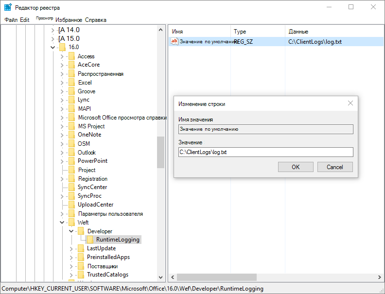

# <a name="debug-your-add-in-with-runtime-logging"></a>Отладка надстройки с помощью журнала среды выполнения

Вы можете использовать ведение журнала в среде выполнения для отладки манифеста надстройки, а также некоторых ошибок установки. Эта функция может помочь вам определять и устранять проблемы с манифестом, которые не обнаруживаются при проверке схемы XSD, например несоответствие идентификаторов ресурсов. Ведение журнала в среде выполнения особенно полезно для отладки надстроек, которые добавляют команды и пользовательские функции Excel.

> [!NOTE]
> Функция ведения журнала в настоящее время доступна для Office 2016 или более поздней версии на рабочем столе.

> [!IMPORTANT]
> Ведение журнала в среде выполнения снижает производительность. Включайте его, только когда нужно исправить ошибки в манифесте надстройки.

## <a name="use-runtime-logging-from-the-command-line"></a>Использование журнала в среде выполнения с помощью командной строки

Самый быстрый способ приступить к использованию этого средства ведения журнала — включить ведение журнала в среде выполнения с помощью командной строки. При этом используется npx (обычно поставляется как часть npm версии 5.2.0 и новее). Если у вас более ранняя версия [npm](https://www.npmjs.com/), попробуйте воспользоваться инструкциями [Ведение журнала в среде выполнения Windows](#runtime-logging-on-windows) или [Ведение журнала в среде выполнения на компьютере Mac](#runtime-logging-on-mac) либо [установите npx](https://www.npmjs.com/package/npx).

[!INCLUDE[Office settings tool not supported on Mac](../includes/tool-nonsupport-mac-note.md)]

- Включение ведения журнала в среде выполнения:

    ```command&nbsp;line
    npx office-addin-dev-settings runtime-log --enable
    ```

- Чтобы включить ведение журнала в среде выполнения только для определенного файла, используйте ту же команду с именем файла:

    ```command&nbsp;line
    npx office-addin-dev-settings runtime-log --enable [filename.txt]
    ```

- Отключение ведения журнала в среде выполнения:

    ```command&nbsp;line
    npx office-addin-dev-settings runtime-log --disable
    ```

- Определение, включено ли ведение журнала в среде выполнения:

    ```command&nbsp;line
    npx office-addin-dev-settings runtime-log
    ```

- Отображение справки в командной строке для ведения журнала в среде выполнения:

    ```command&nbsp;line
    npx office-addin-dev-settings runtime-log --help
    ```

## <a name="runtime-logging-on-windows"></a>Ведение журнала в среде выполнения в Windows

1. Убедитесь, что у вас установлена сборка Office 2016 **16.0.7019** или выше.

2. Добавьте раздел реестра `RuntimeLogging` в раздел `HKEY_CURRENT_USER\SOFTWARE\Microsoft\Office\16.0\WEF\Developer\`.

    [!include[Developer registry key](../includes/developer-registry-key.md)]

3. В качестве значения параметра **RuntimeLogging** по умолчанию задайте полный путь к файлу, в который будет записываться журнал. Пример приведен в архиве [EnableRuntimeLogging.zip](https://github.com/OfficeDev/Office-Add-in-Commands-Samples/raw/master/Tools/RuntimeLogging/EnableRuntimeLogging.zip).

    > [!NOTE]
    > Необходим готовый каталог, в котором будет создан файл журнала, и соответствующее разрешение на запись.

Ниже показано, как должен выглядеть реестр. Чтобы отключить функцию, удалите из реестра раздел `RuntimeLogging`.



## <a name="runtime-logging-on-mac"></a>Ведение журнала в среде выполнения на компьютере Mac

1. Убедитесь, что у вас установлена классическая сборка Office 2016 **16.27** (19071500) или более поздней версии.

2. Откройте приложение **Терминал** и настройте параметры ведения журнала в среде выполнения с помощью команды `defaults`:

    ```command&nbsp;line
    defaults write <bundle id> CEFRuntimeLoggingFile -string <file_name>
    ```

    `<bundle id>` указывает, для какого узла требуется включить ведение журнала в среде выполнения. `<file_name>` — это имя текстового файла, в который будет записан журнал.

    Установите `<bundle id>` одно из следующих значений, чтобы включить ведение журнала времени для соответствующего приложения.

    - `com.microsoft.Word`
    - `com.microsoft.Excel`
    - `com.microsoft.Powerpoint`
    - `com.microsoft.Outlook`

В следующем примере включается ведение журнала для Word, а затем открывается файл журнала.

```command&nbsp;line
defaults write com.microsoft.Word CEFRuntimeLoggingFile -string "runtime_logs.txt"
open ~/library/Containers/com.microsoft.Word/Data/runtime_logs.txt
```

> [!NOTE]
> Чтобы включить ведение журнала в среде выполнения, потребуется перезапустить Office после выполнения команды `defaults`.

Чтобы отключить ведение журнала в среде выполнения, используйте команду `defaults delete`:

```command&nbsp;line
defaults delete <bundle id> CEFRuntimeLoggingFile
```

В следующем примере отключается ведение журнала для Word.

```command&nbsp;line
defaults delete com.microsoft.Word CEFRuntimeLoggingFile
```

## <a name="use-runtime-logging-to-troubleshoot-issues-with-your-manifest"></a>Используйте журнал среды выполнения для устранения неполадок манифеста

Чтобы устранить проблемы с загрузкой надстройки, используя журнал среды выполнения:

1. [Загрузите неопубликованную надстройку](sideload-office-add-ins-for-testing.md) для тестирования.

    > [!NOTE]
    > Рекомендуем загружать только тестируемую надстройку, чтобы уменьшить количество сообщений в файле журнала.

2. Если ничего не происходит и надстройка не отображается в диалоговом окне надстроек, откройте файл журнала.

3. Выполните в этом файле поиск по идентификатору надстройки, определенному в манифесте. В файле журнала этот идентификатор отмечен как `SolutionId`.

## <a name="known-issues-with-runtime-logging"></a>Известные проблемы с ведением журнала в среде выполнения

В файле журнала могут встречаться непонятные или неправильно классифицированные сообщения. Например:

- сообщение `Medium Current host not in add-in's host list` с дополнением `Unexpected Parsed manifest targeting different host` неправильно классифицируется как ошибка.

- Если появится сообщение `Unexpected Add-in is missing required manifest fields    DisplayName`, не содержащее SolutionId, то ошибка, скорее всего, не связана с надстройкой, отладка которой выполняется.

- Все сообщения `Monitorable` являются ожидаемыми ошибками с точки зрения системы. Иногда они указывают на проблему с манифестом, например опечатку в элементе, которая была пропущена, но не привела к сбою.

## <a name="see-also"></a>См. также

- [XML-манифест надстройки Office](../develop/add-in-manifests.md)
- [Проверка манифеста надстройки Office](troubleshoot-manifest.md)
- [Очистка кэша Office](clear-cache.md)
- [Загрузка неопубликованных надстроек Office для тестирования](sideload-office-add-ins-for-testing.md)
- [Отладка надстроек с помощью средств разработчика для Internet Explorer](debug-add-ins-using-f12-tools-ie.md)
- [Отладка надстроек с помощью средств разработчика для устаревшей версии Microsoft Edge](debug-add-ins-using-devtools-edge-legacy.md)
- [Отладка надстроек с помощью средств разработчика в Microsoft Edge (на основе Chromium)](debug-add-ins-using-devtools-edge-chromium.md) 
