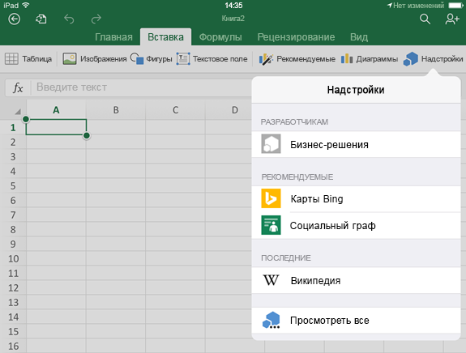
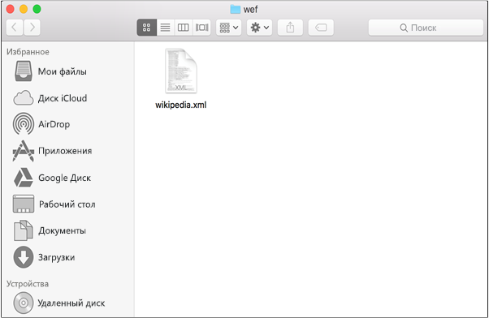
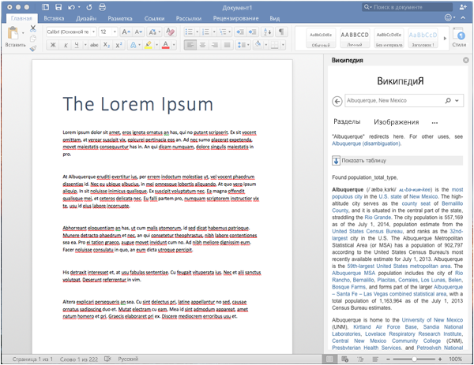

# Загрузка неопубликованных надстроек Office на iPad и Mac для тестирования

Чтобы проверить работу надстройки в Office для iOS, вы можете загрузить манифест неопубликованной надстройки на iPad с помощью iTunes или непосредственно в Office для Mac. Вы не сможете устанавливать точки останова и отлаживать код надстройки во время выполнения, но сможете проверить ее работу и убедиться, что интерфейс отображается правильно и его можно использовать. 

## Предварительные требования (Office для iOS)

- Компьютер Windows или Mac, на котором установлено приложение [iTunes](http://www.apple.com/itunes/download/).
    
- iPad под управлением iOS 8.2 или более поздней версии, на котором установлено приложение [Excel для iPad](https://itunes.apple.com/us/app/microsoft-excel/id586683407?mt=8) и к которому подключен кабель для синхронизации.
    
- XML-файл манифеста для надстройки, которую вы хотите протестировать.
    

## Предварительные требования (Office для Mac)

- Компьютер Mac под управлением OS X 10.10 Yosemite или более поздней версии с установленным набором [Office для Mac](https://products.office.com/en-us/buy/compare-microsoft-office-products?tab=omac).
    
- Word для Mac версии 15.18 (160109).
   
- Excel для Mac версии 15.19 (160206).

- PowerPoint для Mac версии 15.24 (160614).
    
- XML-файл манифеста для надстройки, которую вы хотите проверить.
    

## Загрузка неопубликованной надстройки в Excel или Word для iPad

1. Подключите iPad к компьютеру с помощью кабеля для синхронизации. Если вы подключаете iPad к компьютеру в первый раз, появится запрос **Доверять этому компьютеру?**. Выберите **Доверять**.

2. В iTunes под строкой меню выберите значок **iPad**.
    
    

3. В левой части iTunes в разделе  **Параметры** выберите **Приложения**.
    
    

4. В правой части iTunes прокрутите окно вниз до раздела  **Общий доступ к файлам**, а затем в столбце  **Надстройки** выберите **Excel** или **Word**.
    
    

5. В нижней части столбца  **Документы Excel** или **Документы Word** выберите элемент **Добавить файл**, а затем выберите XML-файл манифеста для надстройки, которую необходимо загрузить. 
    
6. Откройте приложение Excel или Word на iPad. Если приложение Excel или Word уже запущено, нажмите кнопку **Главная**, а затем закройте и перезапустите его.
    
7. Откройте документ.
    
8. На вкладке  **Вставка** выберите **Надстройки**. Загруженную надстройка можно добавить в разделе  **Разработчик** в пользовательском интерфейсе **Надстройки**.
    
    

## Загрузка неопубликованной надстройки в Office для Mac

> **Примечание.** Инструкции для надстройки Outlook 2016 для Mac см. в статье [Загрузка неопубликованных надстроек Outlook для тестирования](sideload-outlook-add-ins-for-testing.md).

1. Откройте **Терминал** и перейдите в одну из указанных ниже папок, чтобы сохранить в нее файл манифеста надстройки. Если папки `wef` нет на компьютере, создайте ее.
    
    - Для Word: `/Users/<username>/Library/Containers/com.microsoft.Word/Data/documents/wef`    
    - Для Excel: `/Users/<username>/Library/Containers/com.microsoft.Excel/Data/documents/wef`
    - Для PowerPoint: `/Users/<username>/Library/Containers/com.microsoft.Powerpoint/Data/documents/wef`
    
2. Откройте папку в **Finder** с помощью команды `open .` (включая точку). Скопируйте файл манифеста надстройки в эту папку.
    
    

3. Запустите Word и откройте документ. Если приложение Word уже запущено, перезапустите его.
    
4. В Word выберите элементы **Вставка**  >  **Надстройки**  >  **Мои надстройки**, а затем выберите свою надстройку.
    
    

  > **Важно!** Неопубликованные надстройки не отображаются в диалоговом окне "Мои надстройки". Они отображаются только в раскрывающемся меню (небольшая стрелка вниз справа от кнопки "Мои надстройки" на вкладке **Вставка**). Неопубликованные надстройки перечислены под заголовком **Надстройки для разработчиков** в этом меню. 
    
5. Проверьте, отображается ли ваша надстройка в Word.
    
    
    
> **Примечание.** Для повышения производительности надстройки часто кэшируются в Office для Mac. Если вам нужно принудительно перезагрузить надстройку в процессе разработки, очистите папку Users/<usr>/Library/Containers/com.Microsoft.OsfWebHost/Data/. 

## Дополнительные ресурсы

- [Отладка надстроек Office на iPad и Mac](../testing/debug-office-add-ins-on-ipad-and-mac.md)
    
