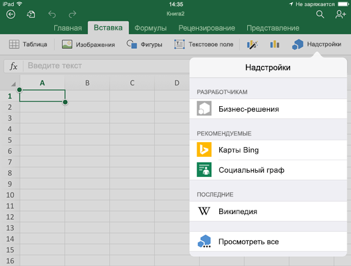
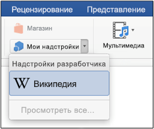
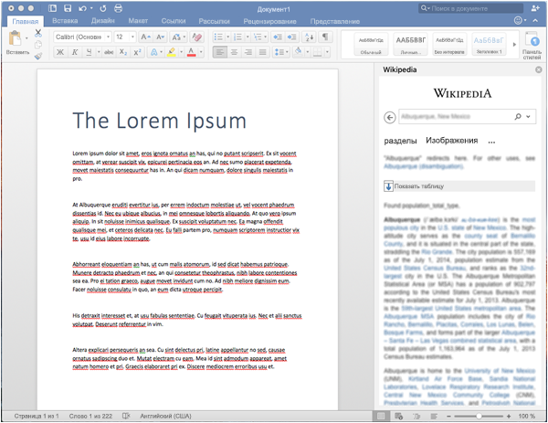

# Загрузка неопубликованных надстроек Office на iPad и Mac для тестированияSideload Office Add-ins on iPad and Mac for testing

Чтобы проверить работу надстройки в Office для iOS, вы можете загрузить манифест неопубликованной надстройки на iPad с помощью iTunes или непосредственно в Office для Mac. Вы не сможете устанавливать точки останова и отлаживать код надстройки во время выполнения, но сможете проверить ее работу и убедиться, что интерфейс отображается правильно и его можно использовать.To see how your add-in will run in Office on iOS, you can sideload your add-in's manifest onto an iPad using iTunes, or sideload your add-in's manifest directly in Office on Mac. This action won't enable you to set breakpoints and debug your add-in's code while it's running, but you can see how it behaves and verify that the UI is usable and rendering appropriately.

## Предварительные требования (Office для iOS)Prerequisites for Office on iOS

- Компьютер Windows или Mac, на котором установлено приложение [iTunes](https://www.apple.com/itunes/download/).A Windows or Mac computer with [iTunes](https://www.apple.com/itunes/download/) installed.
  > [!IMPORTANT]
  > Если вы используете macOS Catalina, [iTunes](https://support.apple.com/HT210200) больше не доступен, поэтому вам следует следовать инструкциям в разделе Загрузка нео sideload надстройки в Excel или Word на iPad с помощью [macOS Catalina](#sideload-an-add-in-on-excel-or-word-on-ipad-using-macos-catalina) далее в этой статье.If you're running macOS Catalina, [iTunes is no longer available](https://support.apple.com/HT210200) so you should follow the instructions in the section [Sideload an add-in on Excel or Word on iPad using macOS Catalina](#sideload-an-add-in-on-excel-or-word-on-ipad-using-macos-catalina) later in this article.

- IPad под управлением iOS 8.2 или более поздней с [установленными Excel](https://apps.apple.com/app/microsoft-excel/id586683407) или [Word,](https://apps.apple.com/app/microsoft-word/id586447913) а также кабель синхронизации.An iPad running iOS 8.2 or later with [Excel](https://apps.apple.com/app/microsoft-excel/id586683407) or [Word](https://apps.apple.com/app/microsoft-word/id586447913) installed, and a sync cable.

- XML-файл манифеста для надстройки, которую вы хотите протестировать.The manifest .xml file for the add-in you want to test.

## Предварительные требования (Office для Mac)Prerequisites for Office on Mac

- Компьютер Mac под управлением OS X 10.10 Yosemite или более поздней версии с установленным набором [Office для Mac](https://products.office.com/buy/compare-microsoft-office-products?tab=omac).A Mac running OS X v10.10 "Yosemite" or later with [Office on Mac](https://products.office.com/buy/compare-microsoft-office-products?tab=omac) installed.

- Word для Mac версии 15.18 (160109).Word on Mac version 15.18 (160109).

- Excel для Mac версии 15.19 (160206).Excel on Mac version 15.19 (160206).

- PowerPoint для Mac версии 15.24 (160614)PowerPoint on Mac version 15.24 (160614)

- XML-файл манифеста для надстройки, которую вы хотите протестировать.The manifest .xml file for the add-in you want to test.

## Загрузка неогрузки надстройки в Excel или Word на iPad с помощью iTunesSideload an add-in on Excel or Word on iPad using iTunes

1. Подключите iPad к компьютеру с помощью кабеля для синхронизации.Use a sync cable to connect your iPad to your computer. Если iPad подключается к компьютеру в первый раз, вам будет предложено доверять **этому компьютеру?**If you're connecting the iPad to your computer for the first time, you'll be prompted with **Trust This Computer?**. Выберите **Доверять**.Choose **Trust** to continue.

2. В iTunes под строкой меню выберите значок **iPad**.In iTunes, choose the **iPad** icon below the menu bar.

3. В левой части iTunes в разделе **Параметры** выберите **Приложения**.Under **Settings** on the left side of iTunes, choose **Apps**.

4. В правой части iTunes прокрутите окно вниз до раздела **Общий доступ к файлам**, а затем в столбце **Надстройки** выберите **Excel** или **Word**.On the right side of iTunes, scroll down to **File Sharing**, and then choose **Excel** or **Word** in the **Add-ins** column.

5. В нижней части столбца "Документы **Excel** или **Word"** выберите "Добавить файл", а затем выберите XML-файл манифеста надстройки, загрузку неогружаемой надстройки.At the bottom of the **Excel** or **Word Documents** column, choose **Add File**, and then select the manifest .xml file of the add-in you want to sideload.

6. Откройте приложение Excel или Word на iPad.Open the Excel or Word app on your iPad. Если приложение Excel или Word уже  запущено, нажать кнопку "Домой", а затем закрыть и перезапустить приложение.If the Excel or Word app is already running, choose the **Home** button, and then close and restart the app.

7. Откройте документ.Open a document.

8. Выберите **"Надстройки"** на вкладке  "Вставка". (На вкладке "Вставка" может потребоваться прокрутка по горизонтали до тех пор, пока не увидите кнопку "Надстройки".)   Неогруженную надстройку можно вставить под заголовком **"Разработчик"** в пользовательском **интерфейсе** надстройки.Choose **Add-ins** on the **Insert** tab. (On the **Insert** tab, you may need to scroll horizontally until you see the **Add-ins** button.) Your sideloaded add-in is available to insert under the **Developer** heading in the **Add-ins** UI.

    

## Загрузка неогрузки надстройки в Excel или Word на iPad с помощью macOS CatalinaSideload an add-in on Excel or Word on iPad using macOS Catalina

> [!IMPORTANT]
> С появлением macOS Catalina Apple [отозвал iTunes](https://support.apple.com/HT210200) для Mac и встроенные функции, необходимые для загрузки нео том же приложений в **Finder.**With the introduction of macOS Catalina, [Apple discontinued iTunes on Mac](https://support.apple.com/HT210200) and integrated functionality required to sideload apps into **Finder**.

1. Подключите iPad к компьютеру с помощью кабеля для синхронизации.Use a sync cable to connect your iPad to your computer. Если iPad подключается к компьютеру в первый раз, вам будет предложено доверять **этому компьютеру?**If you're connecting the iPad to your computer for the first time, you'll be prompted with **Trust This Computer?**. Выберите **Доверять**.Choose **Trust** to continue. Также может возникнуть вопрос, является ли это новым iPad или восстанавливаете его.You may also be asked if this is a new iPad or if you're restoring one.

2. In Finder, under **Locations,** choose the **iPad** icon below the menu bar.In Finder, under **Locations**, choose the **iPad** icon below the menu bar.

3. В верхней части окна finder щелкните **"Файлы"** и найдите **Excel** или **Word.**On the top of the Finder window, click on **Files**, and then locate **Excel** or **Word**.

4. В другом окне finder перетащите файл manifest.xml надстройки, загрузка в **файл Excel** или **Word** в первом окне finder.From a different Finder window, drag and drop the manifest.xml file of the add-in you want to side load onto the **Excel** or **Word** file in the first Finder window.

5. Откройте приложение Excel или Word на iPad.Open the Excel or Word app on your iPad. Если приложение Excel или Word уже  запущено, нажать кнопку "Домой", а затем закрыть и перезапустить приложение.If the Excel or Word app is already running, choose the **Home** button, and then close and restart the app.

6. Откройте документ.Open a document.

7. Выберите **"Надстройки"** на вкладке  "Вставка". (На вкладке "Вставка" может потребоваться прокрутка по горизонтали до тех пор, пока не увидите кнопку "Надстройки".)   Неогруженную надстройку можно вставить под заголовком **"Разработчик"** в пользовательском **интерфейсе** надстройки.Choose **Add-ins** on the **Insert** tab. (On the **Insert** tab, you may need to scroll horizontally until you see the **Add-ins** button.) Your sideloaded add-in is available to insert under the **Developer** heading in the **Add-ins** UI.

    

## Загрузка неопубликованной надстройки в Office для MacSideload an add-in in Office on Mac

> [!NOTE]
> Сведения о загрузке неопубликованной надстройки Outlook для Mac см. в статье [Загрузка неопубликованных надстроек Outlook для тестирования](../outlook/sideload-outlook-add-ins-for-testing.md).To sideload an Outlook add-in on Mac, see [Sideload Outlook add-ins for testing](../outlook/sideload-outlook-add-ins-for-testing.md).

1. Откройте **терминал** и перейдите в одну из следующих папок, в которых вы сохраните файл манифеста надстройки.Open **Terminal** and go to one of the following folders where you'll save your add-in's manifest file. Если папки `wef` нет на компьютере, создайте ее.If the `wef` folder doesn't exist on your computer, create it.

    - Для Word: `/Users/<username>/Library/Containers/com.microsoft.Word/Data/Documents/wef`For Word:  `/Users/<username>/Library/Containers/com.microsoft.Word/Data/Documents/wef`
    - Для Excel: `/Users/<username>/Library/Containers/com.microsoft.Excel/Data/Documents/wef`For Excel:  `/Users/<username>/Library/Containers/com.microsoft.Excel/Data/Documents/wef`
    - Для PowerPoint: `/Users/<username>/Library/Containers/com.microsoft.Powerpoint/Data/Documents/wef`For PowerPoint: `/Users/<username>/Library/Containers/com.microsoft.Powerpoint/Data/Documents/wef`

2. Откройте папку в **Finder** с помощью команды `open .` (включая точку или точку).Open the folder in **Finder** using the command `open .` (including the period or dot). Скопируйте файл манифеста надстройки в эту папку.Copy your add-in's manifest file to this folder.

    

3. Запустите Word и откройте документ. Если приложение Word уже запущено, перезапустите его.Open Word, and then open a document. Restart Word if it's already running.

4. In Word, choose **Insert**  >  **Add-ins**  >  **My Add-ins (drop-down** menu), and then choose your add-in.In Word, choose **Insert** > **Add-ins** > **My Add-ins** (drop-down menu), and then choose your add-in.

    

    > [!IMPORTANT]
    > Неопубликованные надстройки не отображаются в диалоговом окне "Мои надстройки". Они видны только в раскрывающемся меню (небольшая стрелка вниз справа от кнопки "Мои надстройки" на вкладке **Вставка**). Неопубликованные надстройки перечислены под заголовком **Надстройки для разработчиков** в этом меню.Sideloaded add-ins will not show up in the My Add-ins dialog box. They are only visible within the drop-down menu (small down-arrow to the right of My Add-ins on the **Insert** tab). Sideloaded add-ins are listed under the **Developer Add-ins** heading in this menu.

5. Проверьте, отображается ли ваша надстройка в Word.Verify that your add-in is displayed in Word.

    

## Удаление неогруженной надстройкиRemove a sideloaded add-in

Вы можете удалить ранее загруженную неогруженную надстройку, с помощью очистки кэша Office на компьютере.You can remove a previously sideloaded add-in by clearing the Office cache on your computer. Подробные сведения о очистке кэша для каждой платформы и приложений можно найти в статье ["Очистка кэша Office".](clear-cache.md)Details on how to clear the cache for each platform and application can be found in the article [Clear the Office cache](clear-cache.md).

## См. такжеSee also

- [Отладка надстроек Office на iPad и MacDebug Office Add-ins on iPad and Mac](debug-office-add-ins-on-ipad-and-mac.md)
