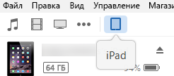
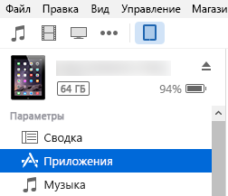

# Загрузка неопубликованных надстроек Office на iPad и Mac для тестированияSideload Office Add-ins on iPad and Mac for testing

Чтобы проверить работу надстройки в Office для iOS, вы можете загрузить манифест неопубликованной надстройки на iPad с помощью iTunes или непосредственно в Office для Mac. Вы не сможете устанавливать точки останова и отлаживать код надстройки во время выполнения, но сможете проверить ее работу и убедиться, что интерфейс отображается правильно и его можно использовать.To see how your add-in will run in Office for iOS, you can sideload your add-in's manifest onto an iPad using iTunes, or sideload your add-in's manifest directly in Office for Mac. This action won't enable you to set breakpoints and debug your add-in's code while it's running, but you can see how it behaves and verify that the UI is usable and rendering appropriately. 

## Предварительные требования (Office для iOS)Prerequisites for Office for iOS

- Компьютер Windows или Mac, на котором установлено приложение [iTunes](http://www.apple.com/itunes/download/).A Windows or Mac computer with [iTunes](http://www.apple.com/itunes/download/) installed.
    
- iPad под управлением iOS 8.2 или более поздней версии, на котором установлено приложение [Excel для iPad](https://itunes.apple.com/us/app/microsoft-excel/id586683407?mt=8) и к которому подключен кабель для синхронизации.An iPad running iOS 8.2 or later with [Excel for iPad](https://itunes.apple.com/us/app/microsoft-excel/id586683407?mt=8) installed, and a sync cable.
    
- XML-файл манифеста для надстройки, которую вы хотите протестировать.The manifest .xml file for the add-in you want to test.
    

## Предварительные требования (Office для Mac)Prerequisites for Office for Mac

- Компьютер Mac под управлением OS X 10.10 Yosemite или более поздней версии с установленным набором [Office для Mac](https://products.office.com/buy/compare-microsoft-office-products?tab=omac).A Mac running OS X v10.10 "Yosemite" or later with [Office for Mac](https://products.office.com/buy/compare-microsoft-office-products?tab=omac) installed.
    
- Word для Mac версии 15.18 (160109).Word for Mac version 15.18 (160109).
   
- Excel для Mac версии 15.19 (160206).Excel for Mac version 15.19 (160206).

- PowerPoint для Mac версии 15.24 (160614).PowerPoint for Mac version 15.24 (160614)
    
- XML-файл манифеста для надстройки, которую вы хотите проверить.The manifest .xml file for the add-in you want to test.
    

## Загрузка неопубликованной надстройки в Excel или Word для iPadSideload an add-in on Excel or Word for iPad

1. Подключите iPad к компьютеру с помощью кабеля для синхронизации. Если вы подключаете iPad к компьютеру в первый раз, появится запрос **Доверять этому компьютеру?**. Выберите **Доверять**.Use a sync cable to connect your iPad to your computer. If you're connecting the iPad to your computer for the first time, you'll be prompted with  **Trust This Computer?**. Choose **Trust** to continue.

2. В iTunes под строкой меню выберите значок **iPad**.In iTunes, choose the  **iPad** icon below the menu bar.
    
    

3. В левой части iTunes в разделе  **Параметры** выберите **Приложения**.Under  **Settings** on the left side of iTunes, choose **Apps**.
    
    

4. В правой части iTunes прокрутите окно вниз до раздела  **Общий доступ к файлам**, а затем в столбце  **Надстройки** выберите **Excel** или **Word**.On the right side of iTunes, scroll down to  **File Sharing**, and then choose  **Excel** or **Word** in the **Add-ins** column.
    
    

5. В нижней части столбца  **Документы Excel** или **Документы Word** выберите элемент **Добавить файл**, а затем выберите XML-файл манифеста для надстройки, которую необходимо загрузить.At the bottom of the  **Excel** or **Word Documents** column, choose **Add File**, and then select the manifest .xml file of the add-in you want to sideload. 
    
6. Откройте приложение Excel или Word на iPad. Если приложение Excel или Word уже запущено, нажмите кнопку **Главная**, а затем закройте и перезапустите его.Open the Excel or Word app on your iPad. If the Excel or Word app is already running, choose the  **Home** button, and then close and restart the app.
    
7. Откройте документ.Open a document.
    
8. На вкладке  **Вставка** выберите **Надстройки**. Загруженную надстройка можно добавить в разделе  **Разработчик** в пользовательском интерфейсе **Надстройки**.Choose  **Add-ins** on the **Insert** tab. Your sideloaded add-in is available to insert under the **Developer** heading in the **Add-ins** UI.
    
    

## Загрузка неопубликованной надстройки в Office для MacSideload an add-in on Office for Mac

> [!NOTE]
> Инструкции для надстройки Outlook 2016 для Mac см. в статье [Загрузка неопубликованных надстроек Outlook для тестирования](https://docs.microsoft.com/outlook/add-ins/sideload-outlook-add-ins-for-testing).To sideload Outlook 2016 for Mac add-in, see [Sideload Outlook add-ins for testing](https://docs.microsoft.com/outlook/add-ins/sideload-outlook-add-ins-for-testing).

1. Откройте **Терминал** и перейдите в одну из указанных ниже папок, чтобы сохранить в нее файл манифеста надстройки. Если папки `wef` нет на компьютере, создайте ее.Open  **Terminal** and go to one of the following folders where you'll save your add-in's manifest file. If the `wef` folder doesn't exist on your computer, create it.
    
    - Для Word: `/Users/<username>/Library/Containers/com.microsoft.Word/Data/documents/wef`For Word:  `/Users/<username>/Library/Containers/com.microsoft.Word/Data/documents/wef`    
    - Для Excel: `/Users/<username>/Library/Containers/com.microsoft.Excel/Data/documents/wef`For Excel:  `/Users/<username>/Library/Containers/com.microsoft.Excel/Data/documents/wef`
    - Для PowerPoint: `/Users/<username>/Library/Containers/com.microsoft.Powerpoint/Data/documents/wef`For PowerPoint: `/Users/<username>/Library/Containers/com.microsoft.Powerpoint/Data/documents/wef`
    
2. Откройте папку в **Finder** с помощью команды `open .` (включая точку). Скопируйте файл манифеста надстройки в эту папку.Open the folder in  **Finder** using the command `open .` (including the period or dot). Copy your add-in's manifest file to this folder.
    
    

3. Запустите Word и откройте документ. Если приложение Word уже запущено, перезапустите его.Open Word, and then open a document. Restart Word if it's already running.
    
4. В Word выберите элементы **Вставка**  >  **Надстройки**  >  **Мои надстройки**, а затем выберите свою надстройку.In Word, choose  **Insert** > **Add-ins** > **My Add-ins** (drop-down menu), and then choose your add-in.
    
    

    > [!IMPORTANT]
    > Неопубликованные надстройки не отображаются в диалоговом окне "Мои надстройки". Они видны только в раскрывающемся меню (небольшая стрелка вниз справа от кнопки "Мои надстройки" на вкладке **Вставка**). Неопубликованные надстройки перечислены под заголовком **Надстройки для разработчиков** в этом меню.Sideloaded add-ins will not show up in the My Add-ins dialog box. They are only visible within the drop-down menu (small down-arrow to the right of My Add-ins on the **Insert** tab). Sideloaded add-ins are listed under the **Developer Add-ins** heading in this menu. 
    
5. Проверьте, отображается ли ваша надстройка в Word.Verify that your add-in is displayed in Word.
    
    
    
    > [!NOTE]
    > Для повышения производительности надстройки часто кэшируются в Office для Mac. Если вам нужно принудительно перезагрузить надстройку в процессе разработки, очистите папку `Users/<usr>/Library/Containers/com.Microsoft.OsfWebHost/Data/`.Add-ins are cached often in Office for Mac, for performance reasons. If you need to force a reload of your add-in while you're developing it, you can clear the `Users/<usr>/Library/Containers/com.Microsoft.OsfWebHost/Data/` folder. 

## См. такжеSee also

- [Отладка надстроек Office на iPad и MacDebug Office Add-ins on iPad and Mac](debug-office-add-ins-on-ipad-and-mac.md)
    
