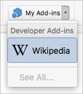

# Загрузка неопубликованных надстроек Office на iPad и Mac для тестирования

Чтобы проверить работу надстройки в Office для iOS, вы можете загрузить манифест неопубликованной надстройки на iPad с помощью iTunes или непосредственно в Office для Mac. Вы не сможете устанавливать точки останова и отлаживать код надстройки во время выполнения, но сможете проверить ее работу и убедиться, что интерфейс отображается правильно и его можно использовать.

> [!NOTE]
> Соответствующие действия касательно надстройки Outlook приведены в статье [Загрузка неопубликованных надстроек Outlook для тестирования](../outlook/sideload-outlook-add-ins-for-testing.md).

## Предварительные требования (Office для iOS)

- Компьютер Windows или Mac, на котором установлено приложение [iTunes](https://www.apple.com/itunes/download/).
  > [!IMPORTANT]
  > Если вы используете macOS Catalina, [iTunes](https://support.apple.com/HT210200) больше не доступен, поэтому следует следовать инструкциям в разделе Sideload надстройки на Excel или Word на iPad с помощью [macOS Catalina](#sideload-an-add-in-on-excel-or-word-on-ipad-using-macos-catalina) позже в этой статье.

- Установлен iPad iOS 8.2 или более поздней Excel [или Word](https://apps.apple.com/app/microsoft-word/id586447913), а  также синхронизированный кабель.

- XML-файл манифеста для надстройки, которую вы хотите протестировать.

## Предварительные требования (Office для Mac)

- Компьютер Mac под управлением OS X 10.10 Yosemite или более поздней версии с установленным набором [Office для Mac](https://products.office.com/buy/compare-microsoft-office-products?tab=omac).

- Word для Mac версии 15.18 (160109).

- Excel для Mac версии 15.19 (160206).

- PowerPoint для Mac версии 15.24 (160614)

- XML-файл манифеста для надстройки, которую вы хотите протестировать.

## Sideload надстройка на Excel или Word на iPad с помощью iTunes

1. Подключите iPad к компьютеру с помощью кабеля для синхронизации. Если вы впервые подключите iPad к компьютеру, вам будет предложено использовать **Trust This Computer?**. Выберите **Доверять**.

2. В iTunes под строкой меню выберите значок **iPad**.

3. В левой части iTunes в разделе **Параметры** выберите **Приложения**.

4. В правой части iTunes прокрутите окно вниз до раздела **Общий доступ к файлам**, а затем в столбце **Надстройки** выберите **Excel** или **Word**.

5. В нижней части **столбца Excel** **word Documents** выберите Добавить **файл, а** затем выберите файл манифеста .xml надстройки, необходимой для загрузки.

6. Откройте приложение Excel или Word на iPad. Если приложение Excel Word уже запущено, выберите кнопку **Главная**, а затем закрой и перезапустите приложение.

7. Откройте документ.

8. Выберите **надстройки** на вкладке **Вставка** . (На вкладке **Вставить** может потребоваться прокрутка по горизонтали, пока не увидите кнопку **Надстройки** .) Ваша надстройка с боковой загрузкой доступна для вставки под заголовком **Developer** в пользовательском интерфейсе **надстройки** .

    

## Sideload an add-in on Excel Word on iPad с помощью macOS Catalina

> [!IMPORTANT]
> С введением macOS Catalina Apple прекратила [iTunes на Mac](https://support.apple.com/HT210200) и интегрировала функции, необходимые для загрузки приложений в **Finder**.

1. Подключите iPad к компьютеру с помощью кабеля для синхронизации. Если вы впервые подключите iPad к компьютеру, вам будет предложено использовать **Trust This Computer?**. Выберите **Доверять**. Вы также можете быть заданы вопросы, если это новый iPad или если вы восстанавливаете один.

2. В Finder в **статье Locations** **выберите значок iPad** ниже панели меню.

3. В верхней части окна Finder нажмите кнопку **Файлы**, а затем **найдите Excel** **или Word**.

4. Из другого окна Finder перетащите и manifest.xml файл надстройки, необходимой для боковой нагрузки на **файл Excel** **Или Word** в первом окне Finder.

5. Откройте приложение Excel или Word на iPad. Если приложение Excel Word уже запущено, выберите кнопку **Главная**, а затем закрой и перезапустите приложение.

6. Откройте документ.

7. Выберите **надстройки** на вкладке **Вставка** . (На вкладке **Вставить** может потребоваться прокрутка по горизонтали, пока не увидите кнопку **Надстройки** .) Ваша надстройка с боковой загрузкой доступна для вставки под заголовком **Developer** в пользовательском интерфейсе **надстройки** .

    

## Загрузка неопубликованной надстройки в Office для Mac

1. Откройте **терминал** и перейдите в одну из следующих папок, где вы сохраните файл манифеста надстройки. Если папки `wef` нет на компьютере, создайте ее.

    - Для Word: `/Users/<username>/Library/Containers/com.microsoft.Word/Data/Documents/wef`
    - Для Excel: `/Users/<username>/Library/Containers/com.microsoft.Excel/Data/Documents/wef`
    - Для PowerPoint: `/Users/<username>/Library/Containers/com.microsoft.Powerpoint/Data/Documents/wef`

2. Откройте папку в **Finder** с помощью команды `open .` (включая период или точку). Скопируйте файл манифеста надстройки в эту папку.

    

3. Запустите Word и откройте документ. Если приложение Word уже запущено, перезапустите его.

4. В Word выберите надстройки **InsertAdd-insMy** >  >  (выпадаемое меню), а затем выберите надстройку.

    

    > [!IMPORTANT]
    > Неопубликованные надстройки не отображаются в диалоговом окне "Мои надстройки". Они видны только в раскрывающемся меню (небольшая стрелка вниз справа от кнопки "Мои надстройки" на вкладке **Вставка**). Неопубликованные надстройки перечислены под заголовком **Надстройки для разработчиков** в этом меню.

5. Проверьте, отображается ли ваша надстройка в Word.

    

## Удаление боковой надстройки

Вы можете удалить ранее загруженную надстройку путем очистки кэша Office на компьютере. Сведения о том, как очистить кэш для каждой платформы и приложения, можно найти в статье [Clear the Office кэш](clear-cache.md).

## См. также

- [Отладка надстроек Office на Mac](debug-office-add-ins-on-ipad-and-mac.md)
- [Загрузка неопубликованных надстроек Outlook для тестирования](../outlook/sideload-outlook-add-ins-for-testing.md)
