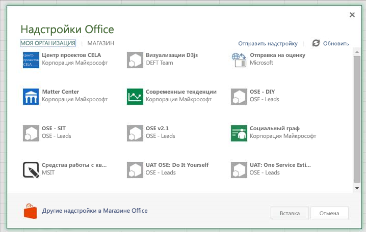
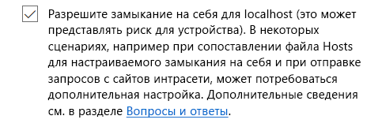

# <a name="sideload-office-add-ins-in-office-online-for-testing"></a><span data-ttu-id="d8316-102">Загрузка неопубликованных надстроек Office в Office Online для тестирования</span><span class="sxs-lookup"><span data-stu-id="d8316-102">Sideload Office Add-ins in Office Online for testing</span></span>

<span data-ttu-id="d8316-p101">Благодаря загрузке неопубликованных надстроек Office вы можете установить их для тестирования, не добавляя в каталог надстроек. Загрузить неопубликованную надстройку можно в Office 365 или Office Online. Процедуры загрузки для каждой из двух платформ немного отличаются.</span><span class="sxs-lookup"><span data-stu-id="d8316-p101">You can install an Office Add-in for testing without having to first put it in an add-in catalog by using sideloading. Sideloading can be done on either Office 365 or Office Online. The procedure is slightly different for the two platforms.</span></span> 

<span data-ttu-id="d8316-106">При загрузке неопубликованной надстройки ее манифест хранится в локальном хранилище браузера. Поэтому если очистить кэш браузера или поменять браузер, процедуру придется повторить.</span><span class="sxs-lookup"><span data-stu-id="d8316-106">When you sideload an add-in, the add-in manifest is stored in the browser's local storage, so if you clear the browser's cache, or switch to a different browser, you have to sideload the add-in again.</span></span>


> [!NOTE]
> <span data-ttu-id="d8316-p102">Загрузка неопубликованных надстроек, описанная в этой статье, поддерживается в Word, Excel и PowerPoint. Соответствующие действия касательно надстройки Outlook приведены в статье [Загрузка неопубликованных надстроек Outlook для тестирования](https://docs.microsoft.com/en-us/outlook/add-ins/sideload-outlook-add-ins-for-testing).</span><span class="sxs-lookup"><span data-stu-id="d8316-p102">Sideloading as described in this article is supported on Word, Excel, and PowerPoint. To sideload an Outlook add-in, see [Sideload Outlook add-ins for testing](https://docs.microsoft.com/en-us/outlook/add-ins/sideload-outlook-add-ins-for-testing).</span></span>

<span data-ttu-id="d8316-109">Из следующего видео вы узнаете, как загрузить неопубликованную надстройку в классическое приложение Office или Office Online.</span><span class="sxs-lookup"><span data-stu-id="d8316-109">The following video walks you through the process of sideloading your add-in on Office desktop or Office Online.</span></span>  


> [!VIDEO https://www.youtube.com/embed/XXsAw2UUiQo]

## <a name="sideload-an-office-add-in-on-office-365"></a><span data-ttu-id="d8316-110">Загрузка неопубликованной надстройки Office в Office 365</span><span class="sxs-lookup"><span data-stu-id="d8316-110">Sideload an Office Add-in on Office 365</span></span>


1. <span data-ttu-id="d8316-111">Войдите в свою учетную запись Office 365.</span><span class="sxs-lookup"><span data-stu-id="d8316-111">Sign in to your Office 365 account.</span></span>
    
2. <span data-ttu-id="d8316-112">Откройте средство запуска приложений в левой части панели инструментов, выберите **Excel**, **Word** или **PowerPoint** и создайте документ.</span><span class="sxs-lookup"><span data-stu-id="d8316-112">Open the App Launcher on the left end of the toolbar and select  **Excel**,  **Word**, or  **PowerPoint**, and then create a new document.</span></span>
    
3. <span data-ttu-id="d8316-113">Откройте вкладку  **Вставка** на ленте и в разделе **Надстройки** выберите **Надстройки Office**.</span><span class="sxs-lookup"><span data-stu-id="d8316-113">Open the  **Insert** tab on the ribbon and, in the **Add-ins** section, choose **Office Add-ins**.</span></span>
    
4. <span data-ttu-id="d8316-114">В диалоговом окне **Надстройки Office** откройте вкладку **МОЯ ОРГАНИЗАЦИЯ** и выберите **Отправить надстройку**.</span><span class="sxs-lookup"><span data-stu-id="d8316-114">On the  **Office Add-ins** dialog, select the **MY ORGANIZATION** tab, and then **Upload My Add-in**.</span></span>
    
    

5.  <span data-ttu-id="d8316-116">**Найдите** файл манифеста надстройки и выберите **Отправить**.</span><span class="sxs-lookup"><span data-stu-id="d8316-116">**Browse** to the add-in manifest file, and then select **Upload**.</span></span>
    
    

6. <span data-ttu-id="d8316-p103">Убедитесь, что надстройка установлена. Например, если надстройка вызывается командой, эта команда должна появиться на ленте или в контекстном меню. Если же у вас надстройка области задач, должна появиться область.</span><span class="sxs-lookup"><span data-stu-id="d8316-p103">Verify that your add-in is installed. For example, if it is an add-in command, it should appear on either the ribbon or the context menu. If it is a task pane add-in the pane should appear.</span></span>
    

## <a name="sideload-an-office-add-in-on-office-online"></a><span data-ttu-id="d8316-121">Загрузка неопубликованной надстройки Office в Office Online</span><span class="sxs-lookup"><span data-stu-id="d8316-121">Sideload an Office Add-in on Office Online</span></span>


1. <span data-ttu-id="d8316-122">Откройте [Microsoft Office Online](https://office.live.com/).</span><span class="sxs-lookup"><span data-stu-id="d8316-122">Open [Microsoft Office Online](https://office.live.com/).</span></span>
    
2. <span data-ttu-id="d8316-123">В разделе  **Начало работы с веб-приложениями** выберите **Excel**,  **Word** или **PowerPoint** и откройте новый документ.</span><span class="sxs-lookup"><span data-stu-id="d8316-123">In  **Get started with the online apps now**, choose  **Excel**,  **Word**, or  **PowerPoint**; and then open a new document.</span></span>
    
3. <span data-ttu-id="d8316-124">Откройте вкладку  **Вставка** на ленте и в разделе **Надстройки** выберите **Надстройки Office**.</span><span class="sxs-lookup"><span data-stu-id="d8316-124">Open the  **Insert** tab on the ribbon and, in the **Add-ins** section, choose **Office Add-ins**.</span></span>
    
4. <span data-ttu-id="d8316-125">В диалоговом окне **Надстройки Office** откройте вкладку **МОИ НАДСТРОЙКИ** и выберите **Управление моими надстройками** > **Отправить надстройку**.</span><span class="sxs-lookup"><span data-stu-id="d8316-125">On the  **Office Add-ins** dialog, select the **MY ADD-INS** tab, choose **Manage My Add-ins**, and then  **Upload My Add-in**.</span></span>
    
    

5.  <span data-ttu-id="d8316-127">**Найдите** файл манифеста надстройки и выберите **Отправить**.</span><span class="sxs-lookup"><span data-stu-id="d8316-127">**Browse** to the add-in manifest file, and then select **Upload**.</span></span>
    
    

6. <span data-ttu-id="d8316-p104">Убедитесь, что надстройка установлена. Например, если надстройка вызывается командой, эта команда должна появиться на ленте или в контекстном меню. Если же у вас надстройка области задач, должна появиться область.</span><span class="sxs-lookup"><span data-stu-id="d8316-p104">Verify that your add-in is installed. For example, if it is an add-in command, it should appear on either the ribbon or the context menu. If it is a task pane add-in, the pane should appear.</span></span>

> [!NOTE]
><span data-ttu-id="d8316-132">Чтобы протестировать надстройку Office с Edge, введите "**about:flags**"В панели поиска Edge, чтобы открыть параметры параметров разработчика.</span><span class="sxs-lookup"><span data-stu-id="d8316-132">To test your Office Add-in with Edge, enter “**about:flags**” in the Edge search bar to bring up the Developer Settings options.</span></span>  <span data-ttu-id="d8316-133">Проверьте опцию"**Разрешение замыкания на себя для локального узла**"и перезапустите Edge.</span><span class="sxs-lookup"><span data-stu-id="d8316-133">Check the “**Allow localhost loopback**” option and restart Edge.</span></span>

>    

## <a name="sideload-an-add-in-when-using-visual-studio"></a><span data-ttu-id="d8316-135">Загрузка неопубликованной настройки при использовании Visual Studio</span><span class="sxs-lookup"><span data-stu-id="d8316-135">Sideload an add-in when using Visual Studio</span></span>

<span data-ttu-id="d8316-p106">Если вы разрабатываете надстройки с помощью Visual Studio, процесс загрузки неопубликованной надстройки будет аналогичным. Единственное различие состоит в том, что необходимо обновить значение элемента **SourceURL** в манифесте, чтобы включить в него полный URL-адрес расположения, где развернута надстройка.</span><span class="sxs-lookup"><span data-stu-id="d8316-p106">If you're using Visual Studio to develop your add-in, the process to sideload is similar. The only difference is that you will have to update the value of the **SourceURL** element in your manifest to include the full URL where the add-in is deployed.</span></span> 

<span data-ttu-id="d8316-p107">Если вы только разрабатываете надстройку, найдите XML-файл манифеста и обновите значение элемента **SourceLocation**, чтобы включить абсолютный универсальный код ресурса (URI). В Visual Studio будет добавлен маркер для развертывания в localhost.</span><span class="sxs-lookup"><span data-stu-id="d8316-p107">If you're currently developing your add-in, locate your add-in manifest.xml file, and update the **SourceLocation** element value to include an absolute URI. Visual Studio will put in a token for your localhost deployment.</span></span>

<span data-ttu-id="d8316-140">Например:</span><span class="sxs-lookup"><span data-stu-id="d8316-140">For example:</span></span> 

```xml
<SourceLocation DefaultValue="https://localhost:44300/App/Home/Home.html" />
```
