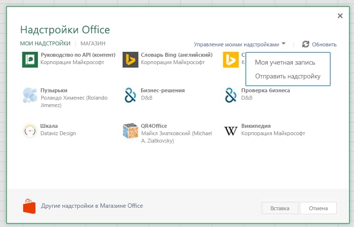

# Загрузка неопубликованных надстроек Office в Office в Интернете для тестирования

Загрузка неопубликованной надстройки Office позволит быстро установить ее для тестирования, не размещая в каталоге надстроек. Для загрузки неопубликованных приложений можно использовать как Microsoft 365, так и Office в Интернете. Эта процедура слегка различается для каждой из двух платформ.

При загрузке неопубликованной надстройки ее манифест хранится в локальном хранилище браузера. Поэтому если очистить кэш браузера или поменять браузер, процедуру придется повторить.

> [!NOTE]
> Загрузка неопубликованных надстроек, описанная в этой статье, поддерживается в Word, Excel и PowerPoint. Соответствующие действия касательно надстройки Outlook приведены в статье [Загрузка неопубликованных надстроек Outlook для тестирования](../outlook/sideload-outlook-add-ins-for-testing.md).

В видео ниже показано, как загрузить неопубликованную надстройку в Office в Интернете или классическое приложение.

> [!VIDEO https://www.youtube.com/embed/XXsAw2UUiQo]

## Загрузка неопубликованной надстройки Office в Office в Интернете

1. Откройте [Office в Интернете](https://office.live.com/).

2. В разделе Начало **работы с веб-приложениями**выберите **Excel**, **Word**или **PowerPoint**; а затем откройте новый документ.

3. Откройте вкладку **Вставка** на ленте и в разделе **надстройки** выберите надстройки **Office**.

4. В диалоговом окне **надстройки Office** откройте вкладку **Мои** надстройки, выберите **Управление моими**надстройками, а затем **отправьте надстройку**.

    

5. **Найдите** файл манифеста надстройки и выберите **Отправить**.

    

6. Убедитесь, что надстройка установлена. Например, если надстройка вызывается командой, эта команда должна появиться на ленте или в контекстном меню. Если же у вас надстройка области задач, должна появиться область.

> [!NOTE]
> Чтобы протестировать надстройку Office с помощью Microsoft EDGE, необходимо выполнить дополнительные действия по настройке. В командной строке Windows выполните следующую строку: `npx office-addin-dev-settings appcontainer EdgeWebView --loopback --yes`

## Загрузка неопубликованной надстройки Office в Office 365

1. Войдите в свою учетную запись Microsoft 365.

2. Откройте средство запуска приложений в левой части панели инструментов и выберите **Excel**, **Word**или **PowerPoint**, а затем создайте новый документ.

3. Действия 3–6 совпадают с действиями в предыдущем разделе **Загрузка неопубликованной надстройки Office в Office в Интернете**.

## Загрузка неопубликованной настройки при использовании Visual Studio

Если вы разрабатываете надстройки с помощью Visual Studio, процесс загрузки неопубликованной надстройки будет аналогичным. Единственное различие состоит в том, что необходимо обновить значение элемента **SourceURL** в манифесте, чтобы включить в него полный URL-адрес расположения, в котором развернута надстройка.

> [!NOTE]
> Хотя неопубликованные надстройки можно загружать из Visual Studio в Office в Интернете, их невозможно отлаживать из Visual Studio. Для этого вам потребуются средства отладки браузера. Дополнительные сведения см. в статье [Отладка надстроек в Office в Интернете](debug-add-ins-in-office-online.md).

1. В Visual Studio откройте окно **Свойства**, выбрав **Вид** -> **Окно свойств**.
2. В **обозревателе решений** выберите веб-проект. В окне **Свойства** отобразятся свойства проекта.
3. В окне "Свойства" скопируйте **URL-адрес SSL**.
4. В проекте надстройки откройте XML-файл манифеста. Убедитесь, что вы изменяете исходный XML-файл. Для проектов некоторых типов в Visual Studio откроется визуальное представление XML-файла, которое не будет работать на следующем шаге.
5. Найдите и замените все экземпляры **~remoteAppUrl/** только что скопированным URL-адресом SSL. В зависимости от типа проекта отобразится несколько вариантов замены, и появятся новые URL-адреса, похожие на `https://localhost:44300/Home.html`.
6. Сохраните XML-файл.
7. Щелкните веб-проект правой кнопкой мыши и выберите **Отладка** -> **Запустить новый экземпляр**. Веб-проект будет выполнен без запуска Office.
8. В Office в Интернете загрузите неопубликованную надстройку согласно инструкциям, приведенным выше в разделе [Загрузка неопубликованной надстройки Office в Office в Интернете](#sideload-an-office-add-in-in-office-on-the-web).

## Удаление надстройки неопубликованные

Вы можете удалить ранее созданную надстройку неопубликованные, очистив кэш браузера. Кроме того, при внесении изменений в манифест надстройки (например, для обновления имен файлов значков или текста команд надстройки) может потребоваться очистить кэш, а затем повторно Загрузка неопубликованных надстройку с помощью обновленного манифеста. В этом случае надстройка будет отображаться в Office в соответствии с обновленным манифестом.
